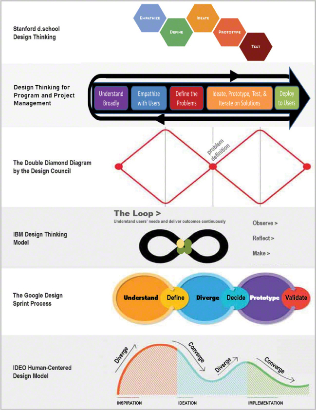
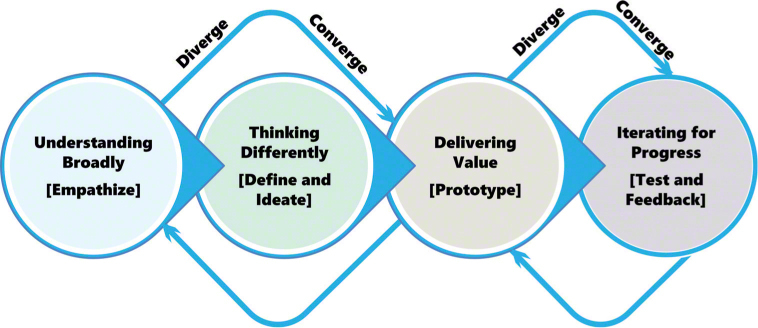
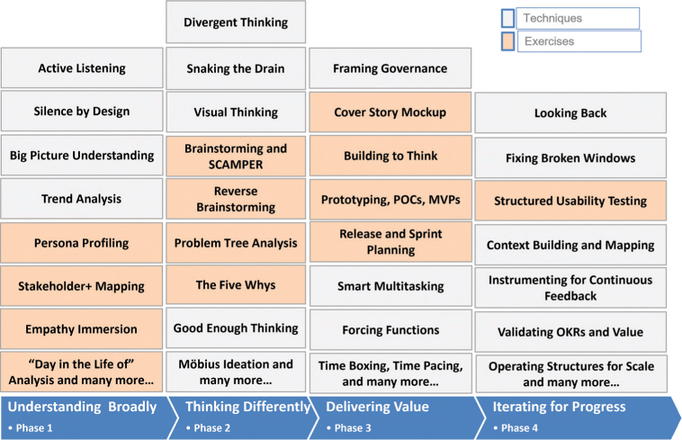
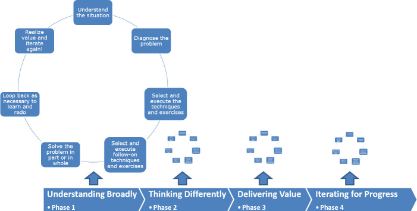
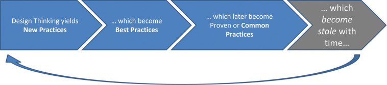
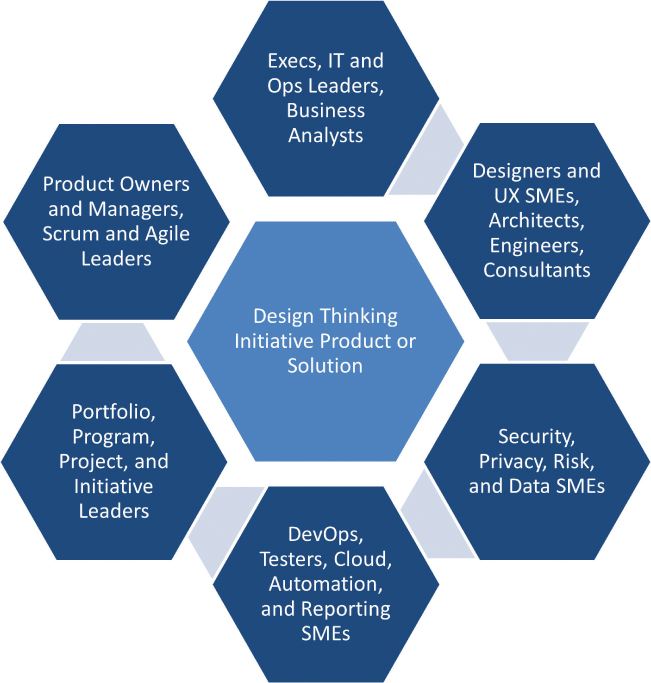

# 设计思维解释

你将在这一小时学到什么：

- 慢思考以更快交付
- 进步的过程：流行的设计思维模型
- 我们的技术设计思维模型
- 完美与时间的较量
- 是什么：技术和练习
- 怎么做：进步的设计思维周期
- 什么时间：歧义, 复杂性和不确定性
- 什么原因：更好的实践和更快的结果
- 谁做：按技术角色划分的设计思维
- 行动中的设计思维：现实世界的技术示例
- 不该做的事：艰难的教训
- 总结和案例研究

正如我们将看到的，设计思维既是一个过程，也是一组技术和练习，有助于比其他方式更快地思考和解决问题。 第 1 小时开始第一部分，称为"设计思维基础知识"，我们围绕"进步设计思维周期"和"技术设计思维模型"进行组装和调整（第 1-5 小时）。 本书的后续部分包括第二部分"广泛理解"（第 6-9 小时）, 第三部分"以不同方式思考"（第 10-14 小时）, 第四部分"交付价值"（第 15-18 小时）和第 V，"为进步而迭代"（第 19-24 小时）。

在第一个小时，我们通过解释流行的设计思维模型的过程, 基本原理和结构，为设计思维奠定了基础。 通过涵盖设计思维的内容, 方式, 时间, 原因和对象，提供了额外的背景信息。 第 1 小时结束时讨论了快速工作和缓慢思考之间的自然张力，以及对在每个小时内分享的各种现实世界经验教训的看法。

## 慢思考以更快交付
设计思维是关于放慢脚步，花时间深入理解, 思考和迭代最棘手问题的解决方案，以此作为交付价值的一种方式。 在存在极大复杂性, 歧义和不确定性的情况下，设计思维可以帮助我们比以往任何时候都更快地交付价值。 以伊索龟兔赛跑的寓言来思考设计思维。 设计思维的过程, 技术和练习是乌龟，解决问题和交付结果的传统方法是兔子。

当比赛的路线被清楚地标记并且终点线清晰时，兔子几乎总是会击败乌龟。 标准实践和经过验证的方法将使我们非常一致且可预测地到达终点。 野兔在简单问题的世界中茁壮成长。

但是，当那个世界变得模糊不清，问题异常复杂，终点线笼罩在模棱两可的阴影中时，像野兔一样快也无济于事。 更糟糕的是，野兔会让我们走上昂贵且耗时的死胡同。 在这些情况下，乌龟的方法更有意义……不是因为它比兔子慢，而是因为乌龟更聪明。 设计思维鼓励我们去理解和学习，以便我们识别正确的问题，思考如何做出最好的后续步骤，并走上更明智的道路。 设计思维为我们提供了以一种为进步扫清道路的方式思考和执行所必需的技术和练习的组合。

事情是这样的：乌龟实际上会越过终点线，而兔子仍然迷路，四处奔波，原路返回，花费大量时间却收效甚微。 因此，为了完成这个寓言，当遇到最混乱的问题和最复杂的情况时，乌龟确实会提供更好的价值实现时间。 放慢速度去做设计思维的工作会让我们到达终点线。

## 进步的过程：流行的设计思维模型

设计思维是一个组织如何取得进步, 如何完成困难的事情以及如何相对快速地交付真正价值的过程。 尽管这个过程看起来是循序渐进的，但设计思维在很大程度上是非线性的：它充满了重新学习, 倒退和重新开始。 不过，有趣的是，帮助我们取得进步或克服歧义和复杂性的并不是设计思维过程。 相反，我们通过设计思维的技巧和练习取得进步。

设计思维技巧和练习可以帮助我们在遇到困难时取得进步。 更重要的是，设计思维帮助我们避免完全陷入困境。 我们主动使用设计思维——理解, 同理心和思考等等——所以我们不会坐以待毙，想知道为什么我们的技术项目停滞不前或我们的业务转型偏离轨道。

尽管如此，这个过程还是有价值的。 设计思维过程模型帮助我们组织设计思维的技巧和练习； 在这个过程的不同阶段需要不同的技术。 这个过程帮助我们了解潜在的先行者或继任者，这反过来可能会帮助我们完成手头的工作。 例如，在我们开始思考和构思之前，我们可能需要对一种情况和相关人员产生共鸣，然后定义与该情况相关的一个或多个问题。 这并不意味着我们以后不会回过头来探索情况, 人员和问题的其他方面。 我们可能会！ 但是一个好的设计思维过程模型的逐步性质可以帮助我们在开始循环之前从左到右工作。 图 1.1 反映了一些最流行的设计思维过程模型，你可以看到它们有多么相似。



图 1.1
流行的设计思维过程模型。
你可能还会注意到它们的不同之处。 各种设计思维模型反映了对该模型的创建者来说什么是重要的。 有些重视思考，有些重视与人的联系，还有一些重视迭代测试和改进的需要。 虽然这些都是很好的通用模型，但技术专业人员仍然需要一个更简单的模型。

## 我们的技术设计思维模型

出于我们的目的，我们需要一个与技术项目保持一致的设计思维模型，在逻辑上与设计思维保持一致，并且尽可能地浓缩它。 最重要的是，我们的模型需要考虑在整个过程中迭代交付有价值的东西的重要性； 我们不能简单地以原型和无休止的迭代来结束我们的工作。 正是这种价值观念使我们的模型与众不同。 最后，我们需要一个模型，它可以递归地把我们带回过去，以提高我们的理解, 引入新的思维方式, 交付价值等等，如图 1.2 所示。



图 1.2
我们的技术设计思维模型。
请注意，我们将在第 2 小时详细探讨这个模型。然而，首先，我们需要考虑解决难题的两个敌人：追求完美和时间限制，为这个模型做准备。

## 完美与时间的较量

有人说完美是善的敌人，但完美也是速度和速度的敌人，也是真正完成任何困难或模棱两可的事情的敌人。 因此，我们必须克服制定和执行完美计划的冲动，以及追求完美实际上会让我们放慢脚步的现实。

考虑引入新事物时收益递减的影响。 因为做新事物意味着改变，新事物是痛苦的。 但是改变——以及痛苦——才是真正长寿的唯一途径； 没有办法解决它。 关键是开始改变。 如果不露面并下定决心推动变革，我们就不可能改变任何事情。 成功在于开始。

然而，大多数成功案例真正有趣的地方在于，它们很少是完美无缺的执行案例。 他们的转型之旅充斥着错误的开始, 考虑不周的计划, 糟糕的想法和重新开始。 但在所有这些情况下，人们都尝试过并失败了，但学得足够快，可以改正方向。 他们并没有在第一次就把所有事情都做对，但他们很快就取得了足够的方向性，足以让他们各自的工作取得成功。

如果他们专注于完美，那么这些成功故事仍将是半成品。 或者早已被遗忘和搁置。

因此，如果完美和时间是真正的敌人，那么我们如何才能比竞争对手更快地完成工作呢？ 通过借鉴经过验证的设计思维技术和练习的工具包，并以此改变我们执行解决难题和尽早交付价值的方式。

## 是什么：技术和练习
虽然我们已经看到设计思维是一个递归的过程，必须在此过程中产生某种价值，但设计思维是通过我们采用的特定技术和我们在整个过程中进行的练习来实现的。 橡胶通过设计思维技术和练习与道路相遇。 每个字面上都有数百个。

- 技术，也称为设计思维方法或原则，是不需要大量前期工作或步骤即可完成的学习, 思考或执行方式。 例如，三分法则提醒我们，通常至少需要三次构建和测试某物的迭代才能获得可用的产品。 这是一个简单的公理。 大多数技术都符合这样的公理或原则，因此有点不言自明。 静默设计, 绕过排水沟, 为思考而建, 使想法可见和可视化……这些都是设计思维技术的例子，可以很快理解和应用。
- 练习，有时称为设计思维游戏，由步骤和活动组成。 练习远远超出了你对一种情况的思考方式，而是反映了一系列逐步执行的活动，一个接一个，以达到某种理解或输出。 有些很简单，只需要几个步骤。 其他的，例如船锚练习，包括准备工作和十几个步骤，帮助我们识别影响进度的因素，这些因素反过来可用于管理和减轻进度风险。 逆向头脑风暴, 运行沼泽, 进行事前分析, 网状网络, 用于头脑风暴的 SCAMPER, 模式匹配……这些都是设计思维练习的例子，它们带领我们通过一系列步骤来获得输出或结果。
- 食谱，有时称为剧本，代表了技术和练习的组合，它们共同帮助我们完成设计思维过程中的特定阶段或该过程的一部分。

正如我们在图 1.3 中看到的，我们的技术设计思维模型中的每个阶段都反映了许多技术和练习。 因为有太多不同的技术和练习，所以在我们的设计思维过程模型中，只有少数被展示并映射到每个阶段。



图 1.3
将技术和练习映射到我们的技术设计思维模型。

## 怎么做：进步的设计思维周期

在我们确定我们可能采用的特定设计思维技术或练习之前，我们需要考虑哪些可以帮助我们，哪些可以带来清晰度，哪些可以推动我们寻求的结果。 我们需要组织自己，并在有意义的地方插入我们的工具（我们的技术和练习），以创建取得进步的秘诀。 考虑一下图 1.4 中所示的进步设计思维周期如何用于组织我们的需求并将必要的技术或练习汇集在一起，以帮助我们完成技术设计思维模型的四个阶段。



图 1.4
```The Design Thinking Cycle for Progress``` 帮助我们组织自己和思考。
进步的设计思维循环是递归和循环的。 它是循环的，因为我们几乎总是需要多次运行循环，以实现与我们的技术设计思维模型中特定阶段（或阶段的一部分）相关的结果。 循环帮助我们创建特定阶段所需的配方，就像我们使用配方来烤蛋糕一样。 我们选择的设计思维技巧和练习是要素。 就像一个好的面包师一样，我们可能需要通过添加额外的配料或将一种配料换成略有不同的配料来扩充食谱。 我们甚至可能需要拜访面包师同行，或联系专业面包师，帮助我们思考或考虑新的或不熟悉的技术和练习。

通过这些方式，进步设计思维周期代表了我们如何在设计思维旅程的每个阶段取得进步。 这是我们用来思考, 组织和运行了解情况, 解决问题和创造价值所必需的技术和练习的方法。

## 什么时间：歧义, 复杂性和不确定性
传统的软件开发和项目管理技术并不总能为我们提供创造性解决问题所需的许可或灵活性。 传统技术可能无法帮助我们克服歧义，帮助我们找出正确的路径，帮助我们确定要解决的正确问题，或者给我们尝试和失败再尝试的自由。

这些传统技术通常会规定特定的任务和流程，注入严格的关卡和质量检查点，并强制执行其他此类实践。 需要明确的是，当问题很明确, 解决方案很明显并且解决方案的工作只需要计划和交付时，这些都是很好的做法。

但是，如果我们希望克服充满复杂性的模棱两可的情况和一百个不同的可能后续步骤所带来的挑战，我们就需要更好的方法——更聪明的方法。 在这些情况下，设计思维为我们提供了技术, 练习, 自由和灵活性，以在我们学习, 迭代这些学习并以节省时间的方式交付价值时解决未知问题。

这真的是关键，对吧？ 时间是最有价值的商品。 完成大规模独特的努力需要时间。 随着模糊性, 复杂性和不确定性的增加，对更多时间的需求也在增加……对能够推动更深入的理解, 更强的构思, 更深刻的洞察力和更清晰的前进道路的技术和练习的需求也在增加。 所以我们可以保存和节约时间。 看来我们有时间价值危机，而设计思维是我们的超级英雄。

正如我们多年来所说的那样，那些领导, 装备, 管理和管理我们的技术团队和最棘手的技术项目的人需要迭代操作，就像他们的团队必须操作一样。 这是一个联合练习，每个人都依靠设计思维通过快速实践和快速失败来快速思考和学习。 解决复杂问题和创造价值需要用能够取得进步的技术和练习来武装我们的问题解决者以及领导我们的问题解决者的人。

因此，如果时间是我们的主要敌人，那么设计思维就是我们的回应。 以人为本或以用户为中心的运营方式为整个团队和与之相关的每个人——从发起人和利益相关者到产品经理, 业务负责人, 架构师, 功能团队负责人, 开发人员和用户——提供了所需的许可, 一致性和指南 以不同的方式思考并更快地交付。 设计思维提供了解决复杂问题所需的工具和技术。 它有助于广泛地理解环境，同情与该环境相关的人，定义需求和问题，原型设计和测试潜在的解决方案，快速学习和迭代这些潜在和部分解决方案，以及交付和部署解决问题和创造价值的解决方案 .

## 什么原因：更好的实践和更快的结果
解决困难和独特的问题总是非常困难。 交付复杂的技术支持解决方案和大规模业务转型也总是很困难。 为什么？ 因为他们的环境和情况是模棱两可的和流动的，使得问题难以确定地定义。 潜在的后续步骤和解决方案随后还不清楚，而且众所周知也不完整。

1973 年，Rittel 和 Webber 将这些最艰难的努力描述为棘手的问题。 这些问题是邪恶的，因为它们看起来极其难以解决。 鉴于它们的复杂性和挑战，解决棘手问题的方法不仅需要改变人们的思维方式，还需要改变他们的学习和操作方式。 用爱因斯坦的话来说，这些问题不能用创造它们的相同思维方式来解决。

在这些情况下，以设计思维的角度来处理情况和问题是有帮助的。 为什么？ 因为设计思维将人和他们的需求置于我们的情况和问题的中心，无论多么复杂或模棱两可。 在这样做的过程中，我们正在用解决歧义, 复杂性等问题的方法来武装自己，如前所述。 这些工作方式反映在接下来介绍的最佳实践, 通用实践和设计思维实践中。

### 最佳实践
在大多数行业中，我们谈论使用"最佳"实践来更快, 更便宜或风险更小地做或交付某事。 最佳实践被誉为"最佳方式"的行业典范，因此受到了广泛关注。 但最佳实践只是一个季节的"最佳"，然后它们就会过时。 它们变得陈旧。 他们失去了"最好"的地位。 我们真正需要的是一种更好的练习方式……比最好的更"常青"的东西。

### 常见做法
有时，更好的练习方法是在我们处理情况或问题的"常用"方法中找到的。 今天可能有一个单一的最佳实践来应对特定的挑战，但肯定有许多共同的方法来应对这一挑战。 它们可能不是最佳实践，但比大多数都好。 常见做法在最佳和可接受之间取得更具成本效益的平衡。

需要明确的是，常见做法不如最佳做法有效。 那些执行通用实践而不是最佳实践的人引用的经典权衡在于牺牲能力或质量甚至时间来获得降低成本的美妙优势； 常见做法几乎总是比最佳做法便宜得多。

我们想说的是，常见实践属于"足够好"（一种设计思维技术，我们将在后面介绍）的范畴，提供与最佳实践相近的功能或质量，但成本更低。 我们可能还会发现，通用实践可以比最佳实践更快地实施，但同样需要在功能, 质量, 安全性等方面进行权衡。

选择通用实践而不是最佳实践的关键是了解接受风险的偏好所在。 常见的做法是收益递减。 例如，如果我们能够以 95% 的百分位和 96% 的一半成本实现 X，并且 95% 是我们的用户可以接受的，那么我们就有一个很好的案例来使用成本较低的通用实践而不是"更好"但成本更高的最佳实践。

## 设计思维：超越最佳和通用实践
除了最佳实践或通用实践之外，还有第三类实践。 我们将此第三类称为设计思维实践，正如我们可能猜测的那样，它们将人置于问题或情况的中心。 不过，更重要的是，今天使用设计思维实践来最终揭示明天最终将成为最佳实践的东西（一个季节......）。

从设计思维实践到最佳实践再到常见实践的这种演变会如何发挥作用？ 我们需要与受问题或情况影响的人合作，而不是实施标准的最佳实践或易于修复的通用实践。 我们这样做是为了了解大局，同情大局中的人，定义大局中存在的问题，然后迭代原型并测试解决方案。

在这样做的过程中，我们将发现什么将成为一组新的最佳和通用实践，以在一段时间内针对特定情况加以利用，至少在这些最佳和通用实践变得陈旧并需要另一轮设计思维之前，如图所示 1.5.



图 1.5
从设计思维实践到最佳和常见实践。

## 谁做：按技术角色划分的设计思维
如果不是很明显，设计思维适用于所有技术

专业人员，无论其扮演的角色或角色如何。 从主题专家到各种架构师和工作流领导, 产品所有者和经理, 流程专家, 经理, 执行官和许多支持角色，设计思维是将技术大家庭凝聚在一起的粘合剂（见图 1.6）。

> 笔记
> 什么是角色？
> 角色是具有相似兴趣和需求的相似人的融合。 使用这种技术，我们可以创建虚构角色（例如"财务用户", "销售用户", "执行利益相关者"和其他此类组合）来代表具有共同需求并将使用特定工件的用户社区的类型或子集 或解决方案或可交付成果的特征以类似的方式。



图 1.6
通过设计思维将技术大家庭聚集在一起。

## 行动中的设计思维：现实世界的技术示例
当我们走过每个小时时，我们将逐步访问设计思维在现实世界中的实际应用示例。 我们将在贯穿全书的 BigBank 案例研究中应用许多现实世界的技术和练习。 通过这些方式，设计思维将变得非常真实，并且与每位读者相关，无论其经验或背景如何。

我们将涵盖可能更容易执行或有助于探索问题或情况的不同方面的备选方案，而不是仅提供单一的技术或练习。 我们还将扭转局面，涵盖那些让我们希望重来的艰难教训和经验，接下来将介绍。

不该做的事：艰难的教训
就像我们在每个小时中都包含真实示例以反映如何将设计思维技术或练习应用于各种技术项目和计划一样，我们也在每个小时的教训中包含真实示例： 通过痛苦的经历。 这些"不该做什么"部分中的每一个都是该小时学习的重要组成部分，因为我们看到设计思维的误用或忽视是如何分散, 混淆或让最需要清晰和进步的人失望的。

## 概括

在第一个小时，我们为如何思考设计思维奠定了基础，包括它是什么, 如何应用, 何时使用, 为什么有意义，以及谁参与并从中受益。 设计思维本身就是一个过程，但设计思维的真正价值在于应用设计思维技术和运行设计思维练习。 我们通过技巧和练习来解决问题并创造价值。

我们将设计思维定位为解决难题和最困难情况的答案。 复杂性和模糊性导致不确定性，这反过来又增加了解决此类问题和情况所需的时间。 因为设计思维将人置于问题和情境的中心，它为我们提供了一个与众不同的镜头，让我们在遗留和传统的技术和练习不足时取得进步。 我们通过介绍"不该做的事"部分结束了最初的一小时，反映了在第 2 小时到第 24 小时结束时提供的知识。

## 作坊
### 案例分析
为了应用我们学到的知识，每个小时的结尾都有一个案例研究，重点是一家虚构的公司 BigBank 及其数字化转型。 考虑以下情况和问题。 你可以在附录 A"案例研究测验答案"中找到与此案例研究相关的问题的答案。

### 情况
由于此案例研究贯穿 24 小时，因此在第一个小时做好准备很重要。 BigBank 是一家拥有 100 年历史的商业银行，随着客户及其需求的不断变化，它努力保持生存。 作为一家全球性金融机构，BigBank 在过去几十年中通过并购不断壮大，其技术基础设施和标准仍然反映了这一传统，包括巨额技术债务和同比成本。

你已被 BigBank 的执行委员会 (EC) 聘用，协助银行分散的 IT 团队和各种业务领导团队。 你的主要发起人和银行的首席数字官萨蒂什 (Satish) 已要求你深入到你喜欢的地方，但要对银行围绕客户及其需求进行自我转型的愿景保持全局观。 最重要的是，Satish 要求你牢记他经常与团队分享的一句话，即"数字组织是更具弹性的组织……我们需要这种弹性才能再生存一百年。"

BigBank 围绕多个商业领域进行组织，业务遍及三大洲的 30 个国家/地区。 Satish 赞助了一项名为 OneBank 的基础广泛的全球业务转型计划，该计划又包括十几个项目和战略计划（你将在随后的几个小时内了解有关这些项目和计划的更多信息）。

执行委员会和 Satish 特别指望你帮助银行重新构想其未来，将业务和技术方面的人员和团队聚集在一起，并与当地的 OneBank 交付团队合作，重塑他们交付新业务能力和成果的方式。 目标？ 以速度递增地交付价值。

为了帮助执行委员会奠定基础，Satish 要求你主持问答环节，以回答委员会提出的几个关于你的早期想法和可能方法的问题。

### 测验
1. 放慢思考速度以加快交付速度是什么意思？

2. 简单地说，设计思维技巧和设计思维练习有什么区别？

3. 在最棘手, 最模糊和最复杂的问题中取得进展时，我们的主要敌人是什么？

4. 在通用实践, 最佳实践和设计思维实践之间似乎存在自然的阶梯式顺序。 这是什么命令？