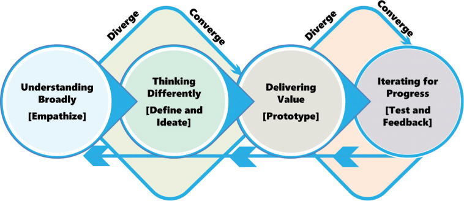
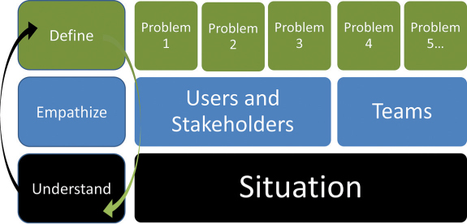

# 技术设计思维模型

你将在这一小时学到什么：

- 以人为本的思维
- 设计思维的四个阶段
- 第一阶段：广泛理解
- 第二阶段：换位思考
- 第三阶段：交付价值
- 第四阶段：迭代取得进展
- 什么不该做：完全从左到右
- 总结和案例研究

了解了设计思维的基础知识后，我们将在第 2 小时将注意力转向有助于组织设计思维过程的简单模型。 然后，我们将回顾我们模型的四个阶段：广泛理解、不同思维、交付价值和迭代取得进展。 一个常见的“不该做什么”场景与对设计思维的递归性质设定不当的期望有关，结束了我们的第二个小时。

## 以人为本的思维

传统的问题解决侧重于识别问题、理解问题的症状或表现、制定解决方案并选择最佳解决方案。 设计思维采用不同的方法，将受问题影响的人置于问题或情况的中心。 这种解决问题的方法通常称为以人为本（或以用户为中心）的设计思维。

考虑处于问题或情况中心的人似乎是常识，但这并不像我们想象的那样普遍。 考虑一下我们有多少次将主题或项目或需求放在中心位置，然后尝试围绕该主题或项目或需求进行构建。 我们创建“空气质量项目”，而不是“需要清洁空气的人”。 一路走来，我们看不到需要清洁空气的人以及为什么这对他们和他们的处境很重要。

多年来，以人为本的设计思维采取了多种形式，但通常围绕以下内容进行组织：

- 理解和同情面临特定问题的人
- 定义问题
- 想着那个问题
- 为该问题设计原型并测试潜在的解决方案
- 在此过程中寻求增量反馈，以更好地理解、理解、定义、思考、制作原型、测试和改进解决方案

正如我们之前提到的，这个过程似乎是逐步的或线性的，而且它肯定是这样开始的。 然而，最终，它变成了一种非线性的练习，即循环往复以完善我们对问题的理解以及我们如何定义它； 多想一点； 更新原型和我们正在进行的工作； 并继续测试、迭代和更新。

## 设计思维的四个阶段

正如我们在第 1 小时中简要介绍的那样，我们的技术设计思维模型由四个阶段组成，每个阶段都递归地重新连接回所有先前的阶段，如图 2.1 所示。 这样，该模型支持持续思考、持续学习和持续改进。 它使我们能够为第 1 小时中概述的复杂且独特的棘手问题提供解决方案。

图 2.1。
请注意我们的技术设计思维模型的逐步递归性质。
在耐心不足但对解决方案的期望只会不断上升的情况下，我们如何使用我们的技术设计思维模型来解决难题？ 使用我们的模型

- 管理期望。 前面提到，解决复杂问题并不是要在今天获得完美的解决方案，而是要逐步学习并随着时间的推移使用这些学习来改进不完美的解决方案。 如果领导者坚持完美的解决方案，而用户也有同样的期望，那么任何东西都无法交付。
- 广义理解。 从大局的角度来看，如果团队无法描述支撑问题的环境，他们可能会完全误解并解决错误的问题。
- 感同身受。 如果团队不深入了解将使用解决方案的人员的需求，包括他们将如何使用解决方案，则解决方案本身可能根本无法解决问题。
- 最大化构思。 团队必须设计成在思想、背景、教育、经验等方面多样化。 同质团队的思维受到限制，因此他们的构思和创新能力也受到限制。
- 解决歧义。 了解要解决的真正问题需要时间，并且愿意涉足与我们周围和面前的景观相关的未知因素。 我们的团队需要对“学习和失败以及学习和失败”感到自在，因为我们通过通常无法控制的事情来寻求更好的理解和清晰度。
- 澄清不确定性。 同样，我们必须帮助我们的团队在澄清和克服不确定性的过程中发现“最佳下一步”。 复杂问题的定义和解决需要迭代构思、原型设计和测试，作为学习和澄清的一种方式。
- 建立思考。 复杂的问题不能仅靠“思考和计划”来解决。 相反，团队还需要获得许可和指导，才能在更深入的理解和学习的过程中进行构建和尝试。

通过这些方式，我们可以在处理各种情况以寻找解决方案时发展我们的团队所需的执行和治理技术。 让我们仔细看看所有这些是如何在我们的技术设计思维模型的四个阶段中结合在一起的。

### 第一阶段：广泛理解
我们的技术设计思维模型的第一阶段侧重于通过倾听、理解和学习来提高清晰度，因为我们与合适的人联系并确定要解决的正确问题。 正如我们在图 2.2 中看到的，因此我们需要在几个不同的层次或层次上广泛地理解：

- 状况。 这包括市场条件、行业或生态系统格局及其挑战、竞争对手的现实情况和合作伙伴的期望、政府或监管方面的考虑，以及组织和业务部门的文化和规范。
- 人的状况。 这包括那些正在经历这种情况及其痛点的人，以及与每一层情况相关的问题——我们需要同情和理解那些处于情况及其问题中心的用户。
- 与情境有关的问题。 这包括特定的业务挑战和潜在的技术限制和痛点，所有这些都是为了确定正确的问题或需要解决的问题。

图 2.2
获得广泛的理解从一般到具体，包括与每种情况相关的各种人和问题。
第 6 至 9 小时涵盖了第一阶段。 有了这种广泛的理解，我们就可以开始思考这些问题的潜在解决方案，接下来将在第 2 阶段介绍。

### 第二阶段：换位思考

在我们的技术设计思维模型的第 2 阶段，我们考虑了帮助我们重新思考、以不同方式思考的技术和练习。 为什么需要不同的想法？ 因为我们大多数人往往只依赖于几种思维方式，而棘手的问题需要一种新的方法。 解决棘手的情况或问题显然不是那么简单； 否则，在我们出现之前很久就有人解决了。 因此，我们需要更多的想法； 我们需要不同的方法来处理情况或问题。

这就是不同思维发挥作用的地方，或者更准确地说是构思。 Ideate 是一个特殊的词，指的是从我们心灵的孤独中抽离出来并以某种方式显现出来的那种思维。 说实话，我们中的一些人可以很好地进行构思工作，即使这种构想还停留在我们的脑海中。 我们都认识这样的人，他可以将心智模型整合在一起，并在脑海中保留十几个数字和维度。 但对于我们大多数人来说，当我们用语言表达我们的想法，或者从中创造出一些有形的东西，或者在白板或纸片上画出我们的想法时，构思才是最好的。 我们大多数人最擅长的是将我们的想法外化。 一旦揭开神秘面纱并公开展示，外化使我们能够更深入地思考我们的想法。 摆脱了单一思想的束缚，我们可以与其他思想合作，进一步将这些点点滴滴联系起来，探索这些想法的各个方面。 一旦离开我们的头脑，我们常常会发现我们的想法会催生出更多的想法。 这种构建和外化的过程就是构思，在解决问题和创造或实现价值方面，它是一个强大的差异化因素。

构思可以单独进行，也可以作为与同事和其他人更广泛合作的一部分。 阅读和研究以及在精神上涉猎他人的工作也可以帮助我们构思。 对于许多人来说，当我们在小团队中与其他人一起构思时，最美妙的新想法就会浮出水面。 然而，经验告诉我们，真正的突破往往在我们独自思考时到来。 幸运的是，有大量的技巧和练习可以帮助我们：

- 清理我们的思想以不同的方式思考。
- 发散思考，然后收敛。
- 为创造性思维建立护栏。
- 把自己逼到极致。
- 减少不确定性。
- 仔细考虑风险。
- 解决歧义。
- 建立思考。
- 逐步解决问题。

转到第 10 小时到第 14 小时的具体技巧和练习，这些技巧和练习可以帮助我们在努力理解情况时以不同的方式进行构思和思考，更多地了解这些情况，与生活在这些情况中的人们联系，沉迷于并找出隐藏在这些情况中的问题 情况，并在这样做的过程中开始解决这些问题。

### 第三阶段：交付价值
将此阶段命名为“尽早且经常交付价值”很诱人，因为此阶段的目标远远超出了交付单次价值的范围。 在复杂的技术项目和计划中，最终的价值衡量标准通常在启动后数月或数年交付。 设计思维有别于其他思考和交付价值的方式，正是在之前的几个月和几年中交付价值的能力。

通过设计思维驱动我们的思维方式，交付价值始于尽早交付一些小而有用的东西。 通过构建思考和“边做边学”，我们发现了原型制作以递增方式提供价值的方法。 我们发现价值是通过迭代和与他人合作以快速交付部分解决方案来创造的。

- 从小处着手，快速交付
- 通过概念验证练习、MVP、试点等提供价值
- 应用有助于我们提高价值节奏的技术
- 以我们之前的工作为基础，随着时间的推移提供越来越多的价值

第 15 小时到第 18 小时涵盖了我们用来交付价值的技术和练习，并为第四阶段也是最后阶段 4“迭代进步”奠定了基础，其中包括学习和完善我们的解决方案的概念。

### 第四阶段：迭代取得进展
取得进步的基本原则之一是做一些工作，获得一些关于这项工作的反馈，并在我们改进和继续工作时使用这些反馈进行必要的更改。 根据反馈和迭代循环修正我们的工作路线有助于我们做正确的事情并且有意识地这样做。 迭代是关于交付今天有用的东西，这些东西会逐渐改进，明天会更好。 正是在迭代、反馈、构建和测试的过程和重复中，我们调整了我们的思维，提高了我们对情况的理解，并最终解决了一些最棘手的问题。

我们所知道的反馈实际上只不过是其他人——尤其是那些将使用我们工作的人——对我们工作的看法。 反馈有几个关键：

- 尽早征求反馈。 不要等到最后才发现你错过了标记并需要重新开始！
- 经常寻求反馈。 这样做可以让我们以最好的方式迭代或构建我们的工作，因为我们调整我们的工作以更好地满足人们的需求。
- 反馈应该来自我们草稿和 MVP 的最早迭代。 我们可以使用该反馈来重新思考我们的问题或情况，重新思考我们如何处理问题或情况，并重新思考如何最好地测试和实施我们的解决方案。

我们在哪里可以获得有用的反馈？ 反馈来自不同的人并通过不同的沟通渠道，包括

- 在试图验证可用性的人手中进行测试
- 逐字记录或直接引用使用我们提供的早期工作的人的明确目的以获得反馈
- 从我们自己的反省中吸取的教训
- 通过改变我们的解决方案使我们提供的解决方案更有用的人手中的静默设计

反馈也以在原型或解决方案的早期进行中的工作中戳洞的形式出现。 这是一种构建思考的形式，旨在验证我们正在做的事情与我们正在思考的事情。 戳洞的想法很简单。 与他人分享您的早期草稿文档，包括“稻草人”目录、早期模型、线框、粗略原型和其他类型的正在进行中的工件，并询问他们：

- 我在正确的轨道上吗？
- 我错过了什么？
- 应该删除什么？

这种早期反馈有助于我们了解问题或潜在的解决方案，并在我们完全构建它之前对其进行调整，然后寻求反馈。 与谈论空白画布固有的可能性相比，其他人更容易在半完成的计划或想法上戳洞。

允许人们在我们未完成的想法和进行中的工作上戳破洞需要勇气。 但是这种做法可以让每个人都更快地进步。 使用我们的草稿文档、模型等来确定想法或部分解决方案

- 现在将按原样工作
- 有一些小的变化和调整的潜力
- 很脆弱，但现在可以作为临时创可贴
- 是死胡同，但有用的方式与 Snaking the Drain 帮助我们重新开始和重新思考的方式相同

第 19 至 24 小时反映了测试、持续改进和迭代、大规模运营以及进行持久改变的意义。 正如建筑师弗兰克劳埃德赖特所说，“你可以在绘图桌上使用橡皮擦，或者在建筑工地上使用大锤。” 通过测试和反馈进行迭代可以让我们避免以后的大锤。

## 什么不该做：完全从左到右
一家大型石油公司聘请了一组顾问协助公司重新设计网站。 该团队使用了一种流行的设计思维模型，并开始着手研究客户的用户群及其需求。 片刻之后，顾问们结束了他们的同理心练习并继续定义问题。

当这种从移情到问题定义的关注点转变为人所知时，客户项目经理变得愤怒起来。 在他看来，顾问不可能花足够的时间与用户交谈并定义他们的需求！ 项目经理拿出工作说明书，转向正在使用的设计思维模型的图像，这清楚地说明问题定义只有在移情结束后才开始。

首席顾问解释说，该模型旨在迭代和递归； 它看起来是逐步的或从左到右的方向，但事实并非如此。 在花了一周的时间处理客户升级和顾问自己的组织内部升级后，团队能够说服客户，事实证明，严格从左到右移动比在步骤之间快速移动并返回之前的步骤要慢得多 加深理解并取得进一步进展的方法。

## 概括

这一小时建立在第 1 小时建立的基础之上，充实了我们的技术设计思维模型。 我们经历了四个阶段中的每一个阶段：广泛理解、不同思维、交付价值和迭代以取得进展。 虽然该模型看起来是线性的和逐步的，但我们还概述了设计思维在我们迭代和学习解决问题和交付价值时如何以其真正的形式让我们来回走动。 一个“什么不该做”的真实世界示例展示了设计思维的这种递归和“循环”性质，包括与每个相关人员一起设定期望的重要性，在本小时结束。

## 练习册
### 案例分析

考虑以下案例研究和问题。 您可以在附录 A“案例研究测验答案”中找到与此案例研究相关的问题的答案。

### 状况

Satish 迫切需要您围绕几个不同的主题或维度开始组织包含 OneBank 的十几个计划。 例如，每个计划在启动状态或项目生命周期方面处于不同的位置。 如果我们通过设计思维的镜头来看待每一项举措，每项举措在其似乎所处的主要阶段方面都会有所不同。有些仍处于最早的探索阶段，而另一些似乎在各种状态下停滞不前或脱轨 解决方案建模、原型设计或测试。 Satish 认为，如果每个计划都根据与执行委员会共享的设计思维阶段进行重塑，BigBank 可以从根本上改变每个计划各自团队对其工作的看法。

帮助 Satish 和执行委员会根据技术设计思维模型重组其 OneBank 计划，回答他和几位 OneBank 计划领导者的问题。

### 测验

1. 我们如何根据技术设计思维模型对我们的 OneBank 计划进行分组或组织？

2. 在学习或同理心的语境中，“广泛理解”是什么意思？

3. 我们最常采用的传统思维方式与帮助 OneBank 的多项举措重回正轨所必需的思维方式和想法之间有何区别？

4. 从时间或阶段的角度来看，什么时候通过设计思维过程及其技术和练习交付价值？

5. 虽然从阶段的角度考虑某个时间点可能是有用的，但为什么从左到右的设计思维过程存在根本缺陷？