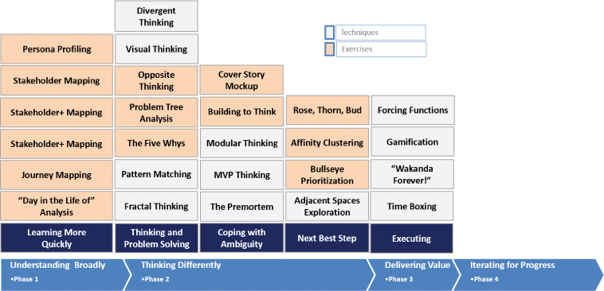

# 面向小众的设计思维

你将在这一小时学到什么：

- 为我设计思维
- 学得更快
- 思考与解决问题
- 应对歧义
- 为不确定性确定下一步最佳步骤的优先级
- 更有效地执行
- 什么不该做：这不适合我
- 总结和案例研究

在我们的第三个小时，我们快速浏览了 20 多种设计思维技术和轻量级练习，我们可以在小观众情况下使用它们，包括单独使用，以提高效率。 稍后我们将详细介绍其中的许多内容，因为我们将它们应用到特定设计思维阶段或整个数字化转型之旅或主要技术计划中来推动价值。 不过，就目前而言，重要的是要了解设计思维的技术和简单练习可以为个人、团队和小型工作组提供的可能性的广度。 我们以现实世界中的"不该做的事情"作为第 3 小时的结尾，重点是一位建筑师得出的结论是设计思维只是另一种"当今风格"。

## 我的设计思维

我们每个人在一天的工作中都会面临挑战。 从我们的日常任务到我们的工作场所倡议以及我们的项目，我们被要求倾听和学习、思考、解决问题、测试我们的想法、解决歧义、确定优先次序并有效执行。 设计思维及其各种技巧和练习可以帮助我们应对挑战，无论问题的类型如何，也无论我们扮演的角色或角色如何。 也就是说，如果我们是 Web 开发人员、IT 主管、产品经理、云基础架构专家、系统测试人员、安全和合规专家或 UX 设计师，设计思维技术和练习可以帮助我们

- 学得更快
- 以不同的方式和更深入地思考和构思
- 应对歧义
- 面对不确定性，确定下一个最佳步骤的优先级
- 更有效地执行

让我们快速浏览一下这些领域中的每一个领域以及设计思维技术和练习的种类，它们可以帮助我们完成一天的个人任务和小组（按阶段和区域组织，如图所示） 3.1). 同样，许多这些学习、思考和执行的方式将在以后的时间中详细介绍。



图 3.1
请注意，我们可能会针对个人以及我们的小型团队和团队计划采用各种设计思维技术和练习。

## 学得更快

解决问题、创造解决方案和交付价值的关键往往在于更好地了解情况和地势。 通过理解和学习，我们可以在以前失败的地方取得进步。 我们理解和学习得越快越好。

- 利益相关者映射。 每当我们接受新事物时，都会有其他人参与其中。 识别这些人并将其"映射"到他们扮演的角色、他们所代表的群体、他们拥有的权力和影响力、他们对我们工作的兴趣以及他们的联系信息是有益的。 虽然可以使用表格来捕获此信息，但以利益相关者地图形式表示此信息的图形可以让我们更轻松地查看关系和层次结构。
- 角色分析。 我们可能希望通过关注一个人在组织中扮演的角色或角色来汇总或匿名化个人数据，而不是评估或记录特定的人。 通过这种方式，我们可以创建一组虚构人物（例如最终用户、IT 支持、服务台技术人员等）来代表具有共同兴趣、需求、需求和行为的人群，所有这些都应该影响 我们如何出现、我们设计什么、我们如何测试、向谁寻求最佳反馈等等。
- 利益相关者+映射。 有了利益相关者地图（也许还有一组角色简介或同理心地图），我们可以创建一个比传统利益相关者地图更有洞察力的版本。 利益相关者+地图包括我们的利益相关者所说的话以及我们认为他们在想什么。 如果我们将每个人的情绪颜色编码为红色、琥珀色或绿色（或通过表情符号或图标），我们还可以直观地表明每个人的满意度。 这样的可视化帮助我们优先考虑并关注合适的人。
- 旅程映射。 我们可以将可视化更进一步，并说明不同的人或角色在与我们的产品、服务或解决方案交互时在何处以及如何导航流程（```Kelley``` & ```Kelley```，2013）。 客户旅程或利益相关者旅程中的每个接触点都代表一个让该人满意或失望的机会（其结果也可以在一种卷起的利益相关者+地图或情绪地图中捕获）。
- "生命中的一天"分析。 如果旅程地图是针对客户或利益相关者与产品、服务或解决方案的特定交互的战术，则"生命中的一天"或 ```DILO``` 分析旨在了解一个人所做的事情——一个人执行的更广泛的"一切" 或全天体验。 观察和记录他们的活动有助于我们开始更深入地了解他们工作的性质。 工作重复性越强（如跨越数小时或可能数天所见），此 ```DILO``` 分析越直接有用； 我们大多数人倾向于每天进行大约 80% 到 90% 的同一组活动。

有一条贯穿这些技巧和练习的线索，这条线索就是人：了解他们是谁，他们想什么和说什么，他们做什么，他们什么时候做，以及他们如何适应周围的问题和情况。

## 思考与解决问题
作为个人，我们倾向于只用过去对我们有用的几种方式来思考。 然而，设计思维为我们提供了更多方法，可以帮助我们克服阻碍我们前进的障碍。 考虑以下：

- 视觉思维。 通过将文字转化为图片和数字来"让想法和潜在解决方案可见"，这种技术长期以来一直被用来将我们头脑中的内容具体化为我们可以看到并进一步思考的东西。 在小团体的背景下，视觉思维特别强大，因为图片和数字可以带来清晰度并引发人们和团队之间的共同理解。
- 模式匹配。 模式是重复的蓝图或设计，类似地，设计思维背景下的模式匹配概念是关于发现重复的主题或线索来解释我们的行为、思考或执行方式。 我们使用模式匹配来了解我们过去所做的事情与未来可能实现的事情之间的联系。 模式识别的力量是通过洞察力和知识实现的，这些洞察力和知识让我们可以选择重复模式或以一种新的方式出击。
- 分形思维。 分形是一种特殊的模式，它是自相似的，并且会按比例或垂直方向重复自身（这解释了为什么这种技术有时被称为垂直思维）。 分形就在我们身边。 牢记这一事实，使用分形思维来认识和使用小和大之间的关系来学习和思考不同的方式。 考虑一下家庭中的行为和做法如何向上反映到街道、社区和城市中。 并考虑我们在国家层面看到的趋势和主题如何向下反映到我们的经济、行业、企业和团队中。
- 发散思维。 为了更有效地构思并创造出许多可能的解决方案或想法，我们需要花更多的时间发散和更少的时间融合。 发散是关于收集想法、探索可能的解决方案并扩大我们的选择。 发散就是增加想法的数量，通常是通过以不同的方式思考。 发散不仅会导致更大而且更多样化的选项集。 另一方面，融合的目标是缩小、削减或削减我们的想法、选择和解决方案，以提供极少数但可能是最好的（基于我们今天所知道的）。 大多数人习惯于以后一种方式看待问题，花 5 或 10 秒思考一个问题，然后在接下来的 5 天内实施答案。 这种趋同的思维在大多数时候通常运作良好，但在非常模糊和不确定的情况下，我们需要先发散再趋同。
- 问题树分析。 当我们更好地了解一个人的旅程和他们"生命中的一天"时，我们也会看到他们面临的问题和挑战。 执行问题树分析（基于 ```Paulo Freire``` 在 1970 年代初期的教育工作）以将问题的原因与该问题的影响或影响分开（```Freire Institute```，2022）。 这个简单的方法是基于树的隐喻。 画树干代表问题，画下面的树根代表根本原因，画上面的树枝来捕捉问题的影响和其他结果。
- 五个为什么。 一旦我们通过问题树分析了解了表面上的问题或情况，我们可能需要进一步探索问题的根本原因或原因。 丰田汽车公司在 1930 年代提出的五个为什么，为我们提供了一种经典的设计思维方法，可以逆向思考支撑当今问题或情况的因果关系。
- 相反的思维或逆向头脑风暴。 每个人都熟悉头脑风暴，我们将几个不同的人的思想聚集在一起思考一个情况或问题。 头脑风暴是最早的构思形式之一，当解决方案不明显时，我们都会自然而然地使用它。 但是，当传统的头脑风暴不能产生足够的想法时，我们应该转向相反的思维，或逆向头脑风暴，正如 ```Straker``` (2012) 所概述的那样，其他人早些时候将其概念化为另一种头脑风暴的方式。 逆向头脑风暴帮助我们创造性地发现新风险，找到新的解决方案，发现新的挑战，并扩大我们的构思漏斗的规模。 该技术很简单：与其试图正面找到问题的解决方案，不如倒转问题并考虑什么会使问题变得更糟。 这是一种简单的构思方法，因为大多数人天生就会思考为什么一个想法是个坏主意，或者情况会如何变得更糟。 我们是"假设"和"半满"思维的大师。 同样，我们很容易讨论如何使情况或问题变得更糟，或者考虑所有可能出错的事情。

上述每一种构思技巧都可以一起使用，以帮助我们以不同的方式进行深入思考。 每个人也可以用来结束传统的头脑风暴会议。 但是，如果这些还不够，请考虑跨越 10 小时到 14 小时的 40 多种构思技巧和练习。

## 应对歧义
当前方的道路清晰时，我们很容易思考并优先考虑我们可能做出的不同选择。 但是当这条路径模糊或完全隐藏时会发生什么？ 我们如何处理这种歧义？ 设计思维提供了一套多样化的技术和练习，以 360 度的方式提高清晰度：

- 模块化思维。 为了解决问题，将大范围的情况分解为较小的块通常很有帮助。 这种模块化思维使我们能够更有针对性地思考更广泛情况的特定方面。
- 建立思考。 对于解决方案，"为思考而构建"的过程类似于用我们的双手制作原型。 这个想法是为我们可以考虑、测试和迭代改进的问题创建一个解决方案或部分解决方案。 为什么？ 快速理解和学习，快速失败，迭代我们的学习，并以这些方式在我们学习和廉价失败的同时取得有意义的进步。
- ```MVP``` 思维。 以同样的方式，我们可以构建一些东西来帮助我们思考，我们也可以通过考虑最小可行产品或解决方案的属性来提高清晰度。 这些属性中的每一个都允许我们在将其分解为更小的部分时考虑全局。
- 封面故事模型。 与其正面解决歧义，我们可能会规避当前的事态，而不是象征性地将自己置于未来的某个时刻。 在我们穿越时空的未来，我们占据了《纽约时报》或我们最喜欢的杂志的头版，而我们的倡议就是封面故事。 那个封面故事突出了什么？ 我们完成了什么？ 与过去相比，我们的员工今天可以做得更好、有什么不同？ 通过考虑成功的属性并考虑到最终结果，我们可以回过头来考虑如何导航到封面故事的未来。
- 复盘。 比事后剖析更好的是，考虑另一种时间旅行技术，它涉及假装我们在未来。 在这种情况下，未来是暗淡的，以彻底的失败为标志。 我们是怎么失败的？ 谁没有做使我们的项目或倡议成功所必需的事情？ 在最终导致我们的项目或计划消亡或失败的过程中，我们错过了什么？ 一旦我们捕捉到了我们的想法和想法，比如封面故事模型，我们就可以向后工作，但在这种情况下，要避免在这个过程中犯这些错误。

在所有这些情况下，我们都以非常不同的方式处理我们的情况。 在某些情况下，我们专注于问题，而在其他情况下，我们会考虑可能的解决方案。 我们可能会将我们的情况分解为一组合乎逻辑的组件。 或者我们可能会完全避开今天，穿越时空走向光明或阴暗的未来，这两种选择都给了我们今天很多思考和行动的机会。

## 为不确定性确定下一步最佳步骤的优先级
一旦我们弄清楚了一些，一旦我们更好地了解了土地的布局及其模糊性，我们就有更好的机会在一系列可能的选择中确定下一步或两个最佳步骤。 许多设计思维技巧和练习可以帮助我们提炼出下一个最佳步骤。

- 靶心优先级。 这个视觉练习帮助我们组织目标、任务和其他对我们、我们的团队或我们的项目很重要的竞争项目。 它帮助我们通过组织和分组什么是最重要的、什么是最不重要的以及什么处于中间的过程来学习。 通过针对细分为任意数量象限的目标图像组织我们的目标或任务，我们也可以进行一定数量的子分组。
- 相邻空间探索。 理想的下一个最佳步骤可能与我们已经考虑的核心优势或能力相邻。 使用相邻空间的概念来评估更改更简单且风险更低的地方，并认为相邻选项更容易追求，因为它们与我们已经知道、可以做或擅长的事情更相似。
- 玫瑰、荆棘、花蕾 (```RTB```) 练习。 当 ```Bullseye Prioritization``` 或 ```Adjacent Spaces``` 练习仍然给我们留下疑问时，使用 ```RTB``` 来更详细地缩小特定选择的范围。 ```RTB``` 为我们提供了一种简单的方法来组织每个选择的正面、负面和机会，以便可以单独评估它们并相互比较。 玫瑰是选择的那些积极或健康或运作良好的方面。 荆棘是那些运作不佳的方面，而萌芽反映了有潜力的方面或需要改进的地方（萌芽通常是选择一个选项而不是另一个选项的差异制造者）。
- 亲和聚类。 有时在项目进行过程中，大量信息或模棱两可可能会拖慢进度。 亲和聚类帮助我们做出更明智的近期选择，这反过来又帮助我们保持动力。 无论是分析研究数据还是考虑创意，你都可以使用这种方法将项目组织成逻辑组。 这是给混乱带来一些秩序的简单方法。 当团队根据感知到的相似性对项目进行排序时，就会揭示模式，定义固有但不一定明显的共性。 通过这种方式，你可以从完全不同的信息中得出见解和新想法。 辨别数据（或任何大量项目）之间的模式也是驯服复杂性的有用方法。

通过"下一步最佳步骤"或选择的简短列表，我们可以将注意力转移到有助于我们个人或作为小组成员更有效地执行的技巧和练习上。

## 更有效地执行
我们工具包中一些最有用的设计思维练习和技巧可以帮助我们更可预测、更快或更有效地完成摆在我们面前的工作。

- 强制功能。 使用真实的或人为的截止日期来帮助我们比其他方式更快地完成某件事。 毕竟，约会可以成为强大的动力； 错过一个人为的提前日期也可以帮助我们遇到真正重要的不可动摇的日期。 并考虑我们行业即将发生的变化、我们市场中的新竞争对手以及我们公司内部的组织变化如何也可以作为强制功能。
- 时间拳击。 除了通过强制函数强加的截止日期外，我们还可以使用 ```James Martin``` 开发的时间管理技术，称为时间盒来帮助我们取得进展并完成大量工作。 "盒装"时间量给了我们一个截止日期，因此我们可以在其中处理某事的最长时间。 这种技术会产生紧迫感，并且通常用于比我们认为谨慎或可能的交付速度更快。
- 游戏化技术。 游戏化由计算机程序员和发明家 ```Nick Pelling``` 在 2002 年创造，它改变了我们的行为以达到预期的结果。 它特别有用，可以激励我们多快完成生活中必要但平凡的事情。 这个想法是使用一个系统来制作一个游戏，该系统会在我们一路实现目标时奖励我们。 当我们经济地驾驶时，汽车制造商通过点亮绿点或其他视觉效果来改变驾驶员的行为。 游戏制作者使用徽章和分数来保持用户的参与度和他们的平台。 当我们取得进步时，我们可以使用游戏化来奖励自己，勾选清单上的另一项，等等。
- "永远的瓦坎达！" 如果熟悉军队或运动队的战斗口号，就很容易理解成为比我们更大的事物的一部分的力量。 向 ```Marvel``` 的复仇者联盟特许经营权致敬，"```Wakanda Forever```！"的概念 技术只是将个人与团队联系起来，团队具有目标和成就。 在这样做的过程中，个人通常会加强并提供比他们单独提供的能力更高的性能水平。 无论是健康的自豪感、更大的自我激励，还是发现以前隐藏的力量的能力，帮助我们坚持和前进，"```Wakanda Forever```！" 可以在今天交付和有朝一日交付之间产生差异。

我们在第 3 小时中介绍的大部分技术和练习，包括学习、思考、应对、确定优先级和执行，将在后面的几个小时中进行更详细的介绍。 每种方法在个人和团体层面都很有用。 练习每个人，以找到自然使用和交流他们如何在小组环境中发挥作用的方法。

## 什么不该做：这不适合我
任何新事物都会带来采用或忽略的选择，以及许多问题。 一家传统汽车制造商的建筑师发现自己在说："我应该尝试这种叫做设计思维的新事物吗？ 我需要试试吗？ 为什么我不能坚持我知道有效的方法？ 等待今天的新口味有什么坏处？"

这位架构师最终了解到，广泛地了解生态系统、深入理解他的最终用户、定义和解决正确的问题等等不仅仅是昙花一现。 无论设计思维标签如何，他们都有助于他如何更有效地工作。 然而，他不愿意改变，最终被鼓励提前退休。

不要成为说"这不适合我"的人。 一种新的学习、思考、应对、优先排序和一般工作方式意味着我们出现和完成工作方式的改变——分散注意力、尴尬、耗时，甚至是不自然的改变。 本书中的许多设计思维技巧和练习，如果不是有点愚蠢或不必要的话，肯定会让人觉得不自然。 毕竟，设计思维要求我们从根本上重新思考和改变我们学习、思考和执行的方式。

但这些都是好的、健康的变化。 如果一切顺利，并且我们当前的方法使我们从 A 点到达 B 点，我们可能会忍不住搁置这本书。 但事情是这样的：随着我们周围外部变化的步伐不断加快，我们在技术领域所做的工作也越来越复杂，我们必须同样加快我们自己的方法和工具固有的变化步伐。 我们需要在我们的工具包中添加新的和渐进的方法来更好更快地完成工作。 我们需要先熟悉其中的一些新技术、练习和工具，然后才能在工作中使用它们。

当我们不拥抱和实践这些"为我和我的小组"以自我为中心的设计思维练习时，我们就错过了培养更广泛地实践这些方法所必需的信心的机会。 在我们的业务发起人或 CIO 要求我们承担一个已经偏离轨道并需要新的理解和思维方式才能取得进展的项目之前，学习并完善我们运行旅程映射、问题树分析、靶心优先级排序和亲和力聚类练习的技能 . 在家里练习强迫功能和时间拳击，与我们的孩子一起游戏化，并在我们的小组中进行事前回顾。 在我们真正需要在更大的环境中使用这些方法之前，先练习这些方法并在小团队环境中熟练使用它们。

## 概括
在这个小时里，我们研究了设计思维技巧和练习，这些技巧和练习足够简单有用，可以开始在个人和我们的小组中使用。 通过这种方式，我们可以开始逐渐习惯新的学习、思考、应对、优先排序和执行方式，同时将 20 多种新"工具"添加到我们的工具包中。 这些技术和练习中的每一个都会在以后的时间中得到更详细的介绍。 我们以一个架构师不愿学习、改变和以新方式运营的现实世界"不该做什么"示例结束了第 3 小时。

现在我们已经探索了设计思维给我们个人带来的广泛可能性，我们准备在第 4 小时探索设计思维在创建和维护有弹性和可持续的团队的背景下。

## 练习册

### 案例分析

考虑以下案例研究和问题。 你可以在附录 A"案例研究测验答案"中找到与此案例研究相关的问题的答案。

### 情况

BigBank 的 OneBank 计划领导者被"推销"了使用设计思维来解决问题、取得进步并逐步交付价值的想法。 但是执行委员会和银行的首席数字官 Satish 要求你分享一些轻量级的技术和练习，倡议领导者及其团队应该熟悉并使用这些技巧和练习。 他们还希望你能为银行提供一种组织对个人和小型团队有用的设计思维技术和练习的方法。 他们对模糊性和不确定性之间的区别仍然有些困惑。

### 测验

1. 你如何组织设计思维技巧和练习供个人使用或小团队使用？

2. 你如何向世行的倡议领导者解释模糊性和不确定性之间的区别？

3. 有哪三种设计思维技巧或练习可用于应对歧义？

4. 可以帮助个人或小团队以不同方式思考的三种设计思维技巧或练习是什么？

5. 哪三种设计思维技术或练习有助于在面对不确定性时确定"下一步最佳步骤"的优先级？