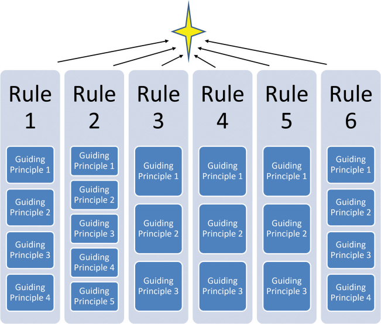
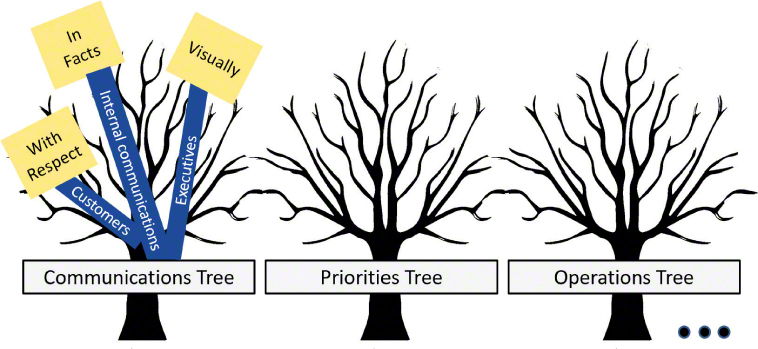
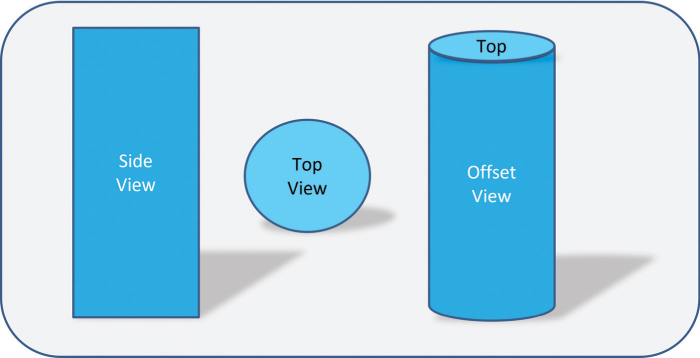
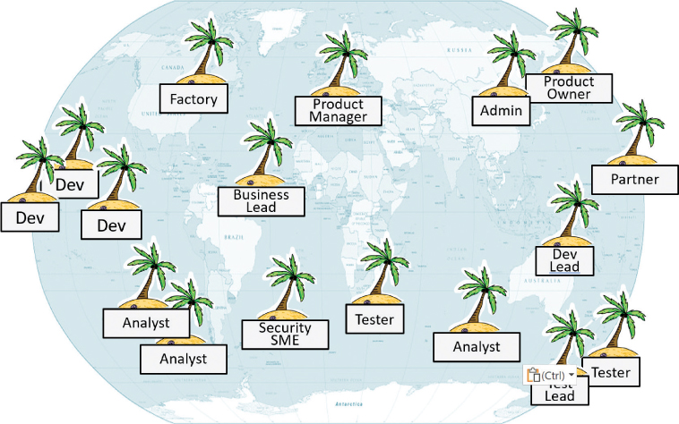

# 有弹性和可持续发展的团队

你将在这一小时学到什么：

- 技术团队协调的设计思维
- 可持续团队的设计思维
- 负责任地快速运营
- 什么不能做：群岛效应
- 总结和案例研究

虽然我们在第 3 小时中介绍的设计思维对工作场所、社区和小团体中的个人很有用，但它也是构建、维护和作为团队成员工作的理想选择。 在这一小时中，我们将介绍一些设计思维技巧和练习，这些技巧和练习有助于建立有弹性的团队、保持这些团队健康、以包容和有效的方式与我们的团队成员一起工作、在彼此之间建立健康和有意的联系等等 . 第 4 小时以与避免群岛效应相关的重要"不该做的事情"结束。

## 技术团队协调的设计思维

技术团队可能会在学习更快、更深入地理解问题、更有信心地识别问题、更聪明地构思、快速交付价值等过程中练习一百种不同的设计思维技巧和练习。 但是，这些技术中没有一种比他们用来帮助团队更好地工作和共同成长的技术对个人的影响更大。 在这一小时中，我们将介绍以下内容：

- 健康对齐的简单规则
- 操作一致性的指导原则
- "我们能怎样？" 质疑包容性团队合作和解决问题
- 通过设计实现更智能构思的多样性
- 学习和团队合作的成长心态
- 迭代的三分法则
- 包容和有效的会议技巧
- 用于弹性的网状网络

对于初学者，让我们将注意力转向建立一套简单的规则以实现良好的团队合作。

### 行动中的设计思维：健康对齐的简单规则
在我们建立团队和建立规范的过程中，现在考虑如何调整和维护该团队还为时过早。 通过创建一套简单的规则，可以实现更快决策、更清晰的战略和运营一致性的长期和可持续的方法，从而实现团队的长寿。

简单规则定义了团队的知名度、优先事项、重要和不重要的内容、团队将创造或做的事情、团队将与谁建立联系以及团队何时运作和沟通。 团队开发并应用他们自己的一套团队独特的简单规则。 这些规则成为团队执行和成功的路标或公式。 为了清晰明了并保持团队一致性，请记录一组 6 到 10 条回答以下问题的简单规则：

- 作为一个团队，我们是谁？
- 我们做什么; 我们的目标是什么？
- 我们将采取哪些措施来确保实现这些目标？
- 我们不做什么（所以我们保持专注）？
- 我们什么时候开始工作； 我们的时间是几点？
- 我们在哪里工作； 我们的界限是什么？
- 我们的遗产是什么？ 我们想因什么而出名？

改编自唐纳德·苏尔 (```Donald Sull```) 和凯瑟琳·艾森哈特 (```Kathleen M. Eisenhardt```) 所著的《简单规则：如何在复杂的世界中茁壮成长》一书，《简单规则》可作为指导方针，帮助一群人保持一致，忠于他们的核心价值观，并更快地做出决策。 简单规则有助于在我们和我们团队的上层、下层和周围发生其他变化时保持"我们是谁"。 将简单规则视为北极星（见图 4.1）。



图 4.1
无论规模大小，Simples Rules 都是任何团队或组织的北极星。
有时，团队负责人会单独创建一套简单规则草案，但出于购买目的，它们总是作为一个团队完成。 简单规则也可能随着时间的推移而完善，但它们通常非常耐用。

**时间和人员**：简单规则练习需要 3-10 人进行 30-60 分钟。

要创建一组简单规则：

1. 提前几天要求团队成员考虑描述团队的人员、内容和时间。
2. 召集团队，并逐一要求每个团队成员写下并单独思考以下问题：
   1. 我们的工作是什么样的？
   2. 我们将因什么而出名？
   3. 我们作为一个团队做什么？
   4. 我们的主要目标是什么？
   5. 我们最大的技能或优势是什么？
   6. 我们在哪里工作，我们的界限是什么？
   7. 我们什么时候开始创造产出？
   8. 鉴于以上情况，我们作为一个团队是谁？
   9. 鉴于上述情况，我们的遗产是什么？
3. 通过前面的答案来起草一组初始的简单规则。
4. 大约一周后，巩固和简化简单规则，解决差距以创建规则的改进版本。
5. 再过两周后，将列表修剪到前 10 名左右。
6. 作为团队文化的一部分，发布、使用和遵守这些简单规则，可能每月修剪和优化这些词。

多年来，世界各地的团队一直在不知不觉中制定简单规则，以帮助他们保持专注和保持一致。 摇滚乐队酷玩乐队在早期创作了一套 10 首歌曲，以推动乐队之间一致的艺术过程和音乐成果。 用他们的话说：

1. 专辑不得超过 42 分钟或 9 首曲目。
2. 制作必须惊人、丰富但有空间； 没有重叠，更少的轨道，更多的质量，凹槽和摇摆。 鼓点和节奏是最重要的。
3. 电脑是仪器，不是录音工具。
4. 意象必须是经典的、丰富多彩的、与众不同的……
5. 在设置发布日期之前，请确保视频和图片都很棒，并且高度原创。
6. 永远保持神秘。 面试不多。
7. 凹槽和摇摆节奏和声音必须尽可能保持原创。...
8. 宣传/评论副本在乙烯基上。 停止复制问题，听起来和看起来更好。
9. 杰奎琳·萨布里亚多 (```Jaqueline Sabriado```)，```ns p cc```，面向前方。
10. 想想如何处理慈善账户。 设置一些小但真正有能力和建设性的东西。

经过四分之一个世纪的合作，这些简单的规则让酷玩乐队在声音、输出和特定听众的吸引力方面保持了惊人的一致性，同时保持了独特的自我意识和传统。

在小型企业界，一家牙科供应公司制定了一套简单规则，以帮助公司确定优先考虑哪些潜在牙科客户。 在评估了自己的客户数据库后，该公司发现其当前牙科客户的 10% 占其收入的一半以上。 公司的 ```Simple Rules``` 旨在巩固各种共同特征，以帮助其最大程度地扩大盈利客户群，包括

- 我们只会针对拥有自己诊所的牙医。
- 我们目标牙医的理想年龄是 35-55 岁。
- 我们瞄准的每位牙医都应该能够每年投入 10,000 美元的产品。
- 理想的牙医目前负担不到 5% 的融资，因此有带宽与我们合作。
- 理想的牙医已经参加了我们公司特定的培训方案。

根据这些简单规则执行一个月后，公司删除了第一条规则，因为它发现这条规则并没有真正产生影响。 该公司还将 10,000 美元的承诺价值降低到 5,000 美元，因为它被证明与预测器几乎相同。 后来，这家牙科供应公司还根据从当前牙科客户那里收集到的见解，添加了"理想的牙医有一个网站"这一规则。 在执行这套修订后的 5 条简单规则一年后，尽管市场形势严峻，该公司仍实现了超过 40% 的销售额增长。 它的定位和调整能力帮助公司始终如一地关注正确的客户。

### 行动中的设计思维：操作一致性的指导原则
一致性在简单规则以外的领域很重要。 一套简单的规则定义了谁、什么和什么时候，同样建立一套指导原则可以推动"如何"的一致性。 指导原则概述了团队将如何运作、如何思考、如何确定优先级、如何沟通等等。 指导原则为团队提供保持可持续发展所必需的运营指导，同时做出符合团队简单规则、预期遗产和组织整体战略的明智决策。

因此，指导原则是不可协商的价值观和参数，它们描述了一个团队如何为彼此出现，如何处理日常业务和彼此。 实际上，指导原则是我们起草的简洁的单行线，作为通用护栏，让我们保持在正确的车道上——就像物理护栏对道路上的车辆所做的一样。

与简单规则类似，指导原则经久不衰； 他们不应该随着时间的推移而改变太多。 但与简单规则不同，我们可能需要为我们决定的每个领域起草 5 到 10 条指导原则，作为一个团队，我们希望以一致的方式处理。 因此，我们可以轻松地围绕沟通、优先事项、运营等组织 50 条或更多指导原则。

为了制定有效的指导原则，我们将核心价值观与反映团队对其目的、使命或人员的看法的动词相结合。 例如，当我们考虑沟通的指导原则时，一个团队可能会起草

- 我们始终如一地以一种声音进行交流。
- 我们以透明的方式执行。
- 我们诚信经营。
- 我们在内部和外部实践包容性。
- 我们与每个人交谈并恭敬地对待每个人。

顺便说一句，团队通常首先创建这样一组描述他们将如何沟通的原则。 众所周知，沟通在很大程度上取决于我们的运作方式和我们的价值观。 之后，团队通常会起草指导原则，重点关注他们将如何相互支持、处理诚实和道德问题、管理分歧和升级等。

**时间和人员**：指导原则练习需要 3-10 人进行 60-120 分钟。

执行以下步骤以帮助我们的团队创建自己的一套指导原则，并参见图 4.2 的工作示例：

1. 准备工作：虽然不是绝对必要，但首先要创建团队的一套简单规则。 这些规则帮助团队专注于团结一致的领域，并帮助他们建立一套相关的指导原则。
    
    图 4.2
    通过树的比喻来组织指导原则，我们可以在创建新树和进一步发展现有树时保持井井有条。
2. 同意合作的媒介。 考虑使用实体会议室的白板或 Miro 或 Klaxoon 等在线协作工具。 或者使用 Zoom 或 Microsoft Teams 共享虚拟桌面或白板。 用老式的纸和笔喝咖啡也总是有效的。
3. 召集团队充实第一套指导原则。 留出 30 分钟来起草第一套 5 到 10 条指导原则（请记住，我们要避免单独制定简单规则或指导原则)。
4. 列出团队将为其制定指导原则的各个领域，例如沟通、优先事项和运营。
5. 为了使这个练习直观，选择一个视觉隐喻。 具有树干、根和树枝的树隐喻对于创建指导原则特别有效。 为每个区域使用不同的树（因此，你将创建通信树、优先级树、操作树等）。
6. 决定首先关注哪个区域并将其记在第一棵树的树干上。 例如，团队可能决定从"我们将以尊重和诚信的方式进行沟通"开始。
7. 不要想太多这个练习！ 从树干顶部画出几根树枝（请记住，每套指导原则都有自己的树）。 主干的每个分支都应该形成一个问题，并将代表我们正在构建的区域（主干）的一个维度。 例如：
  1. 分支#1："我们将如何在团队内部进行沟通？"
  2. 分支#2："我们将如何与我们的业务发起人和其他执行利益相关者进行沟通？"
  3. 分支#3："我们将如何进行包容性沟通？"
  4. 分支#4："我们将如何以一种易于访问的方式进行沟通，以确保每个人都在循环中并且我们不会遗漏任何人？"
  5. 分支 #5："我们的团队沟通将如何尊重个人界限？"
  6. 分支#6："当我们不同意或不一致时，我们将如何在我们之间沟通升级？"

8. 通过每个团队成员循环，逐一添加额外的树枝。 根据需要添加并标记这些树枝。 分店多就好了！ 我们可以稍后合并。
9. 每个团队成员循环询问团队将"如何"完成分支#1 上写的内容，然后是分支#2，依此类推。 请注意，每个"如何"问题的答案都是指导原则，应记录在一页中。 每个分支机构可能会有许多这样的叶子或指导原则。
10. 例如，对于 分支 #2，"我们将如何与我们的业务发起人和其他执行利益相关者进行沟通？" 我们可能会创建以下一组叶子或指导原则：
  1. 分支 #2, 叶 #1：首先处理紧急情况； 不要通过故事掩盖坏消息或积累坏消息。
  2. 分支 #2，叶 #2：与事实、日期和风险缓解措施进行沟通。
  3. 分支 #2，叶 #3：在图片和仪表板中进行可视化交流。
  4. 分支 #2，叶 #4：以反映高管期望的方式进行沟通。
  5. 分支 #2，叶 #5：拼出首字母缩略词，直到确定它们是我们共享词汇表的一部分。

11. 继续建造每根树枝和它的叶子，树就会成形。
12. 稍后，团队可能希望使用我们在第 3 小时中简要介绍的一些技术按主题或优先级对叶子进行分组，并在以后的几个小时中详细介绍（例如模式匹配和亲和聚类）。

对团队的其他 5 到 9 个简单规则或重点区域重复整个过程，最终团队将组装一个由 6 到 10 棵树组成的小森林，每棵树可能有 5 到 10 根树枝和 5 片左右的叶子或指导 每个分支的原则。 请注意单个简单规则或重点领域如何驱动 20 到 40 或更多指导原则。

练习完成后，巩固并分享这些指导原则。 他们需要被团队看到和使用！ 跟随他们，加强他们，随着时间的推移修剪他们，并通过定期的团队跟进来增加他们。

### 行动中的设计思维："我们怎么可能？" 包容性团队合作
"我们怎么可能？" 是受苏格拉底启发的设计思维主食，多年来已在许多情况下证明了自己的用处。 "我们怎么可能？" 提问反映了将一群人聚集在一起并创建团队所必需的积极进取的态度。 "我们怎么可能？" 为团队构思、团队问题解决以及良好的协作和团队合作创造一个安全的场所。 这意味着许多解决方案都是可能的，并且团队将作为一个团队一起解决这个问题或情况。 这是最好的乐观和包容性思维。 就像其他为思考和执行建立积极环境的技术一样，"我们如何？" 非常适合收集观点、推动构思、解决问题并最终取得进展。

## 可持续团队的设计思维

除了基本的一致性之外，可持续发展的团队还需要推动自己实践自我保健和团队保健才能保持健康。 如果我们不打算照顾我们如此精心建造的东西，为什么还要建造它呢？ 五项重要的技术和实践包括

- 通过设计实现更智能构思的多样性
- 学习和团队合作的成长心态
- 迭代三法则
- 包容和有效的会议技巧
- 用于弹性的网状网络

让我们仔细看看这五种设计思维技术和实践，这些技术和实践对于建立能够很好地团结在一起的团队很有用。

### 行动中的设计思维：通过设计实现更智能构思的多样性
经验和二十多年的研究告诉我们，多元化的团队可以加速创新（福布斯，2011 年）。 这并不意味着思想、经验、文化、教育等方面的多样性很容易实现，也不意味着我们不会面临与沟通方式和文化规范相关的其他挑战。 但这确实意味着，如果我们正在寻找以不同的方式思考并解决真正困难的问题的方法，那么通过组建一支多元化或跨界的团队，我们可以更好地做到这一点。

跨界团队只是多元化团队的代名词，其团队成员反映了地域、性别、背景、文化、教育、能力、种族、组织、学科、技能、资格等方面的多样性。 跨界团队将人们融合在一起工作，带来他们独特的经验和观点。 通过这种与生俱来的多样性，跨界团队的最大好处体现在改进的构思和这些团队交付的最终结果中。 在设计思维过程中应用跨界团队合作以获得最大效果。

> 笔记
> 设计的多样性
> 设计的多样性无疑是我们单独用于解决问题的第一种技术。 想想看。 当我们小时候遇到问题或陷入困境时，我们会怎么做？ 我们可能会问哥哥该怎么办，或者在爸爸的怀里哭诉我们的悲伤，或者向妈妈抱怨——依靠一个年长的人，有着完全不同的背景，丰富多样的经历，甚至可能是不同的性别 . 当我们还是孩子的时候，我们的家庭成员就像我们想象的那样多样化，几乎在所有方面都与我们不同。 他们有独特而不同寻常的思考和执行方式，而且往往能帮助我们摆脱困境。 拯救多样性！

当我们陷入困境时，多样性可以帮助我们找到出路，并帮助我们避免陷入困境。 我们多元化的同事不仅给我们提供了与我们不同的观点，而且由于他们的性别、背景、经验、文化、种族、能力和其他差异，他们自然会帮助我们以不同的方式思考和执行。

另一方面，同类相同的团队和 v 团队的思维自然受到限制，因此他们的构思和创新能力也受到限制。 如果你环顾四周，看到一群和你长得一模一样的人，那么迈向更聪明思考的第一步就像将一些新人带入团队一样简单。

请记住，设计的多样性并不意味着一切都会变得更容易。 多元化悖论提醒我们，多元化团队并不是包容和创新的包罗万象的良方。 毕竟，人还是人，更大的团队多样性自然会引入新的偏见和默认模式来解决问题。

但经验也告诉我们，多元化的团队可以加速创新和解决问题。 我们会更快地构思和制作原型。 因此，再次强调，如果我们正在寻找以不同方式思考和解决难题的方法，我们最好将一个多元化的团队聚集在一起，而不是试图单独思考、解决和创造。

多样性帮助我们从新的角度看待世界和我们的问题。 字面上地。 想想圆柱体的视角。 从上面看圆柱的人自然会相信他们看到的是一个圆。 另一个侧视图的人自然会相信他们正在看一个矩形。 如图 4.3 所示，两个人都不会错。 不过，第三个人可以走进来，通过他们的经历和差异看到不同的观点，甚至可能是圆柱体。 我们需要与我们有不同看法的人来帮助我们以不同的方式看待我们的问题或情况。



图 4.3
从不同的角度来看，情况可能看起来非常不同。
当然，我们可以教会我们团队中的人以不同的方式思考并接受新的观点。 但是这里的例子提醒我们为什么难题很少单独解决。 正如我们将在未来几个小时看到的那样，构思往往不是一项团队运动。 常识告诉我们，最好有 10 名团队成员，因此可能有 10 种不同的情况，而不是单一的观点和一次解决问题的机会。

### 行动中的设计思维：学习和团队合作的成长心态

在我们走过人生的过程中，我们可以选择一种听天由命的态度，坚持原地踏步，坚持我们今天所知道的。 我们称之为固定型思维模式，它是大多数人大多数时候的实际操作模式。 或者我们可以选择一种反映学习和失败并最终成长的能力的态度，也称为成长心态。 猜猜哪一个可以帮助你解决更多问题并更快地创造价值？ 由卡罗尔·德韦克 (```Carol Dweck```) 博士创建，并在她的《心态：成功的新心理学》一书中概述，以成长心态进行操作和思考的前提是，

- 无论年龄、经验、教育程度或专业领域如何，人们都有能力学习。
- 人们想要成功，自然不喜欢失败。
- 因此，失败需要成为尝试和做事的健康部分，因为它是通往成功之路的关键一步。
- 失败提供了一种独特的学习方式，是反馈的最终形式。
- 坚持是成功的另一个关键因素，因为人们在实践成长心态的同时失败并学习。
- 恩典是成功的最后要素； 它必须在团队成员之间和内部进行实践，才能使成长心态成为团队文化或工作场所氛围中具有粘性和持久性的一部分。

最后一点怎么重复都不为过。 拥有成长心态需要个人和团队以健康的眼光看待失败。 我们必须向他人请求尝试、失败和学习的恩典，同样，当他们尝试、失败和学习时，我们必须将这种恩典扩展到他们身上。

没有两条恩典之路，成长心态是不完整的。

如果我们今天发现自己有固定的心态，请选择改变它。 选择相信我们能够超越今天的状态，学习、成长、失败，并最终因为这些失败而成功。 重铸失败为学习！ 并相信最好的还在后头。

同样地，不要让我们的团队成员有固定的心态，让我们的心态变得更糟！ 我们无法改变别人，但我们可以通过自己的行动，向他们展示另一种方式。 在整个团队中塑造成长心态。 成为将成长心态的优雅扩展到其他团队成员的人，并观察它随着时间的推移返回并反映在整个团队中。

### 行动中的设计思维：迭代的三分法则
经验和常识告诉我们，我们很少在第一次做新事情时就做对任何事情。 正是出于这个原因，我们迭代和完善我们的工作。 迭代是我们取得进步的方式。

因此，如果我们期望第一次就实现完美，那么完美几乎是不可能的。 我们无法实现完美并快速完成。 因此，当我们着手快速交付有价值的东西时，我们必须

- 为我们的用户和其他利益相关者设定完美不是主要目标的期望。
- 相反，选择在第一个版本或原型或 MVP 的基础上进行迭代和构建……方向性足够好的东西可以保证来自将使用第一个版本的社区的第一轮反馈。
- 考虑其他形式的思考和构思（除了足够好的思考）在尽早交付有价值的东西方面可能发挥的作用。
- 最后，广泛传达我们遵循三分法则，这表明我们可能需要三次迭代（有些人说最多五次迭代）才能使我们的第一个版本具有足够的方向性，以便与我们的用户社区分享

三分法则告诉我们，我们的原型、新设计、解决方案、可交付成果或其他工作产品将需要三次迭代才能满足最低要求。 三分法则为我们提供了一种自信的思考方式，在前两次迭代的基础上进行构建并从中学习，并比其他方式更快地完成更多工作。 关键是在我们改进工作并从好到更好再到首次发布的过程中，设定切合实际的期望并在整个迭代过程中扩展优雅。

### 行动中的设计思维：包容和有效的会议技巧
在工作场所，生活常常感觉就像是一系列的会议，一个接一个。 有些是定期发生的，有些是临时发生的，有些是面对面发生的，有些是通过远程方式发生的。 无论会议的时间、地点和形式如何，这些与人类同胞的互动都需要一个安全的思考和协作场所。 包容和有效的会议技巧有助于提供这个安全的地方。

考虑以下技巧和指导原则列表，了解如何举办包容、有效且健康的会议：

- 邀请合适的人在合适的时间出现在合适的地点，并提前通知合适的时间。
- 表现出积极的意图并关注积极的结果。
- 为所有会议制定会议议程或时间表，即使它是一系列会议之一。 人们有权忘记我们想聊什么； 议程是我们的提醒，也是我们帮助其他人做好准备的工具。
- 取消或重新安排会议时，尽可能提前通知，让与会者有机会从事其他工作或优先事项。
- 如果我们预计会议会很艰难，请考虑我们可以做些什么来做好准备并很好地传达信息。
- 让与会者知道他们是否是可选的，并允许他们"选择退出"参加特定会议（并让他们也知道在会议结束后的某个时间很快就会收到会议记录）。
- 确定会议记录员作为会议开始时的首要任务； 人类记忆不能替代书面或记录的文字。
- 在远程会议开始时，鼓励与会者至少在开始的几分钟内打开视频（目标是使会议可视化并让人们看到）。 为了保护隐私并保持安全的协作场所，永远不需要视频； 使其成为可选的。 但是模拟我们希望看到的行为，我们往往会看到它。
- 对于定期会议，确保我们轮换或分担做笔记的工作量（最重要的是，请记住做笔记不是一项针对特定性别的任务）。
- 对于包括远程与会者的会议，当需要讨论或构思时，通过让远程与会者首先分享他们的想法和想法来推动包容。
- 也使用技术来推动包容性会议，包括 IM 线程、"举手"功能、表情符号和其他类似的反馈功能，帮助人们联系、提问、分享观点和参与。
- 知道什么时候讲故事，什么时候简明扼要（并在这些领域也温和地帮助其他人）。
- 记得把最安静的与会者拉出来，并询问他们的想法。 每个人都需要知道他们将有机会在会议结束前发言或分享他们的想法。
- 在会议结束时太多人离开之前，讨论是否需要召开后续会议，并尽量安排在当时而不是以后。
- 确定并商定后续沟通渠道（并使用该渠道分享会议记录和后续步骤）。

在一天结束之前发送这些会议记录和后续步骤，或者在最坏的情况下在 24 小时内发送。 不要因为害怕打字错误或语法问题而阻止人们在会议结束后立即发布会议记录。 在会后快速跟进和行动方面的权衡值得偶尔出现错字。

### 行动中的设计思维：网状网络的弹性
鉴于连接人员和团队孤岛的需要，有时称为群岛网络，网状网络是关于通过有意的联系以及非正式和正式交流的网状网络来关心和喂养团队。 通过这些联系的叠加，我们可以增加我们团队的归属感、社区、社会资本和社会凝聚力，这反过来将对团队的文化和工作氛围产生积极影响。

引述："所有成功文化的轴心都是归属感"——卡伦·齐格勒 (```Karen Zeigler```)

在大流行的第一年，与 2019 年观察到的情况相比，我们彼此之间的非正式联系下降了 30%。我们正在迅速成为孤岛，我们的工作场所和沟通反映了这种日益严重的脱节，如图 4.4 所示。



图 4.4
考虑一下从远处看，许多组织是如何简单地像一个岛屿的集合，而不是一个有凝聚力的团队。
而且没有办法绕过这个岛屿或群岛效应。 它是真实的，我们需要一种新的方式来联系人们、连接岛屿并重建归属感。 有效的团队合作要求这些岛屿通过正式网络和通信链路的网格以新的和多样化的方式连接起来。 后来我们意识到我们需要非正式地做同样的事情，因为人们失去了他们曾经与同事和工作场所的朋友以及可能跨越世界的其他团队之间的非正式桥梁。

使用网状网络让团队保持联系，尤其是当相关人员分布在不同的距离或时区时。 积极地将个人孤岛和更大的小团队孤岛相互联系起来，以推动更广泛的意识、更有效的沟通和更深入的协作。 最大限度地保持联系，让我们的员工和团队保持健康，并且不太可能在精神上检查或做人们在感到孤立、被忽视和孤独时所做的其他类型的事情。

通过包容性沟通和同心沟通（在第 15 小时详细介绍）促进了良好的岛与岛之间的联系，包括点对点和点对导师的关系。 以这些方式联系可以让我们取得进步并取得单独也难以取得的成果。 正如我们通过设计多样性以及我们将在第 10 至 14 小时中介绍的与构思相关的技术和练习所看到的那样，当尝试单独思考和解决时，难题变得更加难以思考和解决。

好的网状网络是什么样的？ 如图 4.5 所示，它包括

- 多个点对点连接，它们共同创建了一个重叠的关系、连接和归属感网格
- 人与团队和实践社区之间短而频繁的点对点交流节奏，这再次加强了归属感
- 通过签到等简单行动定期与他人建立正式和非正式的联系（我们有针对性地询问他人感觉如何，感觉如何，今天或本周有什么让他们分心或吸引他们的地方）
- 与其他人迹罕至的岛屿建立轻型桥梁，包括那些与我们的日常生活或工作没有直接联系的人（重要的是在我们核心联系圈之外的人之间建立联系）
- 大局地理分组以及与了解我们的项目、计划或我们关心的其他领域中广泛发生的事情的人员和资源的联系


图 4.5
一个健康的网状网络由多个连接点和关系组成，不仅跨越工作场所，而且跨越更远的地方。
通过引入增加共享身份技术中的关系建立方法来加强网状网络。 这可能包括

- 这是我的个人资料
- 远程团队建设
- 其他非正式关系建立方法
- 非正式的欢乐时光或 ```ChitChat``` 会议（虚拟/在线以及面对面，视情况而定）

最后，将网状网络扩展到拥有共同围栏、共同目标或兴趣的其他人，或者有朝一日可能成为我们团队的一员的其他人。 考虑远程和物理连接方式：

- 传统或团队仪式，如梦幻足球或垒球联赛、Aloha 周三半天庆祝活动、周五晚上虚拟烧烤、周六早上虚拟早午餐、周一晚上足球派对、```5K``` 步行、钓鱼和狩猎周末、露营和保龄球之夜、约会之夜或 电影观看派对、纸牌和多米诺骨牌以及台球锦标赛等

- 由当地社区、教堂、学校或社区赞助的服务项目
- 慈善和救灾活动自然而然地将人们联系在一起以帮助他人（否则谁都不可能认识彼此）

在轻松的时期和最困难的时期，与那些给你能量、目标、出口、声音或有价值观点的人建立联系和交流。 使用网状网络有意识地发展我们自己的网络，一次一个人、一个团队和一个事件。 毕竟，我们谁都负担不起长期作为一个岛屿或群岛运营。

## 负责任地快速运营
除了角色、清晰度和联系之外，我们还需要以一种使他们能够快速行动以缩短价值实现时间的方式来运营我们的团队，同时促进健康的协作和团队合作。 体现本小时概述的许多设计思维技术和练习的实践包括：

- 锻炼和塑造信任。 团队生存时间更长，行动更快，实验更聪明，实践成长心态，因此当个人透明地相信和信任彼此时，他们会承担更明智的风险。
- 需要对齐。 为团队预留时间建立一套简单的规则和指导原则，帮助他们更好地协调和更快地转变决策。
- 落实责任。 为了保持信任，我们需要确保当我们的团队说他们将要做某事时，他们会兑现承诺。 后果是生活的自然组成部分； 不要回避它们，而是将后果作为一种方式来强化重要和不可谈判的东西。
- 实践透明度。 为了加强问责制和信任，部署实时团队仪表板和其他使团队进展"可视化和可见"的方法。 这样的仪表板提供了对技术计划或项目生命周期中自然会出现的瓶颈和障碍的可见性，从而使团队及其领导者有更多时间来解决问题。
- 验证包含。 审核并检查团队以确保每个人的声音都被听到，人们以健康的方式工作，并且团队真正按照预期（即设计）多样化。
- 要求低开销。 创建具有更少管理层级和层次结构的更扁平的组织，以自然地提高可见性、简化问责制并加速决策制定。
- 研究所更少的门。 尽量减少人员和团队经常插入流程的强制"停止"或关卡和其他检查点的数量； 确保团队在创建可交付成果或工件时协同工作，以最大限度地减少或消除与关卡或检查点相关的时间。

通过这些方式，练习本小时中概述的许多技巧和练习，以平衡团队的速度与其创造价值和交付业务成果的能力和记录。

## 什么不能做：群岛效应
当我们没有花时间努力将人和团队联系起来时，我们就有可能陷入一个叫做群岛效应的陷阱。 成千上万的组织在大流行期间成为这个陷阱的受害者，尤其是在第一年末，当时没有人真正预料到大流行会持续超过 6 到 12 个月。

到 2020 年底，全球大部分劳动力都变成了孤岛，无休止地推动决策和选择，或者让他们孤立无援、不知情。 人们开始从无聊和与世隔绝的感觉中"退房"，而其他人则变得冷漠。 工人们开始成群结队地退休和退出工作岗位，而在其他情况下，工作退居二线，转而照顾所爱的人、帮助远程学校的孩子、参加即兴视频游戏锦标赛、半天抽烟休息和外出休息。 - 控制一天的饮酒。

人们不应该孤立地生活。 许多仍然来上班的人发现自己负担过重、陷入困境、不快乐，感觉自己一文不值。 这种缺乏联系的部分原因解释了为什么这么多人寻找新的工作和新的方式来度过一天。 大洗牌之后，草未必更绿，但至少是不一样的草。

尽管我们中的一些人告诉自己，每个人都需要广泛的同龄人、朋友和家人来保持健康、参与和积极性。 网状网络是关于包容性和连接性的，是关于不让任何人掉队的。 在工作、家庭、邻居、俱乐部、我们的教会家庭以及我们更广泛的社区和社区中扩展我们的网状网络。 确保我们关心的其他人也这样做。 健康的人和牢固的人际关系将帮助我们避免群岛效应。

## 概括
第 4 小时在第 3 小时奠定的广泛基础上进行了扩展。在这一小时中，我们介绍了八种新的设计思维技术和练习，用于建立和维护有弹性和可持续发展的团队。 我们探索起草简单的规则和指导原则以实现健康的一致性和操作的一致性，然后在"我们如何做？"中分层。 质疑包容性团队合作。 接下来，我们介绍了通过设计实现更智能构思的多样性、用于学习和团队合作的成长心态，以及用于迭代和设定期望的三分法则。 我们介绍了一系列技术和指导原则来帮助我们举行包容和有效的会议，我们还介绍了如何执行网状网络作为将原本孤立的人员和团队相互联系起来的一种方式。 第 4 小时总结了将这些技术和练习结合在一起以快速操作的意义，以及"不该做什么"部分，重点是避免群岛效应。

## 练习册
### 案例分析

考虑以下案例研究和问题。 你可以在附录 A"案例研究测验答案"中找到与此案例研究相关的问题的答案。

### 情况

```Satish``` 对他的几位 ```OneBank``` 倡议领导人感到担忧。 世行的多项举措似乎未能从根本上做出决策，或未能在战略和运营上保持一致。 两个最同质的倡议团队在构思和解决问题方面也停滞不前。 最后，还有许多与会议和研讨会中看似非包容性行为相关的事件的报告。 萨蒂什有几个问题，需要你在与倡议领导人交谈之前先了解一下你的初步想法。

### 测验

1. 哪种类型的设计思维技术或练习可以帮助其中一些团队更快地做出决策并从战略和运营角度保持一致？

2. ```How Might We``` 可以用什么方式？ 质疑也能帮助这些优柔寡断和不结盟的团队吗？

3. 什么样的设计思维技术可以提高团队构思和解决问题的能力？

4. 什么样的设计思维技术可以帮助那些在会议和研讨会上遭受非包容性行为困扰的团队？

5. 你如何简要解释群岛效应？