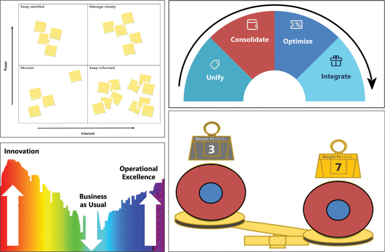
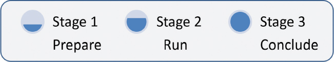

# 可视化和视觉团队合作

你将在这一小时学到什么：

- 使团队合作可视化
- 视觉协作工具
- 执行设计思维练习
- 第一阶段：为练习做准备
- 第二阶段：运行练习
- 第三阶段：结束练习
- 什么不该做：把它全部放在里面
- 总结和案例研究

在这一小时中，我们不仅探索如何将设计思维原则用于团队合作和协作，还探索如何以研讨会或会议的形式执行设计思维练习。 在介绍了视觉思维的重要性并列出了超过两打的视觉协作练习之后，我们重点介绍了几种在线设计思维协作工具。 然后我们将通过一个简单的三阶段过程来成功执行任何设计思维练习：准备练习、运行练习和结束练习。 通过保持流程的简化和对特定练习的添加开放，并在每个阶段中包括关键步骤，我们为远程和面对面的协作奠定了基础。 第 5 小时结束时，"不该做什么"强调了团队成员之间达成共识的重要性。

## 使团队合作可视化

如果我们独自思考，我们可能不需要将最初的想法写在纸上、白板上或某种数字格式中。 尽管我们的机会很渺茫，但我们可能会很幸运，并记得足够多的因素和围绕我们想法的影响，从而真正得出解决方案。 这不是最聪明的方法，但有时会奏效。

然而，如果我们在一个团队中工作，我们绝对需要把脑子里想的东西从脑子里拿出来。 仅靠文字是不够的，因为文字很容易被误用和误解。 将头脑中的想法从头脑中清除出来的最好方法是通过视觉来做到这一点。 我们称这种通用技术为使想法可见和可视化。 这只不过是创建并一起改进图片、图形、图表、模型等，以帮助我们在团队成员和我们可能邀请的其他人之间建立共识，以帮助我们思考和解决问题。 使我们的工作可见和可视化的两种方法包括视觉思维和基于视觉的设计思维练习以进行视觉协作。

### 行动中的设计思维：用于理解的视觉思维
就我们的目的而言，视觉思维是关于有意地用图片和图形来增加甚至替换文字。 正如我们无数次听到的那样，一张图片胜过一千个单词。 虽然我们可能会争论字数，但正如我们在图 5.1 中看到的那样，一张图片确实比一页页的文字更能有效地形成共同的理解。



图 5.1
请注意此处的视觉效果如何帮助任何人（无论他们之前是否参与过）开始了解团队可能面临的问题或挑战。

### 行动中的设计思维：视觉协作练习

正如我们已经看到的，设计思维的基础是让想法可见和视觉化的概念。 正是通过这些方式，我们可以将我们的想法从脑海中拉出来并与他人分享，以产生同理心、构思、交流、同理心、原型、测试、操作、执行等等。 在整本书中，我们涵盖了三打以上的视觉协作练习。 其中一些包括

- 利益相关者映射以更快地了解人们
- 用于确定利益相关者优先级的权力/利益网格
- 旅程地图以了解更多关于人及其工作的信息
- 用于了解更多关于用户和角色的移情映射
- 用于分离原因和结果的问题树分析
- 用于思考日程安排的船和锚
- 化繁为简的隐喻类比思维
- 不可能完成的任务
- "效率思维"的莫比乌斯思想
- 识别主题的模式匹配和分形思维
- 用于查找模式和主题的亲和聚类
- 为构思和同理心运行沼泽
- 广泛理解的文化立方体
- 用于验证自然模式适合度的黄金比例分析
- ```Bullseye``` 优先级排序，了解什么是第一、第二、第三
- 用于可视化支持和反对变革的力量的力场分析
- 用于解决视觉问题的思维导图
- 合适的人，合适的时间同心沟通
- 快速理解的结构化文本
- 2×2 矩阵思维，用于重点和优先级排序
- 低风险后续步骤的相邻空间探索
- 封面故事样机以对齐和激发
- ```RTB``` 用于更明智的后续步骤
- 用于共享理解的流程
- 用于学习和反馈的模型
- 负责任地适应变化的逆幂定律

现在让我们将注意力转移到一组工具上，这些工具可以促进视觉和可见协作，并为我们提供让地理上分散的团队一起进行设计思维练习的方法。

## 视觉协作工具
我们所有人都习惯于与他人面对面合作。 我们使用白板，在一张办公桌或桌子上相互查看图表和计划，并在会议室和会议空间进行交流。

但正如我们所知，协作并不总是面对面进行。 随着我们的团队跨越更远的距离和地域，以及无数的本地和全球条件使差旅变得困难或昂贵，虚拟协作的需求变得比以往任何时候都更加重要。

对于设计思维练习和其他此类实时交互，请考虑使用以下流行工具：

- ```Klaxoon``` 板及其研讨会平台，用于运行交互式会议和设计思维研讨会，审查和标记在 ```Microsoft PowerPoint``` 或 ```Visio``` 或 ```Adobe``` 的协作工具中创建的预先准备的内容，使用 ```Klaxoon``` 的多色智能和可调整大小的便签进行实时练习，等等。 在团队无法亲自开会进行设计思维练习的情况下，```Klaxoon``` 和 ```Microsoft Whiteboard```（接下来介绍）很容易使用。 请访问 https://klaxoon.com/ 创建一个帐户并开始使用 ```Klaxoon``` 的工作坊平台。
- ```Microsoft Whiteboard``` 及其预填充的问题解决、设计、策略、回顾和同理心地图模板等，用于现场素描、制定概念、标记内容以放入 ```Klaxoon``` 板等。``` Whiteboard``` 包含在 ```Windows 11``` 中，提供有限的 ```Web``` 版本，可以下载用于其他 ```Windows``` 平台、```Apple iPhone``` 和 ```iPad```。 请参阅 ```Microsoft``` 在线商店以获取该应用程序。
- ```Figma``` 用于线框图、标记便签以及与他人快速分享想法，包括使用自定义库来托管和迭代我们的项目和计划的原型。 并使用 ```Figma``` 的 ```FigJam``` 进行在线白板、构思和探索想法。 请参阅 https://www.figma.com 设置帐户并使用此工具。
- ```Microsoft Teams``` 和 ```Zoom Video Communications```，用于通过视频进行交流和协作、共享图形和其他数据，以及进行实时和异步交流。 在 www.zoom.us/download 下载 ```Zoom```，在 www.microsoft.com/en-us/microsoft-teams/download-app 下载 ```Microsoft Teams```。

当然，还有许多其他工具可用。 使用 ```Miro``` 进行协作，使用 ```Canva``` 进行原型设计，使用 ```Mural``` 进行设计思维模板和画布，使用 ```LinkedIn``` 上的 ```Billboard Design Thinking group``` 进行模板，以及与此处列出的其他类似的工具在 ```Linux``` 和 ```Linux``` 等平台上运行实时协作和视频会议 各种移动平台。

## 执行设计思维练习

有整本书籍和课程专门用于提供设计思维研讨会和促进练习。 出于我们的目的，我们已将"运行设计思维练习"简化为三个阶段，如此处所述和图 5.2 所示。

- 第一阶段：为练习做准备
- 第二阶段：运行练习
- 第三阶段：结束练习



图 5.2
使用这个简单的三阶段过程来思考和执行设计思维练习。
使用这三个阶段和每个阶段中包含的步骤来执行本书中概述的任何设计思维练习。 接下来详细介绍每个阶段。

> 笔记
> 只是一点点清晰......
> 尽管另一个术语可能更理想，但我们还是选择了术语阶段，以避免与与技术设计思维模型相关的阶段以及与运行设计思维练习相关的步骤混淆。

### 第一阶段：为练习做准备

有完整的课程专门用于准备和提供设计思维研讨会、会议或练习（通常可以互换的术语）。 出于我们的目的，我们希望尽可能减少任何开销，以负责任地创建尽可能简单的流程。

我们还需要考虑练习的"人的方面"； 不仅是必须成为我们工作核心的用户社区，我们还将邀请我们的团队成员和其他利益相关者加入我们的设计思维练习。

最后，如果我们牢记我们的练习通常旨在广泛学习、深入理解、定义问题以构思和解决问题，或者原型和测试，并且我们了解我们的设计思维练习在这个连续体中的位置，那么我们应该知道 更多关于收集什么、如何计划以及邀请和准备谁的信息。

通过执行以下操作来准备和计划运行设计思维练习：

1. 选择一个所有者来确定对特定设计思维练习的需求并为此做好准备。 通常情况下，业主也会担任锻炼促进者（或教练），但我们现在不应该做出这样的假设。
2. 将所有后勤工作整合在一起，包括如何促进演习（在实际地点或通过 Klaxoon 等工具）。
3. 安排必要的工具和材料以促进练习（从物理白板、表格、记号笔和便利贴到相同的虚拟等价物）。
4. 确定要解决的关键挑战、一组简短的练习目标和一个简单的议程。
5. 根据目标，确保计划的设计思维练习仍然合适。 根据需要调整或添加额外的练习并更新议程。
6. 考虑运行该练习需要多少时间（请参阅该练习的练习说明）。 根据参加者和推定的主持人或教练的可用性，确定必要参加者的人数和组成以及练习的实际日历日期和时间。
7. 尽早发出会议邀请以锁定与会者。 将议程和目标包含在此次会议邀请中，并明确表示此次活动不仅有趣且充分利用时间，而且是共同实现目标的重要一步。
8. 根据我们在此过程中学到的知识，确定并准备我们的设计思维练习辅导员或教练。 确保主持人通过一组模拟练习来熟悉自己。 主持人需要准备好并兴奋地吸引与会者并推动我们的练习取得成果。

当然，这个简单且可重复的过程可以修改，但它应该作为任何练习的良好起点或模板。

### 第二阶段：运行练习
如果我们准备充分，那么我们应该有一个实体或虚拟的房间，里面坐满了准备好一起工作的与会者。 通过执行以下操作开始并执行设计思维练习：

1. 成为第一个（实际或虚拟）到达并欢迎所有人的人。 通过 30 秒的简短介绍进行循环。 在每位与会者自我介绍时包括一个简单的破冰游戏（请参阅此处的注释以获取受欢迎和最喜欢的破冰游戏列表）。
2. 分享与设施、预定休息时间、减少分心的做法、参与期望、参与协议等相关的任何后勤或内务管理规则。 保持这些轻松和乐观，为合作和开放的交流创造一个安全的空间。
3. 介绍会议的主题和目标、议程、我们都应该了解的问题或情况或情况，以及我们今天的最终目标：我们希望实现的结果（可能包括更多地了解情况， 建模或定义问题、构思学习或可能解决问题、构建原型等）。
4. 在开始实际的设计思维练习之前，从旨在帮助人们创造性思考的热身开始可能会很有用。 请参阅第 10 小时进行热身，包括诸如画出我们脑海中的想法、用玩具积木或乐高积木建造摩天大楼、与邻居搭面条或纸桥、制作最准确或距离最远的纸飞机等活动， 只用纸和胶带设计一个四杯托，不提笔不折线画房子等等。
5. 介绍设计思维练习、我们面临的挑战、我们将使用的材料以及我们寻求的结果。 提醒与会者我们需要关注的关键用户社区，包括那些有可能被忽视或边缘化的用户和边缘案例。
6. 按照此处或其他来源中概述的步骤运行实际的设计思维练习。
7. 如果与会者停滞不前或陷入困境或分心，请考虑引入一套护栏以进行不同的思考（如第 11 小时所述）或进行快速签到以了解每个人的表现。 根据需要提供清晰度或帮助。

> 笔记
> 重要的破冰船指南
> 我们最喜欢的一些打破僵局的话题包括让与会者分享他们梦想的工作、最喜欢的运动队、第一辆汽车、最自豪的成就、他们愿望清单顶部的项目、他们目前正在听的音乐或播客、他们读的最后一本书 ，他们上周末是如何度过的，或者分享一些可能很少有人知道的关于他们的事情。 但是，在浏览每个与会者的答案时，请注意创造一个包容和鼓励的环境！

这个过程在纸面上看起来很容易，但挑战也会随之而来。 准备好乐观地应对这些挑战，牢记我们需要取得的成果以及我们都需要一起冲过终点线这一事实。

### 第三阶段：结束练习
虽然特定练习的结束可能会产生截然不同的输出和结果，但仍然有几个共同的步骤可以执行来结束我们在一起的时间。

1. 对练习及其交付和接收方式进行简单的回顾，包括它在设计思维连续体中的位置以及完成的内容。
2. 收集或记录或以其他方式保存所有已完成的模板、工作示例、问题陈述和框架输出、模型、想法列表、优先选择或决策、原型和图纸、测试计划和输出，以及所有可能创建的视觉效果 一路上。
3. 与与会者就下一步和后续行动达成一致，包括下一组决策、技术和练习。
4. 在解雇任何人之前，请与会者就练习、工具和材料的有用性、主持人或教练的有效性以及下次应该做些什么做些不同的事情征求与会者的反馈。
5. 结束练习，感谢大家的到来和参与。
6. 进行领导层内部汇报，以分享成果和产出，并与这部分较小的听众讨论下次应该采取哪些不同的做法。
7. 之后，以数字格式与与会者和相关利益相关者分享输出、结论、后续步骤等，以免他们在演习结束后迷失方向。

## 什么不该做：把它全部放在里面

一家地区性零售商正处于业务转型过程中，发现其员工的工作时间令人难以置信，但进展甚微，开发周期缓慢和测试结果不佳就是明证。 最终有人建议团队过于拘泥于细节和杂草； 团队成员需要一颗北极星，以及一种使他们的工作与北极星保持一致的方法。

粗略的想法被抛来抛去，但没有人想到以一种将想法从他们的头脑中拉出来并公开的方式来推动团队的思考，以便其他人可以"看到"并考虑它们。 团队把一切都藏在心里，困在他们的脑海里……一个人的观点与另一个人的观点略有不同。 团队需要让他们的想法和他们的工作可见和可视化。 他们需要达成某种共识，并就他们的中期和最终产出使用共同的词汇。

相反，他们被告知要回去工作。 经过又一年的艰苦业务转型，该公司认为更广泛的变革不值得付出努力，因此停止了该项目。

## 概括
在第 5 小时，我们探索了可见和视觉团队合作与协作的设计思维原则。 我们概述了用于在人与人之间建立共同理解的视觉思维，然后是用于视觉协作的大量视觉练习。 在了解了一组简单的工具来促进远程和地理分散的团队成员之间的这种协作之后，我们转向了三个阶段来运行本书中超过三打的设计思维练习中的任何一个：第一阶段准备练习， 第 2 阶段用于运行演练，第 3 阶段用于结束演练。 通过保持跑步练习的过程简单，并在每个阶段包含关键步骤，我们创建了一个简单且可重复的过程。 在第 5 小时结束时，"不该做什么"重申了在团队成员之间达成共识的重要性。

## 练习册

### 案例分析

考虑以下案例研究和问题。 你可以在附录 A"案例研究测验答案"中找到与此案例研究相关的问题的答案。

### 情况

萨蒂什最近注意到许多沟通问题，并得出结论认为，```OneBank``` 计划的几个团队使用常用词和短语的方式对他们来说是一回事，但对其他人来说却完全不同。 在解决共享词汇问题时，他要求你也与这些团队分享你对使团队合作可见和可视化的看法。 团队已经传递了几个问题让你先回答。

### 测验

1. 什么是最简单的视觉思维？

2. 视觉协作设计思维练习有哪些例子？

3. 如果团队无法亲自开会进行设计思维练习或会议，哪些替代方案可能最有用？

4. 什么样的逐步过程可以用来组织和执行设计思维练习或会议？