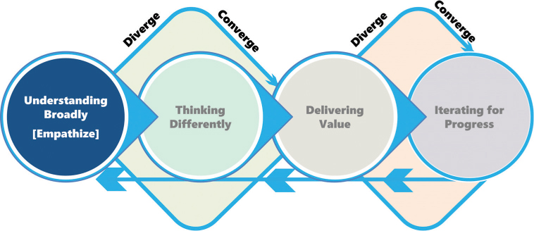
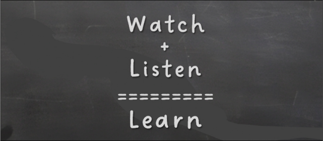
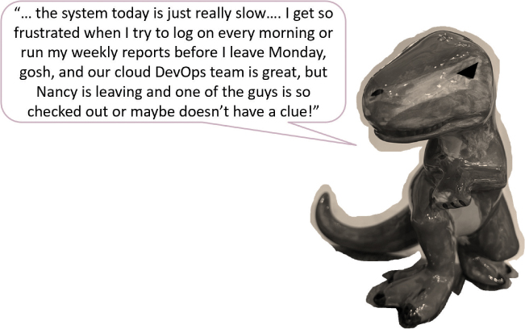
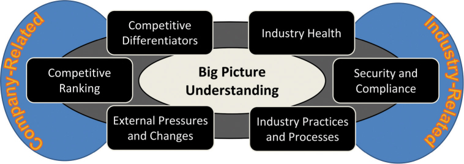
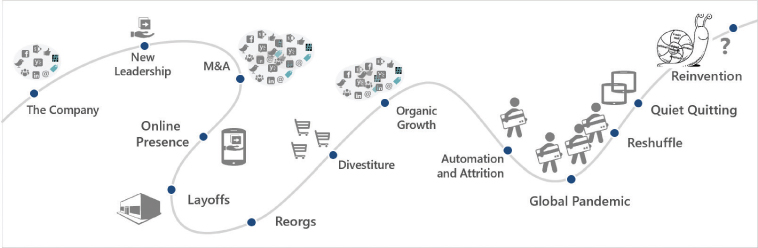
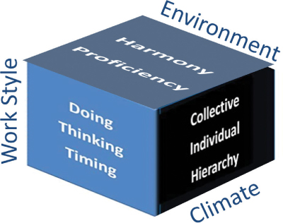

# 了解地势

你将在这一小时学到什么：

- 听力和理解
- 评估更广泛的环境
- 理解和阐明价值
- 不该做的事：忽略文化分形
- 总结和案例研究

第 6 小时从第二部分"广泛理解"开始，我们将重点关注技术设计思维模型的第 2 阶段（见图 6.1）。 在接下来的四个小时里，我们将踏上一段旅程，了解这片土地的情况，与遍布这片土地的合适的人联系，并更多地了解这些人，以此作为一种换位思考、成功解决问题并最终共同创造价值的方式。 在第 6 小时，我们专注于三个方面：倾听、理解和学习。 我们在某种情况或问题的背景下进行倾听、理解和学习的工作。 毕竟，在我们开始与将对我们产生影响的特定人员进行更深入的联系和同理心之前，我们应该了解这片土地的情况——生态系统、行业、组织及其文化。 所有这些工作都体现在我们的技术设计思维模型的第 1 阶段，我们追求它是为了帮助我们弄清楚成功解决问题和创造价值需要什么。 "什么不该做"的案例研究侧重于忽略文化衍生分形的影响，本小时结束。



图 6.1
我们的技术设计思维模型的第 1 阶段。

## 听力和理解

倾听是一种技能。 但这也是一个过程，良好的倾听得益于一些预先计划。 在我们成为真正好的倾听者之前，我们需要提前思考并有意识地

- 知道我们需要什么。 考虑你需要的信息以及可能有能力分享该信息的人。 更重要的是，深入思考我们是否正在寻求"哈哈"的启示、经验教训、历史或汇报、对最近事件的反馈、对未来想法的想法，或其他东西。
- 选择那些知道我们需要什么的人。 考虑在有目的地找到观众并与观众坐下来与开放让我们的观众找到我们并让我们坐下来之间取得平衡。 智慧和洞察力来自四面八方。
- 在场。 没有什么比假设的听众没有真正倾听更糟糕的了。 我们所有人都从经验中知道这一点……当我们的观众分心并因此没有完全在场时，很容易分辨出来。 如果我们在那里听，那就听吧！ 收起电话，合上笔记本电脑的盖子，找一个没有干扰的好地方，然后在场。 聆听和学习并在事后做笔记，以确保我们不会忘记刚刚听到、学到和感受到的内容。
- 要有自知之明。 倾听还意味着实时回应，以表明我们正在参与、思考和学习。 巧妙地点头很有用，偶尔说些简单的肯定的话也很有用，但不要过度使用这些技巧！ 我们都知道有人假装在听，而实际上他们并没有，我们都知道有人以如此分散注意力的方式倾听，以至于我们不禁怀疑他们是否真的在听。 了解我们自己。

> 笔记
> 需要更好地聆听？
> 通过练习主动倾听、设计沉默以及此处概述的其他倾听和学习技巧，成为一个更好的自我意识倾听者。 这样做，我们就可以开始掌握情境流畅的艺术。

长期在麻省理工学院任职的学者库尔特·勒温 (```Kurt Lewin```) 曾说过，了解一种情况的最好方法就是尝试改变它。 为什么？ 因为人们会蜂拥而至帮助我们理解为什么改变是不必要的，一切都很好。 相反，其他人也会蜂拥而至，帮助解释为什么特定的更改无法满足他们的需求或解决他们的问题。 还有一些人会蜂拥而至，就如何进行变革、改变什么以及何时进行变革发表他们的观点。

通过所有这些人的"帮助"，我们可以加深对情况的了解。 但这种临时增长并不能建立我们可能需要的广泛理解，也不能推动可持续变革所必需的那种头脑知识和内心同理心。 相反，我们应该开始练习接下来介绍的主动聆听。

### 行动中的设计思维：积极倾听
人们通常很快就会说他们是很好的倾听者。 但这比我们想象的要困难得多。 这是一项需要磨练的技能，就像任何其他技能一样。 积极倾听就是出现和

- 全身心投入，不受干扰。
- 不断克制打断的冲动，直到该打断为止。
- 与其打断我们分享自己的想法，不如选择反映我们刚刚听到的内容。
- 通过口头暗示、微笑、点头等，反映我们对所听到内容的理解。
- 在有意义的时候进行解释，作为澄清和浓缩关键主题或知识的一种方式。
- 尽我们所能专注于手头的主题，认识到其他人可能会将谈话转向其他方向。
- 根据需要提出问题，记住尽量减少过程中的干扰。

请记住，积极倾听就是放下我们的手机、笔记本电脑、我们的偏见以及我们自以为知道的一切。 在场，像我们错了一样倾听，然后学习（见图 6.2）。 可以说，没有比倾听他人的经历、他们的故事以及他们不请自来的挑战和痛苦更好的学习和同理心的方法了。


图 6.2
积极倾听反映了我们如何表现并专注于他人。 （新闻主管/```Shutterstock```）
行动中的设计思维：设计的沉默
创造并使用尴尬的沉默和其他健康的不适，作为了解他人想法的一种方式。 Silence by Design 是一种通过在与他人交谈时不填补讨论中的停顿或空白来获得理解的方法。 相反，让沉默站着……让它坐着……等待。 耐心等待对方最终重新开始对话，同时观察肢体语言和其他非语言交流。

这个想法很简单。 当我们安静的时候，当我们选择倾听而不是用自己的胡言乱语来填补空白时，我们就是在给别人一份礼物。 我们让他们能够用自己的见解和真正的想法来填补尴尬的沉默。 无论我们是在进行积极的对话还是争论，设计沉默都可以让我们有针对性地了解另一个人的想法。 以及他们的感受。 这些见解就像黄金一样。

在那些尴尬的沉默中，因为我们没有努力寻找自己的语言，所以我们有机会更加注意。 我们有机会考虑围绕讨论的所有非语言反应和肢体语言。 从这些非语言交流中学习——扬起眉毛、交叉双臂、翻白眼或恼怒地摇头——来帮助我们弄清楚一旦我们让"设计沉默"自然而然地进行下去，该从哪里开始对话 .

```Larry King``` 曾经说过："我今天所说的一切都无法教会我任何东西。 所以，如果我要学习，我必须通过倾听来完成。" 聆听有多种形式。 最初，我们希望并且需要广泛倾听那些愿意交谈的利益相关者的意见。 最终我们将学会从噪音中过滤出金块，但重要的是要让每个人都有机会被听到； 不要过早地排除人们的声音。 毕竟，最直言不讳的人往往最受影响或最感兴趣，即使他们可能是最困难或最恼人的。

我们也必须倾听广泛的听众，从上到下，从老板到工人……从处于一切事物中间的群众到"边缘"或外部可能有宝贵经验的人 和我们的观点（见图 6.3）。



图 6.3
当我们通过利益相关者、潜在用户等的呼吸观察和倾听时，通过设计保持沉默可以产生更深刻的见解。

> 笔记
> 嘘……
> 当我们安静下来时——当我们选择倾听而不是用自己的胡言乱语来填补谈话的空白时——我们最终会发现其他人会用他们独特的见解和他们真正的想法来填补那些尴尬的沉默。

### 行动中的设计思维：超级反派独白

就像电影中经常出现恶棍花时间"揭露他们的邪恶计划"一样，我们可能需要让那些对我们的处境和景观有历史了解的人就他们的观点进行独白……比如 一个邪恶的超级反派！ 我们需要知道他们在想什么，我们需要知道情况是如何发展到今天的地步的。

我们怎样才能知道别人在想什么？ 对于初学者，请尝试邀请对影响他们未来的开放式问题的回应，例如

- "这里发生了这么多变化，你认为我们接下来会发生什么？"
- "如果这种情况像你想象的那样发展，你有什么计划？"
- "对于像我和你这样的人来说，这里的未来会怎样？"

或陈述一些对当前情况或组织具有挑衅性的内容，以此作为引起回应的方式：

- "从长远来看，你认为这些行业变化将如何影响我们？"
- "你如何看待过去六个月中一半的领导团队离职？
- "```Allison``` 怎么没有晋升为总经理？"
- "你最后一次看到这样的事情发生是什么时候！？"

如图 6.4 所示，超级反派独白对于与他人互动和了解我们自己陷入的境地非常有用。 通过这种技术，我们可以发现未来会怎样，我们可能面临的不确定性和其他挑战，以及我们可能需要做出的决定。 与天生健谈或容易过度分享的人相处真的很容易。 找到他们，吸引他们，然后学习！



图 6.4
鼓励其他人像 ```Supervillain Monologuing``` 一样谈论和分享他们的观点可以带来比积极倾听和设计沉默更深刻的见解。
引导不开心或心怀不满的人说话也不难。 如果我们不想回答棘手的问题，请找一位愿意的同事并标记团队情况。 一起带领那个人去他们想去的地方，然后坐下来倾听和学习。 请记住，在这些情况下，没有人是真正邪恶的超级恶棍； 我们只是使用一种常见的参与技术来了解更多信息。

### 行动中的设计思维：探索更好的理解

对情况或问题有了合理的了解，我们终于可以开始钻探或"挖掘"细节。 为此，我们会提出一些未经深思熟虑就无法回答的问题。 通过这种方式，我们可以实现探索理解的目标，即让情况变得清晰，不仅可以了解更多信息，还可以避免以前犯过的错误。

探究性问题也超越了澄清性问题。 好的探索性问题可以打开前门和后门，让我们能够以 360 度的方式探索这些情况。 如何？ 通过问开放式的"为什么……？" 问题和追求类似的问题。 当我们探究并提出深层问题以了解情况时，我们是

- 回顾过去，作为解释我们如何来到这里的一种方式
- 评估今天，了解为什么事情是这样的
- 展望未来，思考引入变革时可能发生的情况

我们通过提出一些未经思考就无法回答的问题来进行探索。 目标是使当前或潜在的情况更加清晰，以避免以前犯过的错误，并找到解决我们面前模棱两可的方法。

但是，探究性问题必须超越仅能澄清问题的问题； 探索性问题用于寻找和理解情况的边缘。 因此，它们是开放式的，并且通常以"为什么……？"开头。

重要的是，探究性问题并不是为了消除歧义！ 复杂的情况通常反映出一定程度的歧义，而为消除所有歧义而投入时间和精力是徒劳的。 我们的目标是简单地消除前几个"层"的歧义，以便我们在追求对土地布局的更广泛理解时变得更聪明。

当我们努力更好地理解为什么我们或其他人会陷入困境时，我们可能需要提出深刻而探究性的问题，这些问题真正帮助我们打开另一个人的心态。 如果我们不深入了解为什么另一个人以特定方式思考或重视特定事物，或者我们无法了解当前情况是如何发生的，那么我们可能永远无法完全理解捕捉那个人的挣扎、思考和行为的细微差别。

有多种方法可以巧妙地询问和寻求真相，但开放式问题和漏斗问题通常是最简单和最有用的。 开放式问题不能用是或否来回答。 它们本质上是探索性的，是那种真正让人避免自动回答并真正思考问题的问题。 考虑以下示例：

- "当你设计这个界面时，你的想法是什么？"
- "你打算如何发现需求？"
- "为什么你认为这是管理积压的好方法？"
- "告诉我更多关于……"

漏斗式问题从简单的问题开始（询问姓名、事情进展如何、此人最近在做什么），一旦被问及的人感到舒服，问题就会变得更尖锐或更深思熟虑：

- "为什么你没有在……方面取得更大的成功？"
- "你在……期间克服了什么问题？"
- "你最后一次看……是什么时候？"
- "谁告诉你关于……的？"

尽管探查（尤其是漏斗问题）会有一种感觉，但探查的目的是让情况变得清晰和诚实。 探索提供了理解，这反过来又帮助我们避免错误并更多地了解我们面前的事物。

探索理解为我们扫清了一条穿越不确定性的道路。 要进行良好的"理解探索"练习或提问，请记住以下几点：

- 给被提问者思考的自由、空间和时间。
- 不要过早地回答我们自己的问题或引导我们的听众走上我们自己开辟的道路； 通过设计练习良好的沉默！

让问题坐下来沉入其中，并在他们自己的时间得到回答。 要有耐心。 我们很可能会得到一些我们还不知道的东西。

- 谨慎使用挑衅性或高度情绪化的问题。
- 避免一次用太多棘手的问题轰炸一个人。
- 平衡执行基本事实调查的需要和被引导到意想不到的学习路径（真正的回报所在）的需要。
- 避免仓促下结论； 跳跃打断了信息的流动，暗示我们认为我们已经有了所有的答案！
- 使用我们的听力技巧来确定正确的澄清问题。 澄清将增进理解和同理心。
- 在整个沟通过程中展示参与度。
- 对我们问题的答案提供深思熟虑和真实的反馈，以表明我们正在倾听。 回应回应、经历或故事的特别重要的方面，以此来强化沟通者的信息或邀请更多细节。
- 注意我们自己的肢体语言和面部表情。 没有什么比不受控制的肢体语言更快地结束一场激烈的谈话了。

探究让我们能够消除倾斜的观点、歧义和人们选择分享的少量信息，这样我们就可以学习和看到更大的图景，并在这个过程中变得更聪明。

> 笔记
> 知道这一切？ 不，谢谢。
> 请记住，当我们探索理解时，我们需要避免看起来像个万事通！ 相反，努力成为一个伟大的倾听者，被认为是一个倾听一切的人。

## 评估更广泛的环境
一旦我们倾听并探索了理解，我们就需要做一些研究来填补空白。 具体来说，我们希望获得全局理解，然后了解组织的文化、工作场所氛围和偏见。

### 行动中的设计思维：大局理解

正如我们在第 2 小时中简要介绍的那样，获得全局理解归结为研究和理解许多环境维度，这些维度从广泛的追求开始，并越来越深入以更好地理解

- 宏观经济环境和行业
- 所在行业和环境中的公司或实体
- 公司或实体内的组织或业务部门

例如，如图 6.5 所示，我们可能首先探索更广泛的行业、经济或监管环境，以及其他宏观或全局问题，以了解以下问题的答案

1. 整个行业或景观（经济、问题和当前趋势）的状况和健康状况如何？

图 6.5
通过探索组织周围的宏观和其他高层次问题，我们可以对该组织有一个广泛而全面的了解。
2. 哪些安全和合规性要求是最重要的？
3. 是否有特定的行业惯例、流程和质量标准需要考虑？
4. 最相关的外部压力和变化是什么（例如竞争压力、经济变化或监管问题）？
5. 公司或实体在其行业和竞争对手中的排名如何？
6. 该公司与其他类似公司的区别是什么？ 它们有何不同，为什么？

然后我们可能会更多地探索公司、它的文化和标准，以及它的具体业务和技术问题：

7. 公司或实体的总体愿景是什么？ 它渴望成为谁，实现这一愿景的时间框架是什么？
8. 公司当前的文化在多大程度上反映了它渴望成为什么样的人？ 差距在哪里？
9. 从财务、客户、合作伙伴、员工工作/生活平衡和员工士气的角度来看，公司的总体状况如何？
10. 公司如何应对外部业务压力和变化？
11. 公司的主要业务或运营痛点和挑战是什么？ 这些如何受到技术约束或限制的影响？
12. 它的最高战略业务或运营战略或计划如何？ 技术是阻碍还是帮助？
13. 关于这些战略和举措，公司是否在保护技术或其他圣牛和现状？
14. 公司及其领导团队是否在奔跑而不是朝着统一的愿景或使命奔跑？
15. 公司的业务和技术战略最近进展如何，正在发生或可能发生的变化是什么？

然后，我们可能会填补反映公司特定组织或业务部门及其受业务和技术情况和问题影响的人员的空白：

16. 业务部门的职能战略和能力需要哪些改变？
17. 当前功能的交付情况如何？ 这些交付能力有多成熟？ 关键差距在哪里？
18. 对于任何给定的业务支持技术，是否有识别和围绕特定业务或特定技术的变革驱动因素的跟踪记录？
19. 业务部门及其人员能够改变到什么程度？ 这在以前的项目或计划中是如何体现的？
20. 业务部门的文化在多大程度上允许或禁止变革？
21. 内部对业务部门的看法如何？
22. "价值"对业务部门及其员工意味着什么？
23. 谁定义了"价值"的概念以及如何衡量它？
24. 从领导和管理的角度来看，业务部门的稳定性如何？
25. 在业务部门工作的人如何看待他们的工作、他们的领导、他们自己的团队和他们的整体组织？

有了所有这些广泛的理解和背景，我们就可以解决组织的情况和问题，同时确定要关注的合适的人和合适的问题。 然后我们需要做更多的工作，研究周围的文化和周围情况及其问题的变化速度。

### 行动中的设计思维：变革步伐的文化蜗牛
了解大局和组织的广泛领域是一回事。 了解公司或业务部门的变革能力是另一回事。 在任何 IT 项目或技术计划中，技术团队和业务团队之间存在自然交集，业务团队将从最终的技术支持的业务解决方案中受益。 在这个交叉点处有许多文化属性，它们影响和塑造每个团队、每个业务部门、公司，甚至可能是更广泛的行业和宏观经济环境。

在这种多层次的方式中，我们可以看到文化在这里发生了一点变化，那里发生了一点变化。 这种塑造需要时间。 变化是缓慢发生的，一个人一次，一天一天，像蜗牛一样在旅途中移动。 就像蜗牛一样，文化变革是有机的、有生命力的，移动和变化缓慢，有时是无定形的和混乱的（见图 6.6）。



图 6.6
文化反映了人们随着时间的推移在加入和离开团队和更广泛的组织时反映出的无数变化。
绘制此旅程！ 在他人的帮助下将其画出来，并考虑你所看到的。 一个组织的文化之旅告诉我们该组织的变革能力以及变革的步伐是什么样的。 它向我们展示了组织吸收变化的能力。 你是否看到了变化迅速且采用良好的拐点？ 你是否看到其他时候避免改变并使组织停滞不前？ 这种文化之旅如何反映项目、举措、并购、资产剥离、战略变化、产品发布和产品失败、经济衰退、行业变化等？

除了其缓慢发展的本质外，文化还具有多维性和复杂性。 考虑一下我们的外部合作伙伴、培训机构、云和应用程序供应商、硬件和网络提供商以及许多其他人如何影响现状文化和工作方式。 并转向文化立方体，更深入地思考文化的维度以及它们如何协同工作以更好地描述当今业务部门或公司的文化和工作氛围。

### 行动中的设计思维：理解的文化立方体

常识和经验告诉我们，不能通过"改变文化"来改变文化。 文化倡议需要时间，因此变革也需要时间。 文化一次改变或塑造一个人，一次改变或塑造一种行为——这需要时间。 相反，我们应该寻求首先采取以下基础广泛的步骤：

1. 借鉴当前的文化。 这里的想法是在他们所在的地方与我们的员工和团队会面，就像我们在发展员工能力或组织成熟度方面所做的那样。 通过这种方式，我们可以立即使用和构建我们团队或组织文化中最有价值的现有方面，因为我们学会克服现有的模式和偏见并开始重建进步的动力。
2. 有意识地发展和塑造文化。 接下来，在利用当前文化取得初步进展的同时，我们需要随着时间的推移塑造和重新定义成为一个有效的团队或支持性组织的意义。 我们需要提倡特定的态度、行为和健康的偏见，并压制其他人。 为此，我们必须考虑当前文化将如何在环境、工作氛围和工作方式这三个维度上做出反应和演变。

我们在这里的目标是将文化温和地推向一个地方，在这个地方，差异被有意地利用，并在实现计划或项目的目标和目标方面退居二线。 我们希望采取措施将团队凝聚在一起，奖励出色的工作，并接受这样一种观点，即适合特定任务的人与差异无关，而与能力、成熟度和态度有关。

我们必须小心，不要无意中将特定的团队或部门彼此隔离或分开。 目标和正确的做法是推动包容。 团队中没有局外人，无论地域界限或经验如何。

如果有人侵犯了他人的权利或造成了不安全的工作环境，我们必须迅速采取措施解决问题并树立积极的榜样——不仅仅是领导者，而是每个人。

每天互相帮助，把我们能做到的最好的带到工作中，这不仅仅是领导的工作； 互相照顾是每个人的工作和责任。

我们如何以及从哪里开始？ 评估我们团队或组织文化的最简单方法就是环顾四周。 人们做什么？ 什么似乎是团队默认的，也许是不成文的简单规则和指导原则？ 人们如何行动？ 哪些行为是可以容忍的，哪些不是？ 团队的优先事项和价值是什么？ 他们完成困难任务的记录是什么？ 一边看一边听！

并注意其他人此时此刻对团队——我们的团队——和我们的组织的评价。 这些征求和主动提供的反馈和洞察力揭示了一个重要的时间点观点。 这样的观点为我们提供了一个基准，我们以后可以根据它来衡量我们文化的演变。 为了我们的目的，当我们考虑将设计思维应用于技术意味着什么时，让我们将文化浓缩成一个反映三个维度和八个视角的三维立方体（见图 6.7）。



图 6.7
文化立方体及其维度和视角。
从图中我们可以看出，文化立方体反映了三个维度：业务单元或公司的环境、工作氛围和工作作风。 每个维度包括两个或多个视角。 要评估组织的文化或团队的工作氛围，请评估以下内容：

时间和人员：```Culture Cube``` 练习需要 3-10 人进行 30-120 分钟。

1. 环境。 考虑人们如何看待他们的整体工作场所。
   1. 和谐，或在工作场所有效工作和相互联系的能力。
   2. 熟练程度，或在重要且因此有意义的事情上不断改进的愿望（Pink，2009）。
2. 工作氛围。 考虑人们如何与彼此合作并相互关联。
   1. 集体，或团队有效合作的程度，重视人和/或正在完成的工作，并分享相似的目标和成功理念。
   2. 个人，或者每个团队成员个人在背景、经验、偏见、价值观（以及尊重、主动、领导"追随"风格、同理心、冲突管理技能等）方面给团队带来的东西。
   3. 层次结构，或跨越团队和整个组织的"团队成员之间的纵向差异"（Greer，2018 年）。
3. 工作作风。 考虑人们如何以及何时完成工作。
   1. 正在做什么，或者如何以及为什么执行工作，以及工作在多大程度上得到严格的结构化和管理（或没有）。
   2. 思考，或在执行工作之前执行的计划。
   3. 时间，或何时执行工作。

正如我们从 ```Culture Snail``` 中了解到的那样，文化以缓慢而微妙的方式移动，反映了团队中每一个新员工的增量变化以及有人离开时留下的每一个差距。 这些个体变化会在整体环境、每个团队更具战术性的工作氛围以及每个团队内部和团队之间观察到的工作方式等方面慢慢影响并以微小的方式改变组织的文化。

### 行动中的设计思维：识别和验证偏见
评估更广泛环境的另一个重要技术是识别和验证跨团队和业务部门的偏见。 每个人都有偏见； 我们都有自己的偏好和默认的思考和反应方式。 这些偏见"上升"到我们的团队、业务部门等。

就我们的目的而言，偏见类似于非常糟糕的心理捷径。 它们之所以不好，只是因为它们绕过了深度思考，而是将我们的思想和自动反应倾倒在假设的世界中。 因此，关键是要看到我们自己的偏见，并认识到其他人和我们团队中的偏见。 通过这种方式，我们可以摆脱可能使我们束缚于旧思维和执行方式的行为和模式。

偏见来自我们过去的经历和所见，当我们不自觉地将这些过去的经验应用到我们的工作、沟通、协作和决策方式中时，这些偏见会在现在表现出来。 因为无意和无意识的偏见就像有意的偏见一样会伤害人和人际关系（以及团队和他们的声誉），所以尽早识别和验证它们很重要。

有多种形式的偏见，但在以健康的方式与他人互动时，有几种形式的偏见很容易被忽视：

- 从众偏见，或者认为其他人已经采纳的想法对我们来说也是正确的（而不是在我们寻求其他想法时辩论或搁置它）。
- 确认偏差，这是因为人们想要相信某些东西来证实我们认为我们已经知道的事情。
- 框架偏见，当一个糟糕的想法仅仅因为它被很好地呈现或"框架"得很好而被采纳时，就会发生这种情况。
- 行动偏见，或者即使在没有支持"某事"的信息的情况下，做某事总比什么都不做好，这反过来会使我们在做错事情或朝着错误的方向前进时陷入困境。
- 信息偏差，人们需要更多信息才能做出最佳决策（同时让我们陷入困境）。
- 支持创新的偏见，新想法被采纳仅仅是因为它们是新的，因此被认为是创新的。
- 群体内偏见，即对来自文化、背景、经验、教育、肤色、身高、体重和无限其他属性与你不同的人群的想法不加理会的做法。

偏见在团队和组织中的表现方式与在个人层面的表现方式相同：一次一个人。 偏见也出现在产品和服务中。 想一想许多有色人种的故事，他们必须将手翻到"较轻的一侧"才能让免提传感器分配肥皂和水。 为什么？ 因为这些传感器是为特定肤色设计的。

偏见排斥人、阻碍创新、捷径假设，并对数据收集和反馈会议产生负面影响。 例如，群体内偏见会驱使团队偏爱自己的想法或思考其他团队的想法或想法。 框架偏见会驱使团队或个人将一个精心呈现的想法视为可能是最好的想法。 团队，尤其是那些被期望具有创新精神的团队，会在行动偏见方面犯错误，而不是冒着被认为"想（太多）去构建"的风险。 这些偏见的价值为零，但它们往往会影响我们和我们团队的行为。

所以要警惕这些偏见。 当你听到诸如"那永远不会得到董事会批准"或"我们尝试过但失败了"或"没有人会想要那样"之类的短语时，轻轻地说出这些陈述是值得考虑但反映过去的看法。 提醒团队我们必须从错误中吸取教训，但仍要着眼于未来。 想方设法将对所见所闻的同理心与倾听所有观点（无论新旧观点）的渴望联系起来。

我们需要保持沟通畅通无阻。 毕竟，今天的问题永远不会与昨天的问题相同，也永远无法通过昨天的解决方案来解决。 正如我们接下来将看到的，如果我们能够利用更广泛、更多样化的潜在想法，我们就有更好的机会解决当今的问题。

### 行动中的设计思维：趋势分析
我们评估更广泛环境的最终技术在于长期观察、研究和分析技术，称为趋势分析。 这种技术通常与最终用户和用户社区趋势相关联，但它可以更广泛地应用于团队、业务部门、公司、行业和其他来源。

趋势分析需要从相关来源收集和分析数据，以确定数据中是否存在随时间变化的相关性或关系。 你可以根据用户组或其他来源评估异同，并根据时间或天（或周、月或季节）、地理、行业、组织、教育、语言、年龄关联这些异同（增量） 、性别、有效性、绩效、错误数量、提供的选择、做出的默认决定等。

使用趋势分析得出有关情况大局、组织文化以及团队工作氛围和偏见的高级结论。 请特别注意避免在此过程中引入偏差。 分析趋势很容易出错而且远非万无一失，因此为了我们的目的，只得出最广泛的结论（并确保这些结论得到适当的警告）。 样本量越大（例如，用户或组的数量），结论和结果就越好。

## 理解和阐明价值

在我们的倡议、项目和设计思维过程走得太远之前，我们需要回答几个问题，这些问题有一天将对我们的成功至关重要。 对于我们的团队、组织、产品、解决方案和领导者，请考虑以下因素：

- 我们是否了解我们组织和团队的愿景和使命？
- 我们实现愿景和使命的广泛目标是什么？
- 当这些目标实现时，价值是什么样的？
- 在众多的利益相关者中，谁来定义这个价值？
- 需要多快交付价值？
- 通过哪些关键结果来衡量价值？

我们越早了解预期通过技术交付的价值属性，我们就越有可能随着时间的推移保持这种关注。 之后，当我们通过连接和同理心、构思、原型设计和测试等工作时，我们会自然而然地一次又一次地回到这个价值概念。 当我们解决和规划价值和其他利益的交付时，我们将确定我们工作的具体目标。 我们将确定有助于衡量该工作成功与否的关键结果。 不过，就目前而言，我们只需要从各个利益相关者的角度对价值进行全局理解。

## 不该做的事：忽略文化分形

在第 3 小时的早些时候，我们简要介绍了分形思维，将其作为一种大规模考虑模式以进行不同和深入思考的方式。 分形无处不在，无论是在文化上还是在其他方面。 对于一家大型医疗保健公司而言，如果未能利用在全球范围内大规模观察到并反映在行业层面和整个竞争格局中的趋势，该组织不仅会失去先发优势，而且会在一年内停滞不前。 如果该公司认识到分形并鼓起勇气推进其为家庭和人们提供远程护理仪器的愿景，那么当 2020 年 3 月 ```COVID``` 关闭世界大部分地区时，该公司将比竞争对手领先整整一年。 分形最终以一种从根本上改变了全球医疗保健行业及其许多主要参与者的文化的方式发挥作用。 这种特殊的分形向下回荡到公司、公共实体、联合伙伴关系、业务部门和团队中。

## 概括
在第 6 小时中，我们介绍了一些技巧和练习，以帮助我们更好地倾听和更深入地理解，包括积极倾听、设计沉默、超级反派独白和探索理解。 接下来，我们概述了可用于评估公司或业务部门的文化、偏见和其他大局洞察力的技术和练习。 然后我们介绍了及早了解价值的重要性、定义价值的人以及何时需要交付的重要性，所有这些在我们构思、解决问题、制作原型、迭代和开始解决方案时都将是至关重要的 . 围绕忽略文化分形的影响的"不该做的事情"的真实示例在本小时结束。

## 练习册

### 案例分析

考虑以下案例研究和问题。 你可以在附录 A"案例研究测验答案"中找到与此案例研究相关的问题的答案。

### 情况

```BigBank``` 在 ```OneBank``` 全球业务转型框架下的十几个项目和举措一直在给该组织有限的支持人员造成损失。 萨蒂什和执行委员会很想知道有什么技术可以帮助每个计划的领导团队更快地学习和理解其业务的各个部分是如何"达到今天的水平"的。 萨蒂什个人对任何可以帮助推动一些业务利益相关者更自由地谈论他们自己的想法和观点的技术都很感兴趣。

### 测验

1. 除了良好的积极倾听技巧之外，有哪三种"倾听和理解"技巧可以帮助 Satish 鼓励组织的业务利益相关者更自由、更开放地交谈？

2. 变革步伐的文化蜗牛如何帮助解释企业的各个部分如何发展到今天的状态？

3. 哪种设计思维技术可以帮助我们从维度和角度来看待我们团队的文化？

4. 在研究和了解公司或组织的大局时，从宽泛的环境维度开始，但有助于我们缩小范围并更深入地了解组织的环境维度是什么？