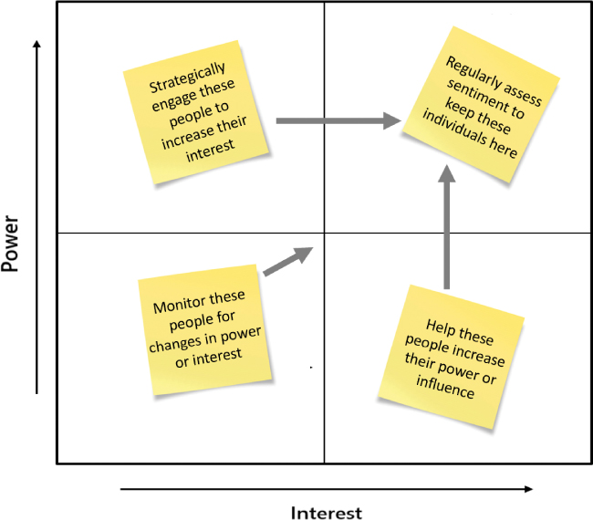

# 与合适的人联系

你将在这一小时学到什么：

- 寻找人员并确定人员优先级的框架
- 利益相关者映射和优先排序练习
- 让利益相关者参与的技巧和练习
- 什么不该做：坚持快乐的道路
- 总结和案例研究

在第 7 小时中，我们将进一步理解我们所处的情况，尤其是与我们分享这种情况的人。 在 IT 项目或计划的背景下，有些人被称为利益相关者，他们对我们的工作有既得利益或有权影响这项工作。 我们必须识别这些人，与他们建立联系，更多地了解他们，优先考虑我们如何与他们打交道，并积极管理那些对我们的工作至关重要的人的关系和期望。 为了帮助我们，这一小时我们探索了一个反映这些活动的框架，并且我们逐步完成了几个设计思维练习来帮助我们。 这样做为第 8 小时奠定了基础，我们将在其中介绍对这些利益相关者的重要子集产生同理心和更深入联系的意义。 我们以"什么不该做"来结束这一小时，这涉及超越客户关系的"快乐之路"进行思考，并确保我们与那些可能一点都不快乐的重要人物保持联系。

## 寻找人员并确定人员优先级的框架

当我们在第 6 小时忙于倾听、理解和评估更广阔的环境时，我们很自然地发现了人们并与之建立了联系。 他们中的许多人都是配角——合伙人、行业专家、熟悉公司或实体的人等等。 其他人可能最终会更直接地参与我们正在进行的工作。 也许你与最终用户或业务经理和技术负责人聊天。

无论他们的角色如何，我们都需要开始了解他们在整个组织中的地位，以及我们需要建立怎样的联系。 我们需要找出差距。 谁不见了？ 我们需要与谁联系并听取他们的意见？

关键是识别这些人，与他们联系，了解他们（知道更深入的学习和关系建立是随着时间而来的，在第 8 小时中介绍），优先考虑我们如何与他们保持联系，并积极管理关系和期望 那些最重要或最有影响力的人。 我们将此过程的前半部分称为利益相关者映射，将后半部分称为利益相关者参与和期望管理。 它们共同构成支撑我们工作的关键活动（见图 7.1）。


图 7.1
与合适的人建立联系和互动的框架。
让我们仔细看看与我们的利益相关者进行映射、联系和互动的常见设计思维练习。

## 利益相关者映射和优先排序练习

我们用于寻找人员和确定人员优先级的框架反映了自然的从左到右的时间进程。 也就是说，我们需要先确定利益相关者，然后才能开始组织和映射他们，然后开展活动以联系、参与和优先考虑他们的参与。 下一组四个设计思维练习将引导我们完成这个框架。

### 行动中的设计思维：识别和映射利益相关者

利益相关者这个词可能并不熟悉，但这只是对同一事物有既得利益的人的另一种说法。 如果我们经营一家企业，我们的商业伙伴、员工、供应商和客户都是企业的利益相关者。 我们实际上需要比我们想象的更好地了解和了解这些人。 在我们与人建立的日常联系的迷宫中，隐藏着一些导致我们的项目脱轨或人们如何以影响我们工作的方式被操纵的原因。

识别、可视化和连接与我们的倡议或情况相关的所有利益相关者之间的点，有助于我们了解应该关注谁。 更重要的是，这样做的过程也有助于我们看到图片中的差距。 传统的利益相关者映射从创建与我们的项目、倡议或工作相关的人员的简单图片或"地图"开始（并且可能彼此相关；参见图 7.2）。 这些地图有力地提醒了当地情况，它们构成了关于应该与谁保持联系、应该考虑谁以及应该小心对待谁的更多见解的基础。 这就是利益相关者映射在企业中如此普遍的原因。 这是一项设计思维练习，尽管它可能被贴上了其他标签，但已经进行了多年。


图 7.2
典型的利益相关者地图反映了组织内的关键利益相关者及其层次结构。

### 行动中的设计思维：利益相关者+映射

Stakeholder+ Mapping 练习通过向地图上确定的每个利益相关者添加思想泡泡和对话泡泡，将有用的设计思维元素添加到传统的利益相关者地图中。 思想泡泡反映了我们认为每个利益相关者的想法，而对话泡泡反映了每个利益相关者告诉我们或与他人分享的内容。 因此，这个传统利益相关者地图的扩展版本具有一些与同理心地图相关的非常强大的属性，我们将在接下来的一小时内讨论这些属性。

时间和人员：利益相关者+ 映射练习需要 1-10 人进行 30-120 分钟，具体取决于我们期望的完整性级别。

让我们为示例工作项目创建一个利益相关者+地图，从一张白纸和一支笔开始：

1. 在纸的中间创建一个方框，并将其称为我们的项目或产品团队。 这是我们的利益相关者地图的开始。
2. 在我们的团队周围，向此添加另一组框，这些框反映了与你合作的我们团队之外的各个团队或部门。
3. 考虑我们团队的业务合作伙伴、承包商、供应商等，并将这些框也添加到地图中。
4. 当地图组合在一起时，为每个框组织和分配关系或角色。
5. 在每个方框上方的对话泡泡中，写下我们所知道的每个利益相关者对我们或团队的"看法"。
6. 在每个框下方的思想泡泡中，写下我们认为每个利益相关者担心或兴奋或想到的事情。
7. 如果它有用并且不影响我们工作的可访问性，请考虑为不同的利益相关者组使用不同的颜色，或者用于负气泡和正气泡（即颜色编码）。
8. 根据整个事情变得多么混乱，我们现在可能想重做地图。 清理它并圈出对团队成功最重要的组，根据我们的喜好应用更多颜色编码，对相似角色进行颜色编码（将我们所有的经理设为红色，将我们所有的业务利益相关者设为蓝色，将我们所有的关键合作伙伴设为绿色， 等等），并组织问题和挑战。
9. 绘制颜色编码的箭头，连接不同群体中的同类角色，并用"关系"标记这些箭头。

需要一个例子吗？ 请参阅图 7.3 中所示的利益相关者+ 地图。


图 7.3
示例 ```Stakeholder``` + ```Mapping``` 将演讲和思想泡泡添加到传统的利益相关者地图中。
随着我们的 ```Stakeholder``` + ```Mapping``` 结束，一张完整的地图摆在我们面前，请坐下来思考我们所看到的：

- 谁最重要？ 谁最有影响力？ 谁不见了？
- 我们更需要关注哪些人？
- 我们需要小心哪些人？
- 我们需要与谁进行更多（或更少）沟通？
- 谁对我们的日常生活很重要？
- 谁对我们的未来很重要？

我们将使用利益相关者权力/利益网格（接下来介绍）以一种简单的方式探索其中的一些问题。 但现在请记得每个月左右重新访问此 ```Stakeholder``` + ```Mapping```，以帮助你反思哪些人发生了变化，哪些发生了变化。 谁来了又走了？ 谁改变了角色？ 鉴于这些变化，我们和我们的团队需要做哪些不同的事情？ 想一想

- 我们（仍然）试图解决什么问题？
- 我们（更新？）解决这些问题的策略是什么？
- 成功是什么样子的，我们将如何衡量它？
- 我们明天将与今天有何不同，为什么这种差异很重要？
- 我们是否有新的利益相关者要添加到利益相关者+地图中？ 其他我们需要删除？
- 是否有机会增加我们与利益相关者之间的共享身份（稍后介绍）？

现在让我们将注意力转移到另一个练习中，我们根据利益相关者所拥有的权力和他们对我们工作的兴趣来映射利益相关者。 有了这些信息，我们将能够创建和使用利益相关者权力/利益网格。

### 行动中的设计思维：确定优先级的权力/利益网格

一旦我们知道了"谁"，我们就需要考虑谁真正需要最多的关注。 此优先排序练习的结果是利益相关者权力/利益网格（或地图）。 权力/利益网格是利益相关者的直观表示，反映了每个利益相关者在我们的 IT 项目或计划中拥有的权力（或影响）和利益。 它是传统利益相关者地图的一种常见但功能强大且更周到的形式。 用它来思考

- 对决策拥有最大权力或影响力的人
- 对我们的工作最感兴趣的人，因此需要了解他们的情况，以保持他们对我们工作的支持
- 只需要被满足的人
- 只需要被监控的人

下面的练习指导我们初步确定谁属于这个特定的利益相关者地图，以及如何根据他们的权力和利益来映射这些人。 我们创建的利益相关者地图将帮助我们规划与个人的持续接触，以最大限度地发挥战略影响并围绕实现业务成果保持一致。

> 笔记
> 让它活着！
> 请记住，任何利益相关者地图都是动态的、动态的文档，会随着时间自然而然地发生变化。 利益相关者地图不仅随着我们与利益相关者关系的发展而变化，而且随着新人的引入、角色的变化、晋升、承担新的项目和责任、发展新的兴趣或干脆离开而变化。

时间和人员：利益相关者的权力/利益网格练习需要 1-10 人进行 30-120 分钟，具体取决于我们期望的完整性级别。

以下步骤帮助我们构建利益相关者权力/利益网格。

1. 举行头脑风暴会议，确定参与我们的解决方案、项目或计划或受其影响的个人名单。
2. 也进行反向头脑风暴会议，问问我们自己和我们的团队"如果我们忘了包括他们，谁会真正不高兴？" 进一步确定我们的解决方案、项目或计划中利益相关者的范围。
3. 开始使用名称和角色填充一个简单的表，注意包括
   1. 我们自己的团队成员与解决方案、项目或计划相关联
   2. 我们已经带入团队或被要求包括的合作伙伴和分包商
   3. 主要客户联系人，包括业务发起人和领导、技术发起人和领导、客户工作流领导和 ```SME```、变革管理 ```SME```、培训领导、有特殊兴趣的人、客户内部 ```IT```、采购和合同人员等，他们将使用或 与我们的解决方案、项目或计划的接口
   4. 以某种方式支持或连接到解决方案、项目或计划的各种公司内部人员
4. 对每个人进行排名，分别确定每个人的权力和利益水平。 问问我们自己
   1. 谁有权推进或阻止工作？
   2. 每个人对我们的项目或倡议的兴趣程度如何？

使用如下扩展表，按照 1 到 4 的等级为每个人分配权力和兴趣等级，其中 4 为最高或最大值：

功率等级表（从小功率到大功率）：

- 很少或没有力量
- 对工作本身或其他利益相关者的一些权力
- 对工作本身或其他利益相关者的重大权力
- 推进或阻止工作的强大力量

利率等级表（从不感兴趣到高兴趣）：

- 对工作或其成果很少或没有兴趣
- 对结果的一些兴趣或外围投资
- 对结果有重大兴趣或投资
- 对结果非常感兴趣并投入

| 利益相关者姓名 | 角色或头衔 | 功率（从 1 到 4，其中 4 为高） | 兴趣（从 1 到 4，其中 4 高） |
| -------------- | ---------- | ------------------------------ | ---------------------------- |
|                |            |                                |                              |
|                |            |                                |                              |
|                |            |                                |                              |
|                |            |                                |                              |

根据需要添加其他行。 15 到 50 个利益相关者的范围可能适合大多数参与（大型项目很容易超过 100 个利益相关者）。

5. 最后，使用如图 7.4 中所示的简单模板将我们的利益相关者置于利益相关者权力/利益网格中。 使用我们创建的列表和排名，根据每个人的权力和利益将他们置于四个权力/利益利益相关者网格方块之一。


图 7.4
用于创建权力/利益网格的模板。
网格完全填充后，我们现在如何使用该网格？

- 右上象限 = 密切管理。 这是我们的"主动参与"象限，它包含我们想要管理和最密切合作的个人。 通过我们的治理框架的各个委员会定期与他们会面（稍后将在第 15 小时介绍）。 在做笔记和跟进方面要有纪律。 了解他们的日程安排，并让他们了解我们的日程安排。 最重要的是，在我们的沟通中优先考虑这些利益相关者。
- 左上象限 = 保持满意。 这是我们的"反应性参与"象限。 让这些人满意并让他们了解情况。 分享新闻，邀请他们参加活动，并及时响应他们的通讯。 通过定期通信保持联系，将它们复制到重要的电子邮件和 IM 线程中，并在相关帖子中标记它们。
- 右下象限 = 保持知情。 这些利益相关者很感兴趣，但不一定有影响力或权力。 让他们了解情况并与他们协商以收集可能改进和推进项目目标或业务成果的见解。
- 左下象限 = 监视器。 这些利益相关者只需要最少的努力。 监控他们的活动，包括他们以适当的沟通节奏，并确保跟踪可能影响他们在我们的利益相关者权力/利益网格中的位置的角色变化。

使用利益相关者权力/利益网格来定义我们与客户、合作伙伴和公司内部利益相关者的互动节奏。 节奏包括我们需要与每个利益相关者沟通的频率、以何种形式以及原因（所有这些都需要反映在项目或计划的沟通管理计划中，也许组织成同心沟通格式，我们将在第 15 小时介绍） . 还要考虑以下指导（见图 7.5）。



图 7.5
定期使用权力/利益网格来战略性地管理甚至转移利益相关者的权力和利益。
对于具有高权力和高兴趣的利益相关者，请确保记录我们定期讨论的满意度条件，以保持他们在右上象限中的位置。

战略性地与权力高但兴趣低的利益相关者接触，目标是提高他们的兴趣水平并将他们从左上象限转移到右上象限。 通过寻找共同目标或提供有价值的东西来制定"权力计划"。

对于权力低但兴趣大的利益相关者，请尝试提高他们在组织或我们的项目或倡议中的知名度。 利用这些人来增加其他人的兴趣，帮助他们增加他们在组织内的权力，使他们进入右上象限。

还要注意落在左下象限的利益相关者。 晋升或角色变更可能会将他们移至左上或右下象限。 如果是这样，请务必迅速并相应地调整我们与他们的接触程度。

特别注意可以帮助加快或可能减慢我们工作的利益相关者。 对也有负面利益的利益相关者要特别谨慎，因为他们可能成为进步的障碍。 使利益相关者产生负面兴趣的两种策略包括：

- 基准测试。 使用与行业标准的比较来证明我们的解决方案已在其他组织中成功实现该组织的计划业务成果。
- 往复运动。 为利益相关者提供有价值的东西，以增加他们回报的可能性，假设这样做仍然符合良好的道德规范。

老式的同伴压力也很有用。 向利益相关者明确表示其他人参与其中，特别是如果他们是唯一的反对者，并询问他们可能需要什么才能让他们加入。

## 让利益相关者参与的练习和技巧
虽然我们有一些非常具体的练习来映射利益相关者并确定其优先级，但在参与和管理期望方面，我们也有许多工具可供使用。 关键是了解需求，这样我们才能选择正确的工具、正确的技术或正确的练习。

行动中的设计思维：让利益相关者参与的技巧
一旦我们确定、规划并开始了解我们的利益相关者，我们就需要积极并持续地让他们参与进来（Furino，2016 年）。 通过参与，关系得以巩固，利益相关者的必要贡献得以实现。

> 笔记
> 管理我们的利益相关者？
> 在发布第六版 PMBOK (2017) 和第四版项目管理标准 (2017) 之间的某个时间，项目管理协会 (PMI) 改变了对利益相关者的立场，从管理他们转变为让他们参与并管理他们的期望。 可以肯定的是，在某些情况下，我们仍然需要实际管理我们的利益相关者，但我们很少"管理"执行利益相关者和发起人，而是寻求管理他们的参与和期望。

在我们运行我们的设计思维练习并用尽其他传统的利益相关者参与方法之后，转向这个设计思维技术和练习列表来识别、规划、管理或监控利益相关者的参与和他们的期望：

- 第 8 小时涵盖的同理心映射
- 第 11 小时涵盖的类比和隐喻思维
- 头脑风暴、最坏与最佳和逆向头脑风暴在第 3 小时中介绍，在第 14 小时中有更详细的介绍
- 第 5 课时和第 12 课时概述的各种视觉技巧
- 第 15 小时涵盖的创建或增加共享身份
- 第 15 小时还介绍了包容性和同心沟通、讲故事、结构化文本和其他沟通技巧
- 通过已实现的更改移情

关于最后一点，在实践设计思维时，团队通常会花时间与用户产生共鸣。 然而，当用户或利益相关者对寻求帮助用户或利益相关者的团队产生共鸣时，我们可能会通过已实现的改变来见证同理心。 这种同理心来自于实现的变化和看到真正的进步（无论进步有多小）。 因此，通过实现的变化产生的同理心翻转了用户/团队来源/目标关系，以及从团队到用户到用户到团队的同理心流动。

随着时间的推移，我们考虑更改我们的利益相关者地图，还考虑使用各种可视化技术跟踪这些利益相关者不断变化的情绪，下面将介绍。

### 行动中的设计思维：利益相关者情绪映射
对于任何利益相关者+ 地图、权力/利益网格或其他以人为中心的工具或模板，请考虑如何使用颜色或图标来直观地传达利益相关者的情绪。 我们称这种技术为利益相关者情绪映射或可视化利益相关者情绪。 将这种技术添加到我们当前的工作中非常容易。

例如，如果我们的利益相关者不满意（红色）、中立（琥珀色或黄色）或总体满意（绿色），我们可能会使用流行的 ```RAG```（红色、琥珀色、绿色）分类法进行颜色编码。 如果由于可访问性或其他原因而无法区分颜色，请使用快乐/中性/不快乐的表情符号来传达 RAG 状态（见图 7.6）。


图 7.6
请注意利益相关者情绪图如何在传统地图的基础上构建以反映利益相关者的态度或满意度。

## 什么不该做：坚持快乐的道路

在测试领域，有这样一种观念，我们必须超越用户将执行的典型和自然过程（快乐路径）进行测试，并且还要仔细测试用户也会使用我们的解决方案和产品进行的所有意想不到的疯狂事情。

同样，当我们通过 IT 项目和计划与人们联系时，我们需要联系的不仅仅是快乐和满意的人。 我们必须与那些不太满意、不太友好，坦率地说，脾气暴躁、易怒的人建立联系。

在一家全球保险提供商中，几乎每个团队都要求与特定的利益相关者打交道，而只是因为他是一个糟糕的人，对待他人不尊重甚至更糟，所以都避免这样做。 人们主动而自然地回避了这个重要的利益相关者。 但最终，该解决方案及其用户社区才是真正受到这种规避策略影响最大的人； 关键用例和其他本来可以及早发现的见解被遗漏了，必须在解决方案交到用户手中后才被纳入。

我们必须与我们满意和积极的情绪利益相关者以及中立和消极的利益相关者建立联系和互动，以正确理解、定义、原型和解决方案。 我们这样做是为了最终创造满意的利益相关者。 请记住，没有人说过客户满意度等于客户幸福！ 找到一种方法来与每个关键利益相关者互动并与之合作，同时牢记需要使用我们的解决方案或产品或服务的重要人群——以及项目团队和该项目团队周围的每个利益相关者的声誉——取决于 平衡。 每个人都可以为解决问题和实现价值做出贡献，包括我们可能希望避免的人。

## 概括
这一小时探讨了与利益相关者（对我们的项目或计划很重要或有影响力的人）建立联系和互动的技巧和练习。 为了快速了解整个过程中涉及的步骤，我们在这一小时开始了一个框架，用于识别、联系、参与和优先考虑利益相关者。 然后我们通过设计思维练习来识别和映射利益相关者，然后使用权力/利益网格来识别拥有最大影响力或权力的人。 用于吸引利益相关者参与的各种技术和练习的列表、反映和管理利益相关者情绪的利益相关者映射练习，以及专注于与广大利益相关者建立联系的"不该做的事情"部分，无论满意与否，都在本小时结束。

## 练习册

### 案例分析

考虑以下案例研究和问题。 你可以在附录 A"案例研究测验答案"中找到与此案例研究相关的问题的答案。

### 情况

支持 ```OneBank``` 全球业务转型的十多项举措反映了跨越不同业务团队、技术团队、合作伙伴、执行影响者等的众多利益相关者。 萨蒂什要求你帮助倡议领导者了解这些利益相关者的广度，并以反映等级制度、权力或影响力以及利益相关者情绪的方式组织他们。 他还在寻找可以帮助他与一些最重要或最有影响力的利益相关者互动的技巧。

### 测验

1. 每个倡议领导者应该执行什么练习来绘制各自倡议中利益相关者的广度？

2. 创建利益相关者地图后，反映利益相关者情绪的简单方法是什么？

3. 权力/利益网格的两个维度是什么？对于 ```Satish``` 和他的领导来说，哪些象限可能是最重要的？

4. ```Satish``` 可以使用哪些技巧和练习来帮助他与最重要或最有影响力的利益相关者进行更深入的接触？