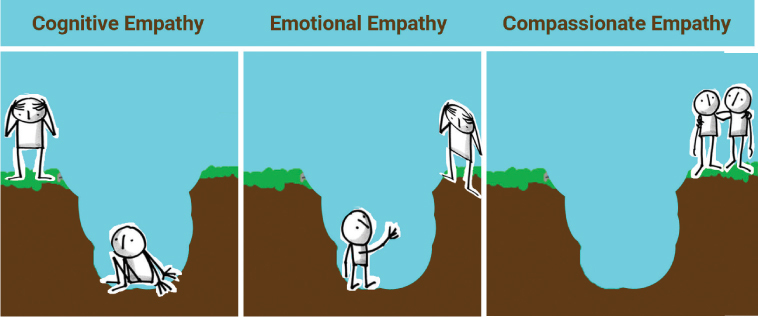
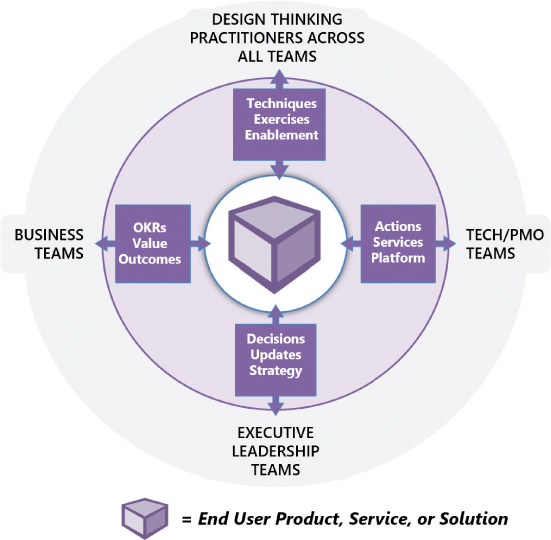
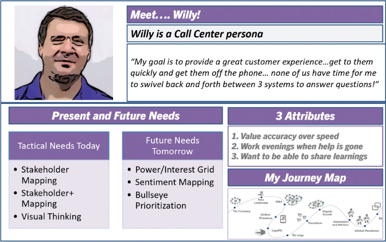
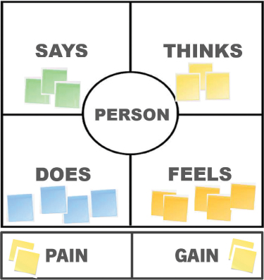
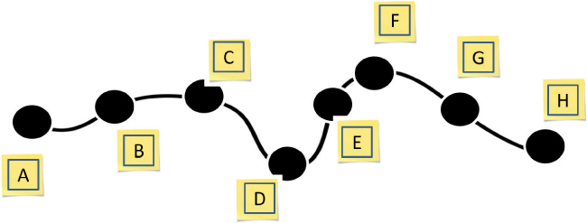
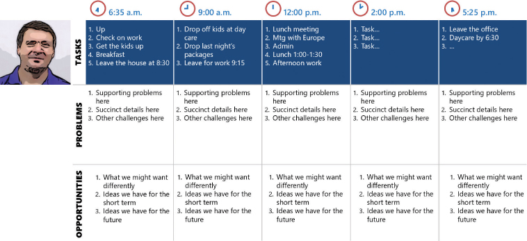

# 学习和同理心

你将在这一小时学到什么：

- 从利益相关者到角色
- 三种同理心
- 60 度同理心模型
-  同理心的秘诀
- 不该做的事：忽略那 20%
- 总结和案例研究

在这一小时中，我们将触及许多人所说的设计思维的核心：对处于我们寻求改善的问题和情况中心的人们产生同理心。 同理心是一段旅程，从观察和提问开始，到通过练习学习结束，这些练习可以帮助我们以三种不同的方式产生同理心。 我们还研究了同理心我们的边缘案例用户意味着什么，包括"什么不该做"，它说明了理解这 20% 对帮助整个用户社区是多么必要。

## 从利益相关者到角色

当我们努力在通往同理心和理解的旅程中加深理解时，我们需要减少对特定人员的关注，而更多地关注这些人所扮演的角色或角色。 请记住，角色是社区的虚构角色（例如"财务用户"、"销售用户"、"高管"等）的组合，他们有共同的需求，并将在类似的情况下使用解决方案或可交付成果的特定工件或功能 方法。

- 我们第 7 小时的利益相关者地图可以帮助我们理解人们所扮演的各种角色。
- 我们需要将这些角色组织成组，这些组以后可以成为抽象的人物角色。
- 然后我们可以为我们需要更好地理解的角色创建一个配置文件。
- 有了一系列相关的人物角色，我们就可以转向各种类型的与同理心相关的练习，以更好地理解这些人物角色。
- 为了更好地理解这些人物角色，我们还可以绘制出他们今天与系统和其他人交互时的微观旅程。
- 最后，我们可以从宏观角度审视这些人物角色，探索个人或人物角色的完整"生活中的一天"，这是了解人们日复一日进行的活动、决策和联系范围的最终方式。

有趣的是，我们可能会对不同的人或不同的角色群体练习不同类型的同理心。 在我们将我们的角色组织成一个 360 度的同理心模型之前，让我们先来看看三种类型的同理心。

## 三种同理心
如前所述，同理心是设计思维的核心，没有一种万能的方式来同理他人。 但是，使用一组相关的设计思维技术和练习，可以通过行之有效的方法与他人建立联系并产生共鸣。

考虑以下三种同理心。 虽然每种类型都可以建立在其前身的基础上，但每种类型也可以独立练习。 还要考虑同理心在每种类型中的不同表现，包括共情者如何"出现"、共情者如何联系和学习，以及共情者如何为他人和那个人的社区服务。

- 认知同理心。 同理心的最简单形式是认知同理心，它是"在头脑层面上联系"以从理智上理解另一个人或团队的想法和感受。 为了在认知层面上产生同理心，我们通常依靠人物画像、旅程地图和传统的利益相关者地图等一般先驱。
认知同理心说："我看到你掉进了一个深坑，似乎无法逃脱。 那可一点都不好玩。"
- 情感同理心。 同理心的下一种形式在情感层面将两个人联系起来。 情感同理心让我们分享或体验另一个人当下的感受。 情感共情的设计思维技巧包括同理心沉浸、日常生活和其他形式的一对一联系，可以建立情感联系。
情感同理心承认并问道："你所处的那个洞看起来很糟糕，我可以看到它对你造成了伤害。 我怎样才能帮你自救？"
- 共情同理心。 同理心的最后一种形式会驱使一个人采取行动。 共情同理心不满足于简单地承认情况或帮助某人自助。 共情同理心利用关系来迫使人们采取行动。 这样的设计思维练习可能包括同理心沉浸、旅程映射、生活中的一天、为思考而构建，以及通过迭代原型制作和测试亲自动手。 正如我们所见，共情同理心超越了理解和传统的同理心。
共情同理心以一种并肩的方式与另一个人一起行动和服务："既然我已经和你一起爬进了这个洞，我们将一起想办法逃离这里，再也不会回来。"

对于三种同理心中的两种，情绪和同理心是齐头并进的。 正如 ```Dev Patnaik``` (2022) 告诉我们的那样，"[T] 一个事件越是情绪激动，我们的杏仁核就越生动，然后帮助我们的海马体长期坚持该事件。 这就是为什么我们最情绪化的记忆也是我们最生动的记忆：我们的大脑对它们的编码比对其他数据的编码更有力。" 利用人类思维的这些现实来更好地应对情绪事件并创造情绪粘性体验。 请参见图 8.1，轻松但准确地了解三种同理心。



图 8.1
根据所实践的同理心类型，同理心看起来非常不同。
我们可以看到这三种类型的同理心是如何在我们从头脑同理心转变为内心同理心再到沉浸在行动中的同理心的过程中相互建立的。 从远处（认知）观察这个洞是一个好的开始，但这与承认这个洞存在并且是痛苦的（情感）完全不同，这反过来又与与一个人一起跳进去并帮助他们逃离这个洞是完全不同的 完全（富有同理心心）。

考虑到这三种同理心，让我们将注意力转向有效同理心的综合模型。 之后，通过一系列可供我们使用的设计思维练习，我们将逐步了解有效共情的秘诀。

## 360 度同理心模型

建立同理心的一个好方法是在整个过程中更深入地了解三种同理心、理解和联系。 正如我们所知，同理心的第一步是关注我们正在解决的问题中的人，因此关注我们将构建的解决方案的用户以及将交付的业务成果。 这个最初的重点是我们将要做的所有其他事情的核心； 它提供了我们需要的以问题和结果为基础的重点，以便更好地与人建立联系和同理心。

充分理解"中间"之后，我们接下来需要对围绕中间的人员和团队进行 360 度全方位观察（见图 8.2）。 我们需要考虑我们的利益相关者地图和权力/利益网格，以确定将聚集在一起解决问题、原型和测试潜在解决方案并交付解决方案及其业务成果的每个人。 因此，我们需要考虑以下几点：

- 我们正在为其解决问题并提供解决方案的中央最终用户社区和角色集合
- 业务和运营人员、团队和角色也受益于代表其用户社区执行的问题解决和解决方案
- 拥有成功所必需的政治、预算和赞助影响力的赞助商、高管和其他关键利益相关者和角色
- 设计思维专家、团队成员和合作伙伴将共同帮助他人理解和解决问题、设计和迭代临时和最终解决方案，并最终帮助创造价值并代表用户社区实现业务成果
- ```IT``` 和 ```PMO``` 团队以及将管理、设计、构建和部署临时 ```MVP``` 和试点以及其他有价值成果的人员，包括最终支持最终解决方案及其用户社区



图 8.2
用于组织利益相关者的 360 度同理心模型。
考虑到这个 360 度的视角，我们可以将注意力转移到练习和共情的整体方法上。

## 同理心的秘诀
通过了解三种类型的共情以及对每种类型最有用的练习类型，我们可以构建一个简单的共情方法。 使用我们的 360 度同理心模型，我们将把这个秘诀或秘诀的一部分应用到每组人物角色或利益相关者身上。

### 行动中的设计思维：角色分析

也称为角色映射或角色分析，此练习旨在帮助我们记录、分组和更多地了解我们的关键角色在想什么、感觉什么、做什么、说什么等等。 请记住，角色是一个虚构人物，反映了具有相似兴趣和需求的相似人的融合。 在我们考虑问题、设计这些问题的原型解决方案以及测试和迭代这些解决方案时，一组有用的角色有助于指导我们的决策。

尽管角色是虚构的人物，但为角色分配面孔或表情符号作为使角色"真实"的一种方式很有用。 一张脸让角色更容易被记住和使用，因为团队会考虑他们正在为他们解决问题和设计解决方案的人。

时间和人员：角色简介练习需要 1-5 个人，每个角色 10-15 分钟。

要创建角色配置文件：

1. 组装利益相关者地图和其他反映人群广度的工件。
2. 将人员和角色组织成 360 度同理心模型中描述的五个组（最终用户社区、其他业务利益相关者、高管和赞助商、各个团队或与计划相关的设计思想家，以及技术和 ```PMO``` 团队）。
3. 进一步将这些群体解构为虚构角色集（例如"销售用户"或"安全团队"或"高管"等）。 这些是我们的角色草案。
4. 为每个角色分配描述。
5. 根据需要细分角色以创建我们的最终角色列表（并为任何新角色分配描述）。
6. 考虑到这些描述，给每个角色起一个容易记住的名字。
7. 为每个角色分配一个虚构的面孔或表情符号，以此让该角色在团队的脑海中"粘"起来。
8. 对于每个角色：
   1. 定义他们的（未来）最终目标。
   2. 今天定义他们的（战术）需求。
   3. 描述最多三个区别属性。
   4. 分配逐字或其他令人难忘的报价。
   5. 包括赋予此角色生命的任何其他摘要信息、图片或图形，并进一步巩固团队头脑中的每个角色。

例如，考虑图 8.3 中所示的示例角色配置文件。



图 8.3
```Persona Profile``` 的一个有效示例。
如果我们考虑与大型项目或计划相关的"最终用户"之外的利益相关者的广度，那么创建数十个角色配置文件并不罕见。 不过，要克制过于细化的冲动。 并记住适应边缘情况并考虑可访问性和敏感的设计需求。 最后，当我们将代表我们项目或倡议人物角色广度的面孔和图像放在一起时，请注意避免偏见和刻板印象。

### 行动中的设计思维：同理心映射

对他人产生同理心，包括他们去过的地方和他们今天的经历，是了解他人的关键。 正如我们之前所说，同理心是我们如何通过别人的眼睛看世界，或穿别人的鞋走路，或戴别人的帽子。 同理心是关于学习的。 请记住，学习不仅仅是观察和收集信息。 学习也是关于在认知、情感和同理心层面上倾听、理解和联系，以了解他人正在经历什么以及他们需要什么。

一种长期存在的视觉方法是通过同理心映射。 如果我们有所需的信息，我们可以在安全的办公桌前进行此练习。 我们用来记录此信息的简单模板称为同理心图。 创建一个同理心地图，每个角色一个，以根据该角色是什么来捕获和了解有关该特定角色的更多信息：

- 可能的想法和可能的感觉
- 可能看到和听到
- 实际说和做
- 根据他们最大的痛点、伤害或需求来体验
- 寻求或寻找，包括他们的最高目标、收获或目的

考虑图 8.4 中所示的同理心图模板示例。



图 8.4
易于使用的同理心地图模板。
要练习，请选择我们自己生活中的一个问题，然后对自己执行此同理心映射练习。 然后尝试将此练习应用到另一个人身上，例如我们的经理，请记住，我们永远无法 100% 确定模板中所有部分的所有答案：

时间和人：同理心映射练习需要 2-5 个人，每个人或角色 10-15 分钟。

1. 看。 他们的环境是什么样的？ 他们被什么东西包围着，不断地看到？
2. 听。 他们从自己的管理团队、直接下属和同事那里听到了什么？ 公司内部公告、行业趋势和媒体对公司或行业的评价是什么？
3. 思考和感受。 他们对自己的工作或角色有何看法和感受？ 什么让他们担心或让他们开心？ 是什么让他们感到沮丧？
4. 说和做。 他们说他们想要完成什么？ 他们实际上在做什么和取得什么成就？ 是什么激励着他们？ 是什么阻碍了他们取得成就或进步？ 我们能否逐字记录或直接引用以支持此部分？
5. 痛苦（或伤害）。 过去什么可能困扰他们或代表今天的痛点？ 他们面临着哪些挑战？ 在他们伪装的表象下，他们真正担心的是什么，他们担心会发生什么事？ 他们似乎想要或需要什么？
6. 收益或（目标）。 不管他们说什么或做什么，他们真正的目标是什么？ 他们所说或所做的与他们所说或似乎想要的是否一致？ 他们需要什么来实现这些目标？ 对他们来说，成功是什么样子的？

一旦我们使用同理心映射获得了一些实践，我们就可以将同理心映射过程应用于之前确定的每个角色。 我们也可以将同理心映射应用于个人，或任何在思考、感受、看到、听到、说出、做等方面非常一致的人群。

随着我们为我们的项目或计划执行更多的同理心映射，我们将开始从这项工作中实现另一个层次的价值。 同理心映射帮助我们发现主题，也帮助我们发现不一致或差距。 例如，如果我们的员工和人物角色说的是一件事，但做的是与那件事相反的事情，那么就会存在需要探索的不一致之处。 不一致是危险信号。 如果一组或一组角色中的许多人表达了相同的痛点或抱怨，则需要探索这个主题。 正是在这些主题和矛盾之处，同理心映射可以帮助我们确定问题的根本原因、解决问题的机会等等。

### 行动中的设计思维：同理心沉浸
同理心沉浸或"步行一英里"（换位思考）将同理心映射带入更深层次，因为我们亲自体验一个人的旅程并体验他们沿途的快乐、冲突和疲倦。 当我们让自己真正沉浸其中时，我们不仅会看到而且会感受到作为另一个人生活在世界上的感觉。

实际上，这可能意味着许多事情：穿上某人使用的设备并执行一项任务，人为地改变我们的一种或多种感官，放弃（或可能体验）生活中的一些奢侈品，甚至生活在不同文化的人们中间 或社会。

无论程度如何，这个想法都是为了加深我们对他人的同理心，并利用这种经验更好地为我们的决策提供信息。 一旦我们了解了人们的动机，我们就能更好地了解他们的需求。

时间和人员：同理心沉浸式练习需要 1-5 人每次体验至少几个小时，最好在不同时间重复。

计划和准备移情沉浸练习：

1. 设置有关行业、团队、角色或个人的舞台：
   1. 研究和学习足以确定角色或人。
   2. 与角色或个人联系，讨论要复制的相关情况或经验。
   3. 与该角色或人员一起确定要执行的具体任务和活动。
2. 确定站在角色或人的立场上的最佳时间和地点。
3. 确定并获得所需的任何特殊权限或访问权限。
4. 如果安全、安保或其他因素使演习个人无法维持，请考虑其他替代方案，例如跟踪角色或人员或参加模拟"演练"。
5. 完成任何其他必要的准备工作，包括特殊物品、安全设备、衣服或所需的工具。

准备好后，执行同理心沉浸练习，只需

1. 出现！
2. 记录我们对体验的看法，捕捉视觉效果并在允许的情况下拍照。
3. 记录与我们正在执行的特定任务和活动相关的流程或旅程，包括来自他人的反馈。
4. 当我们通过流程、工具和信息发现挑战或机遇时，将它们记录下来。

确保尽可能真实地执行任务和活动。 不要走捷径，而是日复一日地站在做这项工作的人的立场上，戴上帽子，生活在他们的皮肤中。 一定要捕捉视觉效果并拍照。 这样做将帮助我们记住并帮助其他人自己"看到"情况。 之后，凭借这些特殊的见解和经验，团队将能够更好地协助进行需求分析、头脑风暴、问题解决、原型设计、解决方案等。

### 行动中的设计思维：旅程映射
旅程映射是从头到尾说明各种接触点的过程，这些接触点共同描述了客户或利益相关者如何走过或流过他们与产品、流程或服务的交互（Kelley & Kelley，2013）。 每个客户或利益相关者接触点都代表一个让那个人满意或失望的机会。

就我们的目的而言，旅程地图是关于我们日常生活的"东西"——我们的用户去的地方和他们在这些地方做的事情，包括这些交互需要多长时间。 有时，了解我们每天面临的挑战的最简单方法是绘制地图。

在人行道上使用一块白板、一张白纸、绘图应用程序或粉笔，绘制一个方框来表示我们的用户在典型的一天工作开始时所做的事情。 或者，例如，我们可能希望分析与另一个团队或应用程序的特定时间盒交互集。 无论哪种方式，用另一个盒子说明旅程中的每一步，然后再一个，然后再一个。 或者简单地创建一个面向时间的表或列表。 做当时对我们来说最容易的事； 关键是要了解我们正在评估的那一天的所有"内容"以及那天正在经历的人。

我们可能会以结合相似工作方面的方式对列表中的这些框或项目进行分组。 也许我们的用户在早上 7 点登录或亲自去上班并查看电子邮件和即时消息 30 分钟，然后再花 30 分钟在日程安排应用程序中，然后是 15 分钟的站立会议、30 分钟的报告、一个小时的工作 在各种任务上，每周产品委员会会议上还有一个小时，午餐时间为 30 分钟，下周业务回顾的计划时间为 30 分钟，再次处理电子邮件和 IM 的另一个小时，等等。 之后，我们可能会将这些详细信息汇总或聚类为花在异步通信（电子邮件和即时消息）上的时间、花在同步通信上的时间（现场会议和电话会议）、花在应用程序上的时间、花在计划上的时间和花在执行上的时间。 只要确保包括一天中每个项目或旅程中的步骤花费的分钟数或小时数即可。 最后，我们将有一个以时间为导向的地图，反映当天的内容和时间。

这是一个美妙的结果！ 为什么？ 因为我们将开始了解我们的用户面临的情况以及他们在忙碌的一天中陷入某些问题或挑战的原因。 而且因为我们以他们甚至可能没有意识到的方式看到他们花费时间的任务、应用程序和人员，我们将更客观地看到复杂性。 我们将看到他们可以为自己收回一些宝贵时间的机会。 或者他们可以选择投资其他领域的时间。

我们将认识到令人沮丧且需要消除的领域。 我们将看到重新设计流程、界面和组织结构的机会。 并看到引入部分速效解决方案和新工作方式的潜力。 例如，考虑图 8.5 中所示的示例旅程地图（请记住，旅程地图可以采用多种不同的形式）。



图 8.5
一种旅程地图的工作示例。
我们可能会选择更详细地映射用户每天重复的耗时过程（例如，他们每周两次执行长达数小时的财务管理和报告功能所采取的所有步骤）。 这里的想法是了解他们的整体日常旅程及其复杂性，以便我们可以了解他们在哪些方面以及更多地了解他们为何在现状中苦苦挣扎，以及在哪些方面有机会在短期内或更具战略性地长期合作。

如果所有这些旅程地图信息还不够，我们可能希望使用另一种称为"生命中的一天"分析或 DILO 的同理心技术在旅程地图中构建更多细节，接下来将介绍。

### 行动中的设计思维："生活中的一天"分析

我们最后的移情练习采用了对一个人、角色或角色的最广泛的看法，并考虑了一整天活动的丰富性。 通过这种方式，它比旅程地图要广泛得多，我们在旅程地图中了解用户在一天的某个子集内所做的"事情"并将其连接到旅程中，帮助我们了解他们做了什么，他们花了多少时间做这件事， 他们一路上面临的问题，以及我们面前的改进机会。 通过"生命中的一天"分析，我们将我们对用户的知识和理解提升到一个新的水平，建立在之前通过添加三个项目创建的旅程地图或"旅程列表"之上。

时间和人员："生活中的一天"分析练习需要 1-5 个人进行半天到几天，具体取决于我们期望的详细程度。

1. 我们延长"旅程"以考虑全天与一天的一部分。
2. 我们添加了有关用户在日常旅程中的感受的上下文。
3. 我们将他们的想法纳入其中，并根据我们自己的想法来衡量时间的使用效率和任务的完成情况。

不要小看这个练习！ 乍一看这可能看起来不寻常或奇怪，但将一个人的感受与他们所做的事情以及"做"的有效性联系起来会给我们带来深刻的见解。 它更好地描绘了可能需要更改的内容，以帮助用户导航他们的情况、解决他们的问题或开始制定潜在的解决方案。

那么，让我们回到之前创建的 ```Journey Map```。 对于我们日常旅程中的每一站，绘制一个情感泡泡或感受泡泡，以反映用户从一项任务转移到另一项任务时的感受。 并从有效性或效率的角度对停止进行评分。 这是对时间的充分利用吗？ 它可以自动化吗？ 是否可以减少、移交给其他人或完全删除？

当我们将所有这些见解汇集在一起时，我们就有了一张用户一天的情感地图。 我们是否看到任何模式或主题（用户是否讨厌检查电子邮件需要多长时间）？ 我们是否看到一致的挫折或恼怒的地方（每次会议似乎都开始得晚，结束得更晚）？ 我们是否认为有必要改变内容、时间或人员？

我们也可以为旅程中的每一站添加其他维度，以反映用户在想或说什么的其他气泡的形式：

- 添加一个为什么气泡，并在其中解释为什么用户又错过了午餐，或者为什么用户如此喜欢完成该特定任务。
- 添加一个名人气泡来表示用户在旅程的每一站与之互动的所有人。 请注意那些似乎给用户带来能量的人，以及那些似乎从他们的共同遭遇中汲取快乐的人。
- 添加一个愿望气泡来跟踪用户表达的他们希望他们的一天有所不同的内容。 将愿望与沿途的任务或停靠站联系起来，并提供任何相关细节（可能与与该停靠站相关的人员或活动有关）。

也考虑为我们最重要的用户或人物角色评估不同的日子，以更好地了解他们的 ```DILO``` 似乎如何根据星期几或一个月、一年中的时间或特定季节内的时间发生变化。 例如，查看图 8.6 中所示的 ```DILO```（再次注意，与旅程地图一样，```DILO``` 可以采用许多不同的形式）。



图 8.6
示例"生命中的一天"分析练习的示例。
最终，会出现一种模式，反映一个人在他们的一天中真正喜欢什么，以及他们不喜欢或避免什么和谁。 使用这些重要的理解来帮助塑造他们在任务、经验或流程方面的下一步。

- 考虑他们在整个 ```DILO``` 的旅程中在内部和站点之间花费的时间，甚至可能包括通勤时间。
- 他们真正花最多时间的地方在哪里？ 按任务划分，他们的能量从何而来，用在何处？
- 他们愿意花更多时间在哪里？ 逐字记录。
- 同样，他们在哪里浪费时间？ 也逐字记录这些内容。
- 旅途中的每一站如何代表一个机会，给他们或同为该站一部分的其他人带来快乐、沮丧、困惑或失望？ 考虑用红色/琥珀色/绿色情绪名称或表情符号（例如积极或消极的标志或快乐或悲伤的脸）标记每个站点。他们与哪些人互动，这种互动的性质是什么？ 尝试找到一两个词来描述这些交互的性质。 他们是积极的吗？ 乐观的？ 消极的？ 还有别的吗？ 在每个站点的名人名单中，将此详细信息添加到他们的名字旁边。我们也可能希望以其他方式注意到这些相互作用的性质。 同样，考虑使用颜色或表情符号为关系分配情绪（其中红色可能表示互动不佳，绿色可能表示互动健康）。
- ```DILO``` 的负担是如何分配的？ 我们的用户是否承担了与特定任务或活动相关的几乎所有"重量"？ 另一个人或帮助者可以有所作为吗？ 反映这种见解。
- 用户是否拥有日常任务所需的工具和资源？ 少了什么东西？ 谁可以帮助思考可以做些什么来改变这种情况？

询问此人的 ```DILO``` 多年来如何保持不变以及如何发生变化。 需要改变什么？ 谁需要改变？ 什么可以在短期内轻松改变或控制？ 最后，变革的长期机会在哪里？

## 不该做的事：忽略那 20%
因为 80% 的用户任务往往是日复一日的相同，并且 80% 的用户对于给定的功能或特性倾向于做同样的事情，所以评估这 80% 然后开始设计和原型制作很容易并且看似合乎逻辑的系统和解决方案。 但是，在做出设计决策之前，至少对剩余 20% 的任务和 20% 的用户进行轻微评估是有实际价值和实际成本节省的。

一家家居零售商评估了其 80% 的用户群体，并着手为传统桌面用户以及门户用户和移动用户设计一组界面。 零售商在整个过程中应用了良好的设计思维技术并快速迭代、收集反馈、每 2 周部署一次有价值的更新、收集生产用户手中所做的静默设计更改等等。 然后零售商最终决定更深入地思考剩余 20% 的用户和用例，其中许多反映了具有特殊需求和可访问性要求的用户的请求。

该零售商评估了剩余 20% 的边缘案例和有特殊需求的用户，并对已经完成的设计工作运行了辅助功能检查器。 它发现需要几个月的时间和 400,000 美元的返工来更新现有的用户界面和底层代码，这些工作本可以很容易地完成，而 80% 还在进行中。 更具破坏性的是，该零售商发现这些被忽视的用户中有许多人已经将项目注销为"不适合他们"，导致在部署代码和界面更改后很久就出现了重大的采用问题。 最终，虽然节省时间和预算可以更早地关注那 20% 的价值，但专注于更全面地服务更广泛的用户社区将更好地定位项目并更好地为零售商及其所有用户服务。

## 概括

在这一小时中，我们介绍了深入观察、联系和同理心利益相关者、用户以及用户组合（称为角色）的方法。 我们讨论了认知、共情同理心的同理心，包括每一种同理心如何在不同层次上与用户和那些实践特定类型同理心的人产生共鸣。 然后我们设计了一个简单的同理心模型，并将五个设计思维同理心练习连接到这个模型。 我们以"什么不该做"结束了第 8 小时，重点是将 20% 的用户和用例排除在我们的项目或计划的"边缘"的危险，并指出更快地考虑边缘情况并同理心不同的用户 超过 80% 的需求不仅节省时间和金钱，而且有助于采用，同时更充分地服务于更广泛的用户社区。

## 练习册
### 案例分析
考虑以下案例研究和问题。 你可以在附录 A"案例研究测验答案"中找到与此案例研究相关的问题的答案。

### 情况
```BigBank``` 最关键和最雄心勃勃的计划之一，即 ```Project Moonshot```，其任务是重塑银行业务的零售端。 ```Satish``` 要求你亲自参与理解、理解和组织当今使用 ```BigBank``` 开户的用户类型，以及选择在其他地方开户的用户。 ```Satish``` 对用户角色以及与用户联系以了解他们的需求略有了解，但他需要你的专业知识。

### 测验

1. 你如何向 ```Moonshot``` 团队解释角色是什么？

2. 什么样的设计思维练习可能对组织角色有用？

3. 同理心的三种类型是什么？这三种类型中的哪一种最有助于理解为什么消费者选择在其他地方使用银行业务？

4. 同理心沉浸在哪些方面不同于同理心映射？

5. 哪三个额外的维度使```Day in the Life of``` 分析与旅程地图不同？