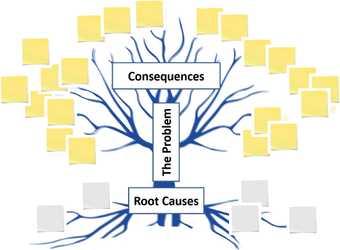
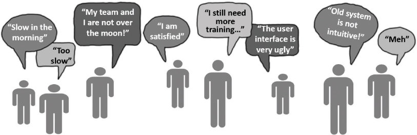
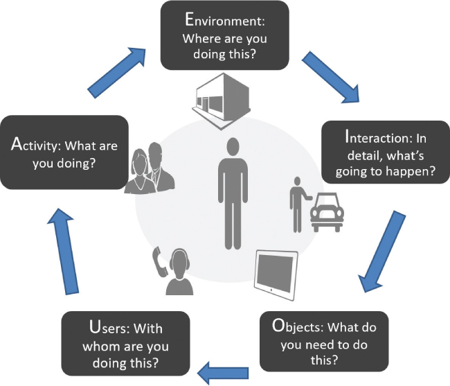
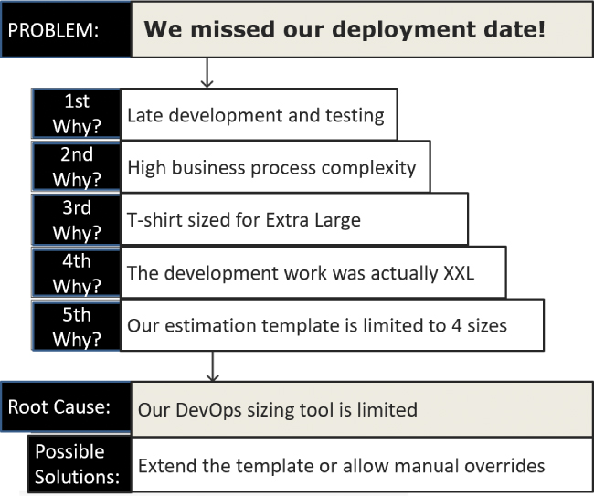

# 确定正确的问题

你将在这一小时学到什么：

- 识别和理解问题
- 问题识别的三个练习
- 问题验证的技术和练习
- 什么不该做：跳进去！ （错误的问题）
- 总结和案例研究

这一小时的重点是问题识别。 不是解决问题，而是确保我们已经解决了各种原因和影响以及周围的症状，并确定了要解决的正确问题。 在这一小时中，我们将完成七个练习来识别和更好地理解问题，为接下来的几个小时做准备，我们将以不同的方式构思和思考，为该问题创建潜在的解决方案。 最后，我们以一个"不该做什么"的例子作为结尾，重点是跳入（在其他情况下通常是一种很好的设计思维实践）来解决错误的问题。

## 识别和理解问题

在我们花时间了解情况，与合适的人联系并倾听他们的意见，并从多个层面理解他们的处境之后，我们可能会觉得我们已经很好地解决了潜在的问题。 事实上我们可能会。 但是对于复杂的情况，假设我们知道要解决哪个问题的危险往往会导致错误的开始和浪费时间。 因此，移情和解决问题之间的一个重要过渡步骤是识别问题，然后更好地理解和验证它。

## 问题识别的三个练习

存在几种用于探索、识别和理解问题的好方法。 但问题树分析和问题框架是两个最简单的练习，可以帮助团队快速找到并专注于正确的问题。 有了这种理解和洞察力，我们可以使用第三个练习，问题陈述，来创建一个反映我们不断发展的理解的问题陈述。

### 行动中的设计思维：清晰的问题树分析

当特定情况或问题的原因和影响在我们的脑海中变得混乱时，将混乱的东西从我们的脑海中清除并记在纸上可能会有所帮助。 评估问题或情况的原因和影响的一种方法是执行问题树分析。 这个练习归功于 Paulo Freire 在 1970 年代初期在教育方面的工作（Freire Institute，2022），它使用树的视觉作为隐喻，如之前在第 3 小时中概述的那样。

我们如何开始？ 画一棵简单的树，如图 9.1 所示。 我们将使用这个简单的视觉效果来帮助我们了解问题（正如我们今天所理解的）与问题的因果关系之间的关系。 要单独或与小组一起运行问题树分析：

时间和人员：问题树分析练习需要 1-5 人参与每个问题 30-60 分钟（并且可以根据问题的性质和复杂性扩展更广泛和更长的时间）。

- 在白板上画一棵简单的树，如图 9.1 所示。
  
  图 9.1
  问题树分析使用简单的树隐喻来帮助我们识别问题并将其与其原因和影响区分开来。
- 用我们寻求理解和定义的整体问题或情况标记树干。
- 按照我们今天对问题的理解，将问题的系统性或其他"根本"原因标记为树的 5 到 10 个（并考虑本小时晚些时候介绍的五个为什么可以帮助我们现在或在此之后不久进一步探索这些根源 练习结束）。
- 标记从树干上射出的 5 到 10 个树枝。 每个分支都是所分析问题的一个独特的已实现或可能的影响或结果。

通过团队循环，首先关注原因（根源），然后关注结果（分支），让每个人都有机会参与并绘制树。 添加根或分支后，再次将注意力重新集中在树干上，以使团队重新关注问题。

不要害怕根据对问题的新理解重新创建树。 同样，不要害怕将分支添加到其他分支，或者将较小的根连接到较大的根。 这个练习的价值在于结果树的视觉特性。 通过问题树分析进行工作就像创建特定情况的思维导图或因果图，有助于探索发生了什么、为什么会发生以及接下来会发生什么。

但是，如果我们在从根本上理解一个问题（或就该问题达成一致并确定其优先级）时遇到问题，请转向问题框架练习，如下所述。

### 行动中的设计思维：问题框架
当像问题树分析这样的简单可视化方法无法使团队就某个问题或其在许多问题中的优先级达成一致时，请考虑另一个称为问题框架的练习。 源于 ```Getzels``` 和 ```Csikszentmihalyi``` 在 1976 年进行的关于将问题理解为创造力的先兆的必要性的研究，问题框架帮助我们理解并优先考虑特定问题而不是一系列其他潜在问题。 它为我们提供了急需的背景。

问题框架练习的价值在于它能够

- 强行讨论。
- 达成共识。
- 围绕共同的理解推动团结和认同。
- 将过去和现在的背景与未来的目标或有希望的结果联系起来。
- 探索问题是否确实是要解决的正确问题。
- 确定问题是否值得解决。
- 验证团队是否具备实际解决问题的正确技能或能力。
- 围绕一组可能的后续步骤创建清晰度。
- 按照今天的理解定义问题并创建问题陈述草案。

问题框架练习的步骤有助于构建问题，因此得名。 通过此处概述的结果，问题框架有助于以面向团队的方式建立"下一步最佳步骤"。 因此，这项工作恰好在人们可能需要聚集在一起的时候以重要的方式聚集在一起。

要与小组一起进行轻量级的问题框架练习，请按照以下步骤操作：

时间和人员：问题框架练习需要 2-5 人参与每个问题 30-60 分钟（并且可以根据问题的性质和复杂性扩展更广泛和更长的时间）。

1. 查看提出的问题。 让每个人都有机会权衡他们对问题的了解，包括背景和假设。
2. 将问题与其根源联系起来。 确定其他相关或相关的问题并讨论它们与该问题的关系。
3. 考虑理想的结果。 确定团队希望看到的事情并讨论更广阔的未来或更广泛的目标。
4. 考虑问题和情况周围的用户、利益相关者和其他人。 重新审视关于更广泛环境、相关人员以及他们如何参与的已知信息。 转向利益相关者和同理心地图、旅程地图、"生活中的一天"调查结果等，将人们（回到）这个问题的中心。
5. 询问并同意所确定的问题是否真的值得思考和解决。 通过共识，团队需要决定这是否是需要解决的正确问题，现在是否是解决它的正确时机，以及这个问题是否值得尝试解决。
6. 同意是继续还是停止。 问题现在已经确定并以多种不同的方式得到了更好的理解，并且团队保持一致，应该可以做出下一步的决定。

作为此练习的结果，团队可以更好地识别并随后解决问题，如果确实是下一步的话。 如果下一个专家也需要请来，或者是否需要首先解决其他问题，那么问题框架就更清楚了。 重要的是，问题框架也使我们能够创建明确的问题陈述，接下来将涵盖并在我们构思和探索问题以找到潜在解决方案的第 10 到 14 小时内使用。

### 行动中的设计思维：问题陈述
```Problem Framing``` 的成果之一是能够创建问题陈述草案。 通过对潜在问题及其原因或影响或模棱两可环境的其他方面有何不同的合理理解和框架，我们现在可以识别可能的问题。 这是一个非常大的胜利。

当然，随着我们进行更多与问题相关的练习（以及后来的思考和解决相关的练习），我们对问题的理解将会成熟。 但是，能够稍微扭转潜在问题以帮助确保它确实是正确的问题对于创建我们的问题陈述至关重要。 为什么这很重要？ 我们的问题陈述提供了清晰的共同理解，这反过来又有助于团结其他人围绕解决该问题所需的条件。

一个好的问题陈述的属性包括

- 它由一个语句和一个句子组成。
- 这句话解决了"什么"、"为谁"和"需要"。
- 它以简单、清晰和易于理解的方式编写。
- 因此，它准确地告诉我们对问题的理解（知道我们的理解将通过这个和本小时分享的其他练习进一步澄清）。
- 它为"我们应该怎样做？"奠定了基础并作为输入。 我们稍后会谈到提问和其他构思和解决问题的技巧。

要与小组进行简单的问题陈述练习，请执行以下步骤：

时间和人员：问题陈述练习需要 2-5 人参与每个问题 15-30 分钟（并且可以根据问题的性质和复杂性扩展更广泛和更长的时间）。

1. 分享之前问题识别练习的结果，包括问题树视觉效果和问题框架练习中的问题陈述草稿。
2. 请团队回答以下问题：
   1. 主要问题是什么？
   2. 为什么这是个问题？
   3. 谁有这个问题？
   4. 这个问题什么时候出现？
   5. 似乎缺少或需要什么？
   6. 如果有的话，今天这个问题是如何解决或解决的？
3. 作为一个团队，根据团队之前学到的和现在看到的内容，审查答案并投票选出最真实或最有效的答案（"最佳答案"）。
4. 复制或重写最能定义当前事态与预期结果之间差距的问题陈述草案，以"\<the what\> for \<the who\> does(do) not satisfy \<the need\>"的形式构造一个句子 "

因此，一个好的和简单的问题陈述可能看起来像这些例子：

- 我们视障用户的门户界面不能满足他们输入销售订单的需要。
- 我们为远程员工提供的团队沟通方法不能满足他们被倾听和代表的需要。
- 我们为在家工作的用户提供的端到端仓库管理系统无法满足他们对实时性能的期望。

为了定向验证问题陈述，我们可以将其转化为"我们如何？" 问题。 开始组合这些最重要的答案，以"我们如何为 \<who\> 更改 \<the what\> 以更好地满足 \<the need\>"的形式构建问题陈述的镜像。

在我们一起研究了细节之后，一个"我们应该怎么做？" 对好的问题陈述的镜像响应可能类似于以下示例：

- 我们如何为有视觉障碍的用户更改门户界面，以更好地满足他们输入销售订单的能力？
- 我们如何改变远程员工的团队沟通方式，以更好地满足他们被倾听和代表的需求？
- 我们如何为家庭用户更改我们的端到端仓库管理系统，以更好地满足他们的实时性能需求？

有了我们的问题陈述，如果需要的话，我们可以在认真开始思考、解决问题和解决之前转向一种或多种问题验证方法。 接下来将介绍其中的四种技巧或练习。

## 问题验证的技术和练习
作为寻求解决问题和创建解决方案之前的最后一步，考虑运行一种或多种设计思维技术或练习，让我们快速验证我们对问题的理解，并可能改进我们的问题陈述。 以下四种技术或练习代表了轻量级设计思维方法的一个很好的横截面：

- 逐字映射
- 用于快速审查的 ```AEIOU```
- 根本原因分析的五个为什么
- 主题的模式匹配

这些面向问题的设计思维技术或练习中的每一个在其他领域也很有用，但接下来将在与问题验证相关的上下文中介绍。

### 行动中的设计思维：逐字映射
以许多不同的方式有用，验证支撑情况的问题的明智的第一步是倾听人们的意见并记录他们所说的内容。 这种技术称为 ```Verbatim Mapping```，是采访的主要内容，代表了一种很好的倾听方式，同时我们汇编了一组对以后提供上下文有用的信念或陈述。

```Verbatims```，顾名思义，是逐字逐句的直接引用、故事和其他描述或记录该人观点的反馈。 当我们想到逐字记录时，我们通常会想到负面反馈、挑战或痛点。 但逐字记录也包括好消息、见解和积极反馈。 隐藏在这些逐字逐句中的潜在主题可能会解释我们为什么、何时、何地、如何以及与谁有问题。

从会议、故事和你通过 ```Supervillain Monologuing``` 和 ```Silence by Design``` 听力会议听到的内容中逐字逐句提取。 如果你可以访问历史记录（例如，旧故事或会议记录），请使用以前记录的逐字记录来帮助了解问题或情况如何随着时间的推移而演变。

使用所有这些信息，按照以下步骤运行逐字映射练习：

时间和人员：```Verbatim Mapping``` 练习需要 1-3 个人进行 15-30 分钟，每人或被评估的会议（并且可以根据源文件的可用性延长更长时间）。

1. 出于隐私原因，请确保事先告知此人或团队我们正在进行此类练习。
2. 注意你听到和看到的重复单词/短语，并逐字记录（逐字逐句）。
3. 如果事件是实时的（相对于使用会议记录和会议记录研究过去的事件），请考虑在练习过程中对趋势或主题进行聚类。
4. 会议或活动结束后，将重复的单词和短语分组到逻辑组或主题中（例如，使用亲和聚类，第 3 小时简要介绍，第 13 小时更详细介绍）。
5. 创建一个个人假设来解释我们认为解释每个集群的原因。
6. 确定一组"下一步最佳步骤"，并特别指出需要进一步探索的内容、需要学习或进一步理解的内容，以及我们有足够的信息可以开始采取初步或补救措施的地方。
7. 将这些逐字集群作为对话气泡插入我们的利益相关者+地图和同理心地图，将每个逐字集群映射到适当的人员或团队，作为丰富我们现有地图的一种方式。

最后，正如我们在图 9.2 中看到的那样，逐字逐句帮助我们学习新东西，甚至可能证实我们对情况及其潜在问题的理解。 逐字记录为我们提供了有关用户和其他利益相关者的丰富且更完整的图片，帮助我们更多地了解人员以及手头的问题或情况。



图 9.2
```Verbatim Mapping``` 帮助我们了解更多并验证我们认为我们知道的内容。

### 设计思维在行动：```AEIOU``` 质疑快速审查

有时，一组简单的问题可以帮助确保我们在思考正确的事情或关注问题的相关方面。 由 Rick E. Robinson（2015 年）创建，使用 ```AEIOU``` 提问练习快速回顾情况，并在我们验证问题、提问和采访他人、召开会议、执行 ```DILO``` 练习、执行旅程时在心理上勾选一组关键维度 映射、进行同理心映射练习、与用户进行同理心沉浸等等。

```AEIOU``` 代表活动、环境、交互、对象和用户。 简单的 ```AEIOU``` 首字母缩略词和五步练习可以注入其他练习中，以快速构建情境或验证问题。 因为它是助记符，所以 ```AEIOU``` 很容易记住，因此也很容易理解。

例如，如果我们正在探索和验证关于有效确定积压工作优先级的问题，我们可能会运行一个练习，从以下方面思考和探索这个积压工作优先级问题：

时间和人员：```AEIOU``` 提问练习需要 2-5 个人参与，每个问题 5-15 分钟。

1. 设置舞台。 分享问题陈述或问题。
2. 活动。 我们是否在正确的时间做正确的事情并执行正确的敏捷仪式（或其他特定于方法的任务）？
3. 环境。 我们是否有合适的论坛或空间来有效地完成这项积压优先级工作？
4. 相互作用。 我们是否了解确定积压工作优先级的必要步骤？ 我们是否以正确的顺序正确执行它们？
5. 对象。 我们是否拥有适合面对面或远程协作的工具？ 我们是否有用于文档、透明度和问责制的有效 ```DevOps``` 工具？ 我们是否使用正确的工具和流程将史诗映射到功能再到用户故事？
6. 用户。 我们有合适的人参与吗？ 我们了解处于危险之中的人物角色吗？ 我们参与的时间够早还是在正确的时间？ 我们缺少谁？ 谁在无意中或以其他方式被边缘化？
7. 警告或模式。 我们是否需要返回到特定区域并进一步探索它？

如图 9.3 所示，```AEIOU``` 提问过程是循环的。 这个想法是为了验证我们对问题的理解，并确定那些可能需要进一步探索和迭代的领域或主题。 迭代可能会解释我们遗漏或无意中忽略的内容。



图 9.3
```AEIOU``` 提问练习反映了验证我们理解的循环或迭代过程。

### 行动中的设计思维：根本原因分析的五个为什么

五个为什么在第 3 小时简要强调并在多年前由丰田佐吉提出，用于发现特定情况、思路、决策和一般问题背后的根本原因或原因。 这种技术也有助于我们了解一个人或团队的动机、价值观和偏见。

该技术看似简单，但通常围绕练习进行组织，而不是反复问"为什么"五次的简单技术。 关键是要根据之前的回答来调整提问，超越显而易见的事物来探索隐藏的事物。

五个为什么类似于跟随兔子的踪迹来发现拐角处或可见事物之下的事物。 最后，你应该找到根本原因。 不，解决根本原因并不总能解决问题本身，但了解根本原因是更好地了解问题本身的良好开端。 正如我们在问题树分析练习中看到的那样，简单地将原因与影响分开可以提供清晰度，因此具有很大的价值。 这个练习应该可以帮助我们在以新的方式思考的同时更好地定义真正的问题陈述。

时间和人员："五个为什么"练习需要 2-5 个人参与每个问题 5-15 分钟（并且可以根据问题的性质和复杂性扩展更广泛和更长的时间）。

要运行"五个为什么"练习：

1. 分享问题陈述。
2. 问"为什么？" 五次，在询问更多之前注意评估以前的答案。 考虑以下示例：
   1. 为什么我们错过了部署日期？ （"因为我们延迟完成了开发和测试。"）
   2. 为什么我们延迟完成开发和测试？ （"因为业务流程比我们估计的要复杂。"）
   3. 为什么业务流程比我们估计的要复杂？ （"因为我们的 ```DevOps``` T 恤估计技术在 ```EL``` 或 ```XL``` 时达到最大值，而这个特定的业务流程实际上是 ```Extra Extra Large``` 或 ```XXL```。"）
   4. 为什么我们在 ```DevOps``` 系统中错误地将此业务流程描述为 ```XL``` 而不是 ```XXL```？ （"因为我们的 ```DevOps``` 评估系统不适应 ```XL``` 以外的任何东西——我们只能输入四种尺寸，而 ```XXL``` 不是其中之一。"）
   5. 为什么我们的 ```DevOps``` 评估系统仅限于四种规模？ （"因为当前的 ```DevOps``` 模板针对四种规模进行了硬编码。"）

在此处的示例中，如图 9.4 所示，根本原因在第三个"为什么"开始变得明显，但如果我们最终没有达到第五个（显然非常重要）"为什么"，我们可能永远不会知道 ```DevOps``` 模板的局限性。



图 9.4
虽然根本原因在第三个为什么中变得很明显，但直到第五个为什么在这个五个为什么练习中我们才终于找到了根本原因。
不过，"五个为什么"绝不是万无一失的。 这个练习让我们走上了一条非常狭窄的道路，并没有真正给我们探索可能围绕我们正在寻求验证的问题的其他问题的自由度。 因此，由提问者来辨别正确的路径（或运行一系列"五个为什么"练习来探索多条路径）。

此外，此练习本身可能会在此过程中引发其他问题。 例如，一遍又一遍地问为什么、为什么、为什么的过程会让人们处于防御状态，导致人们闭嘴或寻找指责的目标。 或者，尝试探索理解或超级恶棍独白技术，以帮助我们更加清晰并验证问题。 并考虑接下来介绍的问题验证的最终练习，即模式匹配。

## 行动中的设计思维：主题模式匹配

寻找反复出现的模式来学习新事物是一种古老的技术，在生活的方方面面都有使用。 不过，就我们这里的目的而言，模式匹配可以帮助我们发现重复的主题或意义线索，这些主题或意义线索可以验证我们的问题，或者告诉我们一些关于我们如何思考或执行的事情。 为了验证特定的问题陈述，请考虑以下问题：

- 我们倾向于看待某事的方式是否会影响我们的反应，而这反过来又会一遍又一遍地导致同样的问题？ 我们是否在理解手头的实际问题时遇到了透视问题？
- 我们的问题是否反映了一种单一模式（我们的部署周期总是由于某种原因而延迟）或逐步模式（我们的用例比我们预期的更复杂，导致更长的开发时间、更长的测试周期，因此延迟部署周期 )?

时间和人员：模式匹配练习需要 1-5 个人参与每个问题 15-60 分钟（并且可以根据问题的性质和复杂性扩展更广泛和更长的时间）。

要执行一个简单的模式匹配练习：

1. 请记住，如果没有良好的数据，模式匹配就很难进行。 收集数据，从中可以得出模式和主题。 数据可以来自记录的问题、之前完成的采访和逐字映射练习、观察、听力练习、风险审查、会议记录等。
2. 将相似的项目组合在一起。 从大的分组开始（例如积极和消极，或输入和输出，或症状和结果，或原因和影响——任何有意义的）。
3. 进一步按主题对这些组进行分类。 如果你没有看到与行动或后果相关的明显模式，请从寻找名词开始（时间、截止日期、工作、信心、自尊、离职率、保留率、会议、通讯、姓名、教育、形象、白天、夜晚 、金钱、日程安排、账单、安全、升级、活动等）或动词（压力大、沮丧、讨厌、匆忙、开车、思考、花费、交谈等），然后从那里开始。
4. 现在我们应该开始看到模式和主题的出现。 按主题标记每个组。
5. 确定与每个小组相关的结果（积极的、消极的、不确定的、预算超支、高质量、进度影响、团队态度、团队绩效、注意力不集中、不健康的同伴压力、健康的竞争、高压力等）。
6. 团队合作，进一步巩固和完善这些成果。 你可能还希望对这些进行优先排序，例如，创建一个前五名的模式和主题列表。

对于每个主题或模式，一定要包括反映积极情绪和消极情绪的单独数据点（例如质量好和质量差或提前交付但落后于计划）。 正是通过这些极端情况，我们可能会识别出提供特殊洞察力或帮助我们进一步深入了解特定群体的模式。

## 什么不该做：跳进去！ （错误的问题）
当一个地区的房屋建筑商开始使用设计思维方法来改变公司与潜在购房者互动的方式时，业主忽略了在进行流程和程序更改之前验证其特定问题集的重要性。 相反，建设者跳进去一路学习。 该公司误解了验证和证实其在问题框架中学到的知识并创建其问题陈述的价值。 它浪费了几个月的时间来"修复"根本不是问题的问题区域，而忽略了其他确实需要修复的区域。

投入是设计思维过程的重要组成部分。 我们通常想投入其中，忙于学习、建设和做事。 但这种直接参与的做法通常适用于构思、原型设计和解决方案。 在了解我们的情况及其问题时，我们需要花时间和资源来验证我们认为我们知道的事情，然后再花宝贵的时间和预算来解决错误的问题。

## 概括
在我们投入时间和精力思考和解决问题之前，第 9 小时结束了与识别、理解和验证问题相关的设计思维的一个重要方面。 在这一小时中，我们介绍了三个有助于识别问题的练习：问题树分析、问题框架和问题陈述（创建问题陈述）。 然后，我们将注意力转向通过逐字映射、AEIOU 提问以及运行五个为什么和模式匹配练习来验证我们对问题的看法。 我们以一个"不该做什么"的故事结束这一小时，该故事讲述的是一位房屋建筑商误解了投入学习的力量； 相反，公司一头扎进解决了错误的问题，犯了一个代价高昂的错误，并在失误中花费了大量的时间和精力。

## 练习册

### 案例分析

考虑以下案例研究和问题。 你可以在附录 A"案例研究测验答案"中找到与此案例研究相关的问题的答案。

### 情况

```BigBank``` 的执行委员会 (```EC```) 相信，他们的明星倡议领导人可以解决公司最紧迫的问题。 ```EC``` 正在向几位倡议领导者施加压力，要求他们开始构思、解决问题和解决方案的工作。 不过，萨蒂什担心快速着手解决错误问题对预算和进度的影响，他需要你的帮助来更负责任地指导组织。 与此同时，```EC``` 不断重申设计思维是关于快速开始、快速失败和快速学习，他们不理解 ```Satish``` 在应用同样的逻辑来确定要解决的正确问题时犹豫不决。

### 测验
1. 已知对创建问题陈述有用的两种不同的设计思维练习是什么？
2. 问题树分析如何提供清晰度？
3. 在验证特定问题时有用的四种不同的设计思维技术或练习是什么？
4. 执行委员会如何误解设计思维对于快速开始和学习的力量？