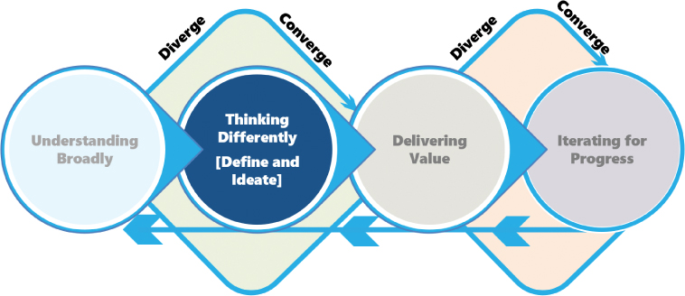
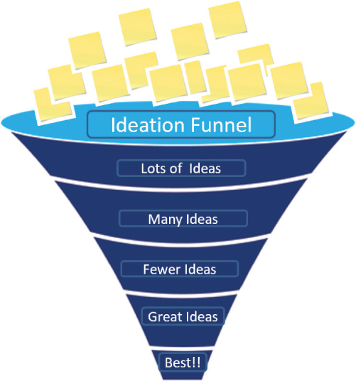
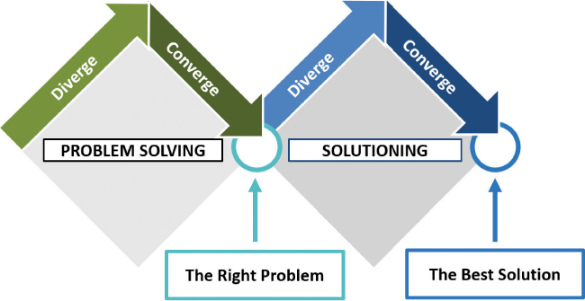
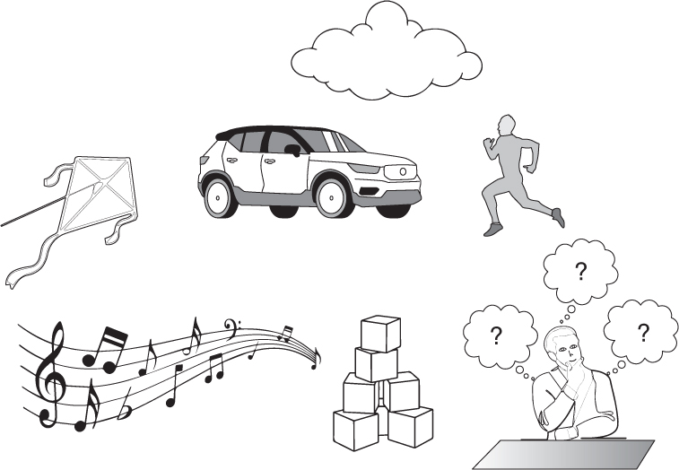
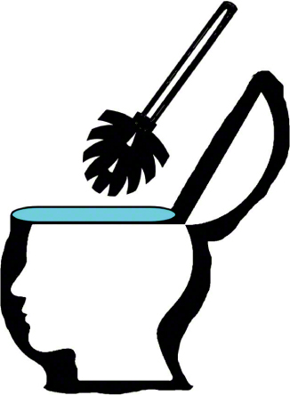

# 换位思考简介

你将在这一小时学到什么：

- 解决问题的构思和思考
- 发散思维和趋同思维
- 换位思考的热身活动
- 清理头脑的技巧
- 什么不该做：保持收敛！
- 总结和案例研究

第 10 小时开始第 III 部分，"换位思考"，我们将重点关注技术设计思维模型的第 2 阶段（见图 10.1）。 在接下来的五个小时中，我们将探索以换位思考的技巧和练习，并更深入地解决我们在第 9 小时中确定和验证的问题。第 10 小时为许多人认为是设计思维核心的内容奠定了基础： 在我们缩小或收敛思维以得出"最佳"想法的简短列表之前，需要发散和广泛地思考。 一旦我们汇聚到要解决的正确问题上，而这个问题可能是我们无法快速解决的问题，我们就需要在发散思维和聚合思维之间交替，或许可以进行一系列思维热身活动来放松头脑，并且 可能会通过一些练习来帮助我们理清思绪。 当情况要求我们做相反的事情以摆脱阻碍我们的精神锁链时，我们以现实世界的"不该做什么"来结束这一小时。



图 10.1
我们的技术设计思维模型的第 2 阶段。

## 解决问题的构思和思考

为什么我们需要换位思考？ 简短的回答是在我们通常的思维方式仍然让我们不知道下一步该做什么的情况下。 在这些情况下，我们需要一个地方来寻求新想法，以了解如何提出新想法！ 毕竟，如果我们的问题或情况的解决方案足够简单，可以用我们当前的工具包或技术和练习来解决，那么它就已经解决了。

这就是换位思考和构思的力量发挥作用的地方。 我们在前两个小时概述了构思的概念。 ```Ideating``` 是一种特殊的思维方式，是一种从我们心灵的宁静中抽离出来，走向开放的思维方式。 它被口头分享，转移到图片或模型上，画在白板上，或者写下来并在平板电脑或纸上仔细考虑。 意念是被外化的思想。

正如我们所知，构思可以单独进行，也可以作为与我们的同事或更广泛的团队和其他人进行更广泛讨论的一部分。 当我们独自构思时，有时我们可以自己得出绝妙的主意。 不过，在他人的帮助下，构思可以帮助我们完成那些绝妙的想法，并确定更多解决复杂问题的想法。 通过这种方式，我们可以创建并填充一个由许多潜在想法组成的创意漏斗，如图 10.2 所示。



图 10.2
创意漏斗是收集创意的简单而有效的比喻。
让我们在我们的思维需要如何从趋同（填充漏斗）转向发散（识别和使用最佳想法）并且可能根据需要来回多次的背景下探索构思漏斗。

## 发散思维和趋同思维

要创建和填充我们的构思漏斗，我们需要花更多的时间发散，更少的时间融合。 正如我们在第 3 小时中所述，发散是关于收集想法、探索可能的解决方案和扩展我们的选择。 发散就是让我们的想法池变得更大、更多样化。 这恰恰与融合相反，融合是关于缩小、削减和修剪我们的想法、选择和解决方案，以减少极少数（并且可能是最好的，至少基于我们今天对问题和情况的了解）。

我们大多数人天生就会以一种趋同的方式来看待问题。 我们花很少的时间发散（通常是在我们的头脑中），而花大量的时间来实施一个我们可能只花了几秒钟就做出决定的想法。 但聚合思维在大多数时候对我们很有效，因为我们的大多数情况和问题都不是非常复杂。

> 笔记
> 55和5
> 阿尔伯特·爱因斯坦以其与思考有关的小玩笑而闻名。 爱因斯坦说："如果我有一个小时来解决一个问题，我会花 55 分钟思考问题，再花 5 分钟思考解决方案"（Debevoise，2021 年），这让他戴上了设计思想家的帽子。

但是，当我们的情况和问题确实很复杂时呢？ 充满昂贵和风险的选择以及做出糟糕的初始选择的影响？ 如果我们需要更多想法怎么办？ 更好的想法？ 更多想法和更好想法的关键在于发散的能力，从根本上改变我们的思维方式。 与其试图找到问题的单一"正确"答案，我们需要专注于创建一个强大的潜在答案或想法列表来填充我们的漏斗。 想法越多越好。 这就是目标！ 越多越好。 我们的想法漏斗需要挑战我们当前的思维，以此作为通过新的眼光探索我们的问题或情况的一种方式。 没有坏主意。

爱因斯坦关于花一个小时解决一个问题的名言抓住了发散思维的本质。 非正式目标有两个：

1. 想出很多点子。
2. 避免过快地着手解决问题。

发散思维帮助我们通过许多想法扭转和重构我们的问题，这样我们就可以用一个或两个或三个最佳潜在解决方案来解决问题。 因此，我们在广泛思考时发散，然后在我们瞄准潜在的"最佳"解决方案时收敛（见图 10.3）。



图 10.3
考虑发散思维如何增加我们拥有的想法和潜在解决方案的数量，而聚合思维如何帮助我们找到正确的问题和最佳解决方案。
发散和收敛的过程听起来很容易。 但事实并非如此。 这是一项艰苦的工作。 正如爱因斯坦的名言，"思考是一项艰苦的工作； 这就是为什么很少有人这样做的原因。"

我们怎样才能使思考，尤其是创造性的、不同的和发散的思考变得更容易？ 正如我们接下来要介绍的，热身可以帮助我们。

## 换位思考的热身活动

研究和我们自己的经验证明了这一点：我们可以采取一些步骤来帮助我们进入更具创造性的思维模式。 有些可能本身就被认为是设计思维技术，但许多只是帮助我们重新思考的小技巧。

### 行动中的设计思维：分类法启动器

就像护栏（我们将在下一个小时介绍）帮助我们更丰富地构思一样，有时一些结构可以帮助启动我们的思维过程。 当我们的头脑太累或太混乱而无法以新的方式思考时，分类法可以给我们提供急需的精神刺激：

- ```SCAMPER``` 的 7 步流程为我们提供了集思广益和填充创意漏斗的新方法。
- 敏捷宣言给了我们评估和思考的 4 条价值观和 12 条原则。
- ```UX``` 设计利用启发式分析进行构思及其 10 种可用性启发式。
- ```Possible Futures``` 练习使用 ```STEEP``` 首字母缩略词来帮助我们从 5 个或更多维度进行思考。
- 船和锚练习可以从标准风险登记分类中获益，作为一种更广泛思考的方式。
- 用于问题验证的 ```AEIOU``` 练习使用围绕 ```AEIOU``` 助记符组织的 5 个步骤来帮助我们轻松记住要验证的活动、环境、交互、必要的对象和用户。

分类法就像我们大脑的作弊卡！ 当我们需要一套思考和创造力的启动器时，它们是公平的游戏并且非常有用。

### 行动中的设计思维：发散思维的独奏技巧
我们作为个人采取的步骤和技巧可以帮助我们进入一种思维方式，以不同的方式和不同的方式思考。 以发散而非传统的收敛方式思考需要练习，我们将在接下来的几个小时内完成其中的许多练习。 从普通的头脑风暴到运行沼泽、```MVP``` 思维、最坏和最好的练习、回到过去、分形思维、力场和黄金比例分析、莫比乌斯思想、寻找虫洞等等，这里有大量的技巧和练习 以不同的方式思考并填充我们的构思漏斗。

还有一些实用的活动或简单的技巧可以帮助我们更快地进入发散或创造性的思维模式。 正如我们在以下列表和图 10.4 中看到的那样，考虑我们自己对这些技巧中的一些的经验可能如何为我们提供了多年来我们自己的一些最佳想法：

- 梦想着未来会发生什么
- 画出我们的想法
- 用玩具积木或乐高积木建造摩天大楼
- 与邻居搭意大利面或纸桥
- 创造最准确或最佳距离的纸飞机
- 仅用纸和胶带设计四杯托
- 不用提笔或折线画房子
- 考虑我们应该保留哪辆汽车
- 收听播客或音乐
- 洗个澡或淋浴放松一下
- 在安静的地方冥想和祈祷
- 接受按摩或水疗
- 散步或跑步



图 10.4
发散思维的技巧和技巧触手可及。
当然，还有许多其他有用的活动可以让你以不同的方式思考。 骑自行车、修剪草坪、瑜伽、游泳、冲浪、举重和进行其他重复性活动给我们的思想空间和时间来漫游。 空间、时间和重复带来精神上的自由。

### 行动中的设计思维：团队发散思维

一旦我们完成了单独的热身活动，最终就会与其他人聚在一起并在团队环境中练习发散思维。 对于初学者，确保我们确实包括其他人来帮助我们思考。 以不同的方式思考的关键在于设计的多样性（在第 4 小时及整个课程中介绍），因为它是关于帮助我们以不同的方式思考的技巧和练习。 例如：

- 在我们一起思考之前，先一起练习正念。
- 一起构建（某物，任何东西！），共同思考。
- 探索此处和接下来四个小时中涵盖的 40 多种不同的思维和想法。

随着我们源源不断的创意源泉和相匹配的不同思维方式，是时候真正以不同的方式思考了。 但不同的思考并不意味着给自己一张白纸。 正如我们很快就会看到的那样，在我们给自己设定的约束、界限、镜头、视角或护栏内，不同的思维会蓬勃发展。 转到第 11 小时了解更多信息，更重要的是练习和使用这些技巧和练习。

## 清理头脑的技巧

有时我们的脑子里充满了自己的想法和自我强化的偏见，以至于我们需要在开始思考之前先把事情清理干净。 想想接下来的两个简单技巧如何帮助我们处理头脑中的东西，并为不同的、新鲜的思考扫清道路。

### 行动中的设计思维：通过木底鞋蜿蜒曲折地工作
当问题出现时，我们所有人都倾向于求助于已知和舒适的事物。 低压力的答案帮助我们应对高压力的情况。 因此，我们自然会寻找以前一直有效的快速修复方法。 但是，如果快速修复不快速或不正确怎么办？ 如果它只是阻碍了我们的思维呢？ 如果这就是我们无法换位思考的原因怎么办？

当速战速决还不够时，我们需要重新思考，我们的团队和同事需要以不同的方式思考。 我们需要清理头脑中的污垢和混乱。 这可能很难！ 毕竟，我们不能忽视那些卡在我们脑海中的东西； 简单而众所周知的快速修复往往会退缩，使我们无法以不同的方式思考。

当陈旧想法的泥泞或混乱仍然停留在我们的脑海中时，我们常常会情不自禁地陷入那种心态。 为了解放我们的思想以不同的方式思考，请考虑 ```Snaking the Drain```。 尝试讨论快速修复如何映射到今天的现实：

- 我们喜欢快速修复的什么？
- 为什么这次快速修复不合适？
- 快速修复会导致什么结果？
- 为什么是时候埋葬它了，至少对于这种特殊情况？

尽可能少的情绪化，讨论它的优点和缺点，最后一次排除快速修复，这样我们就可以从头开始重新思考。 ```Snake the Drain``` 以刷新、重置和重新思考（见图 10.5）。



图 10.5
```Snaking the Drain``` 帮助我们刷新、重置和重新思考。
如果我们仍然发现那个旧想法在悄悄涌现并排挤新想法，请转而转向"牺牲小牛"，接下来会讲到。

### 行动中的设计思维：牺牲小牛杀死死胡同的想法

我们都曾遇到过尝试想出新点子的情况，但同样陈旧的、令人厌烦的解决方案或快速解决方案不断地把自己推回到我们的脑海中。 这些死胡同的想法甚至可能也有道理。 但如果有更好的方法呢？ 更重要的是，有多少种方式，有多少种可能性？ 我们如何重新思考以识别这些可能性？

这样做的一种方法是简单地将死胡同的想法从桌面上拿下来，并称它们为在这个特定时间和这个特定问题下对我们来说是什么：死了。 这些死的想法确实需要被扼杀（或者有些人可能更喜欢"退休"）。 消除我们死胡同的想法可以帮助我们找到解决棘手问题或再次取得进展的新途径。 我们将他们的死亡用作强制函数（一种强大的技术，我们将在第 16 小时详细介绍）来尝试新想法或学习新技能。

死胡同的例子可能包括

- 完全依靠我们今天所知道的，而不是发现一些新的东西来带领我们走向未来
- 利用我们现有的技能和能力，而不是对其进行现代化改造
- 捍卫我们的想法或立场只是因为它们是我们的（并且也依赖于任何其他偏见）
- 保护我们神圣的奶牛，而不是以与当今市场、现实或经济更相关的方式重新发明这些奶牛
- 未能摒弃传统策略以支持新思维
- 因选择原地踏步而恐慌

将此技术与其他技术结合使用，例如前面介绍的 ```Snaking the Drain```，以重新设置并重新思考。 与停留在同一个过去，一次又一次地失败地解决同样的问题相比，冒险进入未知领域肯定会带来回报。

## 什么不该做：保持收敛！
如果我们不改变我们的心态或重新激发我们的创造力，我们将如何摆脱阻碍我们前进的精神锁链？ 在一家陷入 ERP 转型过程缓慢的大型高科技公司中，实地团队不断求助于以前未能发挥作用的相同技术和想法。 他们用传统的 IT 项目管理技术来应对进度和人员配备问题，用创可贴来应对错误设定的期望，并且基本上让自己按照执行团队的心血来潮做出反应，而执行团队在设计上从来没有真正接近细节以 推动真正的进步。

项目团队很少花时间思考，却花很多时间做事。 团队没有深入和不同地思考问题，而是迅速找到了下一个最佳步骤，然后投入大量时间和精力执行通常不是下一个最佳步骤的步骤。 此外，他们浪费了更多时间来处理行政升级和不满意的利益相关者。 然而，他们不知道自己不知道什么，也没有看到另一种方式，直到一组新的想法颠覆了这个正在进行的循环。

他们没有花很短的时间思考无数的挑战，而是用新的眼光和新技术一起应对每一个挑战。 设计思维在执行团队升级并尖叫要更快，更快地进行时放慢了团队的速度。 但设计思维最终使这种速度成为可能，因为发散思维带来了融合思维无法提供的红利。 听取爱因斯坦的意见，多花时间思考，少做事，帮助这个团队和这个关键的业务转型项目摆脱了精心伪装的锁链。 它帮助执行团队和广泛的利益相关者重新获得了对实地团队的信心以及他们再次取得真正进展的能力。

## 概括
在这一小时中，我们探讨了对聚合思维和发散思维的迫切需求。 这些基本技术共同构成了以不同方式构思和思考的核心。 然后我们转向三个热身活动来帮助我们放松心情，包括分类法启动器、单独发散思考的技巧，以及团队发散思考的其他技巧。 另外两个练习——蛇行下水道和牺牲小腿——帮助我们疏通思路。 当我们陷入困境并且相同的旧思维导致相同的旧结果并且没有进展时，我们以一个真实世界的例子结束了第 10 小时"不该做什么"。 我们看到了放慢脚步和发散思考的力量如何通过摆脱阻碍我们团队和我们自己的精神锁链来帮助我们恢复信心和速度。

## 练习册

### 案例分析

考虑以下案例研究和问题。 你可以在附录 A"案例研究测验答案"中找到与此案例研究相关的问题的答案。

### 情况

```BigBank``` 的执行委员会正在对团队执行 ```OneBank``` 保护伞下的十几个计划之一的能力失去信心。 萨蒂什本人在过去一年的不同时间介入提供帮助，但速度上并没有真正的差异。 团队成员的执行方式与他们之前执行的方式相同，不出所料，他们得到了相同的结果，但进展甚微。 该计划的主要利益相关者担心他们需要再次上线，其中一些人开始质疑 ```BigBank``` 是否需要解散团队或完全解散该计划。

```Satish``` 再次需要你的帮助，他愿意根据你的建议打任何需要打的仗，以恢复对这个团队和这个计划的价值的信心。

### 测验

1. 该计划的团队在执行过程中是否存在根本性缺陷？

2. 团队如何在短期内转变他们的执行模式？

3. 改变团队在短期内的思考和执行方式有什么危险？

4. 什么样的热身或简单练习可能有助于团队以不同的方式思考？

5. 一些团队成员似乎陷入了思维方式，他们需要帮助清理或疏通思路，以便他们能够以全新的视角思考。 你有什么建议？