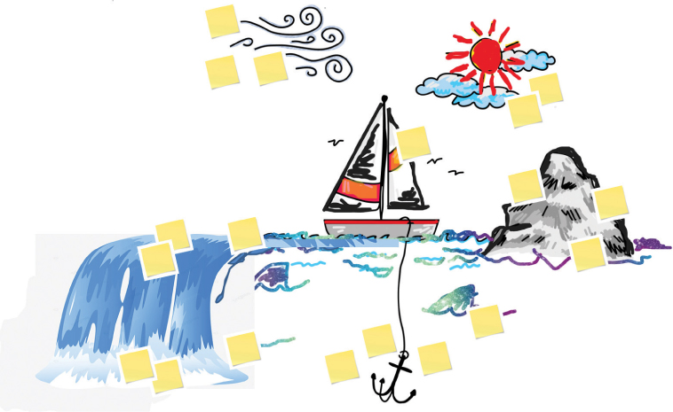
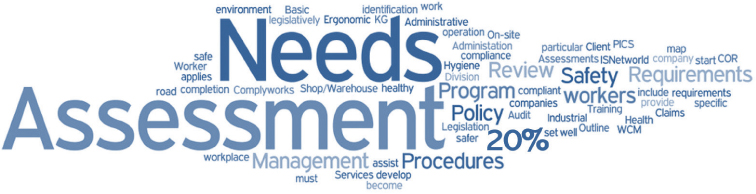
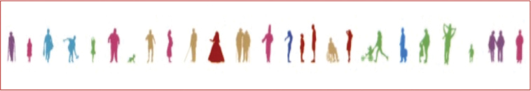
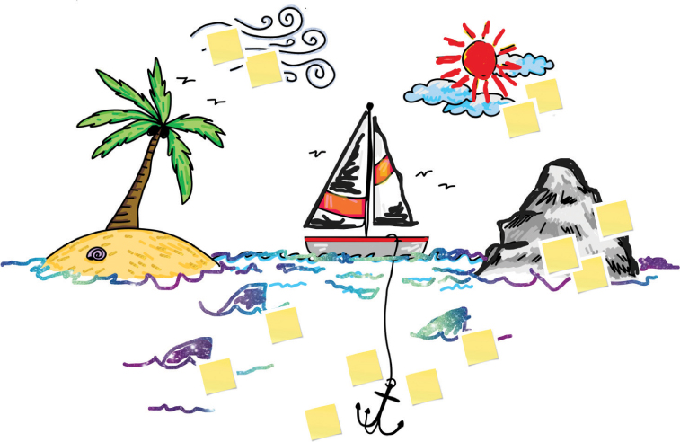

# 创造性思维的护栏

你将在这一小时学到什么：

- 约束和护栏
- 以不同方式思考的简单护栏
- 思考风险的练习
- 极端思考的疯狂技巧
- 什么不该做：避免荒唐可笑的东西
- 总结和案例研究

在这一小时中，我们以我们学到的发散思维为基础。 第 11 小时向我们介绍了另外五种以不同方式思考的技巧或护栏，两种思考风险的练习，以及两种极端思考的技巧。 这些方法一起可以形成一套强大的方法，以不同的方式思考。 有些名字听起来有点疯狂或愚蠢，但这些技巧和练习将我们带到了一个新的思考和构思层次。 恰如其分地，我们以"不该做什么"结束这一小时，重点是不要让听起来很傻的设计思维标签和名称吓跑我们而不敢使用它们（包括如何避免或补救此类情况）。

## 约束和护栏

你有没有想过，真正的创造性思维会在约束和边界内蓬勃发展？ 不是无限的可能性，不是一张白纸，而是一组帮助我们集中思考的护栏或镜头或视角。 这些护栏、镜头和视角帮助我们以新的方式思考和构思。 想想我们回到中学时，老师说我们可以写一篇关于任何事情的论文。 结果不是我们最好的工作吗？ 考虑一下其他时候，老师给了我们该论文的主题或创建了一组边界条件。 也许老师要求全班写下他们的暑假，或者写下我们在假期可能收到的一份意想不到的礼物，或者讲述一个陌生人帮助我们或我们家人的经历。 这些论文有多好？

老师的边界条件创造了护栏，帮助我们的思想更紧密地集中注意力。 由于从数万亿选项中人工制作故事情节所需的时间更少，我们有更多时间深入和有意义地思考重要的事情——我们实际要写的内容。

同样的逻辑，护栏逻辑，适用于我们被要求发挥创造力或寻找创造性解决方案的任何情况。 虽然这似乎违反直觉，但给自己设置一套护栏或一个特定的镜头来思考可以帮助我们更深入、更全面地思考。 让我们来看看这些简单的护栏中的一些以不同的方式思考。

## 以不同方式思考的简单护栏
虽然发散思维是一种以不同方式思考的超级技术，但有数百种简单的技术或护栏可以帮助人们和团队以不同的方式思考，稍微超出常规。 我们如何创建自己的一套发人深省的护栏？ 考虑以下护栏：

- 类比或隐喻。 我们是否可以使用类比或因果关系来进行不同的思考？ 一个简单的比喻可以帮助我们理解复杂的情况吗？
- 充分性或"足够好"。 适度与过剩的界限在哪里？ "足够好"的观点如何影响我们思考、计划和执行的内容和方式？
- 边缘情况。 在我们对产品或解决方案的了解的边缘，我们需要考虑什么？ 有人可能会如何以我们不打算或从未计划过的方式使用或调整我们的产品或解决方案？
- 包容性和无障碍性。 我们的用户社区的可访问性需求和特殊能力如何影响我们的数据收集、思考、原型设计或解决方案？
- 分解或模块化。 如何将我们的问题或解决方案分解为更小、更易于管理的块？
- 时间旅行。 如果我们可以穿越到未来并回顾过去，我们可能会发现哪些失误和错误的假设，以及这些信息对今天的我们有何帮助？
- 日程安排。 如果我们展望未来，什么可能会让我们放慢脚步或阻止我们前进？ 危险在哪里，我们如何准备和减轻它们的潜在影响？
- 射月。 我们如何利用一个几乎不可能实现的目标来帮助我们以不同的方式思考，以实现比我们在没有不可能实现的目标的压力下可能获得的更多成就的目标？
- 资源或效率。 是否有足够但不完美的想法让我们到达终点线？ 扩展我们有限资源的需要如何影响我们的思考？
- 可视化。 有没有图片或图形比单独的文字更容易或更快地促成共同理解？
- 量。 我们是否有足够数量或数量的想法可供探索？ 我们的创意漏斗是充满了可供考虑的想法，还是几乎是空的？ 我们如何进一步储存该漏斗？
- 时间压力。 在接下来的五分钟内找到解决方案的胁迫或巨大的时间压力下，我们的想法会如何改变？ 还是更快？
- 分形。 与我们在第 9 小时中介绍的寻找传统模式类似，是否存在垂直模式？ 以更小或更大的比例呈现的模式？
- X 到 Y 验证。 一段自然的关系会如何随着时间的推移而变得扭曲？ 我们如何才能睁开眼睛看到以某种方式变得正常的异常或功能失调的情况？
- 反向逻辑。 除了解决我们的问题，还有什么会使我们的问题或情况变得更糟？ 我们能否利用这种逆向思维为我们原来的问题或情况找到新的解决方案？

让我们先来看看前五个护栏以及它们所代表的构思或思维技巧。 在接下来的几个小时里，我们将介绍这些护栏的其余部分。

### 行动中的设计思维：类比和隐喻思维
想象一下，我们需要与一群同行者进行从 A 点到 B 点的复杂旅程，而这群人并不清楚为什么或如何。 分享一个类比或隐喻会有所帮助！ 为什么？ 因为类比和隐喻通过将复杂的想法等同于已知或更简单的想法来帮助我们理解复杂的想法。 人们自然而然地倾向于类比和隐喻，因为它们可以帮助我们快速对齐，让人们在同一页上，让我们一起朝着同一个方向前进。 考虑一下这里常见的类比和隐喻如何帮助我们简化复杂的事情：

- 动物。 我们可能会问鳄鱼或河马或动物园里的动物群如何解决问题。 同样，我们可能会使用古老的"一次吃一口大象"的比喻来描述一个长期运行的项目或复杂的设计，或者将遗留系统描述为一只恐龙。
- 日常用品。 我们可能会将一项倡议视为旅途中的船，将一系列选择视为飞镖或雷达上的点，将问题视为减速带而不是路障，将一天的战斗情况视为过山车。 未来的选择可以通过镜头和轮子的类比来考虑，我们可以将原型视为要塑造和塑造的粘土。
- 自然。 我们可能会用一个湖作为穿越的障碍，或者用一棵树来打破一种情况（树干是一个问题，树的根反映了问题的原因，树的树枝是结果或后果，a la 问题树分析练习）。 树类比在创建指导原则时也很有用，它们作为分形思维的另一个例子。
- 瀑布。 我们可能会结合几个类比来构建一个具有许多不同结果的更丰富的情况。 例如，想一想一群人如何在湖中央的一条船上共同生存。 更改船的大小和类型以反映团队的大小、位置、限制等。 在湖的一端添加终点线，在另一端添加瀑布。 我们可能会进一步解释每个人或角色如何在船上完成工作以帮助团队到达终点线。 我们可能会针对自然将人和船拉向瀑布的惯性进行规划，包括风暴和水流，甚至是功能失调的关系（见图 11.1）。

图 11.1
考虑瀑布类比如何将几个类比和隐喻结合在一起来描述一个项目或计划、它的人员和它的情况。
- 虚构人物。 我们可能会问一个虚构的卡通人物或拥有一系列超能力或天赋的超级英雄如何应对某种情况。 或者那个卡通人物如何完全避免这种情况。
- 历史事件。 我们可能会将一项毫无意义的活动比作泰坦尼克号上的"重新安排躺椅"，或者将一种过时的思维或操作方式比作"马和马车"。
- 热门电影。 我们可能会考虑 ```Caffe``` 中尉如何从 ```Nathan R. Jessup``` 上校那里哄骗真相，或者 ```Jack Dawson``` 如何竭尽全力确保他虚构的爱人 ```Rose``` 在泰坦尼克号沉没后幸存下来。
- 体育事件。 我们可以使用无穷无尽的体育类比来帮助解释我们如何合作或实现我们面前的目标。 考虑高尔夫和摩托车越野赛、足球比赛或橄榄球比赛、美国棒球世界系列赛或国家橄榄球联盟的季后赛过程如何帮助我们解释共同努力以实现我们的使命的必要性，或者我们的个人表现或团队合作将如何 被衡量，将帮助我们到达终点，等等。

这些练习帮助我们以压力更小、更容易理解的方式思考复杂和困难的问题，为认同和更深入的理解打开大门。

### 行动中的设计思维：足够好的思考
想象一下，如果我们需要从 A 点到达遥远的 B 点，而我们只得到 50 美元和两天时间。 我们不需要完美的体验或豪华游艇或私人飞机。 我们只需要一种方法来活着和健康地到达 B 点。 哪种交通方式足以或足以完成工作？ 我们如何重塑需求并用另一种解决方案（例如电话或虚拟会议）代替交通工具？

很久以前，法国哲学家伏尔泰说过："不要让完美成为善的敌人。" 也就是说，不要花太多时间和精力追求完美，以至于我们忽视了足够好，反而发现自己无缘无故地浪费时间、金钱、精力等等。 完美成本高昂，这只是预算被不必要地耗尽的另一个原因。

完美与足够好场景在技术领域太常见了，尤其是当我们对紧急需求或新需求做出反应时。 足够好的思考给了我们考虑最低限度和收益递减点的心态。 当我们知道我们在范围、进度和预算方面的界限时，我们可以使用这些护栏来推动在这些需求和约束范围内的解决方案。

因此，足够好可以节省时间、优化预算并保留其他资源。 权衡可能包括经验、质量、长期支持能力等，因此仔细权衡这些权衡很重要。 但是，当"更好"只是浪费时间和资源时，足够好就已经足够好了。 考虑以下"足够好"维度：

- 可接受的质量。 我们改进产品的时间越长，该产品的价格就会成倍增加。 为什么？ 因为努力和时间的增加往往是指数级支出的代名词。 例如，将产品质量提高 1%，从 95% 提高到 96%，实际上可能会使产品成本增加一倍，或者使达到 96% 所需的进度增加一倍。 问问自己并相互确认什么是"好"，这样我们就知道什么时候该停下来。
- 可接受的时间。 如果我们一直在完成一项任务并满足其要求，那么我们在该任务上花费的任何额外时间都不够好。 除非有充分的理由做更多（暗示我们没有完全理解需求），否则做更多是浪费每个人的时间。 知道什么时候说我们完成了，真正完成。
- 可接受的风险。 冒险是生活的一部分。 不要长时间权衡利弊。 相反，快速评估情况并做出下一个最佳步骤或决定开始这段旅程。
- 可接受的下游影响。 我们今天做出的决定和权衡具有持久的影响。 确保目前影响是可以接受的，或者制定一个计划来解决我们今天努力取得进展时可能会出现的不利影响。

因此，"足够好"的想法就是承认收益递减和权衡取舍。 就什么是"好"达成共识； 了解范围、质量、进度、预算和其他资源的界限； 并且不要在没有充分理由的情况下超越这些界限。 当我们完成工作并满足其要求时，我们需要将工作完成。 完成，知道我们以后总是可以根据一组新的需求和足够好的质量标准进行迭代。

> 笔记
> "足够好"的质量标准
> 批评者可能会说"足够好"降低了可接受质量的标准。 它没有。 相反，Good Enough Thinking 帮助我们发现我们最初的计划或我们今天关注的工作是否超出了必要的质量。 因此，Good Enough Thinking 旨在精确满足必要的质量标准，仅此而已。

### 行动中的设计思维：边缘案例思维
想象一下，如果我们必须改变大型社区在 A 点和 B 点之间的体验，并确保最终体验包含整个社区的需求。 就功能而言，我们可能大致知道社区在最终体验中想要什么，但如果我们不知道他们想要的一切怎么办？ 如果我们的理解只代表他们需求的 80% 怎么办？ 我们如何看待我们今天不知道的 20% 的边缘案例，一旦我们到达 A 点，这些边缘案例可能会使我们脱轨？

边缘案例思维是一种设计思维技术，通过对"边缘"的同理心来实现包容（见图 11.2）。 术语边缘案例只是描述处于我们的情况或解决方案边缘的人们的需求的另一种方式，这些人有超出我们已知和打算解决的额外需求或期望。



图 11.2
请注意情况或问题的边缘如何代表潜在解决方案需求的 20% 或更多。
处于边缘的人帮助我们以不同的方式思考、看待和交付。 如果我们希望涵盖我们所有的基础，那么我们需要考虑并包括这 20%，他们更多地反映了我们今天所理解的解决方案缺失的内容。 确保我们不会无意中边缘化那些坐在边界或边缘的人的需求。

- 他们如何以与我们的想法或计划不同的方式行动或回应？
- 他们的需求如何对更广泛的社区有所帮助？
- 我们如何才能将所有这些需求集中起来为整个社区服务？

这样的见解有助于我们更深入地了解问题和情况的广度，因此从长远来看，我们可以创建更智能的设计和解决方案。

### 行动中的设计思维：包容性和可访问性思维
虽然边缘案例思维代表了在产品需求或解决方案能力方面缺失的 20%，但包容性和可访问性思维代表了我们社区中具有特殊可用性和可访问性需求的更大比例。 想一想任何社区都是如何由有视力和听力障碍的人、技术和带宽受限的人、有看不见和看不见的残疾的人以及有其他需求但无意中被排除在使用我们的产品或解决方案之外的人组成的。 正如我们在图 11.3 中看到的，这些人通常没有与核心社区相同的背景、教育、经验、能力和需求。 我们可能认为我们对需求有共同的理解，但是当我们避免或跳过包容性和可访问的思维时，我们就会忽视我们社区的巨大横截面。 有人建议忽略可访问性和包容性会使近一半的用户社区边缘化！



图 11.3
与我们专注于捕捉处境或问题边缘的需求的边缘案例思维相比，包容性和可访问性思维关注的是人及其访问和使用解决方案的需求。
想象一下，我们正在从 A 点到 B 点的旅程中，我们不能排除任何人。 让整个用户社区从 A 点到 B 点需要尽可能早地进行包容性和可访问性思考，包括在我们离开 A 点之前。包容性和可访问性思维帮助我们及早进行全面思考，以避免可用性和可访问性失误，因此我们 解决整个社区的需求。

包容和可及的思维是关于寻找和照顾我们经常被边缘化或完全忘记的人。 这是关于向客户发出声音，尤其是那些没有发言权和被忽视的人。 我们如何让那些不常听到的人发声？ 答案在于意向性和自问：

- 当我们寻求广泛学习和理解时，我们的讨论和发现中缺少谁？
- 今天我们有意排除谁，为什么？ 我们可以帮助谁爬出组织无意或以其他方式造成或随着时间的推移而强化的深渊？
- 当我们考虑解决方案和产品功能以及如何发布它们时，我们在解决问题时缺少了谁？
- 在设计我们的解决方案时，谁需要盟友？ 我们如何以这种身份服务？
- 我们可以帮助谁让位，让我们一起冲过终点线？
- 谁需要一种独特的方式来参与我们正在做的事情，我们如何让那些具有不同能力的同事参与我们的旅程？
- 即使不方便或不属于我们的计划，还有谁需要包括在内？

考虑每个人的整体，包括他们明显和不太明显的能力和缺陷。 考虑每个人喜欢如何工作、思考、交流、互动和被对待。 他们独特的文化、语言、种族和其他独特的维度是什么？ 还要考虑是什么将社区彼此联系起来。 随着时间的推移，可以统一一个支离破碎和孤立的社区的共同线索和主题在哪里？

最后，当谈到我们社区的无障碍挑战、能力、声音和应对策略时：

- 了解可访问性如何影响沟通和包容，并使用建立而不是破坏的语言作为全面包容和尊重沟通的标准。
- 创建包容性的董事会和理事会，以提高认识和包容性。
- 作为一个团队和社区讨论并同意如何快速解决分歧和冲突。
- 使用也具有包容性的类比和隐喻，以便将人们聚集在一起而不是疏远一个子集。
- 考虑人们如何故意隐藏或忽略使他们与众不同的东西； 努力给予人们做自己的自由。
- 主动考虑边缘案例之间的重叠以及更大程度地包容和关注可访问性的需求
- 推动宣传活动以推动更大的包容性并增强团队一起工作和沟通的能力； 在这种情况下，意识是关于尊重差异而不是推动统一。
- 最后，在解决问题和解决问题的范围内促进盟友关系。 注意包容性和可及性思维意味着每个人都有朋友和盟友。 盟友大声疾呼纠正疏忽并保持团队和所服务社区之间的健康关系，在从 A 点到 B 点的过程中纠正路线方面发挥关键作用。

除了社区的无障碍挑战、能力和应对策略之外，还要考虑文化、价值观、生活方式等，如前所述。 让对社区文化多样性的了解影响每个人的出现、共同思考和共同解决问题的方式。

### 行动中的设计思维：模块化思维和构建
假设当我们为他们的问题和挑战开发新的解决方案时，我们有大量的人需要从 A 点到达 B 点，但他们今天的需求各不相同，并且当我们到达 B 点时可能会继续不同。 我们如何以一种让我们开发解决方案并随着时间的推移让不同的人群加入该解决方案的方式来完成这一旅程？ 当我们的解决方案满足他们的独特需求时，我们如何才能让那些进行旅程的人随着时间的推移而增加？ 我们能否以并行的方式满足这些需求，还是应该以更线性的方式追求它们？

我们需要选择。 我们需要将问题及其解决方案分解为模块的方法，以便我们可以随着时间的推移（逐步或水平）交付该解决方案，包括一次提供给更大的用户组（水平和垂直方面）。

模块化也是关于可互换的组件，因此我们可以通过并行处理部分来处理整体。 模块化设计创造了通过逐步改进和升级解决方案的各个部分来改进和升级整体的机会。 这就是模块化在汽车、家庭、计算机以及数百万其他产品和服务中如此受欢迎的原因。 模块化给了我们自由和选择。 想象一下，因为我们无法更换硬盘驱动器或升级内存或通过升级操作系统及其应用程序使系统性能更好而不得不购买一台新计算机。

一种流行的模块化思维体现在另一种称为通过组合再生的技术中。 考虑一下我们如何以模块化的方式将旧的和新的结合起来，其结果自然是"不那么新"，因此更容易实现并且对我们的用户来说具有很高的消费性（与全新的东西相比）。 模块化是指通过引入一组新的或更好的功能的增量附加组件和插件取得小胜利，使我们离目标又近了一步。 当我们超前思考并努力让一群复杂的人走上一段复杂的旅程时，请考虑如何以模块化的方式构建新的基础，以便我们可以让每个人都参与进来。

## 思考风险的练习
设计思维在识别、思考、管理和减轻风险方面的技术和练习已经成熟。 当我们进入不确定和不清楚的领域时，有用的第一步包括以这些方式评估情况。 接下来，我们看一下两个练习，它们不仅可以让我们探索整个情况，还可以让我们通过几个不同的镜头直观地查看该情况。

### 行动中的设计思维：超前思考的事前分析

考虑将一群人从 A 点带到 B 点，在整个旅程中充满危险。 在迈出第一步之前，先在心里走一遍这段旅程，并考虑一下沿途的危险和危险，难道不是很有意义吗？ 这就是运行事前分析的价值所在。 我们大多数人都知道事后剖析是什么：它是在某物死后查看某物。 尸检之后的学习肯定是有用的，但最终还是死了。 必须有一种更聪明的思考和学习方式。 ```Premortem``` 为我们提供了这种方式，让我们在计划或项目仍然可行和活跃的时候看看一些东西。

这种"预"版的尸检是由加里·克莱因 (```Gary Klein```) 创造的，并于 2007 年发表在哈佛商业评论上。它要求在死前进行详细评估，以希望从一开始就避免死亡。

这个想法也很简单。 我们需要有意识地提前考虑我们的项目可能会失败的事情，或者外部可能发生的事情会导致死亡，或者谁可能无法交付项目的关键方面。 在此类失败或死亡发生之前，我们会提前进行此思考。 正如 ```Gary Klein``` 所解释的那样，"在事前分析中，团队成员假设他们正在计划的项目刚刚失败——就像很多人所做的那样——然后为它的失败提出合理的理由。 有保留意见的人可以在一开始就畅所欲言，这样项目就可以得到改进，而不是被解剖"（2007 年）。

事前分析包括构建缓解措施或额外的用户参与以避免这些故障场景。 这种缓解和参与可以帮助我们识别和避免那些意外的失败，否则这些失败会使项目、计划等意外和停止。

```Premortem``` 还使人们能够以"这就是发生了什么"的方式回顾潜在问题，这种方式在政治上不如"如果我们集成组中的 ```Marcy``` 未能按时交付系统集成怎么办？"那么政治敏感。 因此，事前分析是另一种通过回顾而不是展望未来进行头脑风暴的方式。 事前演习有助于帮助团队

- 识别潜在问题。
- 根据影响优先考虑这些问题。
- 提前设计缓解措施以避免那些不需要的问题。
- 确定我们在此过程中可能遇到的潜在偏见和失误，包括缓解措施或后续步骤。
- 根据我们的计划、即将到来的行业趋势以及我们可能正在跟踪或计划的其他事件，提前考虑潜在风险如何成为实际问题。

进行事前分析很容易，而且因为它是在失败之前进行的，所以即使不是很有趣，但通常压力也很小。 考虑这里的步骤：

时间和人员：每个项目或计划需要 3-10 人进行 60-120 分钟的事前分析（并且可以根据项目或计划的性质和复杂性扩展更广泛和更长的时间）。

1. 确定要执行 ```Premortem``` 的项目或计划。 请记住，我们是在项目或计划生命周期的早期进行此练习，远在任何事情可能失败之前。
2. 召集团队并做好准备：我们已经走向未来，而我们的项目却变成了一场灾难！
3. 让每个人想象是什么导致了灾难，并在物理或虚拟的便利贴上一一分享这些想法。 记下重复的答案，以此作为以后优先考虑风险最高的领域的一种方式，并推动团队寻求新的想法。
4. 如果创意停滞不前，引入风险或项目方法分类法来帮助团队重新思考。
5. 重新审视并记下得票最多的想法。
6. 确定想法和答案并将其分组到亲和力集群或主题中。
7. 通过风险管理镜头确定想法最关键的集群或主题。
8. 集思广益并可能运行 ```SCAMPER``` 练习以考虑早期重点领域和预防措施并一起讨论。
9. 在正式的风险登记册中记录、确定优先级并引入缓解措施和决策。

一旦我们执行了 ```Premortem```，就可以更深入地挖掘任何复杂工作中最麻烦的领域：日程安排。 接下来让我们看一下用于评估进度挑战的流行设计思维练习。

### 行动中的设计思维：应对进度风险的船和锚
想象一下我们在旅途中，只需要从 A 点到 B 点。这是一个足够简单的前提。 然而，更重要的是，什么可能会减慢我们的速度或完全阻止我们的旅程？ 我们需要警惕什么？ 我们怎么会搁浅或偏离航线？ 使用 Boats and Anchors（一种有趣且有益的练习）来思考日程安排挑战。 确定可能使我们的船减速的障碍物或"锚"并评估这些锚以考虑如何最大程度地减少它们对船的阻力或完全切断锚。

通过识别不仅仅是锚点来扩展练习。 还要考虑沿途的岩石和浅滩。 水中的鲨鱼怎么办？ 飓风和其他风暴即将来临？ 海盗寻求掠夺和掠夺？ 这些因素如何影响旅途中的人以及进行旅程的项目或计划（船）？ 对于这些影响进步的因素或障碍中的每一个，使用视觉效果并将它们粘贴或绘制在我们船的视觉效果之上。 然后——最重要的部分——一旦我们确定了这些因素，考虑每个因素如何减慢我们的速度，并确定如何切断这些锚点，避免那些风暴，并在鲨鱼周围航行。 如果我们不能完全摆脱锚的束缚，我们可能会考虑如何至少减少锚的阻力。 更有趣的是，我们还可以考虑如何将锚点转化为速度推动者！

我们可以将我们的旅程分成几个阶段，以更深入地评估每个阶段。 例如，在我们调动团队、了解地形、构思和解决问题、原型和开发解决方案、测试和迭代这些解决方案等过程中，什么可能会减慢我们的项目？

运行"船和锚"练习需要一个团队和一点想象力。 想象一下，我们已经让团队登上了我们的船，我们正在前往一个名为 Point B 的美丽岛屿的途中。我们需要保护和维护我们到达这个美丽岛屿的时间表。 现在考虑一下：我们船周围的水就是我们的处境。 我们将如何在水中航行以避免在途中被困？ 我们如何确定我们会如期到达该岛？

使用白板或海报板画出小船、岛屿、我们的旅程等。 使用便利贴来表示锚点和其他因素。 让团队添加潜在的锚点，每个便签一个，然后将它们贴在板上。 我们会在到达之前用完汽油（预算）吗？ 我们团队中是否有合适的技能或合适的人员来驾驭这艘船？ 我们在旅程的某些部分需要特别帮助吗？ 使用这个船和锚的类比来提前考虑其他类型的与日程相关的威胁，这些威胁也可能影响我们到岛上的旅程。 同样，我们可能会发现水中有恶意或危险的鲨鱼、我们和目的地之间的绕路岩石和浅滩、想要窃取我们的资源或征用我们的船只的海盗，以及可能改变我们的地平线的风暴或飓风。 当然完全。 在这里考虑图 11.4。 要有创意！



图 11.4
运行"船和锚"练习有助于我们创造性地思考日程安排的挑战。
这些锚和岩石等中的每一个将如何减慢我们的速度，或转移我们的注意力，或以其他方式介于我们今天所处的位置和到达该岛之间？ 哪些额外的资源或帮助可以为我们提供速度推动因素？ 在他人的帮助下，现在考虑如何保持正轨或重回计划。

按照此处的步骤进行"船与锚"练习：

时间和人员：船锚练习需要 3-10 人参加，每个时间表困境或挑战需要 60 分钟。

1. 确定并分享今天的挑战或情况。
2. 初始化共享协作空间（白板、```Klaxoon``` 等）。 附上船（我们的项目或倡议）、我们今天所在的位置（A 点）和岛屿（B 点，我们的目的地）的照片。
3. 列出与团队一起探索的潜在障碍（锚、岩石、浅滩、海盗等）。
4. 给每个人虚拟或实体的便利贴。
5. 循环通过每个团队成员，一次一个阶段，并确定该阶段的锚点。 什么会使我们的船慢下来？ 还是完全停止？ 浅滩在哪里？ 鲨鱼？ 谁可能是我们要提防的海盗？
6. 如果构思停滞不前，引入风险或项目方法分类法来帮助人们重新思考。
7. 完成所有阶段后，回顾并巩固所学知识。
8. 用这些新风险填充项目的风险登记册。
9. 开始一个新的练习来探索和减轻每一个新的风险。

因此，船锚练习结合了船的类比和各种形式的头脑风暴和逆向头脑风暴，从时间表的角度来看待问题或情况，包括我们在乘船旅行中可能面临的挑战和风险。

## 极端思维的疯狂技巧
正如我们将在此处和接下来的几个小时中介绍的那样，我们可以利用许多简单但听起来很疯狂的技巧来帮助我们创造性地和不同地思考。 其中两种技术包括"不可能完成的任务"和"莫比乌斯构想"，下面将介绍。

### 行动中的设计思维：不可能完成的任务

有时，当我们面临一个非常重要的旅程时，我们可能会选择给自己一个不可能实现的目标，以此来帮助我们尽可能接近那个目标。 一个超级极端的场景或"登月计划"可以帮助我们以不同于默认情况下的方式思考和决定。 这种极端的思维方式可以畅通无阻地处理那些即使不是不可能也很困难的情况。 不可能完成的任务归功于 ```James Macanufo```，并由 ```Dave Gray``` 在 ```Gamestorming：A Playbook for Innovators```, ```Rulebreakers```, 和 ```Changemakers``` (2010) 中进行了讨论，迫使我们超越明显和简单的答案进行思考。

例如，如果我们必须以健康的预算和充足的时间从 A 点到达 B 点，我们可以很容易地做到这一点。 但是，如果我们只有 20 美元和 24 小时，并且 A 点和 B 点是旧金山和新奥尔良怎么办？ 现在我们面临的挑战需要巨大的机智和创造力。

最后，我们可能找不到真正完成不可能完成的任务的方法。 我们可能会失败。 但是有了摆在我们面前的选择，我们将可以做出选择，否则可能不会很明显。 这才是真正的重点； 有了更多的想法来帮助我们一路走来，我们为自己、我们的团队和我们的社区建立了更大的成功机会，即使我们的最终旅程需要比我们在不可能的任务中的目标更多的费用或耗时的路径 寻求。

### 行动中的设计思维：莫比乌斯思想

在其他情况下，我们可能需要将大量人员从 A 点转移到 B 点，但需要以最有效和高效地最大化我们的资源的方式进行。 这种技术类似于足够好的思考，但有一个转折点：我们如何重新思考或重新组合我们的资源以发挥最大效用？

考虑一下如何充分使用莫比乌斯带，正面和背面，以提供可能两倍于我们在表面上看到的价值（如图 11.5 所示）。 我们如何优化资源模型以充分利用我们的资源？ 我们如何以不同的方式使用我们的设备和工具？ 我们如何以全新的方式雇用我们的员工和团队来创造更多价值？ 莫比乌斯思想通过利用手头的资源做更多事情来帮助我们回答这些问题。


图 11.5
考虑一下莫比乌斯环如何提供两倍于传统环路的资源或功能，并使用这个概念来构思护栏或效率镜头。

> 笔记
> 莫比乌斯在行动！
> 不清楚莫比乌斯带的功能？ 打开网络浏览器，搜索"动画莫比乌斯带"，然后查看搜索结果的图像。 如果我们走经典的莫比乌斯带，在回到原来的起点之前，我们会走完它的长度不是一次而是两次。 我们将充分利用该条带的两侧，使其使用寿命延长一倍。 我们会看到一半的磨损和撕裂，并从该条带中获得两倍的价值，如果条带以经典方式循环。

当资源稀缺且效率最为重要时，莫比乌斯思想可以帮助我们进行创新。 考虑一些传送带、旧打字机色带和自动人行道如何使用莫比乌斯方法将这些资产的寿命延长一倍。 我们可以学到什么并将其应用于我们自己的问题和潜在的解决方案？ 例子可能包括重新部署我们的员工，让他们戴上更多的帽子或承担更多的角色，让我们在入职、沟通、管理、利益相关者联系等方面更有效率。

但我们并不是要将现有的东西扭曲成莫比乌斯形状。 莫比乌斯类比只是帮助我们以一种新的方式看待我们的资源。 这里的真正目标是以不同的方式思考我们如何以比今天更有效的方式使用我们已经拥有的东西。 这不是关于取消义务或寻找新的预算，而是关于在我们进行旅程时最大限度地利用我们可支配的资源。

要执行莫比乌斯思想练习：

时间和人员：莫比乌斯思想练习需要 2-5 人参与每个问题 60 分钟（根据问题的性质和复杂性以及潜在解决方案的早期适应性，可以扩展更广泛和更长的时间）。

1. 将团队聚集在一起，确定项目或计划，并确定挑战、问题或情况。
2. 创建一个团队今天可用的人力资源列表，按人员或角色及其技能、能力、经验和资格组织。
3. 确定项目的约束或边界条件，例如固定预算或时间表。
4. 确定项目团队的限制，例如无法出差或带宽有限。
5. 对于每个约束，确定为什么改变问题或情况是困难的，如果不是不可能的话。
6. 对于每个约束，确定项目或项目团队缺少什么。
7. 最后，考虑与这种情况相关的每个人和每个资源，并在今天的限制范围内讨论：
   1. 可以改变什么？
   2. 什么或谁可以被拉伸？
   3. 什么或谁可以满足未解决的需求？
   4. 团队如何解决任何剩余未解决的需求？
   5. 权衡取舍是什么，如何管理它们（包括倦怠、角色复杂性以及责任或问责制错位）？

当资源稀缺并且我们需要"与我们在场上的团队一起比赛"时，在我们的情况下寻找莫比乌斯机会。 考虑一下我们如何研究如何更充分地利用我们已经拥有的人员和资源，以相同的成本提供更多的价值。 寻找那些方法来充分利用我们的资源，从人员和团队到设备和工具等等。 以不同的方式重新组合资源，寻找从同一个人身上发现更多价值的选项，并从莫比乌斯思想的效率中获益。

## 什么不该做：避免荒唐可笑的东西
当我们面临失败并需要以全新的方式思考时，我们需要寻求新思维的帮助。 一家小型医疗保健公司发现自己处于隐私和合规噩梦的十字准线中，并且本可以从新的理解和思考方式中受益。 不过，陷入这场噩梦的 IT 团队忽略了法律团队和一小部分外部变更管理和构思顾问提供的想法。 相反，IT 团队选择与最初陷入困境的同一个团队进行内部头脑风暴。 事情只会变得更糟，直到 IT 团队被解雇或被替换，并引入了一个新团队来解决隐私问题。

为什么医疗保健公司的 IT 团队忽视了自己的专家？ 因为其中一位外部顾问太急切地参加了初步电话会议，谈论相反的思维，使用创造性的类比或隐喻来建立对情况的共同理解，并通过"船与锚"练习来思考接下来几个月的导航 鲨鱼出没的水域。 团队被看似疯狂的技术和听起来愚蠢的浪费时间的"东西"吓跑了。

回想起来，热切的变革管理和构思顾问也没有做好他们的工作。 与其与从未听说过这些设计思维技术和练习的人分享这些名称，不如让他们简单地谈论过程或结果。 例如，顾问可能更广泛地分享了 IT 团队如何从稍微不同的思维方式中获益，从而使自己从混乱中解脱出来。 顾问本可以提到需要围绕这种情况调整更广泛的团队。 顾问甚至可能建议更深入地思考眼前的挑战。 疏远需要帮助的团队对任何人都没有用。 但最终，不做疯狂或听起来愚蠢的"事情"会让人们失去工作，并延长处理关键隐私和合规事件的时间。

## 概括
第 11 小时建立在我们在第 10 小时中介绍的构思热身和发散技术的基础上，并介绍了另外五种不同思维的技术或护栏：类比和隐喻思维、足够好的思维、边缘案例思维、包容性和可访问性思维以及模块化思维。 然后，我们探索了用于思考风险的事前分析和船与锚练习，随后是两种极端的思维技巧，包括不可能完成的任务思维和莫比乌斯思维。 虽然这些技术的一些名称听起来有点疯狂或愚蠢，但它们将我们带到了一个新的构思层次。 恰如其分地，我们以"什么不该做"结束了这一小时，重点是更好地处理情况以及那些可能仅仅因为某些设计思维技术和练习的名称或标签而害怕使用"听起来很傻的东西"的人 .

## 练习册

### 案例分析

考虑以下案例研究和问题。 你可以在附录 A"案例研究测验答案"中找到与此案例研究相关的问题的答案。

### 情况

```Satish``` 和你已经恢复了对 ```OneBank``` 多项计划工作的信心，并且很高兴执行团队将注意力转移到其他事项上。 但是你听说最近与 ```OneBank``` 的一项关键计划有关的爆破事件。 你很好奇这样一个看似精心策划的倡议是如何突然和引人注目地失败的。 该计划的目标是升级位于知名客户关系管理平台之上的合并系统集。 整个系统是在三年前的合并之后拼凑起来的。 每个人都知道技术基础设施很脆弱，因此人们期望平台项目将是艰难的，但只要可以组织一个广泛而昂贵的最终用户停机时间窗口，就绝对可以实现。

经过数月的规划并成功测试升级后，该团队安排了整个周末的停机时间来完成升级工作。 在开始后的一个小时内，第一次升级系统的尝试以惊人的失败告终。 几天后，利益相关者的信心仍然受到打击，因为没有人真正了解发生了什么。

```Satish``` 现在正式要求你参与进来，以了解可能需要以不同方式做些什么。 他需要你分享在失败后对成功有用的技巧或练习，这种"差异制造者"会带来新的结果。 ```Satish``` 的目标很简单：帮助团队实现风险较低的升级过程和可预测的时间表，以实现零错误或缺陷的理想目标。

### 测验

1. 虽然事后分析很有用，但团队在寻求确定另一轮风险并为下一次升级尝试制定计划时还可以做些什么？

2. 团队可以采用什么练习来实现零停机时间的理想目标，从而尽可能减少所需的停机时间？

3. 团队似乎在超出质量目标要求的计划方面花费了额外的精力和资源。 在这种情况下，什么样的想法可能有用？

4. 在制定下一个多周升级计划时，团队如何更深入地考虑进度风险？

5. 哪种设计思维技术要求我们从效率的角度来看待问题或情况？