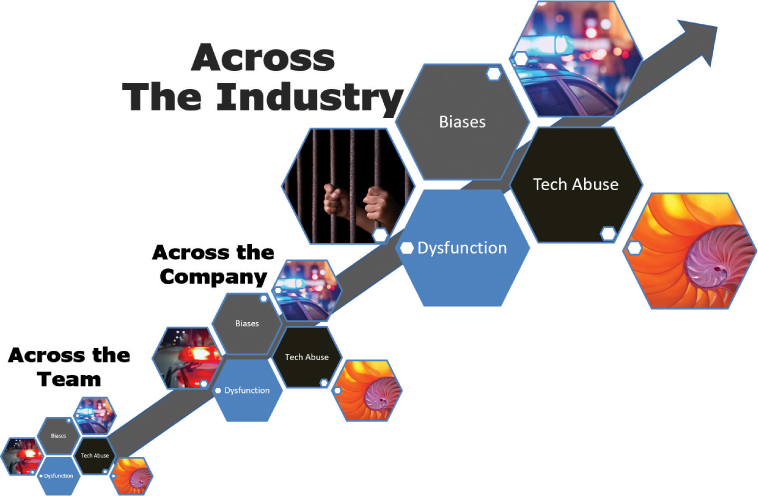

# 提高创造力的练习

你将在这一小时学到什么：

- 创造力和思维
- 创造性思维练习
- 什么不该做：过早结束思考
- 总结和案例研究

在这一小时中，我们将继续以第 10 小时和第 11 小时为基础，概述以不同方式思考的技巧和练习，在这种情况下，以建立或提高创造力。 从围绕视觉和发散思维的基础知识，我们然后转向独特的方法来推动我们自己以全新的方式进行构思。 奔跑沼泽、分形思维、黄金比例分析和逆向头脑风暴等练习广泛地推动了护栏的概念，并为我们提供了各种"螺栓"，有助于将我们的思维推向我们已经完成的构思之外。 我们以一个"不该做什么"的例子作为第 12 小时的结尾，重点是当我们没有仔细考虑摆在我们面前的机会时，我们会错失现实世界中的机会。

## 创造力和思维

在第 11 小时，我们发现了对创造性思维有用的技巧和练习，我们围绕"护栏"的概念组织了这些方法，以进行不同的思考。 从类比和隐喻思维到足够好、边缘案例、包容性和可访问性以及模块化思维，我们概述了解决问题或情况的新方法。 然后，我们将创造力应用于风险管理，并概述了极端思维的技巧。

但是，如果创造性思维根本不够用怎么办？ 如果我们不仅需要创造性思考，还需要提高我们的创造力怎么办？ 我们如何在我们的思维基础上叠加额外的技巧或练习，以不同的方式推动自己？ 我们可以使用哪些创意补强和配方来提高创造力？

在这一小时中，我们将介绍六种方法来重新思考我们已经思考过的事情，将我们带向新的方向，从视觉和发散思维到运行沼泽、分形思维、黄金比例分析和逆向头脑风暴。 将这些方法与其他方法结合使用，我们可能会找到新的方法来解决长期存在的问题。

## 创造性思维的技巧和练习

除了我们已经涵盖的不同思维的护栏之外，一些额外的练习可以将我们的大脑带到新的地方。 将这些视为对其他思维方式的"补强"。 例如，视觉思维是一项长期存在的技术，我们可以将其添加到我们的工具包中并应用于大多数问题或情况，而不管我们以前可能以何种方式思考该问题或情况。

### 行动中的设计思维：用于理解的视觉思维

正如第 5 小时所述，我们越能将我们的想法、计划和解决方案转化为图片和数字——从而使它们可见和可视化——我们就能更快地达成共识。 本书的大部分内容都是围绕使视觉思维或成像、展示、观看和观看的简单过程成为可能的技术和练习来组织的。 当我们能够将头脑中无形无形的思想转化为图形、地图和图像时，我们就能更好地思考并与他人交流这种思考和理解。 我们都知道，复杂的想法和过程通常最好通过视觉传达，这就是为什么俗话说"一图胜千言"。 如图 12.1 所示，一张图片可以准确地提供理解或解决问题所需的内容。


图 12.1
众所周知，数字和图片可以将复杂的事物转化为可以理解的事物，在这种情况下，解释了为什么某人似乎正在迅速逃离某种情况。
当我们的构思和思考过程使我们无法取得更多进展或无法清晰地沟通时，当我们无法用言语表达时，请画一幅画。 如果你对情况的复杂性感到不知所措，请考虑该情况的两个或三个关键部分，然后画出来。 图片帮助我们看到关系和依存关系，它们帮助我们简化条件并比文字更快、更清楚地达成共识。

除了图片、数字、图表、模型和热图（见以下注释）之外，还可以考虑使用动态和动画内容（例如视频）来有效地传达复杂的过程，并保持可重复的一致性。 例如，在互联网上查看数百个动画莫比乌斯带中的一个（正如我们在第 11 小时中讨论的那样）比这些词更能传达资源效率。

> 笔记
> 热图！
> 红色/黄色/绿色热图非常适合通过使用颜色编码（或其他识别标记以适应可访问性现实）来可视化数据或概念。 颜色或其他标记的多样性和层次有助于说明状态或变化，因此有助于引起人们对该状态或那些变化的注意。

> 笔记
> 结构化文本
> 当文字仍然是最好的交流方式时，请考虑使用结构化文本，稍后将在第 15 小时中概述，以进行清晰而经济的交流。

### 行动中的设计思维：发散思维
正如我们在第 10 小时看到的那样，帮助我们自己更发散地思考会打开通往新想法的闸门。 它是关于产生一系列可能性，而不是发现一个最好或正确的想法。 有许多想法需要进一步探索，我们可以创造一个良性循环，在这个循环中，新想法会产生更多想法，为我们提供取得进步所需的数量、深度和广度。 不要害怕犯错误或"错误"。 相反，戴上我们的 Divergent Hat，借助以下 Divergent Thinking 热身活动，沉浸在新的创造力水平中。

- 散步或跑步。
- 做个按摩。
- 梦想未来会怎样。
- 画出我们脑子里的东西。
- 和我们的孩子一起玩积木或乐高积木。
- 用我们的双手建造一些东西。
- 收听播客或音乐。
- 洗个澡或淋浴放松一下。
- 在安静的地方冥想和祈祷。

并记住爱因斯坦关于想法的重要性所说的话："避免犯错误的唯一可靠方法是没有新想法。" 依靠发散思维技巧和技巧来填充我们的构思漏斗。

### 行动中的设计思维：运行沼泽

一旦我们花了一些时间深入思考一个问题或情况，我们可能想要扭转局面，转而快速思考。 不用想太多，我们对情况的第一反应是什么？ 在不陷入潜在后果或根本原因的情况下，应该做什么？ 现在？ 正是这种时间压力可以产生取得进步或生存所必需的想法。

与早期的技术和练习一样，我们可以通过一群人的视角来看待这个练习。 想象一下，我们需要将我们自己和我们的社区从 A 点带到 B 点，而两点之间有一片沼泽。 我们怎样才能足够快地穿过沼泽以避免陷入其中？ 我们如何以一种特殊的方式或使用一种特殊的装备穿越沼泽？ 我们如何绕过沼泽？ 我们可以飞过它还是像绿色蛇蜥蜥一样跑过它？ 时间压力可以帮助我们突破逻辑障碍。

奔跑沼泽是一个定时发散思维练习的核心。 该练习结合了各种形式的头脑风暴、类比和隐喻思维、视觉思维等——任何可以推动创造性构思的方法。 使用此练习来浮现大胆的想法，如果没有时间限制，这些想法可能不会浮出水面。 隐藏在大而大胆的是可以帮助我们在沼泽中航行的洞察力。

这个练习最好在视觉上完成。 获取面临陷入沼泽风险的社区的照片，并将该照片叠加在沼泽图像上（见图 12.2）。 首先，确保人和沼泽之间有足够的空间。 在这个定时练习中，我们将一分一秒地看着那些人陷入沼泽，因为我们无法想出可以帮助他们生存的想法和解决方案。


图 12.2
运行沼泽使我们和我们的团队处于时间紧迫的境地，以快速构思，而不考虑常识或后果。
以下是如何运行沼泽的示例：

时间和人员：运行沼泽练习需要 5-10 个人进行 5-10 分钟的时间（尽管练习后的讨论可能需要 30-45 分钟）。

1. 通过将我们的小组召集在一起开始练习，分享我们面临的情况和挑战，并将受情况影响的人的照片放在更大的沼泽图像上。 物理和虚拟白板非常适合此练习。
2. 将照片安装在沼泽图像的上方，再次向团队提出问题或情况，并解释这是一个没有坏主意的定时练习。
3. 启动 10 分钟计时器并开始思考和集思广益。 社区和团队将如何穿越沼泽？ 在物理或虚拟便利贴或白板上捕捉潜在和部分解决方案。
4. 随着每一分钟的过去，把受这种情况影响的人的照片推到沼泽深处。 如果这样更容易，你可以剪掉照片的底部。 剪掉它！ 再次，展示它以增加房间或电话中的紧张感。 社区正在下沉； 该团队未能拯救社区……
5. 每过一分钟，重复第 4 步。
6. 当团队停滞不前时，引入不同的头脑风暴方法。 例如，考虑运行超浓缩版本的最差和最佳练习或反向头脑风暴练习（均在第 14 小时中介绍）作为一种不同的思考方式。 这种情况怎么可能变得更糟，而不是解决问题？ （比死在沼泽里更糟？是的。）
7. 随着社区和团队继续深入，每分钟继续更新视觉效果。 推动团队考虑任何一种解决方案。 同样，将建议的解决方案记录在便利贴或白板上。 向他们展示即将到来的厄运，以促使我们的团队在简单明了的事情之外进行更深入的思考。
8. 展示受影响的人的照片，下沉到他们的腰部……他们的胸部……他们的脖子……他们的下巴……并随着原始渗出物到达他们的嘴巴而感到压力增加。 没有疯狂的想法。 拯救他们！

考虑一下随着失败和死亡变得越来越迫在眉睫，时间压力本应如何帮助团队想到看似疯狂的解决方案。 Running the Swamp 让人们可以自由分享他们通常不愿意分享的潜在解决方案，不受过度思考和引用所有"永远行不通"借口限制的想法。 我们将提出多种解决方案，其中一些站不住脚，而另一些则更为实用。 还有一些将是困难的，但可能是可行的。

奔跑沼泽的另一个意想不到的结果包括它为必须穿越沼泽的社区建立了同理心。 为什么？ 因为我们不是在看着一个项目或倡议，或者一个产品或解决方案，沉入沼泽。 相反，我们眼睁睁地看着我们被要求帮助渡过难关的人被吞没。 通过这种方式，我们找到了以全新方式思考的理由和勇气。

> 笔记
> 什么是沼泽？
> 世界不同地区反映出不同种类的危险。 考虑将运行沼泽重命名为更具地理相关性的名称。 例如，此练习也称为赶火车、穿越流沙、过桥、涉水、僵尸穿越以及类似的基于时间敏感的危险类比。 使用最适合情况、地理、人员或问题的那个。

### 行动中的设计思维：分形思维
在第 9 小时，我们介绍了用于识别问题和主题的模式匹配练习，然后简要介绍了一种称为分形的特殊模式。 分形是"永无止境、无限复杂且自相似的，就像一个重复的反馈回路"（```Sheedy```，2021 年）。 分形思维，或"垂直"思维，为我们提供了另一个独特的视角来看待问题或情况：在较小或较大尺度上存在的自相似模式，例如实际上只是大小不同的相似模式。 分形可能比我们的问题小或比我们的问题大，但从数学上讲，它是 X 与 Y 相似的地方 (X ~ Y)。

> 笔记
> 自相似模式
> 请记住，当两个几何对象具有完全相同的形状（尽管不一定大小相同）时，则称它们相似。 当不同尺度存在自相似模式时，它们被称为彼此的分形。

因此，分形思维是关于认识和利用小和大之间的关系来学习和以不同的方式思考。 寻找在特定环境或问题集中反复发现的递归模式，然后将这种大规模模式用作影响变革的高级蓝图、设计或指南。 实际上，我们可能会假设在一个尺度上为真，在更小或更大尺度上也为真。

分形在整个自然界中随处可见，无论是在地球上还是在整个宇宙中。 正如我们在图 12.3 中看到的那样，在它们的相似性中可能会有一些可以学习和应用的东西。



图 12.3
当我们超越传统模式和主题并进行垂直思考时，分形思维可以帮助我们进一步思考问题。
分形帮助我们在变化的背景下思考和思考不同的情况，在这种情况下，最小的模式在越来越大的圆圈或越来越小的圆圈中发挥作用。 考虑一下在家里看到的模式如何在社区和整个城市中发挥作用。 同样，考虑一下国家政府政党的模式如何在州和地方层面产生反响，并在公司、工作场所、团队以及个人的看法和行动中重复出现。 分形就在我们身边。 了解它们可以帮助我们以全新的眼光看待并预测接下来可能发生的事情。

分形思维帮助我们找到模式，帮助我们更好地理解和填补我们自己的问题模式的空白。 需要例子吗？ 考虑一下自然界中常见的这些分形：

- 在原子、太阳系和星系中观察到的模式
- 树枝细分为更小的自相似树枝
- 循环系统让位于越来越小但自相似的血管和毛细血管
- 河流系统由一组重复的较小河流、支流和溪流供给
- 海绵和贝壳、松果、菠萝，甚至西兰花

分形使我们能够预测和规划整个拼图，即使我们只看到拼图的一部分。 相反，分形还可以帮助我们简化最初看起来极其复杂的景观、问题或情况。 将分形思维应用于其他形式的思维和构思之上。

### 行动中的设计思维：黄金比例分析
当我们环顾周围的世界时，有数量惊人的项目例子似乎比例恰到好处。 从天上最大的星系到地下最小的植物，世界上到处都是这样的例子，它们的大小和比例似乎都令人愉悦。 他们说得通； 它们具有一定的自然对称性。 但没有什么明显的东西可以解释为什么他们喜欢。

在这些情况下，我们的观察可能植根于这样一个事实，即我们周围的世界——从星系和我们的太阳系到飓风和贝壳，再到 ```DNA``` 链等等——反映了一种基于事物自然生长方式的对称性，如斐波那契所捕获的那样 序列（从 1、2、3、5、8、13、21、34、55、89 开始，无限增长）。

当我们仔细观察序列中的数字时，我们会观察到一个简单的模式。 例如，```5 + 8 = 13``` 和 ```8 + 13 = 21```。 只需将两个相邻的数字相加，我们就会得到序列中的下一个数字。 细胞、花朵、风暴等以非常特殊的方式生长，通常映射回这种模式，例如，解释为什么这么多花有 5 或 8 或 13 或 21 瓣，包括为什么雏菊通常有 34 或 55 瓣 .

除了模式之外，还有另一个数字在起作用，它为一种独特的创造性思维技巧奠定了基础：两个相邻数字之间的比率。 该比例为 1.6 比 1，我们称之为黄金比例。 这个比例有助于解释为什么胎儿会自然生长，为什么面孔赏心悦目，为什么 ```iPhone``` 看起来恰到好处，以及为什么微软的 ```Azure``` 标志比例恰到好处。 这些例子中的每一个都反映了斐波那契数列，更重要的是黄金比例。 事实上，如图 12.4 所示，我们周围的世界从一开始就反映了这个比率。 聪明的产品设计师和思想家意识到并使用这些知识。 我们也应该。


图 12.4
将黄金比例用作发现问题或情况维度内不自然或未优化关系的特殊镜头。
假设我们需要将一个社区从 A 点移动到 B 点，粗略地看一下这片土地的布局似乎并不正确。 有些事情似乎不正常，或者看起来或感觉不对。 我们可能会看到问题

- 我们旅程的维度
- 我们的人员配置模型的构成
- 我们的冲刺工作项目的规模
- 我们团队的架构
- 我们的原型或用户界面的外观和感觉
- 我们沟通节奏的构成
- 从多样性或经验的角度看我们团队的概况
- 我们测试计划中测试用例的特定组合
- 我们风险登记册的进展或增长

也许我们需要考虑情况、问题或潜在解决方案的维度如何反映或偏离黄金比例。 也许黄金比例可以帮助我们验证摆在我们面前的作品的自然契合度或尺寸。

最后，斐波那契数列确实证明是某些有机体或自然系统生长和变化的最有效或最实用的方法。 在我们的环境、我们的团队和我们周围的过程中寻找黄金比例中反映的自然对称性。 我们能在工作中看到这个比例吗？ 很有可能，如果某些事情感觉"不对劲"，那么解决方法可能取决于对黄金比例的认识和重新调整。

### 行动中的设计思维：逆向头脑风暴

虽然我们稍后会在第 14 小时更详细地介绍这项技术，但逆向头脑风暴和其他逆向思维技术和练习确实是用于不同思维方式的聪明"补强"，如图 12.5 所示。 在我们完成任何想法或思维练习之前，我们应该以逆向头脑风暴练习结束，并创建一个新的想法列表，从一个完全不同的角度反映问题或情况：什么会使我们的问题或情况变得更糟？


图 12.5
考虑翻转我们的逻辑并运行反向头脑风暴会议应该如何结束传统的头脑风暴和大多数其他构思或思维练习。
而且这样的列表很容易编制。 为什么？ 因为大多数人天生就会思考可能会出错的地方。 这是我们都以几乎事实上的方式使用的为数不多的技术之一。 然而，如果有意地使用，逆向头脑风暴可以为我们提供摆脱困境所需的确切方法：大量不该做的想法。 有了会使我们的问题或情况变得更糟的想法列表，我们就可以逐项处理列表，翻转每个项目以将不该做的事情转化为可能的解决方案。

例如，如果我们面临预算短缺问题，与其试图解决这个预算问题，不如考虑我们可以做些什么来使我们的预算问题变得更糟！

- 尽管已经超出预算，但仍要继续增加支出。
- 尽早获取明年的预算。
- 申请短期贷款。
- 向其他部门借用。
- 从其他部门窃取。
- 忽略这个问题。
- 把问题留给我们自己。
- 使用信用卡隐藏问题。
- 把问题归咎于别人。
- 创造性地调整会计记录以解决问题。
- 销毁会计记录。
- 烧毁建筑物及其记录。
- 在意识到短缺之前找到一份新工作。

有了这份详细的"不该做什么"清单，我们就可以将每项行动转过来，编制一份我们在传统头脑风暴中可能遗漏的积极行动清单。

## 什么不该做：过早结束思考
一家大型系统集成商 (```SI```) 发现自己陷入了困境。 它的摇钱树已经枯竭，销售团队未能用新的收入来源取代那些垂死的收入流，由此导致的人才大量外流让 ```SI``` 看起来像一个空壳。 ```SI``` 的领导团队聘请了外部咨询公司来考虑和讨论新的市场前景、新的品牌机会以及重塑公司的想法。 最终，精心策划了一次收购，收购了 ```SI```，而创新和成就的强大遗产在另一家垂死的公司中消失了。

事后回想起来，```SI``` 的领导后来意识到，外部咨询公司未能深入理解并代表其构思。 咨询公司忽略了一个事实，即 ```SI``` 坐拥资产和 ```IP``` 的金矿，几年后将被普遍称为"云计算"。 它错过了在整个行业、数据中心技术和无共享计算平台中回荡的分形。 外部咨询公司从未超越表面层面的头脑风暴来真正考虑 ```SI``` 的潜力。 它未能通过发散思维技巧用想法填满构思漏斗。 它过早地放弃了思考，许多人为此付出了代价。 最终，这家咨询公司让无数股东和成千上万受到收购、裁员和错失市场机会影响的人失望了。

## 概括

在第 12 小时，我们以前面几个小时分享的技巧和练习为基础，探索了六种提高创造力的补强方法。 从视觉和发散思维到运行沼泽、分形思维、黄金比例分析和逆向头脑风暴，我们概述了思维的种类以及我们可以用来完善我们的构思漏斗的后续步骤。 第 12 小时以"不该做的事情"结束，与错过发散思考的关键机会和过早放弃我们的思考有关。

## 练习册

### 案例分析

考虑以下案例研究和问题。 你可以在附录 A"案例研究测验答案"中找到与此案例研究相关的问题的答案。

### 情况

```BigBank``` 的首席数字官萨蒂什 (```Satish```) 发现，在各个 ```OneBank``` 计划领导者的构思和执行方式中，错失了太多机会。 他要求你主持一个构思研讨会，以探索改进团队创造力和构思过程的不同方法。

### 测验

1. 六种技巧和练习中的哪一种真正专注于将想法从头脑中转移到纸上或白板上，以此来增加团队之间的共同理解？

2. 哪项技术实际上包含许多有助于以不同方式思考的技巧和技巧？

3. 除了新想法之外，像奔跑沼泽这样的定时练习如何激发更大的同理心？

4. 哪种技术让我们考虑了在我们以下或我们以外的规模上发挥作用的模式？

5. 哪种技术要求我们考虑斐波那契数列如何影响特定解决方案的自然拟合或维度？

6. 研讨会参与者如何集体看待六种创造性思维技巧和练习，特别是如何自然地增强经典头脑风暴？