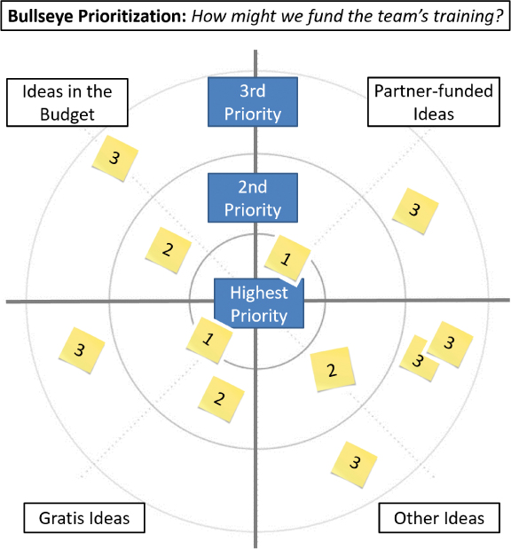

# 减少不确定性的练习

你将在这一小时学到什么：

- 不确定情况下的下一步思考
- 减少不确定性和歧义
- 克服不确定性以及下一步是什么
- 什么不该做：蛮力路径
- 总结和案例研究

在这一小时中，我们将探索设计思维技术的一个特殊子集和有助于减少不确定性的练习。 通过下一步思考并确定模糊性和不确定性之间的区别后，我们学习了四种方法，可以比其他方式更确定地前进。 然后，我们探讨了七种技巧或练习，用于在前方道路不明时确定"下一步最佳"。 第 13 小时以"不该做什么"结束，重点是在面对模棱两可的情况下避免使用蛮力。

## 不确定情况下的下一步思考

像雾一样，模糊隐藏了我们面前的道路。 当实在没有办法照亮整条路的时候，利用这一小时的功法，至少照亮我们前面的那部分路。 这种技术被称为"下一步思考"，本质上是一种"伞式技术"，涵盖了多年来一直用于一步一步取得进展的一整套技巧和练习。

这才是真正的目标：在旅程中有目的地移动，从一步到下一步，承认不是每一步都是完美的，但每一步都会增加学习并因此增加价值。 有了我们的短期、中期和长期规划路线图，我们可以使用本小时介绍的其他技术，例如购买功能和 MVP 思维来建立一些共识并取得一些强有力的初步进展。 但是然后呢？ 我们如何到达那个中期或下一个地平线？

明确地说，我们可能需要先"控制可控的"。 然后我们需要转向下一步思考，思考如何在我们的短期、中期和长期视野之间实现跳跃。 首先要考虑的是，在我们的项目和计划的不同视野或阶段之间存在着思考如何

- 保存和重复使用我们（现在）所知道的
- 利用我们的经验和我们取得的成就
- 依靠我们长期以来建立的关系
- 承认并填补我们的空白
- 识别帮助他人的模式和机会
- 把我们自己带到一个新的问题或情况

下一步思考帮助我们概念化更广泛的情况、我们团队的技能，以及可能需要什么作为实现下一步目标的垫脚石。 想想我们的团队做了什么，在哪里，和谁一起做了，以及成功的程度，以及我们的交付记录。

在更个人的背景下，下一步思考也是利用我们今天的身份、我们对自己所做的投资以及我们提供超越今天的价值的能力的重要组成部分。

- 我们能否通过将今天的成功作为为什么值得晋升的典范来获得职位晋升？
- 我们能否通过发展我们所服务的社区来扩大我们目前的成功？
- 我们能否与他人合作探索和解决相邻空间（本小时稍后讨论）或寻找创造价值的新方法？
- 我们能否提高技能并缩小差距以担任经理的角色？ 还是其他领导角色？
- 我们是否应该将我们所学到和完成的一切带到另一个需要我们提供的帮助的组织中？

考虑下一步思考的以下原则：

- 成为利用我们手头的东西创造价值的专家； 通过我们所拥有的、我们拥有的人以及我们拥有的地方找到成功。
- 重要的比紧急的更重要； 确保重要事项得到交付，即使是紧急事项的快速跟进者。
- 在人们所在的地方满足他们的需求，然后找出他们的下一组需求。
- 在进入下一步或下一个挑战之前，采取必要的行动以确保已解决的问题不会退化为旧问题。

这个小时的大多数练习都代表了下一步思考的一种形式。 让我们从四个练习开始，它们可以帮助我们通过最大限度地减少摆在面前的不确定性、歧义和风险来迈出明智的一步。

## 减少不确定性和歧义

思考风险较小和风险较大的结果有助于我们暴露不确定性和模糊性的领域，这反过来又可以帮助我们做出更明智的下一步。 当我们面临不确定性时，通过包括可能的未来思考、使战略与时间范围保持一致、回溯到过去和相邻空间探索等练习，尽我们所能减少不确定性。 也可以考虑按顺序运行两个或多个这样的练习，本质上是创建一个自定义方法来减少不确定性。

### 行动中的设计思维：可能的未来思维

杰罗姆·C·格伦 (```Jerome C. Glenn```) 于 1971 年创建了期货之轮，时至今日，车轮类比仍然是一种强大而简单的思考工具。 轮子及其各种形式帮助我们围绕一个中心思想或事件组织我们的思想。 作为视觉思维的一种方法，这种以视觉为导向的"可能的未来思维"练习可以帮助我们根据当前的趋势或事件以及这些趋势或事件的可能后果对未来的不同版本进行建模。

可能的未来思考练习很容易单独完成或与一群人一起完成（例如，在物理或虚拟白板上或通过 ```Miro``` 或 ```Klaxoon``` 等工具）。 使用轮子类比，通过轮子的六个类别或部分的镜片来查看情况。 期货轮的原始版本将这些类别或部分与首字母缩写词 ```STEEP``` 对齐（这是另一种有用的分类法，无论使用何种方法或工具，都可以独立思考）：

- 社会的
- 技术的
- 经济的
- 环境的
- 政治的
- <在这里插入你的>

轮子的第六个"在这里插入你的"部分是一个自定义部分，我们可以根据另一个维度、新出现的变化或我们希望思考的模式进行分类。 如果我们看到不止一个正在出现的变化或模式，例如我们希望考虑的行业趋势或一组文化现实，我们可以将我们的轮子分成八个或更多部分。 图 13.1 展示了一个经典的六节轮。


图 13.1
使用一个简单的轮子类比，通过多个部分或类别的镜头来识别和探索一种情况。
现在绘制出未来的可能性以及与我们的中心思想与每个维度或部分的交集相关的假设。 当我们在轮子上工作时，我们应该发现自己在思考机遇、识别风险和制约因素、考虑如何建立共识、从战略上思考可能的变化及其对这些可能的未来的影响等等。

### 行动中的设计思维：使战略与时间范围保持一致

当下一个最佳步骤显而易见时，第二步和第三步的重要性可能会比我们准备考虑的更快地变得更加重要。 有人说，这种从短期到中期的飞跃可能也是最重要的。 毕竟，中期是一座桥梁，它将我们今天所知道和所做的事情（这对我们来说可能很舒服，因为它是已知的）与我们可以计划和梦想但坦率地说，看不到的长期未来联系起来。

因此，使战略与时间范围保持一致可以成为一个重要的工具，通过围绕三个步骤组织的向后思考（从未来到现在）进行超前思考：

- 制定整体地平线计划（这必然是高层次和战略性的，但受制于未知因素，因此当我们展望未来时有点抱负）。
- 创建一个倡议路线图或项目路线图，以提供更清晰的近期（从而创建一个中期和中期战略计划）。
- 创建一个包含基础 Sprint 计划的发布计划，以及有助于导航日常任务和近期里程碑的必要项目计划（将详细信息保存在我们的 ```DevOps``` 工具中，以便我们可以使我们的项目计划尽可能轻量级，理想地集中 关于高级里程碑和与其他正在进行的工作的依赖关系）。

将策略与时间范围对齐是一种视觉练习，使用我们放置在类似于图 13.2 中显示的时间范围模板顶部的气泡。 直观地展示这些视野和计划，以帮助考虑优先级、可能需要作为先决条件执行的内容、可以并行执行的内容等等。


图 13.2
使用此工作示例模板使战略与时间范围保持一致。
在长期视野中画出第一个泡泡，并用描述长期需要实现的目标的内容标记第一个泡泡。 我们可能会将其标记为"重塑我们的团队"或"完成公司的业务转型"或"十年后退休"。 时间框架——1 年、4 年、20 年——并不像将旅程分成三个重要步骤或到达最终目的地所必需的里程碑那么重要。 如果练习似乎突出了四或五个步骤，那就这样吧！ 只需在模板中添加更多视野即可。

第二个泡沫反映了我们今天所处的位置； 现在我们有了一个端到端的视图，只需要充实它。 想办法创造第三个短期泡沫和第四个中期泡沫。 例如，我们可能会意识到，在追求中期目标之前，我们需要获得特定的晋升或职位或完成一些教育。

如果可能，请依靠已成功完成此旅程的大部分或全部的同事或朋友来帮助确定此旅程中通常采取的各个步骤（气泡）。 当我们识别这些泡沫时，将它们放在各自的短期、中期和长期位置。 然后连接气泡之间的点，以直观地描绘逐步优先级（步骤 1、步骤 2、步骤 3）和依赖关系（例如，步骤 1 和步骤 2 可能都需要在我们到达步骤 3 之前完成）。

一旦我们完成了我们旅程中真正重要的里程碑，我们可能想要重新审视它们并充实地平线之间的小垫脚石。 根据我们的需要进行深入和详细的介绍，但在某些时候采用一些足够好的思考（第 11 小时）并开始迈出重要的第一步！

将此练习与可能的未来思考相结合，考虑三到四种可能的未来，以更好地了解哪些是最容易实现的、最耗时的、最昂贵的、风险最大的，等等。

### 行动中的设计思维：回顾过去
在软件开发中，向后移植是"从最新软件版本获取软件补丁或更新并将其应用于同一软件的旧版本"（CrowdStrike，2022 年）。 我们可以使用这种方法来导航近期，并为我们如何看待我们周围的事物和不变的事物注入新的活力。 以打牌的名义，或者让我们的团队上场，或者与我们所知道的和给定的人一起工作，回到过去正是我们需要减少的方法 不确定。

考虑一下：技术团队很少有机会构建新的解决方案，或者利用一套新的平台和工具，或者只是从头开始。 我们经常面临大量的技术债务、遗留系统和流程，我们需要了解、适应某些领域、解决其他领域并最终进行转型。

作为一种设计思维技术，回溯过去是关于认识到当今的现实和有限的选择集，然后在这些选择和限制条件下工作以实现新事物。 它帮助我们应对不确定性，因为我们不是为了改变它而走进一个新环境。 相反，我们使用我们面前的东西、我们必须与之合作的团队以及我们当今拥有的技能和经验——所有这些都非常有价值——来创造选择。

如何？ 让我们从一个列表开始：

- 辨明情况。 什么是不变的？ 可能会改变什么？ 想一想并考虑 Snaking the Drain 来清除那些不可行的旧想法，或者浪费其他人陷入困境并思考它们的时间。
- 确定我们是谁作为主题专家。 我们真正擅长什么？ 我们的超能力是什么？ 仔细考虑并将其记录下来，作为进一步思考的一种方式。
- 对我们的团队做同样的事情。 我们可以共同拥有哪些特殊技能，我们跨越哪些行业，差距在哪里？ 确定我们多年来完成的工作。 这些经验并不能定义我们是谁，但它们仍然是我们在人员、技术、业务等方面的信誉和经验的基础。 深入挖掘并记录这些项目。
- 确定我们喜欢什么。 作为个人和团队，我们热衷于什么？ 如果我们必须每周一起工作 40 小时，什么样的工作或角色甚至感觉不像工作？
- 确定我们可以在哪些方面快速学习新知识，以及在哪些方面收益递减会影响这种时间、精力和成本的投资。

最后，现在是这种技术的创造性对抗不确定性的价值。 考虑我们如何将自己和我们的团队反向移植到与我们之前担任过的角色或项目类似的角色或项目中，并（利用我们最近的经验和技能）赋予这些新角色或项目新的生命。 这种设计思维技术不仅要缩小我们的选择范围，而且要以新颖的方式创造性地适应和重用我们是谁和什么（```Mittal```，2022）。 通过将我们当前的自我注入反映旧角色和项目的新角色和项目，更快地加速走向未来。

结合人员和团队来创造混合机会和新选择。 写下这些选项！ 单独和一起考虑这些选项。 与他人一起进行头脑风暴和逆向头脑风暴，以解决看不见或未说出口的问题。 最后，我们应该有一个强大的实物期权清单，疯狂期权，以及中间的许多其他机会。

### 行动中的设计思维：降低风险的相邻空间探索

相邻的未来或类似于我们所知道的选择可以帮助我们找到低风险的下一步吗？ 这样的下一步可以节省时间和做出选择吗？ 是的！ 我们可能不会朝着全新的方向前进，而是沿着与我们已知的事物相邻的低风险路径迈出几步。 追求相邻的选择或探索相邻的空间可能不会改变我们的未来，但这些方法可以帮助我们在短期内取得有意义的进展。

我们经常在我们的职业生涯中应用这种方法，通过进入新的但相邻的空间来建立我们所知道的； 这样做可以让我们使用我们所知道的，学习相邻领域的"新"知识，并成为更广阔领域的专家，如图 13.3 所示。


图 13.3
考虑一下我们如何在整个职业生涯中驾驭相邻空间，以此作为一种以低风险的方式逐步改变自己的方式。
公司和组织在探索增量市场或在他们已经知道和做的事情的边缘取得微小进展时，会做同样的事情。 这种策略在一段时间内还不错……但最终，我们多年来一直关注并为人所知的东西在某种程度上变得过时了。 或者我们对已知事物感到厌倦，或者只是在已知事物周围看到更多机会，而不是停留在已知事物中。

我们如何将同样的"相邻空间"思维模式应用到我们的应用程序平台或软件发布的下一个版本中？ 在我们引入新功能或界面更改时，我们可以做些什么来让我们的用户保持相对舒适？

基于 ```Stuart Kauffman``` 在他的著作 ```Investigations```（2002 年）中关于增长的观点，相邻空间探索可以帮助我们确定我们可以逐步增长和迭代（至少部分）我们已经知道的领域。 走进我们今天已经知道和做的事情周围的未知水域或空白区域，有助于我们思考并采取下一步行动，走向一个新的但可能熟悉的未来。 这很容易，因为保持不变； 我们所知道的和我们所知道的周围的事物的相似之处多于它们的不同之处。

## 克服不确定性以及下一步是什么

有时我们别无选择，只能忍受摆在我们面前的不确定性和我们周围的模棱两可，并努力应对——我们需要找出并采取下一步最佳措施。 我们已经介绍了模式匹配和分形思维如何帮助我们设想下一步，相邻空间如何降低下一步的风险，以及如何将可能的未来和调整策略映射到长期、中期和短期时间 地平线可能会有所帮助。 但是，当涉及到对解决不确定性有用的技巧和练习时，我们只是触及了皮毛。 在接下来的几页中，我们将介绍另外七种创建清晰度的方法，同时我们向前迈出最好的一步。

### 行动中的设计思维："什么，那又怎样，现在呢？"

在不沉迷于过去的情况下，考虑发生了什么、其后果以及根据这些后果下一步该做什么可能是有用的。 这可能不是最好的下一步战略，但它可以帮助我们在并行考虑其他选择的同时导航前进的道路。

有时玩游戏是解决问题最简单的方法，尤其是当我们需要快速取得进展以摆脱困境，或者只是不想陷入琐碎的细节时。 一个简单的游戏是"什么，那又怎样，现在呢？" 锻炼，它可以帮助我们学到足够的知识，从而摆脱犹豫不决并继续前进。

管理科学家 ```Chris Argyris``` 和 ```Peter Senge``` 在 1990 年发表的推理阶梯模型中介绍了这种方法。 这个想法是通过最近的事件来工作，并通过问题和镜头来看待它

1. 什么？ 我们需要讨论与事件相关的（发生的）事情。
2. 所以呢？ 我们需要讨论事件的影响或后果。
3. 现在呢？ 我们需要总结后续步骤和可能的重做。

这个简单的三步过程对于新技术团队、执行委员会和倡议领导者来说是一个很好的练习，可以用来探索当前的问题或情况。 "什么，那又怎样，现在呢？" 教授一种简单的方法来解决潜在的困难问题或情况。 它还打开了确定下一步最佳步骤的大门，同时就如何在未来更有效地处理这些相同情况进行健康的对话。

### 行动中的设计思维：```MVP```思维
我们中的许多人都熟悉最小可行产品或 ```MVP``` 一词。 ```MVP``` 是满足个人或社区最低需求的功能或产品的最早版本。 就功能或特性而言，```MVP``` 不是最好的，但它已经足够了（也许已经足够好了，正如我们在第 11 小时中讨论的那样）。

运用 ```MVP``` 思维无非就是思考什么是最小可行产品或能力在另一个人手中。 从某种意义上说，这也是"种子思维"，即 ```MVP``` 就像种子一样，在得到照料、浇灌和培育后会变得更加成熟。

当我们面临确定下一个最佳步骤时，使用 ```MVP``` 思维来确定我们是否可以创建一个简单的 ```MVP``` 或详细说明现有的 ```MVP```； 任何一种策略都可以安全地将我们带到下一步。 例如，我们可能会对"获得博士学位"或"创业"或"重塑我的团队"这样的目标感到不知所措。 不过，与其着手实现该长期目标，不如考虑每个目标的 MVP 是什么样的。 在各自的旅程中采取的第一个或下一个最佳步骤是什么？ 通过解决较小的目标，我们离实现更大、更困难的目标更近了一步。

如何？ 找出使我们达到目标的最低水平的成就、能力或功能。 将该最低标准称为最低可行产品或 ```MVP```，并迈出第一步：

- 我们想读博士吗？ 使用 ```MVP``` 思维并从一年或两年制学位开始。
- 我们想开自己的公司吗？ 使用 ```MVP``` 思维并从简单的 ```Schedule C``` 独资企业开始。
- 我们是否希望更多地了解电子商务和网站？ 使用 ```MVP``` 思维，从志愿服务或帮助他人建立网站，或者参加在线或关联学习课程开始。

  我们是否正在考虑从事项目管理工作，并且需要一些实际经验才能被聘用担任这样的职位？ 再次，使用 ```MVP``` 思维！ 从在家里、为教堂、为邻里或社区开展小项目开始。 从 ```ExpertRating.com``` 参加一些低成本培训，并在此过程中获得基本的项目管理认证。 将此基本认证称为我们的 ```MVP```，但 ```MVP```止步于此。 通过完成 ```PMI CAPM``` 认证，以此 ```MVP``` 为基础。 一旦我们达到认证所需的项目管理经验，就可以学习并通过 ```PMI PMP``` 认证。

正如我们在图 13.4 中看到的，```MVP``` 思维帮助我们在已知的基础上进行构建。 ```MVP``` 思维帮助我们一路验证更大的目标确实仍然值得追求。


图 13.4
使用 ```MVP``` 思维以低风险的方式构建我们所知道的，同时验证我们的方向仍然值得追求。

### 行动中的设计思维：下一步的 2×2 矩阵思维

当我们需要知道该走哪条路时，有时剖析情况的两个维度会有帮助，例如努力与时间、难度与重要性、成本与努力等等。 归功于 ```Alex Lowy``` 和 ```Phil Hood``` 在 2004 年出版的《2×2 矩阵的力量：使用 2×2 思维解决业务问题并做出更好的决策》一书中，简单的 2×2 矩阵多年来一直用于帮助人们和团队 评估两个维度的多个选项。 以这种方式考虑选项可以帮助我们发现最佳选择或理想的前进道路。 有时称为 2×2 矩阵思维，这种方法可以帮助我们自信地再次行动。

2×2 矩阵思维的一些最常见用途包括

- 紧迫性与重要性（任务或目标）
- 重要性与困难（任务或目标）
- 努力与价值（任务或目标）
- 成本与价值（任务或目标）
- 简单性与结果（任务或目标）
- 权力与利益（利益相关者）

开始使用 2×2 矩阵很容易。 例如，绘制一条水平线并将其标记为"重要性"（我们将其称为水平或 x 轴），然后绘制一条垂直线并将其标记为"难度"（我们将其称为垂直或 y 轴） . 将这两条线分别用作框的底部和左侧。 将该框分成四个较小的框，如图 13.5 中的示例，我们现在有一个 2×2 矩阵。


图 13.5
很容易绘制和使用 2×2 矩阵来思考问题或情况的两个维度。 (```aywoo/123RF```)
或者，只需画一个大加号来创建一组四个开放式框。 然后添加一个 x 轴和一个 y 轴，并用每个轴代表的维度标记它们。

虽然创建和填充矩阵的过程本身很有用，但一旦填充了矩阵，真正的价值就会出现。 例如，一旦填充了重要性与难度 2×2 矩阵，我们就可以看到哪些任务或目标最重要，哪些难度最小，我们可能会优先考虑这些项目（以及整个象限）。 相反，我们将能够看到最不重要但最难实现的任务和目标，并且我们可能会降低这些项目和该象限的优先级。 通过这种方式，我们可以更清楚地了解后续步骤。

### 行动中的设计思维：靶心优先级

当我们的团队陷入困境，看不到前进的道路时，对 2×2 矩阵思维的特殊改编可能会很有用。 这种视觉方法称为靶心优先级，将 2×2 矩阵与靶心或雷达图像叠加在一起。 结合起来，当我们面临许多可能的选择或决定时，这两个图像一起帮助我们做出下一个最佳选择或决定。

这个练习的关键是组织。靶心优先级帮助我们将摆在我们面前的选择组织到矩阵的四个象限中，然后在每个象限内组织对团队来说最重要的、次要的，依此类推（见图 13.6，请记住每个象限 便利贴将包括实际的书面选择）。 可视化每个选择使这个练习非常直观； 离靶心越近，团队同意的选择或决定就越重要。



图 13.6
基于象限的靶心提供了两个不同的洞察维度——一个用于组织组，另一个用于对这些组中的项目进行优先排序。
要执行靶心优先级练习以组织和排列选项的优先级，请邀请我们的团队或构思小组一起，然后执行以下操作：

时间和人员：靶心优先级练习需要 5-10 人进行 60-120 分钟。

1. 在虚拟或物理白板上写下问题或情况。
2. 在白板上，通过团队循环创建与问题或情况相关的选项或选择列表。 我们还不想开始分组或确定优先级！ 只需填充此列表。
3. 一旦列表有了一个好的开始，就开始确定新出现的主题和分组。 理想情况下，确定三个或四个分组。 越多越好，但通常三到四个是理想的。
4. 要求团队用主题标记这些分组。 通过标签进行交谈的行为将有助于推动对每个小组的共同理解（并可能帮助团队确定更多的选择或选项或列表项）。
5. 现在在白板上画一个靶心（或雷达屏幕或飞镖靶）的图像，并将图像分成四个象限。 用主题标记每个象限。 同样，如果我们只有几个主题，对于初学者来说也没关系。
6. 将我们列表中的每个选项或选择写到便利贴上。 接下来我们会将这些便利贴放在靶心或雷达屏幕或飞镖靶图像上。
7. 从第一张便利贴开始，向团队大声朗读。 一起，根据适当的象限考虑它在图像中的位置。 将便利贴放在该象限中，不要担心它相对于图像中间（靶心）或图像外边缘的位置。 只需将其放入适当的象限即可。
8. 完成下一组便利贴，将它们放在适当的象限中。
9. 当一个象限变得有点拥挤时，团队可能倾向于开始优先考虑每个便利贴相对于靶心或图像中心的位置。 对抗冲动！
10. 当所有便签都放好后，现在我们可以考虑每个便签相对于同一象限中其他便签的重要性。 根据附近的选项调整每个距离雷达中心的距离。 如果一个选项比另一个更好或更重要，则将更好的选项"提升"到靠近靶心的中心。
11. 当团队讨论并确定一个选项比另一个更差或价值更低时，将其移到图像的边缘。 留出空间让最佳选择占据中心位置。
12. 同意并将最重要的选项放在图像的中心，每个象限一张便利贴。
13. 继续确定优先级，将不太重要的选项从雷达屏幕的中间推得越来越远； 离中间越远，选项越不重要。

就是这样！ 如果太少的声音倾向于推动优先级排序，我们可能希望使用不同形式的民主投票。 我们需要每个人都权衡他们的意见和经验。

同样，如果我们面临势均力敌的关系或选择，我们可能希望使用另一个设计思维练习来解决决胜局。 简单的决胜局练习的例子包括

- 使用 玫瑰、荆棘、花蕾（接下来介绍）从正面、负面和可能性的角度了解每个选项的更多信息。
- 使用五个为什么（在第 9 小时中介绍）更好地理解每个选项，首先询问团队或小组"为什么这个选项是这个象限中的最佳选项？"
- 使用"我们怎样才能"提问（已在第 14 小时进行了全面介绍和更详细的介绍）乐观地为为什么一个选项比另一个选项更容易实现或更健康做好准备。 使用此讨论重新确定选项的优先级。

或者，如果我们发现自己比较的选项只位于两个象限（而不是像我们可以使用基于靶心图像的方法轻松做到的那样四个），请考虑使用 2×2 矩阵思维。 2×2 矩阵适用于将一组选项与两个维度进行比较，例如成本与价值、成本与难度或重要性与紧迫性。 要考虑单个维度，例如实施或执行特定选项的难度如何反映在对该选项的更改和针对该选项的更改中，请查看力场分析。 这两个练习都可以在第 14 课时找到。

### 行动中的设计思维：```RTB``` 实现更明智的后续步骤
由 ```LUMA``` 研究所于 2012 年创建，我们使用"玫瑰、荆棘、花蕾"或 ```RTB``` 练习来详细探索特定选择。 这里的想法是将与选项或选择相关的积极、消极和机会组织在一起。 每个维度形成一个组。 我们根据它产生的玫瑰、荆棘和花蕾来看待我们的选择。 在这样做的过程中，我们会发现情况或选择的某些方面是好的，其他方面阻碍了我们，还有一些可能提供机会或出路。 进一步来说：

- 玫瑰是选项或选择中积极、健康或运作良好的那些方面。
- 荆棘是那些不积极或不健康的结果或后果。
- 花蕾是有潜力的领域； 它们代表了见解和机会或需要改进的领域。 花蕾常是选择一个选项而不是另一个选项的差异制造者。

要运行简单的 ```RTB``` 练习，请按照此处的步骤操作：

时间和人员：```RTB``` 练习需要 3-5 人进行 30 分钟或更长时间，具体取决于情况或景观的复杂程度。

1. 召集我们的团队或小组，确定物理或虚拟白板是否合适，并解释情况或问题以及目标：确定选项或选择。
2. 讨论并商定三种独特类型的便利贴（包括使用图标或表情符号）来识别积极、消极和机会。 每个独特的便利贴将代表三个 RTB 维度之一。
3. 给每个人一套所有三个便利贴。
4. 使用与图 13.7 中的模板类似的东西，让每个人识别他们的第一朵玫瑰、刺和花蕾。

图 13.7
使用 ```RTB``` 根据积极、消极或代表机会的维度来组织选项或选择的维度。
5. 通过团队或小组进行循环赛，让每个人都有参与的机会。
6. 当每个人都有机会时，重复练习并通过几个循环进行。 越多越好。

> 笔记
> 玫瑰是红色的，对吧？
> 在 ```RTB``` 练习中小心使用颜色。 当然，我们知道颜色并不总是可视化的最佳选择，因为它可以排除有颜色和其他视觉障碍的人。 但在 ```RTB``` 活动中，最常用的颜色可能会造成混淆。 例如，红色通常意味着停止或危险，但在 ```RTB``` 练习中，红玫瑰反映了一些"积极"的东西。 同样，绿色通常意味着前进或进步或健康的事物，但在 ```RTB``` 练习中，绿色反映了茎和刺的颜色，这是一种"负面"。 一个解决方案？ 坚持使用图标和表情符号！

```RTB``` 练习中会出现几个主题，快速浏览这些主题可能足以指导团队或小组做出选择。 但在出现多个主题的情况下，我们可能会返回并运行 靶心优先级练习，或者转向我们的下一个练习亲和聚类。

### 行动中的设计思维：用于模式查找的亲和聚类

有时，我们面对如此多的数据和如此多的下一步可能性，以至于我们不知道如何整理和理解摆在我们面前的东西。 什么都不做显然无助于我们取得进步。 幸运的是，我们有几种技术可以提供更多的清晰度，包括 ```LUMA Institute``` 的亲和聚类方法（```LUMA```，2012）。

亲和聚类帮助我们看到摆在我们面前的逻辑组或选项集群，这可以帮助我们做出一些初始选择和更明智的下一步最佳步骤。 通过练习本身，亲和聚类自然地减少了围绕看似复杂情况的一些不确定性。

亲和聚类如何工作？ 假设我们最近大学毕业，现在有几十种选择可供选择。 使用亲和聚类练习首先根据相似性对选项进行排序（而不是陷入单独查看每个选项的泥潭）。 例如，我们可能会确定我们有与军队相关的选择，加入几家小型初创企业之一，加入几家更成熟的公司之一，自己出击，帮助家族企业之一，攻读研究生学位， 在进入工作场所或安顿下来并养家之前，先抽出一些时间去旅行。 我们也可以结合这些选项中的几个，并引入混合方式，例如兼职工作或兼职攻读研究生学位或养家糊口并全职工作。

不管有多少选择，将它们组织成簇或组，如图 13.8 所示。 我们可能会围绕三个集群组织我们的选择； 例如，基于工作、教育和个人主题。


图 13.8
在我们整理和聚集摆在我们面前的选项之后，我们可能会找到下一个最佳步骤。
相反，我们可能会使用我们的模式匹配技能来找到我们的选项之间其他不太明显的联系。 例如，我们可能会创建按地理位置对齐的集群或组（让我们靠近家人的选项，让我们留在州或地区的其他选项，以及基于旅行或国际的其他选项）。 我们也可以创建围绕家庭概念组织的集群或组（例如家庭友好选项、家庭中立选项和反家庭友好选项）。

### 行动中的设计思维：购买共识功能

当所有其他方法都失败并且我们前面没有明确的下一步时，我们可能仍然需要做一些事情——某种下一步。 在这种情况下，明智的做法是获得一定程度的共识，以某种程度的团结朝着某种方向前进。 使用 ```LUMA Institute``` 的"购买功能"练习来确定优先级并推动达成共识。

购买功能的前提很简单：团队需要汇总功能列表、下一步最佳步骤或选项，然后根据列表中各项的优先级进行调整。 不过，他们不是靠语言来结盟，而是靠想象中的钱，就像"把钱放在嘴边"。 如果一项功能或下一步或选项对很多人都很重要，它可能会获得最多的预算，他们会成为明显的赢家。 通过这种方式，购买功能展示了每个团队成员真正看重的东西，而不是他们可能会说自己看重的东西。 钱会说话。

请注意，"购买功能"通常要求所有团队成员都是平等的，并且会得到一个假想的 100 美元预算（当然，我们可以更改规则，给我们的产品经理或销售副总裁更多的钱，从而获得更多的选民"权重"，但是 保持人人平等通常是个好主意）。 每个团队成员都被要求在编制的列表（不同功能、下一步最佳步骤或选项）中分配他们想象中的钱。 在某些情况下，最好匿名分配这些预算，而在其他情况下，演习负责人可能希望所有参与者都能看到彼此的选择。

无论他们对某个项目充满热情还是持观望态度，一个人可能会选择将他们的全部假现金放在列表中的单个项目上，或者他们可能会选择将钱四处散布。 他们可能会像我们前面提到的那样受到影响。 选择是他们的。

就像在现实世界中一样，除非匿名分配预算，否则这种方法会造成一定程度的紧张。 人们倾向于结对或组合起来，利用他们的影响力、权力和预算来做出选择。 我们需要考虑这些行动，而且我们需要采取必要的步骤，在这样的练习之后再次推动团结！ 毕竟，只有每个人都同意遵守结果，这才是共识。

## 什么不该做：蛮力路径

最困难的情况往往会导致最鲁莽的决定。 有时，这些决策正是组织避免分析瘫痪所需要的。 但是考虑一下全国批发商面临几个不同的"下一步最佳步骤"的例子。 而不是与她经验丰富的团队一起使用靶心优先级或亲和聚类来解决这些问题并确定它们的优先级，或者通过诸如"什么，那又怎样，现在呢？"之类的练习获得某种程度的共识。 或购买功能，一个相当新的中层管理人员单方面决定了公司的命运。 她认为，克服个人不确定性和更广泛的公司范围和行业模糊性的途径是以一种蛮力的"让开并跟随我"的方式向前冲锋。

这位高管相信快速做出决策，但没有借助其他人来之不易的经验、专业知识和洞察力。 她带领她的团队走上了一条蛮力之路，希望这段旅程能拨开迷雾，消除不确定性。 相反，她失去了她的主要领导，六个月后发现自己在离职面谈中解释了她的战略。 "Just Do It"可能很适合作为广告口号，但当下一步行动充满不确定性时，它很少是正确的做法。

## 概括
在第 13 小时，我们探索了 11 种有助于减少不确定性和阐明"下一步最佳步骤"的技术和练习。 一路上，我们探索了模糊性和不确定性之间的差异，因为我们应用了可能的未来、将策略与时间范围对齐、向后移植到过去和相邻空间。 然后我们回顾了一系列用于确定优先级、对模式和主题进行分组、达成共识等的方法。 这一小时以"什么不该做"结束，重点是通过纯粹的蛮力穿越未知的道路。

## 练习册

### 案例分析

考虑以下案例研究和问题。 你可以在附录 A"案例研究测验答案"中找到与此案例研究相关的问题的答案。

### 情况

尽管 ```BigBank``` 似乎在全球许多方面都取得了进展，但 ```OneBank``` 的关键举措仍然在重启、重新规划和后续步骤执行不力方面摸索不前。 萨蒂什听到你谈论了几种应对不确定性和歧义的技巧和练习。 他希望你与几位 ```OneBank``` 倡议领导人交谈并回答他们的问题。

### 测验

1. 你如何用一个简短的句子来解释不确定性和歧义性之间的区别？

2. 什么技术或练习可以帮助团队展望未来并根据技术或经济因素等领域的广泛分类评估未来？

3. 如果一个组织想要利用它已经知道的和已经做的，但仍要逐步改变自己，那么本课介绍的哪种技术是合适的？

4. 靶心优先级以哪两种方式帮助团队确定下一步？

5. 在三个视野中，哪个视野最难设想或实现？

6. 当下一个最佳步骤难以捉摸且团队似乎对他们真正支持的选项犹豫不决时，本小时介绍的哪种技术可能有助于达成共识？