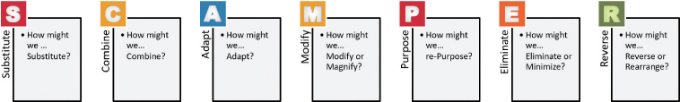
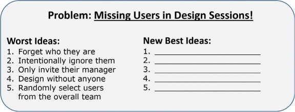
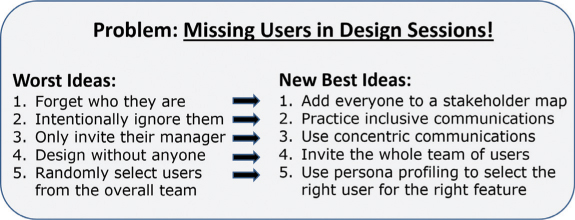
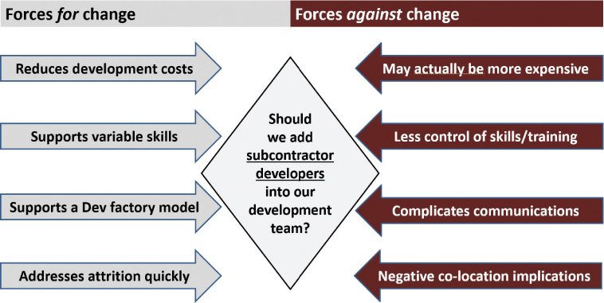
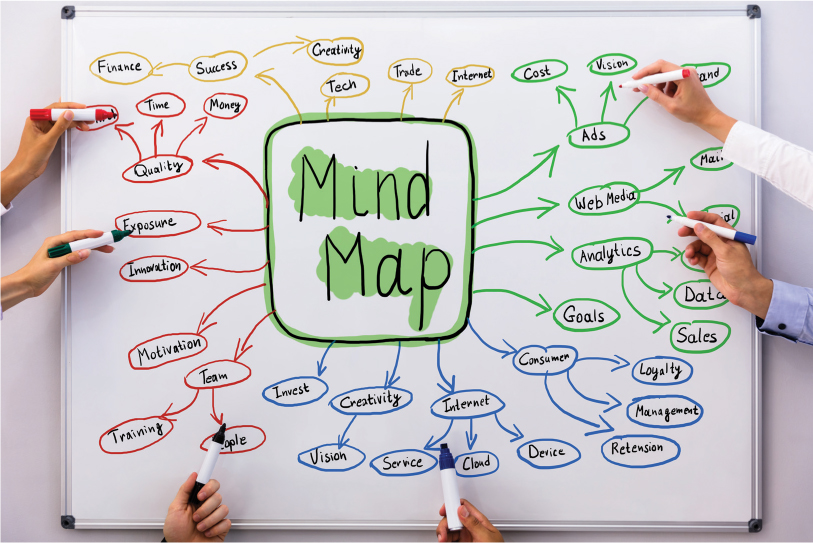

# 解决问题的思考

你将在这一小时学到什么：

- 从想法到潜在的解决方案
- 解决问题的视觉练习
- 不该做的事：在头脑风暴时吝啬
- 总结和案例研究

在过去的几个小时里，我们介绍了 20 多种设计思维技巧和练习，有助于以不同的方式思考。 需要明确的是，本小时涵盖的八种技巧和练习也将帮助我们思考和构思。 但是，随着我们的创意漏斗充满创意，我们可以从发散性思维转变为更趋同的思维——也就是说，着眼于缩小和提炼并可能解决我们面前的问题。 当我们跳过头脑风暴时，第 14 小时以"不该做什么"的故事和启示作为结尾。

## 从想法到潜在的解决方案

这一小时的技巧和练习将帮助我们弥合从发散思维到解决问题和探索潜在解决方案的差距。 在接下来的几个小时里，我们会将这些潜在的解决方案细化为部分或完整的解决方案。 首先，让我们看一下解决问题的前五种方法。

### 行动中的设计思维："我们怎么可能？" 解决问题

正如第 4 小时中简要强调的那样，"我们应该怎样做？" 多年来，用于解决问题的工具一直被用来为构思和解决问题创造一个安全的场所。 这种技术反映了一种乐观的态度，有助于将人员和团队聚集在一起构思和解决问题。

- 如何。 这个开场白打开了解决问题的大门，表明解决方案确实是可能的。
- 可能。 这个简单的词告诉团队，任何想法都值得考虑。 它打开了探索之门，而不是强迫人们只考虑能够解决问题的想法。
- 我们。 这最后一句话为合作奠定了基础。 它说这个解决问题的练习不是单方面的，而是要作为一个团队一起完成。
-  ?。 通过将这种设计思维技术格式化为疑问句，我们让人们知道问题尚未得到解答。 这种方法鼓励人们创造性地思考，探索情况，并考虑否则可能不会考虑的事情。

"我们怎么可能？" 是乐观包容的思想。 它反映了设计思维的真正精神。 正如我们在第 4 小时分享的那样，"我们可以怎样做？" 非常适合收集观点、推动构思、解决问题并最终取得进展。

### 行动中的设计思维：头脑风暴
```Alex Osborn``` 通常被认为是不同思维方式、探索问题和解决问题之父，他在 1953 年推广了头脑风暴法（```Besant```，2016 年）。 头脑风暴是一种有趣的构思方法，因为它会导致发散思维和聚合思维。 因此，我们本可以更早地将它包含在第 10 或 11 课时，但作为一种融合和解决问题的方法，将它保留在这一课时也是有意义的。

我们都曾经集思广益。 从表面上看，这似乎是一种深入思考问题或情况的简单方法。 但是 ```Brainstorming``` 要做好并不容易。 ```IDEO``` (2022) 分享了进行有效头脑风暴练习的分步过程，此处反映了其核心以及通过参与者准备来增强和改进会议的方法、不同方式和深入思考的护栏等。 请注意，我们应该在已完成的工作的基础上确定正确的问题（第 9 小时），这样我们才能确定我们不会聚在一起解决错误的问题。

要运行有效的头脑风暴会议，请执行以下步骤：

时间和人员：头脑风暴练习需要 5-10 人进行 15-120 分钟，具体取决于问题的复杂程度或正在探索的领域。 我们可以选择按顺序运行多个头脑风暴会议。

1. 将多元化的团队召集在一起进行头脑风暴，使用第 4 小时中概述的"设计多样性"原则来最大限度地提高团队在思考和构思方面的多样性。 思想、经验、教育、文化、在组织的时间、角色类型、利益相关者代表方面的观点等的多样性对于促进良好的头脑风暴会议都很重要。
2. 在开会之前，分享问题陈述和要集思广益的情况。 该团队可能会更早地参与问题识别练习，例如问题树分析或问题框架（所有这些都在第 9 小时中介绍）； 确保团队有这样的背景。
3. 提前与团队分享最新研究或我们组织的最新经验揭示的有关此问题或情况的内容可能会很有用。
4. 或者，考虑不及早分享问题或情况。 传统的头脑风暴法受益于提前通知，但过多的提前通知会造成人们"带着答案"走进来的情况。
5. 开会时，向团队大声声明好奇心是目标； 没有想法太疯狂，没有什么是不可能的。
6. 在开始实际的头脑风暴练习之前，考虑进行创造性的热身活动来让人们思考（转到第 10 小时了解热身想法，包括分类法、发散思维技巧和技巧等）。
7. 使用"我们怎样才能？"开始实际的头脑风暴练习。 技术。 例如，我们可能会以"我们如何以提高代码质量的方式改进我们的软件开发工厂？"开始会议。
8. 当我们促进头脑风暴练习时，请考虑以下事项：
   1. 如果团队似乎已经有了先入为主的想法和解决方案，请考虑通过蛇形排水或牺牲小腿练习来清理或疏通思想。
   2. 过渡到单独的头脑风暴，每个人单独考虑想法和潜在的解决方案。 要求每个参与者使用便利贴记录他们的想法会很有用。
   3. 可能有必要经常提醒团队，在头脑风暴时没有坏主意。
   4. 在单独头脑风暴 10 分钟或另一个商定的时间段后，创建多个不同的小组来考虑他们的个人想法。 集体构思可以提升单独头脑风暴的结果。
   5. 确保各小组分享他们的想法并在小组内建立彼此的想法，注意确保所有的声音都被听到和考虑。

9. 使用便利贴，记录和分享小组头脑风暴会议中产生的想法。 考虑将个人头脑风暴的结果也添加到这个便签集合中（例如，在虚拟或物理白板上获取所有想法）。
10. 使用 ```Affinity Clustering```（在第 13 小时中概述）整合想法，以创建类似想法的集群或组。
11. 讨论这些想法，将它们进一步组织成潜在的解决方案、部分解决方案以及可能需要进一步探索的其他组。
12. 根据需要安排和运行后续头脑风暴会议，收集反馈，同时通过虚拟团队和社区头脑风暴整合新想法。

我们可以使用许多其他技术来使我们花在头脑风暴上的时间更有成效。 例如：

- 我们可能希望使用关键字作为观察问题或情况的镜头。 例如，如果我们正在与我们的团队一起考虑代码质量情况，我们可能会说，"让我们从速度的角度来考虑这种情况。" 添加关键字会增加一些复杂性，但就像我们在第 11 小时介绍的思维护栏一样，关键字也可以帮助人们以不同的方式思考并更深入地思考。
- 我们可能希望将此会议作为初始学习会议并说，"让我们根据我们首先需要学习或了解的内容来思考这个问题或情况，然后我们更深入地思考它并共同决定如何处理它。 "
- 当团队陷入思考的死胡同时，我们需要准备额外的小型练习。 例如，第 11 小时中涵盖的众多思考护栏之一可以帮助我们重新调整或重新启动头脑风暴会议。
- 我们还应该建立一个小型练习，让我们通过"相反思维"的视角来看待问题或情况（甚至可能的解决方案）。 本小时晚些时候将介绍这些练习的两种类型，最差和最佳以及逆向头脑风暴。
- ```Mission Impossible```、```Visual```、```Fractal```、```Good Enough``` 以及过去几个小时中讨论的其他不同思考形式，包括接下来介绍的 ```SCAMPER```，可以为我们的头脑风暴会议增加一个深思熟虑的维度，并帮助重振已经停滞或偏离的会议 轨道。

请记住，完美或完整的解决方案在头脑风暴期间不太可能出现，坦率地说，它们也不是目标。 任何产生潜在解决方案的想法通常都是我们在短期内能做的最好的。 但正是这些新想法和潜在解决方案为我们提供了起点。 结合起来，这些头脑风暴的结果为我们在接下来的一个小时内进行原型设计和解决方案奠定了基础。

### 行动中的设计思维：```SCAMPER``` 更好的头脑风暴

```SCAMPER``` 是另一个已经存在多年的练习，它在帮助解决难题方面的作用常常被低估。 ```Bob Eberle``` (2008) 创建了 ```SCAMPER```，作为在头脑风暴会议期间激发更大创造力的一种方式。 这种方法为参与者提供了一种逐步改进我们集思广益方式的方法。

```SCAMPER``` 是以下七种活动的首字母缩写词：(S) 替代，(C) 结合，(A) 适应，(M) 修改（或有时放大），(P) 目的或投入另一种用途，(E) 消除或 最小化，和 (R) 反转或重新排列。 如图 14.1 所示，每个关键字代表我们在头脑风暴会议中可以提出的一个问题。 在运行实际的头脑风暴会议之前，我们也可以使用 ```SCAMPER``` 作为一种轻松的特定问题的先驱技术。



图 14.1
使用 ```SCAMPER``` 作为一种有用的分类法，以一种规定但经过时间验证的方式进行头脑风暴。
要运行 ```SCAMPER``` 练习，请使用问题形式的关键字引导团队完成以下七个活动。 按照"我们可以怎样？"来表述每个问题。 创造一个乐观和创造性的构思练习。

在下面的示例中，我们将介绍本小时之前概述的代码质量问题：

- 代替。 我们如何将代码开发服务或解决方案的一部分或方面替换为另一部分或方面？ 考虑我们如何在不影响整个开发生命周期的情况下替换流程的一部分，或者注入更智能的替代方案，或者简化流程。 例如，也许我们可以将代码审查流程外包，或者用合作伙伴开发团队替换一个开发团队。
- 结合。 我们如何将代码开发过程的各个部分组合或合并在一起？ 我们是否应该与其他组织合作以获得更高质量的结果？ 也许我们可以结合手动和自动测试来创建更好的代码，或者将我们的开发团队与我们的业务分析师结合起来，以在开发一段代码之前推动更好的功能理解。
- 适应。 我们如何调整流程或流程的组成部分以产生更好的结果？ 我们应该改变或调整什么以提高可预测性或流程透明度？ 例如，也许我们可以改进 ```DevOps``` 流程，为我们提供代码开发流程的实时窗口。
- 调整。 我们如何修改代码开发流程以推动更大的吞吐量、更高的质量和更高的透明度？ 如果我们的团队规模扩大一倍或我们代码的市场规模扩大一倍，是否有机会创新或提高我们的代码质量？
- 目的（或用于其他用途）。 我们如何在我们组织的其他部分或与我们的合作伙伴和客户一起使用我们的代码开发过程？ 我们应该追求共同创新（见以下注释）还是共同发展战略？ 也许我们可以借鉴我们业务其他部分使用的质量和合规流程，并将它们应用到我们的代码开发工厂。
- 消除或最小化。 我们可以完全消除代码开发过程的哪些方面？ 我们是否在运行冗余进程？ 如果我们失去了一半的团队或一半的市场怎么办？ 例如，我们可能会用自动化测试代替大部分手动代码测试。
- 重新排列或反转。 我们如何重新安排当前流程中的步骤以产生更好的结果？ 我们是否应该左移或将部分测试移至开发周期的早期阶段？ 如果我们从最终结果回溯到团队收到开发一组代码的请求，是否有机会做一些更聪明的事情？ 例如，我们的开发人员是否应该在看到功能规范之前更多地参与开发前的需求收集？

> 笔记
> 共同创新
> 更快地交付商业价值的一种方法是通过共同创新。 我们的想法是与我们的合作伙伴、用户、团队成员或其他人实时并肩开发解决方案和可交付成果，而不是在迭代定义、构思、原型制作、演示和测试、再次构思、最终构建之间来回切换 解决方案或可交付成果，等等。 共同创新打破了人与组织之间的壁垒和缝隙，说明了联合设计可以更快地推动商业价值的另一个例子（盖伊，2016 年）。

```SCAMPER``` 为团队提供了几个好处：

- 它自然地帮助我们找到正在探索的情况的问题陈述中的差距和漏洞。
- 它是我们可以在头脑风暴过程中使用的另一种有用的分类法（如第 10 小时中所述），尤其是在团队停滞不前或无法以足够不同的方式思考时。
- 它为我们提供了另一种改进头脑风暴过程及其结果的有效方法。

在结束头脑风暴会议之前，如果不进行简短的 ```SCAMPER``` 迷你练习，我们甚至可能会认为我们的头脑风暴是不完整的。 同样，我们应该以同样的方式考虑接下来的两个设计思维练习，作为头脑风暴的自然延伸。 接下来的这两种方法都以 ```SCAMPER``` 中的"R"为基础，通过"逆向"来帮助我们更深入地思考一种情况。

### 行动中的设计思维：最差和最好的创意

最坏和最好的逆向思维练习非常有效且非常简单。 该方法是几种相反的思维练习之一。 不过，它比其他的更轻松，旨在推动与彼此不熟悉的群体和人们进行初步讨论，这些人可能不愿意以"不同的方式"思考。

```Worst and Best``` 取自 ```Interaction-Design.org``` (2022) 共享的最糟糕的想法方法。 不是让人们当场提出一个又一个绝妙的主意，而是给每个参与者一个情况或问题，并简单地要求分享什么会使这种情况或问题变得更糟。 就是这样！ 如图 14.2 所示，我们只需要每个参与者提出一个"最坏的想法"。



图 14.2
对于简单的逆向思维，与团队一起进行最坏和最好的练习，并从"最坏的想法"开始，如此处所示。
指导参与者避免过度思考这个练习。 这应该很容易：分享脑海中出现的最糟糕的想法，并享受倾听他人可怕想法的乐趣。 愚蠢和疯狂的想法是金子，因为它们有助于让参与者在规范之外更自在地思考，这将在本练习的后面产生更有趣和更好的想法。

我们可能会在视觉上将这些最糟糕的想法组织成一系列糟糕到非常糟糕的想法。 或者，我们也可以创建一个简单的 2×2 矩阵，就像我们上一小时介绍的那样，并将这些最糟糕的想法放在四个象限之一中。 考虑诸如实施难易程度与成本、可行性与实用性、重要性与难度等维度（请记住，在"最差"的练习中，最差的象限可能会溢出，而其他象限则相当空虚）。

一旦我们让每个人都分享了他们最糟糕的想法并将它们放在连续统或 2×2 矩阵中，我们就可以准备好进行本练习中真正有用的部分了。 就像我们在反向头脑风暴中所做的那样，将每个最坏的想法"翻转"成一个"最好的"想法，记录这些最好的想法，并用这些最好的想法填充 2×2 网格，如图 14.3 所示。 如果我们发现一个"最差"的想法产生了两个或三个最好的想法，那就更好了。



图 14.3
对于简单的逆向思维，现在将每个最坏的想法相反地翻转成最好的想法。
随着团队逆向思考的顺利进行，我们可能希望重复接下来介绍的逆向头脑风暴练习。

### 行动中的设计思维：逆向头脑风暴

正如我们在前几个小时提到并在第 12 小时详细介绍的那样，反向头脑风暴或逆向头脑风暴为我们提供了另一种创造性的方式来进行头脑风暴和不同的思考。 此方法由 ```D. Straker``` 在 2012 年概述，并由其他人更早地概念化。 逆向头脑风暴帮助我们发现新想法，识别新风险和利益相关者，找到新的解决方案和挑战，并将问题转化为潜在的解决方案。

当我们的头脑风暴会议似乎还不够时，可以考虑在这些会议之后附加反向头脑风暴练习。 与最差和最佳一样，这个练习通过以新的方式构思和连接问题到潜在解决方案的点来帮助我们解决问题。 它填满了我们的创意漏斗，不仅给了我们更多的想法，也给了我们更多潜在的解决方案。

正如我们已经看到的，逆向头脑风暴的前提很简单：什么会使事情变得更糟而不是更好？ 考虑什么会使我们的问题或情况变得更糟。 我们甚至可能会问自己，什么可能会使我们的潜在解决方案变得更糟。 然后翻转我们的答案，找出可能真正让事情变得更好的新想法列表。

前面提到过，这种方法有时称为反向思维。 这很容易做到，因为正如我们在第 12 小时分享的那样，很容易列出一长串可能出错或使问题或情况变得更糟的事情。 为什么？ 因为许多人天生就会深入思考事情如何变得更糟而不是变得更好。 这就是反向头脑风暴的美妙之处。 就像我们的最坏和最好的练习一样，很容易想到一种情况下的坏处和最坏处。

当然，这个练习的价值不在于发现那些糟糕的想法。 在思考什么会使问题或情况变得更糟之后，我们需要翻转这些答案，重新思考如何让事情变得更好。 循环执行这个发现坏想法并将其转化为好想法和潜在解决方案的过程，直到我们拥有几个潜在解决方案的基础。 并考虑接下来的视觉练习，使我们的问题解决更加清晰。

## 解决问题的视觉练习
虽然前面的五种技巧和练习是解决问题的好工具，但没有什么比视觉练习更能帮助我们概念化并从字面上"看到"部分解决方案或值得进一步探索的领域。

### 行动中的设计思维：构建考虑和融合

正如我们在前几个小时概述的那样，在纸上或白板上创建模型或构建模型或原型可以帮助我们以新的方式思考。 当我们将想法和潜在的解决方案从脑海中转移到我们和其他人可以考虑这些想法和潜在解决方案的开放空间时，用我们的双手还可以帮助我们汇聚一个或几个最好的想法。

这个想法？ 构建考虑和收敛很容易：绘制、概述、构建、组织、考虑和讨论，以任何顺序并在需要时递归进行。 这些步骤使我们能够从发散思维转变为趋同解决方案，并可能在我们围绕潜在解决方案明确解决问题时来回移动。 当这种自由形式的收敛构思和部分解决方案不充分时，请考虑其他两种用于解决问题的可视化技术：力场分析和思维导图，接下来将介绍。

### 行动中的设计思维：用于可视化的力场分析

有时，直观地列出变革的力量和反对变革的力量可以帮助我们以不同的方式看待问题。 库尔特·勒温 (```Kurt Lewin```) 于 1951 年创建，作为社会科学的工具，力场分析 (```Force Field Analysis```, 简称 ```FFA```) 帮助我们想象一种情况以及支持和反对改变这种情况的压力。

围绕不确定性或优先事项的原因可以通过 ```FFA``` 来揭示。 力场分析可以帮助我们了解围绕提议的变更、推动和撤离的作用力。 由于这种分析是可视化的，如图 14.4 所示，与仅使用文字相比，更容易与他人达成共识。



图 14.4
可视化拟议变革的力量和反对拟议变革的力量可以帮助我们更深入地思考变革。
力场分析不仅仅是一个优点/缺点列表。 这个想法是我们正在组织一种关于变革力量和反对变革力量（或维持现状）的观点。 力量可以是金融的、政治的、社会的、战略的等等。 我们也可以从"为什么应该发生变化"和"为什么应该避免变化"的角度来考虑这个练习。 如果我们发现团队难以深入思考，请使用流行的分类法，例如在期货轮中使用的 ```SCAMPER```、```AEIOU```、```STEEP``` 中使用的分类法，或者在船与锚练习中使用的风险分类法。

将我们通过研究、倾听他人的意见、他人的经验以及我们自己的观察收集到的包括数据、逐字记录和信息在内的材料汇集在一起，创建这份变革力量和反对变革力量的清单。 依靠我们之前几个小时涵盖的技术和练习，将它们的输出用作本练习的输入。

为了显示支持和反对拟议变更的力量的相对强度或优先级，我们可以对力量进行不同的大小、编号或颜色编码。 如果要考虑的力量很多，我们甚至可以使用亲和力聚类或之前在第 13 小时中概述的其他优先排序练习，对最强大的积极力量和消极力量进行排名或排序。

### 行动中的设计思维：思维导图
思维导图是跨企业和其他地方使用的另一种常用技术，用于集思广益、思考、推动清晰度并最终形成对问题或想法的共同理解。 由托尼·布赞 (```Tony Buzan```) (2017) 在 1970 年代创建，从思维导图练习中得到的思维导图为我们提供了一个视觉表示，因为我们探索并更好地理解问题或想法。

思维导图的功能是将一个中心问题、想法或解决方案链接到另一层想法或维度、依赖关系、人员等，然后将第三组想法或维度链接到前一层，依此类推。 当我们从中心思想或核心问题出发时，思维导图创建思维导图的过程使我们对中心问题或思想的理解越来越好。 这个过程不仅为我们详细地外化了"土地布局"，而且还帮助我们思考和解决问题，如果我们的思维仍然内化在我们的头脑中，我们将永远无法做到这一点。

例如，如果我们在管理团队时间方面遇到问题，我们可能会创建一个时间管理思维导图来得出一组想法，其中一个想法可能包括委派（如图 14.5 所示）。 当我们进一步充实这个授权想法时，我们可能会考虑我们实际上可以授权什么、授权给谁以及授权给谁。 这些领域反过来可能会促使我们探索与我们的团队被要求处理的项目相关的 50 项任务。 这组任务可以进一步推动我们思考哪些确实可以交给其他人，哪些应该保留在团队中，等等。 最后，当我们考虑可以委托给谁的任务时，我们可能会考虑如何分配这些任务，是否需要花钱请人来完成这些任务，我们将如何管理这些任务的完成等等。



图 14.5
创建一个简单的思维导图可以为我们提供非视觉难以实现的解决问题的见解。 (```andreypopov/123RF```)

## 不该做的事：在头脑风暴时吝啬

当一家小型国防承包商遇到问题时，创新团队会一如既往地做：口头上支持头脑风暴，然后走上一条只在表面上有意义的不成熟的道路。 国防承包商的失误清单以一种令人失望的方式令人印象深刻。 他们几乎没有提前向参与者发出会议警告，尽管安排了一个小时，但实际上对问题的思考时间不超过 15 分钟，没有考虑参与者的思想或经验的多样性，没有使用 ```SCAMPER``` 或其他分类法进行深入和不同的头脑风暴，没有考虑预热或护栏以促进事先或会议期间的思考，并且没有以任何相反或反向头脑风暴结束他们的头脑风暴会议。 团队只是出现了，讨论了问题，得出了几个粗略的结论，然后选择了前进的道路。 如今，也难怪组织和人散去四风了。 国防承包商现在只是一个记忆，一个历史页面上的注脚。

## 概括

这一小时结束了一系列的五个小时，这些小时致力于以不同的方式思考、推动创造力、应对风险、减少不确定性和歧义、通过不确定性来确定下一步的最佳步骤以及解决问题。 第 14 小时特别介绍了七种技巧和练习，可帮助我们从问题陈述转变为想法和潜在解决方案。 我们介绍了"我们可以怎样？" 详细提问和经典头脑风暴，```SCAMPER``` 知情头脑风暴，最坏和最好的头脑风暴和反向思维的逆向头脑风暴，建立考虑和融合，然后力场分析和思维导图用于视觉问题解决。 我们以"什么不该做"来结束这一小时，重点关注覆盖面很广、执行不力的头脑风暴的真实结果。

##  练习册

### 案例分析

考虑以下案例研究和问题。 你可以在附录 A"案例研究测验答案"中找到与此案例研究相关的问题的答案。

### 情况

```BigBank``` 的执行委员会 (```EC```) 多年来一直认为自己在考虑和解决问题方面是有效的。 不过，委员会了解了你对头脑风暴的详细方法，并询问你是否愿意回答有关如何开展更有效的头脑风暴会议的问题。 为了帮助促进 ```EC``` 的要求，```Satish``` 安排了一个问答环节，让你回答委员会的问题。

### 测验

1. 你建议执行委员会如何选择和准备头脑风暴的参与者？

2. 每个头脑风暴会议应该如何开始？

3. 当头脑风暴会议似乎停滞不前或脱轨时，你建议执行委员会如何重振团队的专注或思考能力？

4. ```SCAMPER``` 是什么意思，它有什么用？

5. 执行委员会应如何以一种有助于确保每一块石头都被翻过和考虑的方式结束其头脑风暴会议？