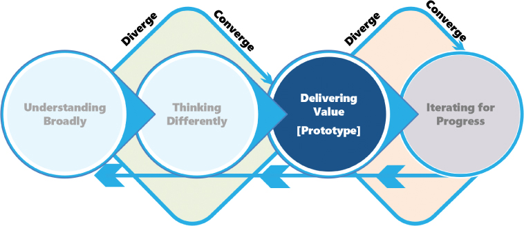
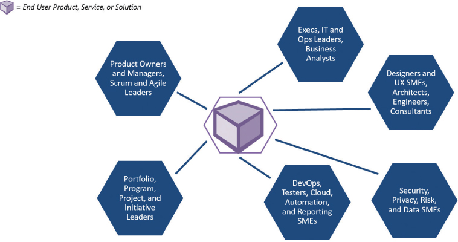
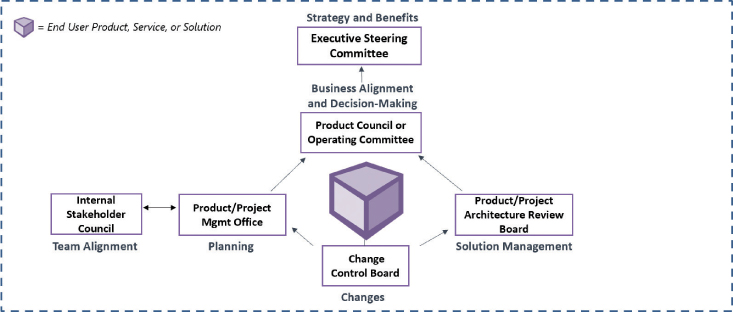
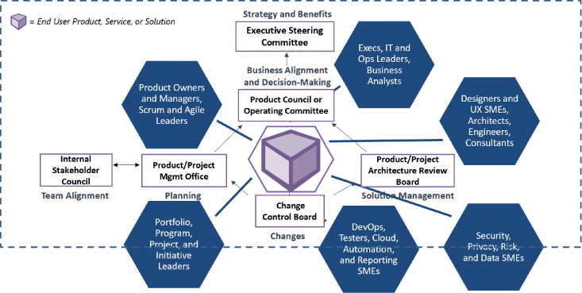
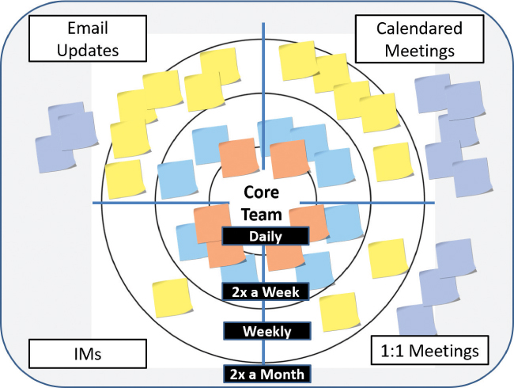
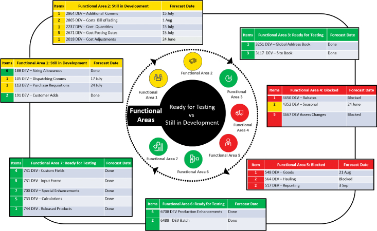

# 交叉团队和沟通的结果

你将在这一小时学到什么：

- 跨界协作
- 跨团队工作的技巧
- 通信挑战的技术
- 不该做什么：需要图片时使用文字
- 总结和案例研究

第 15 小时从第 IV 部分"交付价值"开始，我们将重点关注技术设计思维模型的第 3 阶段（见图 15.1）。 第 3 阶段让我们踏上探索如何通过使用帮助我们学会快速创建初始解决方案的原型制作方法来尽早交付价值的旅程。 之后，我们将介绍通过原型设计和小规模解决方案快速启动的技术，稍后我们将介绍如何更快地交付价值。 然而，在第 15 小时，我们需要通过更有效的协作、交叉团队和沟通技巧，进一步巩固我们在其他团队内部和跨团队工作的能力。 在这种情况下，我们涵盖了四种跨团队工作的设计思维技术，以及另外三种应对沟通挑战的技术。 "什么不该做"专注于在迫切需要图片时只使用文字，这一小时结束。



图 15.1
我们的技术设计思维模型的第 3 阶段。

## 跨界协作

很少有值得或持久的事情可以单独成功完成，尤其是在复杂的技术计划和业务转型的世界中。 此类工作需要跨界合作，或简单的跨团队合作，以实现一系列难以实现的承诺利益和其他有价值的成果。 如果没有有效的交叉团队，项目团队、产品开发团队、工作场所计划等很少能取得成功。

但是，是什么造就了一个有效的项目或产品团队？ 我们如何以一种促进协作而不扼杀创新和扼杀进步的方式有效地将多个团队相互联系起来？ 我们如何在整个项目或计划中创造一种健康的工作氛围，让人们在完成工作的同时，在各自的团队内部和团队之间互相发挥最大的潜能？

正如我们将在以下几页中介绍的那样，有效的交叉团队需要有才华的人，他们不仅有能力完成工作，而且乐于以下列方式开展工作：

- 通过拥抱承认学习需要尝试和做的成长心态，偶尔会在取得成就的过程中失败
- 通过实践强烈的主动性和持久的动力，即使事情不可避免地变得艰难
- 通过行使情境意识领导和同样熟练和一致的追随者
- 通过练习和改进一套包容性沟通和冲突管理技能
- 通过锻炼自我意识和自我管理
- 通过相互尊重的交流分享大胆的观点
- 通过定期吸收不太直言不讳的团队成员的观点
- 通过展示与任何人和每个人一起工作的能力，同时帮助彼此学习和成长

回顾他们的表现并应用反馈来改进他们的流程的团队是有效的团队。 这种团队进化的"反思"模式毫不奇怪地模拟了设计思维的反馈循环、深思熟虑的迭代和持续改进的最佳原则。

最后，正如我们在第 6 小时和文化立方体的维度中探讨的那样，有效的交叉团队需要必要的时间、关心和注意力来创建和维持支持性文化。 这种文化反映并促进了健康的环境、工作氛围和多样化的工作方式。 现在让我们将注意力转向建立或加速这种交叉团队文化的几种技术。

## 跨团队工作的技巧
虽然有数百种技术可以在不同的人群和团队中很好地工作，但有四种设计思维技术可以帮助我们在我们的团队和支持我们工作的其他团队之间创造一种团队合作和有效沟通的文化。 这些交叉团队技术包括

- 为协作构建治理
- 同心通讯
- 包容性沟通
- 创建共享身份

接下来让我们来看看这些设计思维技术中的每一种。

### 行动中的设计思维：构建协作治理

在我们自己的团队中工作有其挑战，但从某种意义上说很简单，因为我们倾向于有一组特定的任务要完成，并且有我们自己的团队会议和合作节奏。 简单的！

但是，当我们的团队被要求解决一个棘手的问题或为另一个组织开发产品或解决方案时，并且我们需要在此过程中与其他组织合作，我们的联系和沟通就会呈指数级增长。 当我们将更多的团队添加到组合中时——我们绝对依赖于帮助我们所有人在解决该问题或解决方案方面取得进展的团队——我们需要考虑这些团队之间的联系以及如何培养和管理这些联系。 如图 15.2 所示，考虑我们可能需要为传统产品开发计划导航的团队和联系的数量。



图 15.2
典型的倡议或项目交叉团队环境。
在这些情况下，我们需要在我们广泛的团队集合之上覆盖一个治理结构。 什么是治理？ 简单地说，治理就是监督。 这是管理或监督一项努力的工作，以帮助确保该努力交付一组预期结果。 努力可能是一个项目，也可能是一个更简单的倡议或更广泛的计划。

在项目或计划的背景下，这种治理结构在本质上始终是虚拟的，由将扮演特定角色并扮演特定角色的人组成，支持跨团队合作创造价值的组织集合。 从这个意义上说，虽然治理本身不被视为一种设计思维技术，但为协作构建治理框架以框架或矩阵的形式创建了虚拟结构，并指定了完成复杂工作所需的组织机构。

为协作构建治理框架通过围绕多个虚拟治理机构（委员会、理事会和董事会）组织人员来推动清晰度，每个机构都有章程和特定职责集。 良好的治理框架或矩阵使层次结构可见，同时建立清晰的沟通和升级渠道（```Furino```，2016 年）。 对于大多数技术项目和计划，这些虚拟治理机构包括

- 一个执行级别的指导委员会，其中包括一个做出关键决策的团队，他们作为问题升级的最终点，并跟踪从启动到实现的计划收益，包括这些收益的质量和时间。
- 产品委员会或工作级运营指导委员会，定期开会审查进展并制定战略和战术决策以实现一系列计划收益。
- 架构审查委员会，实例化以管理战略技术决策和方向，确保今天做出的决策是可支持的并与明天的未来保持一致。
- 变更控制委员会，负责管理项目或计划范围变更，包括战略、用户影响、财务影响以及与特定解决方案代表组织的整体解决方案和技术足迹的"差距"相关的其他事项。
- 传统的项目管理办公室 (```PMO```) 或敏捷产品 (```SCRUM```) 管理办公室，拥有包括项目标准、财务、资源、进度、报告等在内的高级计划。
- 代表负责建立和维护整体治理框架的虚拟团队的内部利益相关者委员会。

我们可能会决定我们需要启动其他治理机构，或者反过来将其中一个或多个合并在一起。 无论如何，这些虚拟委员会、理事会和董事会的成员来自不同的团队，并在我们的实体组织之上创建了自己的框架或矩阵。 通过这种方式，为协作构建治理框架使治理变得可见和可视化，如图 15.3 所示。



图 15.3
请注意构建治理的过程如何吸引底层物理组织的人员来创建支持项目或计划所需的虚拟框架或委员会、理事会和董事会矩阵。

图 15.4 说明了将我们的虚拟治理框架覆盖在我们的物理组织结构之上的样子。



图 15.4
虚拟治理框架位于我们的物理组织结构之上。 它们共同提供了对涉及我们项目或计划的利益相关者的可见性。

### 行动中的设计思维：同心沟通

同心沟通是一种技术，可以让所有合适的人在合适的时间使用合适的沟通渠道了解合适的信息——谁、什么时候、什么以及如何。 这个想法是将一个团队、项目及其具有相关目标的利益相关者组可视化地组织成一组放置在网格顶部的同心圆或环（我们可以为此目的重用 Bullseye 优先级排序模板）。 每个圆圈或环代表通信的优先级和节奏，网格本身反映了每个利益相关者、治理机构或其他组使用的最多四个通信渠道。

- 确定四个主要通信渠道并将它们映射到网格的四个象限。 常见渠道包括电子邮件、小组会议、一对一会议 (```1:1```) 和即时消息 (```IM```)。 添加其他内容，例如时事通讯、门户更新、网站更新、博客帖子等（并将四个网格转换为六个或八个部分，就像我们在第 13 小时中使用"可能的未来"轮所做的那样）。
- 内圈，或第一环，是"项目领导团队"，或者必须始终了解并控制项目或计划的核心人员团队。 这个圈子应该包括由项目经理或产品经理或SCRUM大师、企业架构师、首席解决方案架构师、首席业务分析师或职能领导、开发领导和测试领导组成的日常领导团队。 核心团队需要有关项目或计划的实时信息。 这群领导者应该每天多次通过会议、电子邮件或 IM 更新等方式获取和共享实时更新。
- 围绕核心团队创建第二个圈子或圆环。 这是圈子或环#2，由更广泛的团队组成，他们需要了解一些但不是核心团队已知和共享的全部信息。 或者，他们可能需要知道核心团队知道的一切，但不需要经常被告知（例如，理想的节奏可能是每隔几天或每周一次，而不是每天一次）。 将特定的人和治理机构绑定到这个环上。 使用象限按通信渠道进行组织，包括传统的电子邮件状态报告、定期日历每周电话等。
- 用第三个圆圈围绕更广泛的团队，并将这个圆圈或环标记为#3。 在这个圈子中，有更广泛的人群，他们可能经常需要了解所有细节而无需了解基本知识。 或者，他们可能需要知道一切，但可以等待几周或一个月或更长时间。 将特定的人和治理机构也绑定到这个环上。
- 第四个圈或环可能包括我们的执行发起人和其他执行利益相关者，他们在正常情况下需要每两周更新一次； 在网格的适当象限中按渠道组织这些通信。
- 根据需要构建尽可能多的同心圆，以构成由利益相关者、治理机构、用户社区、专业贡献者、合作伙伴、服务提供商、友好的追随者等组成的整个生态系统。 请参见图 15.5，了解同心沟通视觉效果的示例。



图 15.5
同心通讯不仅帮助我们形象化我们的利益相关者，还帮助我们形象化与每个利益相关者相关的沟通节奏和渠道。
从图中我们可以看出，同心通讯的价值有三方面：

- 它为我们提供了另一种组织利益相关者的方式，在这种情况下，围绕他们的沟通需求（"什么"）和沟通节奏（"何时"）。
- 它帮助我们识别缺失的利益相关者（"谁"）和沟通不足或沟通差距。
- 它帮助我们了解和调整沟通的时间和渠道（"方式"），因为它们从核心团队散布到与项目或计划相关的人员的外部范围。

使用强制功能（在第 16 小时中介绍）以确保与利益相关者的每个同心圆确实及时共享通信。 基本的小团队和项目沟通，以及利益相关者参与和期望管理，通过良好的同心沟通实践得到改善。

也要努力保持一致的沟通。 每个同心圆中的人和群体需要能够依赖通信的频率和准确性。 如果战略和后续信息及方向发生变化，请务必在正确的时间与正确的受众分享更新后的"原因"和"时间"。

### 行动中的设计思维：包容性沟通
在我们完好无损的治理框架和建立的同心沟通渠道的情况下，下一个重点领域是让每个人都有发言权。 包容性沟通是健康的交叉团队的基础，因为它有助于确保我们包容并倾听我们整个团队的意见，相信每个人都有值得表达和考虑的想法和想法。 包容性沟通始于选择团结和包容的词语。 使用我们而不是我或我的。 这样做会产生一种团队合作甚至家庭的感觉。

请注意包容性沟通如何直接关注"如何"。 同心沟通涵盖了沟通的对象、时间和内容，但包容性沟通指导我们如何沟通。 有意识地考虑包容性有助于我们避免误解的孤岛和无知的鸿沟，这两者都会带来挫败感和困惑，通常只会把人们赶走，进一步排除了我们需要吸引的确切人群。

包容性沟通还涉及可访问性，因为它涉及所有人，而可访问性通常归结为我们选择的沟通渠道。 通过使用不同的人需要或喜欢的沟通渠道确保我们的信息得到很好的传达（想想高管沟通与开发团队沟通有何不同，以及千禧一代与婴儿潮一代的渠道有何根本不同）。 还要考虑如何以包容的方式与担任不同角色的人进行沟通。 在早上与一个不喜欢早起的人交流需要一种不同的方法，而不是在当天晚些时候分享同样的消息。 对于紧急消息，我们可能还需要以对时间敏感的方式进行交流（考虑时区、早起者、周末工作人员和午夜蜡烛燃烧器）。 我们的沟通方式和风格需要相应地有所不同。

考虑如何与不同能力的人进行包容性沟通。 色盲的人、有阅读障碍的人、有听力障碍的人和行动不便的人可能以彼此不同的方式进行最佳交流。 因此，我们必须了解我们的团队和同事，以避免在很大程度上可以避免的失误。 同样，包容与沟通渠道和信息本身一样重要。

我们如何使用语言和能力礼仪来实践包容性也是我们如何在同事和团队之间进行良好沟通的重要组成部分。 例如，想一想"以人为本的语言"是如何通过将人置于残疾之前来描述残疾人的。 以人为本描述的是一个人拥有什么，而不是一个人是谁。 与残障人士交流时，询问他们如何描述自己。 良好的以人为本的语言示例包括

- 一个失明的同事
- 我们的自闭症倡议领袖
- 我的产品经理是个聋子

请注意这与说"盲人"或"我们的自闭症领导者"或"我的聋人产品经理"有何不同。 从一个人希望如何接收通信而不是我们可能更喜欢如何发送它的角度来思考包容性通信。 最后，尝试调整这些指导原则以实现健康和包容的利益相关者和团队沟通：

- 我们领导者的个人可信度、准确性和对他人的尊重为团队其他成员和扩展项目或倡议的利益相关者如何相互信任和尊重设定了标准。
- 无论使用何种沟通渠道，我们的沟通都要及时准确，因为其他人需要能够依赖我们预计何时分享更新以及我们实际分享的内容。
- 恭敬地争论并倾听，就好像我们错了，就好像我们可能错过或误解了什么。
- 知道何时分享耗时的故事以及何时简明扼要。
- 考虑并共享各个团队成员需要的信息，而不是我们可能希望共享的信息。 当我们确定具有新通信或渠道需求的新利益相关者时，考虑一个特殊的同心通信圈。
- 在没有听到我们的原因和时间的情况下，不知情的人会用他们自己的想法、担忧和恐惧来填补沟通的空白。 尽量减少沟通空白。
- 充分了解我们的特定和不同的受众，以便在一次共享的信息过少和过多之间取得适当的平衡。 考虑时间节奏（在第 16 小时中介绍）以平衡频率和数量。
- 正确的人需要传达正确的信息； 例如，技术或架构问题需要由技术或架构专家而不是项目经理来交付。
- 了解何时需要面对面交流以及何时可以接受其他渠道，然后明智地选择这些渠道。
- 重复关键信息，对于紧急或关键的沟通，使用多个接收者实际收听的沟通渠道，以确保信息被接收。

需要看到领导者积极与利益相关者和团队沟通。 正是在这种沟通的可见性和努力中，有效的关系和健康的文化得到了加强。 值得重申的是，通过以表现出尊重的方式进行交流，我们将更自然地实践并为包容性交流设定标准。

### 行动中的设计思维：创建共享身份
增加和加强团队的共同身份是团队领导者可以承担的最重要的活动之一。 然而，超越单个团队并在多个团队之间创建共享身份更为重要。 这样做可以在考虑自己的团队集合和考虑集体目标和承诺的统一团队之间产生差异。

将创建共享身份视为寻找共同点、发展跨团队关系以及在人员和团队之间创建共同线索或主题的自然但加速的过程。

在第一次与来自另一个团队的同事会面或联系时，我们应该做介绍，解释我们的角色，使用破冰游戏（例如以下"趣闻"练习）来缓解紧张情绪。 一个简单的 Fun Facts 破冰船可能包括自定义以下问题。 我们还包括了领导者可能对每个问题提供的示例回答——人性化的回答，因此为真正的联系和学习奠定了基础：

- 我梦想的工作是什么？ 在巴黎、新加坡和巴哈马的家中轮流写作和咨询。
- 我最喜欢的球队是什么？ 无论我的孩子在哪支球队踢球。
- 我的第一辆车是什么？ 橙色福特都灵。
- 我最自豪的成就是什么？ 在海军陆战队全职现役期间完成我的 MBA 学位。
- 什么是我的遗愿清单的顶部？ 跳伞一次。 并活着。
- 我在听什么音乐或播客？ 奥利维亚·罗德里戈——和我的孩子们。 野蛮。
- 上周末我是怎么度过的？ 由于几乎整个周末都在下雨，我和我的家人坐在一起（再次）观看所有哈利波特电影，同时靠爆米花和送货上门为生。

我们需要做自己，变得脆弱，并与他人分享我们是谁！ 转向创建共享身份以了解更多关于彼此的信息。 例如，玩评级游戏，或在相互了解时完成"这就是我"练习（请查看两个"尝试自己"侧边栏以获取每个示例）。

当我们被介绍给新团队时，不要只做这些事情。 当我们加入新的团队成员时，也可以使用这种加速建立关系的方法。 除了面对面的茶歇、午餐和其他共享餐点之外，没有什么更好的方法可以加快我们相互联系和了解彼此的方式。

> 自己试试
>
> 评级游戏
>
> 一种加速相互了解的简单而有趣的方法是玩评级游戏。 这个游戏是一个简单的破冰游戏，大家一起玩。 让领导或其他协调人分享以下每个问题，一次一个，然后每个人，包括协调人，权衡"更好"或更喜欢的问题。 修改列表以适应我们的文化、地理等：
>
> - 狗还是猫？ 鸟呢？
> - 无聊还是忙碌？
> - 可口可乐还是百事可乐？
> - 怪物还是激浪？
> - 牛排还是鱼？ 或者沼泽鼠！
> - 喜剧还是动作片？
> - ```iPhone``` 还是安卓？ 黑莓有人吗？ :)
> - 冷还是热？
> - 在山区或海滩度假？
> - 波音还是空客？ 房车会更好吗？
> - 远足还是跑步？ 步行？
>
> 将其他问题添加到列表中，以根据我们的情况或玩评级游戏的团队对其进行个性化设置。 在我们在此过程中更多地了解彼此的同时，请注意保持尊重和包容并从中获得乐趣。

> 自己试试
>
> 这就是我
>
> 一个更好地了解彼此的好方法是在一系列的站立会议或其他定期会议中加入"这就是我"的维度。 避免一次用太多这些东西轰炸新团队或新团队成员！ 将这些维度中的 5 或 10 个编织到初始讨论中，然后在探索另外 5 或 10 个方面很有趣。最重要的是，保持这个非正式的、可选的和包容的！
>
> - 我们的名字（是的，每个人都需要听听我们怎么说我们的名字！）
> - 我们做过的最酷的工作
> - 最让我们开心或自豪的事情
> - 我们最感激的事情
> - 我们当前的愿望和目标
> - 我们儿时的梦想
> - 我们最喜欢的音乐、书籍、食物、电影（类型、乐队、歌曲等等）
> - 我们最喜欢的电视或流媒体连续剧（或我们正在考虑下一部）
> - 我们的行业经验和资质
> - 我们的出生月份以及为什么它很艰难（或者相反，为什么我们喜欢这个月）
> - 这个世界上可能是我们双胞胎的人——或者应该是！
> - 我们的工作地点或地理或时区
> - 我们认为分享的任何家庭或宠物信息会很有趣
> - 我们认为可以分享的任何爱好
> - 我们的大学专业或重点领域，包括我们可能首先追求的！
> - 我们上次度假，我们去哪里旅行，和谁一起去！
>
> 虽然这里的目的是以一种有趣和非正式的方式相互了解，但要注意不要以分裂或两极分化的方式追求或呼唤差异。 参加任何这些类型的练习或活动都应该完全是可选的，零压力分享任何让人不舒服的东西。 毕竟，当我们试图比平时更快地建立关系时，隐私和尊重仍然超越一切。

随着我们继续彼此合作，将会出现更多的机会来更深入地研究。 使用破冰船和其他类似的练习，不仅可以结识新朋友，还可以更好地了解我们现有的团队。 将它们用作了解更多关于他人并找到巩固和创建共享身份的新方法的方式。 例如：

- 将新问题添加到评分游戏或这就是我的练习中，并分享这一新材料，以新的方式相互联系。
- 寻找并创造分享经验的机会——团队聚餐、下班后活动、周末聚会、有计划的休息时间一起放松、早上与我们的扩展团队一起喝咖啡、与我们的核心团队定期共进午餐等等。
- 努力在新人和团队以及现有人员和团队之间建立共同的线索或联系。 这些线索和联系将有助于用相似点代替不同点，所有这些都有助于创建和维持共同的愿景，推动更牢固的关系和协作，并进一步塑造团队的工作和协作方式。

如果我们是团队中的新人，或者是跨团队计划或项目的新领导者，请考虑我们如何吸引其他人并以比有机可能更快的速度快速建立关系。 如何？ 通过分享关于我们自己的有趣事实，推动这就是我系列提问，或运行评级游戏或其他破冰船。

请记住，这些游戏和练习的目的不仅仅是互相学习。 我们真正追求的是我们的相似之处和独特之处，着眼于建立联系、增加我们的共同身份并发展我们的共同文化。

## 通信挑战的技术
在其中的许多时间里，我们都强调了创建健康团队的必要性，并通过为我们的团队提供一个安全的空间来构思、解决问题和一起工作来实现跨界或跨团队的协作和沟通。 然而，当我们遇到不可避免的沟通和协作挑战时，除了通常的技术之外，我们可能还需要另一套设计思维技术来帮助我们度过难关。 在接下来的几页中，让我们探讨三种这样的情况以及可能有用的沟通技巧：

- 黑匣子照明
- 讲故事加深理解
- 快速理解的结构化文本

接下来将介绍这些用于使通信可见或可消费的设计思维技术中的每一种。

### 行动中的设计思维：黑匣子照明

当事实或真相被隐藏时，就很容易延误进度和错过里程碑。 在不了解进度和里程碑失误背后的"原因"的情况下，无数人可能会开始介入以帮助理解根本原因，而其他人则在思考和分享他们毫无根据的意见。 同样，当我们面对一个未知进程或状态的"黑匣子"，我们对那个黑匣子内正在取得的进展失去信心时，我们需要照亮那个黑匣子，以免人们开始制造 提出自己的延误原因。 我们需要一种沟通方式，阐明支撑我们挑战的现实和进步机会。 结合其他几种技术，使用称为黑盒照明的伞式技术的配方可以提供必要的光线。

- 如果我们遇到与进度相关的问题，请验证我们在使用第 16 小时中介绍的时间盒和其他时间管理技术方面的表现如何，例如，将开发黑匣子转变为一系列包含输入、依赖项和 输出。
- 如果我们继续错过里程碑，请更深入地挖掘黑匣子，通过我们的 ```DevOps``` 工具发现、识别并定期沟通实时状态和需要完成任务 X、Y 和 Z 的特定人员，包括依赖关系 每个任务。 根据需要使用强制功能来推动可预测的进展。
- 如果我们发现自己无法按时完成一项完整的承诺，请转向黑匣子照明以点亮、重组并将承诺重新传达为更小的组件或工作块，这样我们就可以在更细粒度的层面上进行计划。

对于最后一点，假设我们有大量的开发定制需要完成。 如果我们错过了我们的开发完成里程碑，那么对流程和性能测试、错误修复、最终用户培训等的下游影响是巨大的。 但是，如果我们在知道开发完成里程碑处于危险之中时立即照亮我们的开发过程并按功能区域重新组织和重新调整它，那么我们可以通过首先专注于完成各个功能区域来稍微挽救我们的时间表，其次 ，第三，这样他们就可以尽早准备好进行测试和培训。 在图 15.6 中请注意，如果我们将开发人员的注意力集中在功能区域一的两个剩余开发中，我们将准备好将该功能区域移交给我们的测试团队。 是的，有些工作会延迟交付。 但是，让我们的测试和培训同事保持忙碌（而不是坐等整个开发工作完成），我们就有更好的机会实现与测试和上线相关的超级目标。



图 15.6
使用黑匣子照明将光线照射到科技的黑匣子中。 例如，我们可能会这样做，以重新调整我们的定制开发工作的重点，以便允许针对特定区域启动后续工作（例如测试），同时继续对落后区域进行开发。
行动中的设计思维：通过讲故事加深理解
讲故事是一种通用的方式，可以帮助他人学习、理解、以不同的方式或深入地思考，并找到灵感和勇气。 这是一种以情感粘性的方式进行交流和共情的方法。 为什么这很重要？ 从跨界或跨团队的角度来看，这对我们有何帮助？

- 好的故事可以促进理解。
- 好故事与我们联系并与我们同在。
- 好故事会改变观念并重塑偏见。
- 好故事最终会塑造工作团队和文化。

在艰难时期，我们依靠勇气的故事，在不确定的时期，我们期待领导和同事的故事。 故事安慰我们，给我们自信。 好故事在分享后很长时间内会引起共鸣。 通过这些方式，好故事会影响最小的团队，就像它们影响最大的组织及其企业文化一样。

> 笔记
> 比喻
> 寓言是一种特殊的故事形式，可以帮助我们通过人物和隐喻的交集来传达复杂或抽象的情境。 用它们来获得普遍真理或获得更广泛的理解和更深刻的同理心。

我们所有人都听过寓言、寓言和类似的讲故事技巧的例子，这些技巧建立在一个人的故事和一个简单的隐喻之上，以解释更复杂的情况。 想想古老的希腊寓言，例如十字路口的赫拉克勒斯、关于 ```Akhfash``` 的山羊的古老波斯寓言，以及善恶树的古兰经寓言。 在新约中，耶稣使用比喻和类似的讲故事技巧以简单的方式传达抽象的想法。 例如浪子、迷羊、钱币等故事，都是以救赎和人的价值为中心的比喻。 当信息很重要时，这样的故事可以帮助我们以"有粘性"的方式获得抽象的想法，并在信息被分享后持久存在。

我们可以为最终可以用一个词概括的主题塑造故事，例如真理、勇气或爱。 在阅读或说出这些文字后很久，这个主题就会继续在听众的思想和心中产生共鸣； 通常是主题推动了故事的粘性。 当我们使用故事

- 需要受到启发才能开始新事物
- 需要额外的勇气去坚持和继续
- 需要通过一个简单的主题来教授一些复杂的东西
- 需要分享一个没有具体细节的惨痛教训
- 需要播种想法，以最微妙的方式影响和告知未来的决策

故事有力量。 然而，一定要适当而谨慎地使用这种力量，以足够长时间地吸引观众的注意力，这样我们才能在最需要的时候收获讲故事的力量。

### 行动中的设计思维：快速理解的结构化文本
有时文字确实比图片更有效地进行交流，尤其是在需要简短的书面更新并且图片的上下文不太直观的情况下。 在这些情况下，当图片或图形不合适或者创建或更新时间太长时，使用结构化文本进行快速沟通。 与反映相同内容的非结构化段落相比，结构良好且格式适当的电子邮件、文本或 ```IM``` 可以更快地阅读和理解。

结构化文本考虑了我们如何使用格式、物理位置、边距和其他空白（字面意思是单词周围的空间），以及文本突出显示和颜色来帮助其他人理解和吸收这些单词。

- 子弹。 创建一组带项目符号的项目，以帮助巩固思想或主题，并将注意力吸引到最重要的项目上。
- 编号。 使用编号列表逐步完成流程或活动序列（1、2、3……）。
- 空格。 以自然吸引眼球的格式放置关键词； 作家需要运用他们最好的系统 2（深度和慢速）思维来激发读者的系统 1（快速或自动）反应（```Kahneman```，2011 年）。
- 一致性。 用动词（执行、执行、审查……）或动名词（执行、执行、审查……）以相同的方式开始每个项目符号。 也始终如一地结束每颗子弹； 多样性会分散读者的注意力，更糟糕的是，可能会让他们停下来思考是否有意图隐藏在这种多样性中。
- 风格。 使用易于阅读和理解的单一字体。 谨慎地对该字体应用粗体，仅作为一种组织整体信息的方式（正如我们在此处所做的那样）或在颜色不包含或不合适时引起对后续步骤或关键风险的注意。
- 颜色。 当颜色具有包容性且适合观众时，请谨慎使用颜色以将注意力吸引到段落或子弹海中的几个关键词。 例如，突出显示必要的几个词，以引起读者对后续步骤或主要风险的注意。

考虑到这些格式化和可读性提示，我们欣赏的关于一张好图片的许多属性都可以内置到电子邮件或文本文档中。 需要时依靠图片和视觉效果，否则使用结构化文本来准确快速地传达我们的信息。

## 不该做什么：需要图片时使用文字
我们所有人都达到了口头交流最终使我们失败的地步。 想一想我们是如何滥用词语、使用具有不同含义的词语，或者试图用很多很多词语来描述一个复杂的情况。 在这些情况下，言语可能是不够的。 与图片交流可能正是我们所需要的。

一位坚持冗长而详细的沟通的项目经理发现，他根本无法传达他、他的团队以及他客户的技术和业务团队面前工作的复杂性。 几个月来，他一直试图传达正在发生的事情和需要发生的事情。 他使用会议和状态报告。 回想起来，他的继任者发现他的前任所有的话只会让更广泛的团队感到困惑。 随着接二连三的话语不断，人们失去了兴趣，不再倾听。 新的项目经理通过一个简单的项目路线图来传达复杂性，并通过使用黑盒照明技术来帮助每个人看到需求并围绕一组后续步骤集中起来。

## 概括

这一小时，我们探索了各种设计思维技术，这些技术可以帮助我们进行跨团队沟通和协作。 我们通过称为"协作框架治理"的虚拟治理覆盖将团队组合在一起，从而为有效的交叉团队奠定了基础。 然后我们转向许多技巧和活动，我们可以使用这些技巧和活动来组织同心沟通，通过包容性沟通进行操作，以及创建（和增加）共享身份以培养包容性团队和共享文化。 之后，我们介绍了三种应对沟通挑战的技术，包括用于沟通复杂性的黑盒照明、用于更深入理解的讲故事以及用于快速书面理解的结构化文本。 第 15 小时以"不该做什么"结束，强调了完全通过口头或书面语言进行交流的问题。

## 练习册

### 案例分析

考虑以下案例研究和问题。 你可以在附录 A"案例研究测验答案"中找到与此案例研究相关的问题的答案。

### 情况

萨蒂什担心，他的几位 ```OneBank``` 倡议领导人没有创造那种人们可以在工作中发挥真实自我并尽最大努力的环境。 由于一些举措跨越了组织界限，并且在某些情况下需要吸引合作伙伴组织，工作场所文化在每周许多新人入职的同时停滞不前。 这些新团队成员中的一些人表示，他们感觉自己好像在孤岛工作，而其他人则表示，他们感觉好像在松散的计划集合中工作，而不是在一个统一的 ```OneBank``` 团队中工作。

```Satish``` 要求你分享一些你在跨团队有效工作方面的经验和技巧，包括创建更具包容性和互联性的工作场所以及应对沟通挑战的技巧。

### 测验

1. OneBank 计划领导者可以执行哪些活动或步骤来创建共享身份？

2. 哪种技术将有助于在 OneBank 计划的集合中创建覆盖或治理矩阵？

3. 哪种设计思维技术考虑了如何根据辐射圈来可视化通信，辐射圈为不同的人和团队调出特定的节奏和渠道？

4. 哪种技术可用于在视觉上简化繁重的基于单词的交流？

5. 当视觉或图片不合适时，哪种技术有助于创建简洁的书面交流？