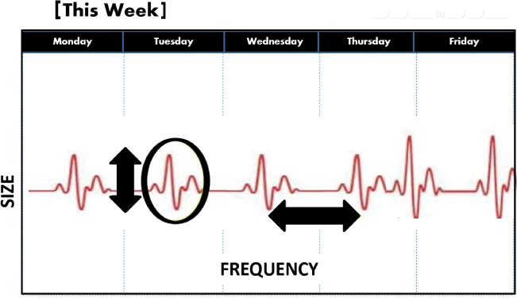

# 边做边做原型设计和解决方案

你将在这一小时学到什么：

- 原型设计和解决方案的心态
- 取得进展与解决整个问题
- 取得计划进展的技巧
- 什么不该做：忽略逆幂定律
- 总结和案例研究

在这一小时中，我们将注意力转移到原型设计和解决方案上，以此作为初步形成解决方案的一种方式。 正如我们之前提到的，有时我们需要做一些事情、画一些东西或建造一些东西来帮助我们解决挑战或情况。 行动巩固了我们的思想，而将我们的思想外化的行为使我们有可能获得他人的帮助，以建立共同的理解并走上进步的道路。 在我们这一小时的学习中，从流程到各种形式的原型制作、构建思考等等，我们有许多可用的技术来帮助我们快速取得进步。 通过强制功能、时间框和节奏，以及应用逆幂定律来改变，我们可以创建一个既有计划又可预测的进步路线图。 第 16 小时以"不该做什么"作为结尾，重点是一个经常重复的现实世界示例，说明当我们忽略逆幂定律时会发生什么。

## 原型设计和解决方案的心态

原型设计是一个基础广泛的术语，用于将我们脑海中的想法写在纸上、手中或屏幕上，以便其他人可以看到它、考虑它、从中学习、迭代并改进它。 就像我们已经涵盖的许多其他技术和练习一样，原型设计帮助我们外化我们的思维并建立共同的理解。 这是转型变革推动者的一个很好的例子。 原型设计帮助我们从今天到明年实现真正的大飞跃。 另一方面，迭代是增量变革推动者的一个很好的例子。 迭代帮助我们进行更小的日常跳跃，从而改进转换（直到我们最终需要再次转换）。 我们迭代以改进（我们的解决方案）并添加（新功能和特性）和减去（复杂性和不必要的）。

因此，原型设计和解决方案以及迭代的目标有三个：

1. 将我们的想法具体化为潜在的解决方案
2. 在达成共识的同时推动更深刻的见解
3. 从我们自己的团队以及最终将使用我们正在设计、构建和部署的产品的人员那里获取早期反馈

在这一小时中，我们将考虑通过原型设计和执行其他形式的"做"来学习和"解决方案"的各种方式。 请记住，我们的目标是简单地取得进展，而不是完全解决一个复杂的问题或提供一个完整的解决方案。

> 笔记
> 让我们先做原型……
> 在我们投入时间和精力开发和部署成熟的解决方案之前，我们需要确保我们正朝着正确的方向前进。 正如我们将在此处看到的，所有形式的原型设计都有助于我们验证该方向。 不过不要害怕，就像在第 21 小时中一样，我们将花费整整一个小时来探索做事和迭代的方式，这有助于我们在最终部署我们的工作供其他人使用时充满信心地交付。

## 取得进展与解决整个问题
为了通过迭代反馈和我们自己的团队以及有一天会以某种形式或方式使用我们的解决方案的一部分人的其他学习来取得进步，请考虑以下技术：

- 用于创建共同愿景的封面故事模型
- 清晰的流程
- 建立思考
- 粗略和现成的原型

接下来，我们将探索这些设计思维技术中的每一种。

> 笔记
> 设计思维
> 设计和原型制作自然会受益于所谓的设计心态。 这种处理情况的方式以事物的运作方式为中心。 因此，这是一种以解决方案为中心而非以问题为中心的心态，因此需要平衡认知分析技能和想象力。 考虑使用我们之前在第 12 小时的发散思维中介绍的热身、技巧和技巧来创建设计思维。

### 行动中的设计思维：共同愿景的封面故事模型

当我们在第 4 小时探索简单规则时，我们提到建立团队希望留下的遗产是多么重要。 同样，我们也需要以最终目的思考我们的项目、计划、产品、服务和解决方案。 当那一天终于到来并且我们的工作可供其他人使用时，我们希望人们对我们的工作有什么看法和想法？ 今天，当我们汇集资源并为我们的产品或服务建立赞助时，我们能学到什么？

开发杂志、报纸或在线新闻故事的封面，就像 ```LUMA Institute``` 的封面故事模型方法是一种强大的方式，可以在今天创造一致性并为未来的某一天带来兴奋，届时我们的产品和服务将最终成为其中的一部分 别人的生活。 我们的封面故事有几个目的：

- 它为我们未来的解决方案奠定了基础，并在我们正在进行的工作的背景下促进了对未来的共同理解。
- 它为我们提供了一个强大的统一视觉或其他图像的格式和论坛。
- 它迫使我们将我们的最终产品或服务概括为几个简洁的项目符号，就像用文字捕捉的电梯间距。
- 它使我们有机会通过未来用户和未来观点的视角来解释我们产品或服务的需求或好处。
- 在我们努力实现产品或服务和未来时，它有助于调整、团结和参与我们自己的团队。

使用 ```Microsoft Word``` 的 ```PPT``` 模板或在线假杂志封面生成器快速创建封面故事样机。 通过这些方式，通过描绘我们工作的成功愿景并展示其在未来用户社区中的影响，我们还可以从赞助商和其他利益相关者那里获得更强烈的支持、兴奋和支持，他们今天可能处于观望状态或只是 不知道我们打算对我们的工作产生的影响。 考虑一下图 16.1 中描述的模拟杂志封面如何展示我们虚构的案例研究组织 ```BigBank``` 通过其众多 ```OneBank``` 计划之一寻求实现的目标。


图 16.1
当我们提前考虑我们希望在工作中留下的积极影响时，我们可以为未来创造一个团队可以团结起来的愿景。

> 笔记
> 持续的愿景
> 传达愿景不是一次性事件。 保持这种清晰度必须是跨越数月以上的任何项目或计划的持续活动。 人们很快就忘记了！ 当相互竞争的优先事项和冲突随着时间的推移自然出现时，保持清晰的愿景可以创造并帮助保持一致。

### 行动中的设计思维：清晰的流程

多年来一直使用流程来提供清晰度。 将流程视为将我们的潜在解决方案连接在一起的高速公路系统。 如果我们了解数据如何从一个地方流向另一个地方，以及在什么方向和条件下流动，那么我们就可以对一组功能和能力进行建模。 流程创建了我们其他潜在解决方案所依赖的结构。 糟糕的流程帮助我们找到解决方案中需要更多思考的领域，无论是架构、设计还是功能。 通过这种方式，过程流为我们提供了本书中经常概述的共同理解，也是寻求解决棘手问题的人们迫切需要的。

可视化流程和流程图提供了对流程工作方式的洞察，包括其输入、依赖关系、任务和输出。 以可视化方式记录这些流程的真正价值在于：

- 通过使复杂的视觉和可见实现的共同理解
- 对相关人员和流程所服务的人员的广泛赞赏
- 共享词汇

最后一点，在技术领域，我们经常使用首字母缩略词、单词和短语，它们对不同的人和不同的学科有不同的含义。 可视化是伟大的均衡器，将每个人带到一个共同的理解点。 可视化为我们提供了上下文。 它引发质疑，使术语和首字母缩略词更加清晰。 它将执行流程工作的人员与以各种方式连接到流程（及其输入、依赖项、任务和输出！）的人员联系起来。 一旦我们理解了一个过程，我们就可以智能地做出改变或以其他方式改进该过程。

作为一种设计思维技术，通过拟议的系统探索和试验数据流。 考虑数据的存储位置、显示方式以及将其用作输入和输出的位置。 创建图纸和示意图以帮助推动讨论并缩小原型中的差距。 使用流程来帮助缩小潜在解决方案和生产解决方案之间的差距。

### 行动中的设计思维：为思考而建
当我们着手解决一个问题时，我们首先会花时间了解问题的表面区域——它涉及什么、它影响什么、它的生态系统等等。 然后我们通常会做一些计划。 然后我们可能会谈计划，提炼压榨，再计划一些。 我们讨论、计划、讨论和计划，这些事情要适度。 但是，我们做计划和推迟"做"的时间越长，我们一开始就误解问题的风险就越大。 想象一下计划六个月，然后投入"做"并发现没有任何事情按计划进行。 它发生了。 我们需要摆脱计划，开始行动！

这时候，```Building to Think``` 就派上用场了。 ```Building to Think``` 是关于跳入和"做"作为一种学习和思考的方式，这样我们就可以更有效地计划、做和部署。 将这种设计思维技术视为"用我们的双手思考"的一种方式。

在技术和软件开发领域，开发人员构建模型或参与系统原型设计是"为思考而构建"的自然方式。 我们也可以在与软件开发相关的特定任务之外应用 ```Building to Think```； 每当我们遇到棘手的问题并需要验证我们是否在正确的道路上前进时，我们都有构建思维的案例。 考虑以下：

- 画！ 这包括所有形式的映射，包括利益相关者映射、思维导图、旅程映射、同理心映射等。 正如我们在第 5 小时中介绍的那样，使我们的想法和原型可视化和可见有助于背景设置和建立共同理解。 使用任意数量的工具，从老式的纸笔和白板到 ```Adobe Photoshop```、```Microsoft PowerPoint```、```Paint```、```Klaxoon``` 等等。
- 使用便利贴和简单的分步流程创建想法模型和原型。
- 使用 ```Microsoft PowerPoint```、```Word``` 或 ```Excel``` 模拟示例报告或其他结果。 如果我们考虑需要从流程流中产生的输出（以表格或报告或多维数据集或其他结果的形式），我们可以轻松地逆向工作并考虑如何获取这些报告的数据。
- 画出或在白板上画出数据如何流经系统、"工作"如何流经系统（时间和动作研究）、人可能与之交互或交互的对象，以及该接口可能需要包含的内容。
- 动画静态图形和图片来逐步说明流程。 ```Microsoft PowerPoint``` 仍然是快速制作动画设计和故事板的最简单工具之一。

> 笔记
> 故事板！
> 故事板是通过故事板创建的，以逐步方式组织一组粗略的草图或绘图，用于说明流程中的一系列或一组步骤。 每个草图或绘图都代表一个步骤，整个故事板提供了一个强大的视觉效果来建立共同的理解。

正如我们所见，```Building to Think``` 是关于绘图、建模、原型制作等，使用了第 5 小时中的许多技术和想法。有时最好的模型是用标记和白板来绘制草图，以超低成本的方式完成的 出简单的过程或模型（其中 A 导致 B 导致 C，输出来自 A、B 和 C）。 如果我们可以在三个维度上建模或创造一些有形的东西，一些我们可以持有和操纵的东西，那就更好了。 我们越早将想法从头脑中转移到开放世界中，我们就能越快找到差距并迭代我们的想法以改进它们（见图 16.2）。


图 16.2
当我们用 ```Building to Think```（在这种情况下，将白板绘图变成移动界面以跟踪项目或计划的健康状况）取代广泛的计划时，我们可以更快地到达目的地。

请记住，```Building to Think``` 是围绕这样一个概念构建的，即当我们简单地投入时，我们可以尽最大努力思考并更快地找到解决方案。事先不要考虑太多； 跳入之后，更聪明地思考的机会很快就会到来！

> 笔记
> 计划思考？ 最终，是的。
> 当我们计划得太早和太长时，我们的许多学习将在执行的后期出现，此时更改变得耗时且昂贵，并且可能需要重新设计构思不当的设计，可能一直回到绘图板。 当然，我们需要计划。 但是有一个时间和地点进行计划，也有一个时间和地点可以早点失败和低价失败……或者说，早点学习和低价学习。 Build to Think，然后考虑实现长期价值所必需的规划类型。

最后的一些想法包括：

- 记住在构建思考时要适应三分法则。 设定可能需要至少三次迭代才能真正获得正确方向的预期。
- 将反馈循环构建到我们正在进行的"思考建设"工作中。
- 将静默设计反馈视为一种有意义地重新思考和改进解决方案的方式。
- 使用 ```Forcing Functions``` 定期审查和更新我们的解决方案； 如果不是有意留出时间，刷新可能永远不会发生。

最重要的是，当我们想要进入一个漫长的规划周期时，请记住蒂姆·布朗告诉我们的话："与其思考去构建，不如构建去思考。" （布朗，2019）

### 行动中的设计思维：粗略和现成的原型制作
另一种取得真正进步而不是在尝试解决整个问题的复杂情况下浪费时间的方法是进行粗略和现成的原型制作，这是用我们的双手思考创建粗略原型的另一个术语。 创建一个粗略的原型，用户可以看到和触摸到的东西，以可视化未来的共同愿景，这反过来可以帮助我们

- 更快地测试我们的想法
- 尽早验证功能和界面创意
- 比其他方式更快地迭代开发和测试

```Rough and Ready Prototyping``` 旨在使用低成本方法和现成的材料快速创建概念模型和界面设计。 我们越早将有形的东西呈现在我们的潜在用户社区面前，我们就能越快地获得有用的反馈。 粗略和现成的原型帮助我们验证方向正确和错误的地方（因此我们需要花更多时间制作原型和微调）。 粗略和现成的原型示例包括模拟解决方案、在白板上绘制线框设计、创建纸质草图以及组装二维工件。 我们还可以使用低成本材料（包括粘土、泡沫和纸制品）创建三维模型，以更好地了解一个想法的外观和感觉（同时注意原型的弱点，越早越好）。

引述：正如著名建筑师弗兰克劳埃德赖特所说，"你可以在绘图桌上使用橡皮擦，或者在建筑工地上使用大锤。"

## 取得计划进展的技巧

在我们使用原型设计和解决方案技术（例如构建思考和粗略和准备好的原型设计）针对我们的目标取得了一些方向性进展之后，我们就可以开始规划我们面前的工作了。 第一步工作受益于某种结构，以便比其他方式更快地学习和迭代。 有了一个轻量级和结构化的计划，以及可以利用的积压工作或工作主体，我们终于可以开始取得真正的进展。 我们的设计思维工具包提供了许多技术，这些技术多年来被证明对推动这种进步很有用，即使我们的解决方案变得更加成熟，我们也会继续使用这些技术：

- 强制函数
- 时间拳击
- 逆幂定律
- 时间节奏

接下来，让我们探讨这些设计思维中的每一种计划-进步-制造者技术。

### 行动中的设计思维：推动进步的功能
我们所有人都将截止日期作为帮助我们或促使我们完成工作的一种方式，尤其是那些没有一点专注就无法自然完成的困难事情。 截止日期对我们有用； 它们给我们带来可见性，通常会带来帮助我们完成必须完成的战术工作的后果。 我们如何使用最后期限来确保我们完成我们绝对需要完成的真正重要的长期任务？ 我们如何使用截止日期来完成不包含任何内在动机的任务的计划进度？

谁又能说最后期限需要由我们的经理或其他领导指定？ 相反，试着给自己设定最后期限，甚至是人为的最后期限，以推动进步。 这种人为设定的截止日期被称为强制功能，它们对于在工作中以及在我们的项目和计划中完成重要任务和日常任务非常有用。

一种长期的日程安排和日历技术，强制功能帮助我们实现时间表或帮助我们满足一组计划的里程碑和截止日期。 强制功能也可用于推动准备和准备。 最重要的是，强制函数帮助我们取得进步。 这种进步很可能也包括一些失败，但进步是不可否认的。 考虑这样一种情况，我们在不久的将来安排一个日期来完成技术认证考试。 日期作为学习的强制函数。 即使我们第一次考试不及格，强制功能也会促使我们提前准备，从而达到目的。 就像许多技术专家的第一手资料一样，我们将通过参加、失败并再次参加认证考试来更快地通过认证考试，而不是从一开始就不真正尝试考试。 强制函数驱使我们去尝试。

在工作场所，强制功能也促使我们去尝试。 我们的经理、同事和用户社区会感谢我们投入并尝试，而不是根本不尝试。 他们会欣赏我们为思考而构建的工作，即使我们失败了； 成功之后，失败很快就消失了。

还有许多其他制造强制功能的例子可以帮助我们完成工作并取得真正的进步：

- 在实际到期前一周安排关键任务的完成，作为实现（如果不是超过）我们的最后期限的一种方式（对第 11 小时中概述的"不可能完成任务的思考"的一种扭曲）。
- 使用其他护栏和技术在我们的日常工作中以不同的方式思考，作为强制功能，以便在需要将它们用于我们的技术项目和计划之前获得这些技术的经验。
- 将新任务分配给新的团队成员，而不是我们已经知道可以交付的更高级的成员； 这样做会推动新人，同时将带宽返回给高级人员（考虑这种方法如何扭曲好友系统配对和杀死英雄，这两个内容将在第 22 小时稍后介绍）。
- 追求一个新的角色，作为我们当前雇主的强制功能，要么提拔我们，要么让我们离开。
- 在失败后使用重新计划练习和其他困难情况作为强制功能，将通常不会联系的人和团体聚集在一起。
- 将"不允许退出"的心态应用于一种情况，以消除退出或回头作为一种选择，然后这将成为一种强迫功能，用于寻找解决我们当前挑战的方法（正如我们在第 17 小时介绍的失败前进技术中看到的那样）。
- 将大量工作分成较小的时间盒冲刺，以作为一种强制功能，以加快参与速度并尽早发现挑战（称为时间盒，接下来探讨）。

强迫一个目标或条件发生既是关注日历或时间表，也是为了追求足够重要的事情以保证遵守日历或时间表。

### 行动中的设计思维：速度和反馈的时间限制
1955 年，西里尔·帕金森 (```Cyril Parkinson```) 解释说，"工作不断扩大，以填补完成工作所需的时间"（斯科特，2018 年）。 我们大多数人都知道，帕金森定律虽然不正式，但在今天仍然适用。 如果我们给自己两个月的时间来测试一个应用程序，人性告诉我们肯定不会提前完成测试。 如果我们计划三个月的开发周期，我们肯定不会很快结束开发。 这项工作往往会占用我们分配的时间。

帕金森定律之所以成为一个问题，有两个原因。 首先，没有紧迫感，我们往往会慢慢开始。 因此，当我们遇到不可避免的挑战时，我们解决它们的时间就更少了，这可能会破坏我们的日程安排。 其次，在一个大型非结构化时间黑匣子内操作并不能为我们提供一组可以实现的目标。

一个解决方案？ 尝试时间拳击，这是一种由 ```James Martin``` (1991) 开发的用于时间管理的简单敏捷技术。 时间盒（或者有些人更喜欢时间盒）如果一项活动没有完全完成，它有助于推动巨大的进步。 这个想法很简单。 不仅要给我们自己和我们的团队一个截止日期，还要给他们最大的工作时间。 这会以时间"盒子"的形式产生健康的紧张感，引发紧迫感以及一些"足够好"的思考（在第 11 小时中介绍）。 为什么这种技术多年来证明自己如此有效？ 考虑：

- 当我们给团队无限的时间时，紧迫性越低，进展就越慢。
- 当我们没有给团队最后期限时，定义越少，不确定性就越多，进展就越少。
- 然而，如果我们在日历上对一项任务进行时间限制，我们将完成一些在最坏的情况下需要通过计划的反馈周期进行一些迭代或改进的事情（无论如何我们都应该计划）。

因此，当我们面临许多要完成的任务时，错开时间限制这些任务以完成我们面前的一切。 限制我们的准备时间，限制我们需要完成以取得进展的重要依赖项，限制我们办公桌上的日常工作，以便为我们提供更多的带宽来处理等待我们的真正重要的工作。 正如我们在图 16.3 中看到的，通过时间装箱，我们可以以更高的可预测性和更少的时间浪费来完成更多的工作。


图 16.3
使用时间盒来组织摆在我们和我们团队面前的工作，平衡强制功能和足够好的思考，以取得更快、更可预测的进展。

### 行动中的设计思维：负载的逆幂定律

大自然有一种自然的方式来分配生活中的大、中、小事件。 当我们转向大自然和统计数据时，我们会发现此类事件的有趣分布。 无论我们是在研究龙卷风、飓风和沙尘暴等天气模式，还是地震和火山爆发等地质事件，我们都会发现

- 大量小型活动
- 中型活动数量较少
- 更少的大型活动

这里的反比关系是大小与频率的关系； 事件越大，它通常发生的次数就越少。 这种关系称为逆幂定律，这种事件分布在生物学、天文学和我们周围的世界中也被广泛观察到。 出于我们的目的，我们使用逆幂定律作为任务加载、学习和考虑社区吸收变化能力的约束，如图 16.4 所示。


图 16.4
考虑逆幂定律来确定社区在一段时间内可以吸收的小型、中型和大型变化的数量。

应用这种设计思维技术来组织和处理项目或计划生命周期中的重大变化，无论我们是推动变化还是被动地处理我们周围的变化。 通过查看和适应我们的项目和计划内部和周围发生的变化的规模和频率，我们可以在应对以下典型场景时做出更明智的决策：

- 我们是否应该在将最新版本部署到我们的用户社区的过程中进行另一组冲刺？
- 当那些相同的用户正在结束本季度的财务或处理他们行业的旺季之一时，我们应该在哪里插入时间进行用户测试？
- 我们如何将两个中等规模的变更分解为我们的利益相关者可以更好地适应的四个或更小的变更？
- 我们可以使用模块化思维或第 11 小时的其他护栏来将我们即将进行的更改重组为更多可消费的块吗？
- 在寻求业务转型的同时，我们如何应对我们在行业中看到的巨大变化？
- 我们应该以什么方式重新平衡我们即将到来的任务、变化和事件，以取得可预测的进展？

考虑一下我们即将到来的时间表、变化和目标是如何随着时间的推移而结合在一起的，并寻找机会、差距、变化很小或事件较少的地方。 在我们有差距的地方，我们也可能有必要的带宽来适应任务加载或变化或新事件。 当然，真正的关键在于任务或变化的大小。 任务或变更或其他事件越大，它对我们的时间表的影响就越大，因此我们用于其他任务、变更或其他事件的时间就越少。

### 行动中的设计思维：相互依赖的时间节奏
虽然逆幂定律是关于适应一组任务、事件或变化的不同大小和频率，但转向时间节奏来考虑业务、项目、行业等的可重复和可预测的节奏。 ```Time Pacing``` 是指通过放慢或绕过那些有节奏的高峰并加速或加载一切照旧的低谷中的变化，围绕用户社区已经安排好的或定期的事件取得进展。

```Time Pacing``` 还可用于推动用户社区或项目团队内的可预测性。 凯瑟琳·M·艾森哈特 (```Kathleen M. Eisenhardt```) 和肖娜·L·布朗 (```Shona L. Brown```) 在 1998 年哈佛商业评论的一篇文章中将时间节奏描述为一种"通过在可预测的时间间隔安排变化来在快速变化、不可预测的市场中竞争"的方式。 通过这种方式，我们的工作成为企业的节奏，这是其他人应该期望看到并定期适应的东西。 考虑一个组织的强制性培训可能如何预期每月完成； 它成为该组织业务节奏的一部分。

在软件部署的世界中，```Time Pacing``` 为我们提供了一种方法，可以随着时间的推移，周到地构建将软件部署到不同用户社区所需的人员配备模型和实施方法。 对于大型科技公司来说，它还涉及安排产品发布和其他运营结构的变化，以此作为保持可预测性和相关性的一种方式。

引用："如果你没有时间做重要的事情，就停止做不重要的事情。" ——考特尼·卡佛

考虑如何应用时间节奏来帮助项目和计划团队安排工作并在最合理的时候交付价值或其他成果：

- 根据项目的即将到来的预算跨时间组织项目的常规财务支出，例如每月咨询和云消费成本，以主动发现资金缺口或处理更多工作的机会。
- 除了项目的路线图，调出我们无法控制的常规项目外部节奏和工作流，它们可能会影响我们和我们的团队，并将这些外部项目视为"带宽"约束或依赖项。
- 结合我们对工作高峰的了解（按照逆幂定律），包括我们计划里程碑的规模和频率，以及我们可以用来加速或充电和重组的停机低谷。
- 将 ```Time Pacing``` 与 ```Time Boxing``` 相结合，以更好地组织我们在低谷期间将关注的方式和重点，以加快我们的日程安排或可交付成果的节奏。

时间节奏最好在日历、挂钟或一系列其他常规事件的视觉上实现。 例如，在图 16.5 中描绘的图像中，我们可以看到一个模拟组织的"一切如常"的高峰和低谷，以及这些高峰和低谷的持续时间，因为它们跨越典型的一周。 鉴于周四和周五的活动强度更大，我们最好避免在这几天引入新的变化、会议等。



图 16.5
使用时间节奏来考虑组织"照常营业"日历的大小和频率，以便我们可以在最容易吸收或适应这些变化的地方引入新的变化。
什么不该做：忽略逆幂定律
随着时间的推移，大多数个人和组织都了解到，我们不能在太短的时间内对我们的员工施加太多的改变，包括我们的用户社区、技术团队、业务领导和执行领导团队。 人们在推回或完全反抗之前只能吸收这么多变化。 然而出于某种未知的原因，一家全球汽车制造商的一位经验丰富的项目经理认为他知道得更多。

领导一系列全球应用程序推出的项目经理忽略了高薪顾问甚至他自己的执行委员会的建议，制定了积极的开发和入职时间表。 他的程序级路线图和针对一系列新应用程序开发和部署项目的更详细的推出计划没有考虑到他要求已经捉襟见肘的用户社区吸收的巨大规模和频率的变化。

耗时的冲刺计划、测试和培训任务与先前计划的业务活动和汽车制造商产品发布的主要周期重叠。 幸运的是，对于公司的用户社区来说，项目经理的路线图在指导委员会的月度会议上被清除干净了。 分配了一个新人来审查和领导该计划，这次考虑的是逆幂定律和时间步调将如何影响总体路线图和时间表。 尽管该计划仍面临许多其他挑战，但至少世界各地的各个用户社区都已做好准备、接受培训，并提供了必要的时间和空间来吸收这些工作方式的关键变化。

## 概括

在这一小时中，我们探索了四种边做边学的渐进式学习技术，包括封面故事模型、流程、构建思考以及粗略和现成的原型制作。 接下来，我们回顾了另外四种在执行过程中实现有计划进展的技巧。 从强制函数和时间盒到逆幂定律和时间步调，我们回顾了如何根据我们要求社区吸收的任务、事件和变化的广度、规模和频率来组织和计划进展。 第 16 小时以"不该做什么"结束，重点是当我们忽略逆幂定律时会发生什么。

## 练习册

### 案例分析

考虑以下案例研究和问题。 你可以在附录 A"案例研究测验答案"中找到与此案例研究相关的问题的答案。

### 情况

```BigBank``` 的执行委员会 (```EC```) 很好奇每个 ```OneBank``` 计划的领导者应该如何执行，他们听到你与 ```Satish``` 讨论了一系列边做边学的技术，然后是另一组技术以取得更可预测的进展。 由于其中一些计划跨越多个国家和用户社区，EC 担心他们的组织在如此多的活动中消耗变化的能力。 他们希望你与他们的团队讨论这些技术以及他们如何适应即将发生的巨大变化。

### 测验

1. 哪四种技术可以帮助团队通过"边做边学"从用户反馈和其他学习中获益？

2. 什么技术可以帮助我们描绘我们工作的成功愿景并展示其对未来用户社区的影响？

3. 什么技术通过理解数据如何从一个地方移动到另一个地方、朝哪个方向、在什么条件下移动来创建结构？

4. 有哪四种技巧可以帮助我们取得有计划和可预测的进步？

5. 时间拳体现了哪些非正式规律？