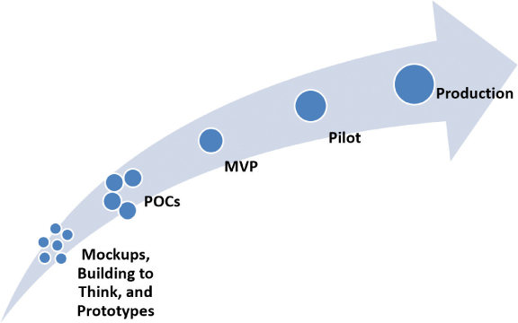
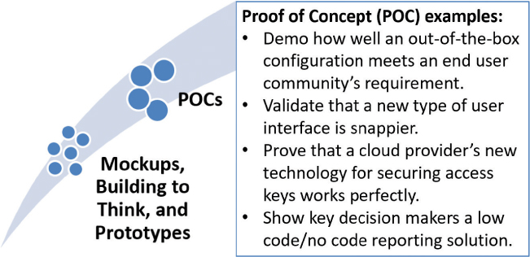
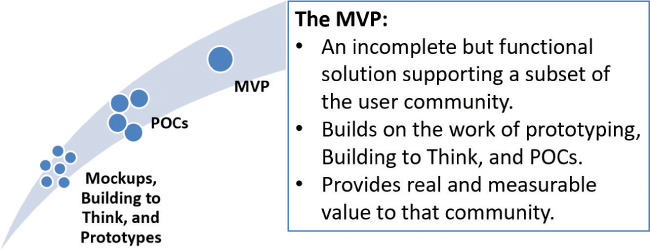
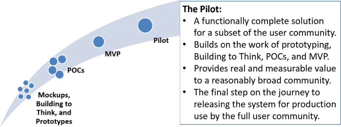

# 小而快的解决方案

你将在这一小时学到什么：

- 进步心态：出现并从小处着手
- 通过目标和关键结果实现价值
- 从小处着手，快速交付
- 交付和执行思考的技巧
- 只在有限的时间…
- 不该做的事：永远的 ```MVP```
- 总结和案例研究

第 17 小时概述了围绕取得进展意味着什么的设计思维思维方式，包括在我们的用户需求或前进道路不明确时有助于解决问题的技术和其他实践。 然后我们探讨价值的概念，然后是通过使用目标和关键结果来定义和衡量价值的必要步骤。 为了尽早交付价值，我们探索了四种技术，它们可以帮助我们弥合我们已经完成的问题解决和原型设计与我们需要交付的最终解决方案之间的差距。 这四种技术包括执行概念验证 (POC)、部署最小可行解决方案 (MVP)、将功能齐全的 Pilot 部署到我们社区的一个子集，以及使用失败前进技术让我们的团队专注于未来而不是 比过去。 我们这一小时的"不该做的事"说明了当我们走完未知的道路后，最终到达确定和舒适的地方并最终停滞不前，而不是为迫切等待它的社区提供完整的解决方案时会发生什么 .

## 进步心态：出现并从小处着手

面对不确定性和歧义时，学习、思考和原型设计都是有用的实践，但最终我们需要根据我们制定的目标和关键结果取得真正的进展。 我们需要做、创造和交付成果。 毕竟，我们是在做和完成的过程中创造价值。

迈向终点线的第一步？ 出现。 ```Carl Jung``` (1980) 多年前说过，"你是你所做的，而不是你说的你会做的。" 在我们真正出现之前，任何计划的价值都没有任何潜力。 "我要做这个"和"我们将努力完成那个"毫无意义，除非我们以个人和团队的形式出现，准备好共同完成摆在我们面前的任务。 出现是完成的第一步。

虽然出现让我们完成工作，但正如我们在前几个小时看到的那样，通过从小处着手、快速行动并一路积累小胜利，工作变得更容易，也更容易实现。 从小处着手，快速交付让我们通过实践快速学习，他们让我们在不浪费太多时间的情况下纠正路线。 我们需要改正路线！ 不确定的路径和模棱两可的环境自然会引导我们走上需要折返的道路。 这就是不确定性和模糊性的本质。 设计思维帮助我们尽快得出结论——我们确实需要学习更多或验证我们的理解，或者确实需要双反——宜早不宜迟。

幸运的是，有许多设计思维技巧和练习可以帮助我们在此过程中更好地理解和理解、快速学习和失败、思考以纠正路线、制作原型以学习、再次纠正路线等等。 正是通过这种工作方式，即使在不确定和模棱两可的情况下，我们也可以提供价值。

但什么是价值？ 我们如何衡量它？ 接下来让我们来探讨这些问题。

## 通过目标和关键结果实现价值
也称为收益或业务成果或已实现的目标，价值是任何有助于我们作为技术项目或计划的一部分交付的结果的东西。 价值包括社区在我们工作的接受方实现的收益、改进、资产和其他成果； 它是当今社区与我们试图实现的目标之间的差异制造者。 价值完全是从该社区的角度来衡量的。 毕竟，他们是预期的受益者。

正如我们在前几个小时看到的那样，价值并不仅仅在项目或计划结束时交付。 事实上，这一小时的前提是我们需要尽早交付价值，越早越好，哪怕只是为了获得一点反馈。 我们需要在整个工作中继续提供价值，小块有用的东西不仅可以帮助我们到达终点，而且（再次通过反馈）帮助我们验证我们仍在正确的轨道上。

### 定义和衡量价值

有时价值很容易"看到"。 当我们提供产品或服务时，它们是有形的价值示例。 当我们的用户社区或预期受益人承认我们已经交付了价值时，我们也可以按表面价值来看待它。 但是我们如何及早识别和衡量价值，以便稍后我们可以返回以验证它确实已完全交付？ 我们怎么知道我们交付了产品或服务预期价值的 100%？ 我们如何确定我们没有做空？

出于这些原因，价值必须具有内在的可衡量性。 为此，我们需要一组目标，并且我们需要将每个目标与可量化的指标联系起来。 一个好的衡量标准通常反映在一个动词或动名词或另一个动作词中，方向性地表明我们有，例如，增加 X，或减少 Y，或改进 Z。以常见和可衡量的方式表达价值的现实世界示例包括

- 将销售收入增加 R%
- 将每个冲刺的平均错误数量减少 S%
- 将支持中心的平均等待时间提高 T%

这种可衡量的结果或结果称为关键结果。 它们需要易于衡量，这假设我们已经对我们的系统进行了检测，不仅可以衡量，而且可以采取措施。 我们还能如何衡量价值？ 价值可以通过以下方式衡量

- 直接财务收益，包括收入增加、成本降低以及从财务角度可以直接衡量的其他成果。
- 直接的非财务收益，包括可以量化但通常难以在财务上量化的结果。 示例可能包括提高生产力、减少客户投诉、改进流程以提高支持团队的响应能力、提高员工流动率和其他人员保留措施等。
- 间接收益，即可见的收益或结果，但通常更难以量化或存在偏见。 例如，考虑如何通过调查来衡量提高的最终用户满意度、更好的客户服务、更高的团队士气和其他此类措施。

还有其他类别的价值和收益，但就我们的目的而言，这些衡量价值的方法是一个良好的开端。 确保价值是可衡量的，并将该价值与直接财务、直接非财务或间接收益联系起来很容易成为首要考虑因素。 当我们在交付有价值的东西的过程中努力"小而快"地解决问题时，我们希望这些价值概念在我们的脑海中浮现。

### 目标和主要结果
确保价值是可衡量的是确保我们真正交付有价值的东西的关键。 但是，我们如何组织一个阶梯式的价值观呢？

1. 考虑一下我们通过关于用户社区及其需求的构思和问题解决所学到的知识。
2. 确定在该用户社区看来"好的"解决方案是什么样的。
3. 将"好"转化为一组高级定向目标。
4. 将每个目标映射到一个或多个可衡量的关键结果。

有了这些基础，我们就可以在项目或计划的任何时候衡量我们的目标实现情况。 目标和关键结果，或 ```OKR```，将项目或计划的战略目标与交付团队为实现这些目标而执行的日常活动联系起来。 因此，```OKR``` 反映了一个目标设定或以价值为中心的框架，旨在将社区设定的战略目标与其他人为实现这些目标而执行的活动联系起来。 这些目标的完成带来了价值； 两者成为同义词。 因此，```OKR``` 明确了价值的样子以及我们如何知道我们已经实现了它。

- ```OKR``` 中的目标是什么。 目标应该激发和激励（例如，反映我们使用第 16 小时中解释的封面故事模型技术创建的内容）。 目标陈述了我们将要完成的事情或我们将通过我们的工作实现的目标。 它可以是大局和战略性的，也可以是不那么宏伟的。
- ```OKR``` 中的关键结果是怎么做。 正如我们所说，关键结果是可衡量的，并且以这种方式量化"好"的样子。 我们应该说明我们衡量关键结果的频率（例如，每月或每季度），并且我们需要将这些关键结果与我们将执行以交付这些关键结果的活动或冲刺联系起来。 我们甚至可以将一系列"足够好"与我们的预期结果联系起来。 无论如何，它们必须是可衡量的。

正如我们所见，对于技术项目，```OKR``` 可以很好地映射到史诗（目标）和功能（关键结果）。 ```OKR``` 也适用于那些从商业角度思考的人。 出于这些原因，```OKR``` 提供了我们在从原型设计过渡到解决方案和交付过程中衡量进展所需的价值框架。

> 自己试试
> 聪明的思维
>
> 当谈到关键结果时，不要忘记思考 ```SMART```！ ```SMART``` 是特定的、可衡量的、可实现的、相关的（有些人更喜欢现实的）和有时限的首字母缩写词。 这个首字母缩略词归功于彼得·德鲁克 (```Peter Drucker```) 和他 1954 年出版的《管理实践》(```The Practice of Management```) 一书。```SMART``` 思维是帮助我们创造可衡量的关键结果的好方法。 如何？ 通过确保每个关键结果都是具体的、可衡量的、可实现的、相关的或现实的，并且受时间限制（例如两个月或 11 个冲刺等）。 我们越能用数据衍生或基于计划的措施来支持我们的关键结果，就越容易随着时间的推移跟踪我们的进展。

## 从小处着手，快速交付

通常，学习和理解的最佳方式是做某事或构建某事。 正如我们上一小时所述，无论是从解决问题的角度，还是从更广泛的解决方案角度来看，原型设计和构建思考都是设计思维的基础。 因此，无数的设计思维技术也旨在帮助我们获得更好的端到端解决方案清晰度并在此过程中学习。 还记得我们之前介绍的所有技术和方法吗？ 在这一小时中，我们将在这些模型、线框、流程以及大量粗略和现成的原型制作方法的基础上进行构建，以取得下一阶段的进展，如图 17.1 所示



图 17.1
当我们弥合从最早的原型到各种概念验证练习并最终到完整的生产解决方案的差距时，请注意价值从左到右的自然进展。
在下一节中，我们将探索四种长期使用的设计思维技术，这些技术可以帮助我们弥合从最早的原型设计和"为思考而构建"到在"执行到思考"过程中开发完整解决方案的差距，包括

- 概念验证 (```POC```)
- 最小可行产品（```MVP```）
- 飞行员
- 进步失败

## 交付和执行思考的技巧

有了 ```Building to Think``` 之后，我们就可以将注意力转移到一种新的思维方式上，这种方式被称为执行思考。 差异取决于范围和受众。 在第一种情况下，关于范围，执行思考帮助我们在已经完成的工作的基础上继续学习，并为了我们自己的利益而学习更多，即使只是为了验证我们在正确的道路上的方向。 然而，当我们进入设计思维练习以取得小胜利时，我们将注意力更多地转移到第二位，在那里我们更多地了解我们的受众需要什么、他们如何需要、何时需要等等。

行动中的设计思维：概念验证
由布鲁斯·卡斯滕 (```Bruce Carsten```) (1989) 创造的概念证明 (```Proof of Concept```, 简称 ```POC```) 旨在证明一个伟大的想法或活动是否真的可行。 ```POC``` 就是做一些小事情，以此来证明更大或更复杂事情的可行性。 这样，它类似于原型设计，但以一种更面向解决方案（尽管是部分的）的方式，如图 17.2 所示。 考虑以下示例：

- 我们可能希望通过 ```POC``` 演示开箱即用的 ```ERP``` 或 ```CRM``` 配置如何满足最终用户社区的要求。
- 在我们将新界面作为更广泛用户社区的标准之前，我们将想要证明一种新型用户界面比当前界面更敏捷、更高效。
- 我们可能想证明我们的云提供商用于保护访问密钥的新技术以某种方式为我们工作，在采用该新技术之前仍将通过我们的监管和合规性审计。
- 我们可能希望向关键决策者展示低代码/无代码报告解决方案如何让非技术用户能够进行以前需要三个月昂贵定制或需要"报告专家"的业务报告。



图 17.2
概念验证 (```POC```) 建立在我们早期的原型设计和构建思考工作的基础上，以验证特定方法或技术确实可行。

这些示例中的每一个都是 ```POC``` 的一个流行用例。 我们越能以微小的方式证明某些事情确实可行，我们就会越有信心，也会节省更多的时间。 也许更重要的是，如果我们在不影响用户的情况下以小而有意的方式尝试失败，我们不仅会保持他们对我们的信心，还会为再次尝试和学习铺平道路。

### 行动中的设计思维：```MVP```

```MVP```，或最小可行产品，反映了对目标受众子集有用的最小功能或能力。 这里的关键是目标受众使用 ```MVP``` 来完成实际工作； ```MVP``` 是一个小规模的生产解决方案，如图 17.3 所示。 它并不完整，也不是适用于用户社区中每个人的解决方案，但它确实有效，并为该社区中的一小部分人提供了真实但有限的价值。



图 17.3
最小可行产品 (```MVP```) 建立在我们的原型设计、建立思考和任意数量的 ```POC``` 之上，为社区的一个子集提供价值。
因此，就像我们通过原型设计和运行 ```POC``` 练习构建思考一样，我们在构建 MVP 时通过执行思考或改进思考来提高我们对解决方案的理解。 这种做法使我们能够修正路线，不仅可以改进我们提供的价值，还可以改进它的交付速度。 一旦对该 MVP 进行迭代和充实，它就可以支持 Pilot 的角色，接下来将介绍。

### 行动中的设计思维：试点

在更广泛地推广之前，先针对少量用户试用功能齐全的解决方案是明智的。 为部分用户推出解决方案的早期版本的概念是为了获得早期反馈，以便在发布后调整和调整试播集，就像电视连续剧可能发布试播集然后修改故事情节或 反馈后的字符。

正如我们在图 17.4 中看到的那样，```Pilots``` 因此在功能上是完整的，这不同于与 ```POC``` 相关的战术或部分功能，或者仅适用于 ```MVP``` 中反映的一部分用户的基本功能。 不过，与原型、```POC``` 和 ```MVP``` 一样，试点通过在投入时间和预算将试点解决方案推广给广大受众进行生产性使用之前收集重要反馈来降低风险。



图 17.4
```Pilot``` 以我们的 ```MVP``` 为基础，创建了一个由社区子集验证的全功能解决方案。

### 行动中的设计思维：为进步而失败

```Failing Forward``` 是一项重要的技术和强制功能（正如我们在第 16 小时中介绍的那样）用于鼓励（如果不是强制）前进。 这个想法只是为了消除在遇到困难时回退到以前的状态或版本的选项。 这种技术有许多其他名称，包括 ```Burning the Ships``` 和 ```Blowing the Bridges```，但在技术领域我们倾向于称其为 ```Failing Forward```。 失败的前进迫使我们为进步而战，而不是放弃并回到旧的和不足的现状。

> 笔记
> 烧毁船只！
> 在 1519 年和帆船时代，西班牙征服者埃尔南多·科尔特斯 (```Hernando Cortez```) 从西班牙出发，在尤卡坦海岸登陆。 据说他和他的 11 艘船和 600 多人的团队在那里征服，收获战利品，并要求这片土地的财富。 不过，在某些时候，他的部下对参战的投入度降低了，所以故事继续说，科尔特斯下令"烧毁船只！" 为什么？ 消除撤退或倒退的可能性。 由于没有返回西班牙家园所需的船只，科尔特斯的部下别无选择，只能参战。 无论输赢，他们都注定要战斗，失败，然后再战斗，直到成功和获胜为止。

正如我们在旁注中读到的那样，我们应该考虑采用 ```Cortez``` 的观点来推动个人和团队在挫折之后甚至灾难之后取得进步。 通过取消那些过去的产品和解决方案，消除返回到旧产品和不再相关的解决方案的选项。 ```Failing Forward``` 的实践通过从字面上消除回头的选择来增加团队前进的动力和承诺。 不允许回头！ 在没有其他选择的情况下，我们更倾向于推动并解决当前的问题。 失败的前进为奔向可能更光明的未来奠定了基础。

## 只在有限的时间…

正如我们所看到的，```POC```、```MVP``` 和试点让我们能够以与构建新想法时构建思维相同的方式执行思维。 但是，我们需要注意不要因为"想"太久而失去听众！ 毕竟，追求完美是进步的敌人。 相反，请考虑以下问题，这些问题可以帮助我们前进，甚至在我们可能想要放松并在 ```POC``` 等舒适领域内进行迭代时继续前进：

- 我们是否真正了解更广泛的受众从一项工作中受益所必需的最小可行产品？ 我们是否记录了 ```MVP``` 的属性并就此达成一致？
- 时机呢？ 我们能否通过一小组有时间限制的冲刺或迭代来实现 ```MVP```，还是需要更多的周期或发布？ 这个时间安排如何适应团队和组织验证和交付价值的需要？
- 是否存在外部现实，例如需要淘汰现有解决方案，这可能会阻止我们推迟实现价值的时间？ 这些现实能否用作我们在第 16 小时概述的取得进展的健康强制功能？
- 在没有硬性外部强制函数日期的情况下，我们能否调整一组良好的人工或其他日期，这些日期也可以作为推动进步的强制函数？
- 我们是否了解交付 ```MVP``` 和等待交付功能齐全的解决方案之间的权衡？ 我们是否让 90% 的用户社区等待，而只为 10% 的用户提供服务？ 我们应该扩大 ```MVP``` 的范围，还是相反，缩短其持续时间？
- 我们的用户能否在新解决方案中执行他们的一部分工作，在当前解决方案中执行他们的部分工作？ 或者，从商业和技术角度来看，这种"转椅"会不会太混乱或太昂贵而无法协调？

当我们循环 ```POC``` 的迭代并构建我们的 ```MVP``` 和 ```Pilot``` 时，我们需要保持警惕，注意改进我们为小规模受众的工作与为更广泛的受众提供有价值的东西之间的紧张关系。 在我们的整个工作中，我们必须记住，更广泛的受众在等待！

在几乎所有情况下，取得进步比实现完美更重要。 我们了解什么是"足够好"可以部署吗？ 我们的用户社区是否已经确认了足够多的信息？ 我们是否认识到我们的短期解决方案何时需要最终让位于满足长期视野的解决方案？ 回报是否大于风险？ 我们是否需要编排我们自己的失败前进版本？ 尽早在这些重要问题上达成共识。 并继续关注更广泛的受众和我们的价值交付计划。

## 不该做的事：永远的 ```MVP```
在小型技术计划和类似的大型企业转型中，使用设计思维技术（例如原型、```POC```、```MVP``` 和试点）来学习、调整和改进我们的解决方案是很常见的，并且受到鼓励。 但我们不能永远围绕这些预生产解决方案进行迭代和循环。 ```POC``` 和 ```MVP``` 只适用于一个季节，而不是一生，因为一家小型消费品公司的 IT 组织从中吸取了教训。

由于处于瘫痪分析状态，该组织在太少的功能上迭代了太长时间，而对于完全预期的受众来说，看不到任何好处。 开发团队和许多其他围绕和支持它的人浪费了数月又数月的宝贵时间，交付太少且没有速度。 最终，合并后的团队变得自满，每个冲刺交付了大约 10% 到 25% 的计划功能。 与此同时，负责开发用户故事和梳理冲刺的小型用户社区忙于在它实际能够测试的少数已交付功能中寻求完美。

由于没有紧迫感，也没有可衡量或有时限的价值，执行发起人对她的"永远 ```MVP```"项目感到厌倦，并取消了她的赞助。 随着项目继续"暂停"一段时间，领导者被洗牌了。 最终，该项目被关闭，因为预期的用户社区失去了耐心并向内寻找自己的解决方案。

## 概括

在这一小时中，我们探讨了围绕取得进展意味着什么的设计思维思维方式，包括一组在我们的需求（或路径）不明确时有助于解决问题和取得进展的技术和实践。 我们探索了价值的概念以及通过使用目标和关键结果 (```OKR```) 来定义和衡量价值所必需的步骤。 然后，我们将这种衡量价值的概念与四种"执行思考"技术联系起来，这些技术有助于弥合问题解决和原型设计与我们需要交付给广大用户社区的最终解决方案之间的差距。 这四种技术包括执行概念验证 (```POC```)、部署最小可行解决方案 (```MVP```)、将功能齐全的 ```Pilot``` 部署到我们社区的一个子集，以及使用失败前进技术让我们的团队专注于未来而不是 比过去。 第 17 小时以"不该做什么"结束，强调当我们长时间运行 ```MVP``` 和其他此类预生产练习而不是将解决方案部署到我们更广泛的用户社区时会发生什么。

## 练习册

### 案例分析

考虑以下案例研究和问题。 你可以在附录 A"案例研究测验答案"中找到与此案例研究相关的问题的答案。

### 情况

```Satish``` 和 ```BigBank``` 的执行委员会 (```EC```) 很高兴看到由于改进的交叉团队和原型制作技术，倡议团队似乎可以更智能、更快速地工作。 但是团队仍然面临尽快交付价值，任何价值的压力。 ```BigBank``` 的一些利益相关者和发起人对只能提供增量价值的人员和预算以及原型设计的投资越来越不安。 其他人甚至暗示这些投资现在毫无进展。

执行委员会提出了一些与你已经看到和使用的技术有关的问题，这些技术将帮助银行在实现计划中的大胜利的过程中实现小而快的胜利。 他们需要看到结果； 他们需要看到结果。 他们相信你可以帮助推动这项工作。

### 测验

1. 本小时概述的帮助团队"执行思考"并最终交付小而有价值的东西的三种技术是什么？

2. 正如本小时所讨论的，团队如何定义和完善价值的概念？

3. "```Fail Forward```"是什么意思，这对团队有什么用？

4. ```Pilot``` 与概念验证或 ```MVP``` 有何不同？

5. 当道路不确定或社区需求不明确时，"进步心态"如何确立取得进步的方式？