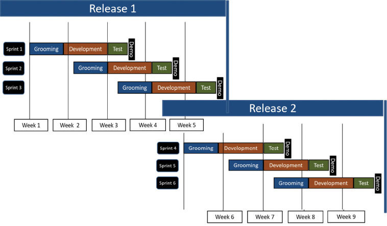
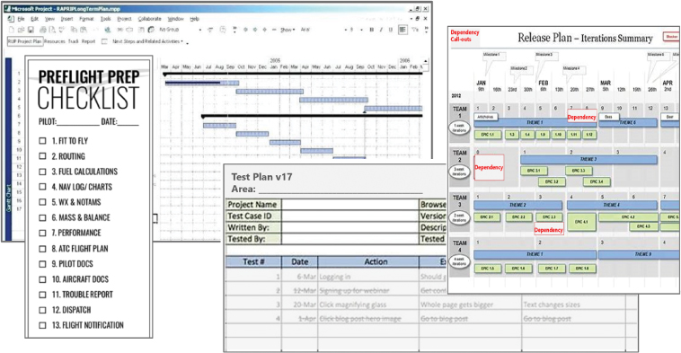
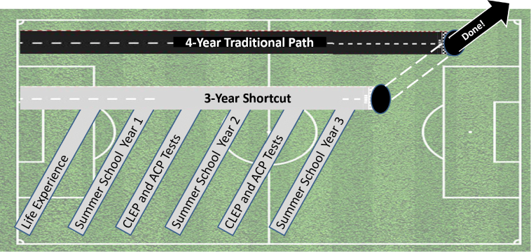

# 快速创造价值

你将在这一小时学到什么：

- 提高价值流通速度的交付技巧
- 团队对速度的考虑
- ```Velocity``` 的变更控制注意事项
- 什么不该做：缩短冲刺以加快速度
- 总结和案例研究

正如我们之前在第 17 小时中介绍的那样，第 18 小时建立在从小处着手以尽早交付价值的方法之上。在这一小时中，我们重点关注快速交付价值的技术以及团队可以用来更快交付的另一组技术。 我们还回顾了一组可以极大地影响速度的变更控制注意事项。 我们以现实世界中的"不该做的事情"结束第 18 小时，重点是误解缩减或缩短设计和开发冲刺的含义，以期提高速度或敏捷性。

## 提高价值流通速度的交付技巧

如前所述，一些用于简单取得进步的相同技巧对于快速或负责任地取得进步也是理想的。 我们已经介绍了流行的设计思维技术，例如时间盒、时间步调和逆幂律。 在这里，让我们探讨发布和冲刺计划、从小规模运营到大交付的考虑因素，以及智能 ```IP``` 重用在实现速度方面的作用。

### 行动中的设计思维：发布和 ```Sprint``` 计划

仅在第 13 小时中简要提及，发布计划是识别、确定优先级和选择高级功能和用户故事（需求）的过程，这些功能和用户故事（需求）将反映在我们的解决方案中，在一段时间内构建，并在结束时交付 那个时间以有时间限制的"发布"形式出现。 我们倾向于将发布视为跨越数月而不是数周。 鉴于敏捷冲刺计划和修饰已被项目管理协会 (```PMI```) 广泛采用并视为标准操作程序，除了使用使冲刺和发布可见和可视化的技术之外，我们在这里没有对它们进行任何深入的介绍。

为了实际组织、确定优先级并考虑项目之间的依赖关系，我们将每个大型发布级别时间框划分为多个称为冲刺的较小时间框。 发布中的每个冲刺通常按顺序执行，并反映配置或开发交付计划的功能集和用户故事所需的代码所需的工作。 冲刺通常持续一到四个星期。 有关此发布和冲刺层次结构的上下文，请参见图 18.1。



图 18.1
请注意冲刺如何按顺序运行以形成发布、发布计划以及最终成为整个项目或计划的重要组成部分。

考虑和规划与我们的解决方案相关的特定冲刺和更大的版本，有助于我们制定计划并了解全局。 然而，这样做并不能自然地帮助我们提高速度。 但是，随着大局的清晰和我们的日程安排的协调，我们可以提前思考并更深入地思考可以帮助我们实现更高速度的下一个最佳步骤。

- 我们的三个视野计划是什么（正如我们在第 13 小时中介绍的那样），我们的发布计划及其基础冲刺与这些视野的一致性如何？ 有提早交房的空间吗？ 是否有机会并行运行某些冲刺或其他工作？ 我们实际上可以并行运行两个或更多版本吗？
- 我们能否更好地识别和评估我们期望实现的收益的价值和影响？ 我们跟踪计划收益实现情况的情况如何？ 我们是否超越了我们所学到的关于"足够好思考"的知识，或者我们是否有机会像我们在第 11 小时中介绍的那样应用另一个思维护栏来提高速度？
- 我们如何改进冲刺梳理和计划以更可预测地交付？ 例如，为什么我们交付不足，我们如何应用第 9 小时中概述的五个为什么、问题框架、问题树分析或问题陈述来提高我们的速度？
- 我们是否很好地监控了产出的交付？ 我们在哪里可以更快地行动并提供更多？ 我们是否需要更好地衡量我们的运作方式，以突出我们的预期收益和其他成果如何缓慢实现？ 我们是否真正了解所有这些工作如何为更大的图景或我们的地平线计划做出贡献？
- 我们如何更好地分析计划变更对我们预期收益和结果的潜在影响？ 例如，是否有机会再次吸引我们的用户并重新构想一组冲刺？
- 我们的预期收益与我们的目标、目标和关键结果的一致性如何。 有什么缺失或错位？

在考虑围绕收益实现的责任和责任时，我们还需要考虑如何优化我们的流程和角色。 正如我们将在稍后的时间介绍的那样，我们越了解我们今天交付价值和预期收益的程度，我们就越能确保未来这些预期收益能够持续下去。

### 行动中的设计思维：小经营，大交付
正如大多数人所理解的那样，关注结果比关注产出更重要。 忙碌并不等同于交付价值。 当谈到冲刺和我们正在进行的其他工作时，我们需要记住以包含可以在冲刺内实际完成的工作主体的方式建立那些冲刺和时间框。 这个想法是提供一些有用的东西，一些可以测试的东西，一些有价值的东西（记住，有时价值需要不止一个冲刺，当然）。 正是通过我们交付的小件工作，才能带来巨大的变化和影响。 考虑以下：

- 使用故事点、T 恤尺码或类似的近似方法来确定用户故事的大小，以估计创建功能或流程所需的时间和精力或开发能力。 用户故事规模调整是创建更好的冲刺、发布和时间表的关键。
- 使用用户故事映射将交付用户故事所需的步骤整合在一起，从确定目标和用户旅程到解决方案，将工作组织到时间框或冲刺中，以及发布发布计划。
- 首先专注于理解和交付关键依赖项和核心基础。 可以肯定的是，我们需要解释交付这些项目的价值，但解释应反映未来影响取决于这第一部分工作的事实。
- 接下来的重点是在正确的时间提供正确的功能（而不是提供一组在短期内实际上可能有用或可能没有用的功能）。
- 同时，使用第 17 小时中概述的 POC 和 MVP 等技术作为快速交付的方式，同时获得以定向准确的方式良好交付所需的反馈。
- 组织剩余的工作以适应对其他工作的依赖性，尤其是我们关注的部分之外的工作。
- 当我们需要在多个冲刺中划分大量工作时（因为一个独立的组件建立在另一个之上），并行地进行推理以及突出和展示这些独立组件的价值。
- 相反，当可以在同一个冲刺中容纳此类工作并且我们已经配置了必要的资源（和资源带宽）以适应并行运行时，可以并行组织这些工作。

通过这些方式，我们应该能够及早展示价值，并在每个冲刺和每个版本中展示它。

### 设计思维在行动：智能 ```IP``` 重用

我们的世界充满了各种形状和大小的加速器，它们可以帮助我们更快地启动或以更快的速度移动。 尽管在技术领域被过度使用，但知识产权 (```IP```) 一词代表了加速器的广泛来源。 就我们的目的而言，```IP``` 是其他人在我们之前完成的工作，可以重复使用（或改编和重复使用）以帮助我们今天取得更好的进步。 考虑以下图 18.2 中描述的列表和插图：

- 文档可交付成果。 我们如何重用功能和解决方案设计文档、技术蓝图等作为模板形式以更快地创建我们自己的文档？
- 规划可交付成果。 为了我们的利益，我们如何调整以前使用的发布和 Sprint 计划文档、地平线计划、路线图和项目计划？
- 清单。 我们如何利用现有的清单来帮助确保我们在设计、开发、部署和运营我们的解决方案时不会错过重要的事情？
- 测试计划。 我们如何调整精心设计的测试计划来加速我们对测试的理解和准备？
- 预先配置的模板。 我们的一些工作如何可能已经反映在其他人以前的工作中，以便我们可以将它们作为文字或比喻模板来提升和重用，以加速我们自己的工作？
- 设计思维模板。 就像我们可能采用面向解决方案的 ```IP``` 一样，我们如何借用设计思维练习中使用的模板、工作示例、工具和其他工件来加快我们准备和交付这些练习的速度？



图 18.2
可重用的工件和其他 ```IP``` 是速度的自然启动器。

这个想法很简单。 避免创建不需要创建的东西的诱惑。 节省我们的时间和精力去思考和创造以前没有做过的事情。 调整和重用我们所能做的，以帮助我们比其他方式更快地取得进步。

> 笔记
> 标准化模板
> IP 的另一种常见形式是标准化模板，它是一个内容空文档，为一组易于理解的用户概述和组织（以同理心和结构化的方式）内容。 模板通过理解文档的结构帮助我们理解文档的"内容"。 标准化模板旨在用于可重复的目的； 使用它们以一致和快速的方式构建工件，确保在此过程中不会遗漏任何内容。

## 团队对速度的考虑

当我们的团队开始他们的工作学习、同理心、解决问题等等时，我们自然会面临以某种速度移动的挑战。 正如我们大多数人所知，这些挑战通常会让我们放慢脚步。 但是我们可以求助于三种设计思维技术来帮助我们挽回损失的时间或加快速度：智能多任务处理、游戏化以及快捷方式或虫洞思维，接下来将分别介绍。 考虑以考虑和验证速度的方法的形式将所有三者串在一起。

### 行动中的设计思维：智能多任务处理
多任务处理或同时执行两个或多个任务的概念并不是什么新鲜事。 这个想法在 1960 年代由 IBM 的计算机工程师推广，但我们大多数人后来开始意识到，多任务处理在提高生产力或节省时间方面并不像我们曾经认为的那样有效。 事实上，真正的多任务处理更像是一个难题。 多任务处理不仅没有完成两倍的工作，反而常常让我们完成的任务还不到一半。 为什么？ 因为当我们从一项任务转移到另一项任务并再次返回时，我们的大脑所做的任务切换会造成太多负担。 让我们自己回到新任务的背景下需要太长时间，浪费时间，因为我们要翻新旧地，从我们离开的地方重新开始。

当然，我们所有人的现实情况是：我们需要在某种程度上同时处理多项任务，因为我们别无选择。 我们每天还有一百件事要完成，大约需要 16 个小时才能完成。 因此，我们必须找到一种方法来完成任务，并与让我们在任务之间停滞不前的惰性作斗争。 我们需要避免超载并取得可持续的平衡。 如何？ 考虑以下问题：

- 我们如何减少盘子上的任务数量？ 也就是说，我们如何拒绝或将任务委托给其他人，从而使 100 个任务变成 80 个？
- 我们如何使用强制函数、时间盒和其他技术来帮助我们集中注意力并确定多任务处理的优先级？
- 我们如何将其中一些任务自动化，以便我们花一些时间监控和验证已完成的任务，而不是把所有时间都花在做上？
- 当我们考虑一项任务时，我们如何减少或消除周围的干扰，这些干扰会破坏我们在脑海中构建的纸牌玻璃屋？
- 我们怎样才能更好地全神贯注于眼前的事物，从而比平时更快地完成任务？

更智能的多任务处理的两个最重要的技术包括

- 做当时最能给我们能量的事； 跟随我们的热情。
- 确保我们为最重要的大石头腾出时间； 如果没有首先考虑重大和重要的任务，通常就不可能在以后添加它们。

这些都是简单的技术，但它们很强大。 做当时给我们最多能量的事情，然后继续做下一件给我们最多能量的事情。 并在大石头（最重要的项目）上取得进展，以免我们耗尽空间、带宽或精力来完成这些工作。 使用 ```Time Box``` 并在必要时使用 Forcing Functions 来帮助我们完成不会给我们能量的强制性工作。 对于持久的改变，考虑个人生产力应用程序和指导（例如 ```BillionMinds``` 提供的）如何帮助我们发现并嵌入最适合我们和我们的情况的特定思维方式和技术（参见 https://billionminds.com）。

最后一点，当我们专注于给我们最多能量的任务时：

- 我们把事情做好，而且通常很快就能完成。
- 我们自然会为其他任务创造更多带宽。
- 核对待办事项清单上的某项会令我们产生内啡肽冲动，这反过来又让我们有精力去处理下一个任务。
- 我们的大脑准备好相对轻松地处理类似的任务，为我们提供更多的带宽来完成这些任务。

当我们追随我们的能量和激情时，我们会完成更多的工作。 当我们深思熟虑地将强制函数和类似的设计思维技术注入到我们的不那么充满活力的任务中时，我们可能会完成剩下的工作。 对于那些最难以捉摸的任务，我们甚至可以考虑接下来介绍的游戏化。

### 行动中的设计思维：参与的游戏化
我们可能会尝试使用智能多任务处理或时间盒来完成工作，我们甚至可能会使用强制功能来帮助我们在只需要完成任务时取得进展。 但是，如果我们仍然无法自律地完成一组任务怎么办？ 我们还可以尝试什么？

考虑如何使用游戏化来推动进步和检查任务。 游戏化是计算机程序员和发明家 ```Nick Pelling``` 在 2002 年创造的一个术语，它通过增加我们的参与度和动力来帮助我们（```Wood & Reiners```，2015）。 为了帮助我们完成摆在我们面前的工作并完成我们害怕的必要但平凡的工作，可以考虑通过围绕这些任务建立奖励系统来制作游戏。

视频游戏制造商长期以来一直使用丝带和徽章以及其他类似荣誉的概念来激励人们花时间玩他们的游戏。 汽车制造商最近也做了同样的事情，在我们经济地驾驶时使用绿色经济叶视觉作为奖励我们的一种方式（并提高我们对车辆里程的看法）。 培训供应商和新语言应用程序使用游戏化来奖励完成培训部分或在计划或课程中取得进步的学生新功能、奖励、证书、级别等。

以同样的方式，将游戏化应用于等待我们的低热情和低能量的任务。 但是，与其仅仅获得视频游戏徽章或积分或新级别，不如用少量但有意义的小饰品或奖品奖励我们自己和我们的团队。 对于那些取得巨大成就的人，礼品卡、茶歇、周五半天、免费午餐等也可以作为大奖。

### 行动中的设计思维：捷径和虫洞

有时两点之间最快的路径不是直线。 也称为捷径思维或寻找虫洞，这种技术是关于在我们今天所处的位置和我们需要去的地方之间寻找不太明显的捷径。 关键在于：在我们和目的地之间导航一切，而不让自己陷入弯路和旁路。 毕竟，明显的路径不一定是我们特定情况的最佳路径。

要找到捷径，我们需要了解地图，了解我们所在的位置和我们想去的地方。 我们应该为初学者设计一条传统路线，哪怕只是为了帮助我们更深入地理解这条路线（就像我们可以使用旅程地图一样，在第 3 小时简要介绍，在第 8 小时详细介绍）。

让我们考虑一下学生完成传统的四年制大学学位可能遵循的途径（见图 18.3）。 如果我们没有现收现付的资金怎么办？ 或者我们不想投资大学贷款？ 有更短的路径吗？ 可能有！ 绘制路线以使其可见，并且更短路径的构成可能开始变得不言而喻。



图 18.3
如果我们只是让竞争环境可见，那么捷径和虫洞比比皆是。 或者，我们也许能够真正改变比赛场地本身以更快地完成比赛。

- 避免夏季和学期之间的长时间休息。 路线应该直观地向我们展示这些中断。 相反，全年上学，这条捷径将使我们能够在三年或更短的时间内完成四年制学位。
- 避免传统的四年制学位课程，通常是 120 到 132 个学分（或 40 到 44 门课程）。 相反，找到一个需要 110 个学分或更少的学位课程，这将帮助我们稍微减少四年的时间承诺。
- 大多数大学至少会为我们的生活经历或我们完成的证书（例如在军事训练、技术认证项目等中获得的证书）授予一些大学学分。 与其假设我们必须完成每门课程，不如与辅导员合作减少必修课程的数量，这也将帮助我们进一步减少四年的时间承诺。
- 最后，大多数大学还延长大学学分以获得大学先修课程 (```AP```) 考试和大学水平考试计划 (```CLEP```) 考试的最低分数。 学习并同时参加其中一些考试，以避免那些没有给我们带来活力或激情的课程，我们甚至可以从常规的四年旅程中节省更多时间。

同样，关键可能在于改变比赛场地，以便我们可以改变路线。 因此，重要的是要真正了解竞争环境或地形，以及我们如何改变它。 有很多方法可以在三年内完成四年制学位。 了解我们的目标并了解我们愿意为实现该目标而做出的权衡。 说实话，如果我们更关注旅行的速度而不是体验，通常有很多方法可以从 A 点到达 B 点。 因此，请考虑权衡取舍并规划新路线。 捷径和虫洞正等着被发现。

## 速度的变更控制注意事项
尽管有些人可能会争论这个前提，但快速执行并不意味着我们将变更控制扔到窗外。 管理进度、范围、资源等方面的变更是保持速度的超前思考的重要组成部分（或者，为了其他充分的理由（例如更高的质量或法规和审计要求）接受权衡）。

> 笔记
> 不是变更管理而是变更控制
> 什么是变更控制？ 正如我们在第 15 小时为协作构建治理框架中简要概述的那样，这是我们在技术领域遵循的正式流程，以确保对我们的解决方案、其业务案例、其技术基础以及与所有这些相关的资源和时间表的更改都得到考虑 鉴于变化。 这种变化通常根据对最终解决方案的影响来衡量，包括交付价值的方式和时间。 变更控制流程帮助我们以受控和协调的方式考虑、记录和应用变更。

变更控制需要远见和时间。 但是这个过程帮助我们维持与我们的解决方案交付和部署目标的强大而有弹性的联系。 深思熟虑的变更控制迫使我们考虑创造价值和提高速度的新机会。

应该以可能对速度产生积极影响的方式调用变更控制过程的事件包括

- 新技术或服务可能会降低我们的速度，因为我们会考虑它们对我们现有设计或解决方案的影响，但从长远来看提供了交付业务成果或提高速度的新方法。
- 现有的技术更新通常会减慢我们的速度，但可以提供新的特性、功能和其他可能在长期内提高速度的机会。
- 不断变化的市场条件可能会减慢我们的速度，但有助于我们在这些变化之后完善价值。
- 增加资源可以让我们提高解决方案的质量、上市时间或尽早交付价值的能力。

当变化出现并且我们需要做出反应时，请考虑如何将这种变化转化为差异制造者或速度推动者。

## 什么不该做：缩短冲刺以加快速度
在软件开发和平台配置中，我们可以花很多时间思考理想的冲刺应该有多长。 两周的冲刺、三周的冲刺，甚至是四周的冲刺都很常见。

当不可避免的挑战出现并且我们最终将太多未完成的工作推出或"雪犁"到未来的冲刺中时，我们可能会想通过改变冲刺节奏来解决这个问题。 一家金融服务公司的产品顾问直接遇到了这种诱惑。 他认为将团队从三周冲刺周期改为两周冲刺周期会给团队带来更好的敏捷性和更多时间来弥补失地。 但他"解决"了错误的问题。 真正的问题与执行不力的修饰、延迟的用户故事以及在没有适当的计划和修饰的情况下将新的和不明确的用户故事添加到冲刺有关。 缩短冲刺周期时间只会减少团队用于开发的时间。

怎么会这样？ 缩短冲刺周期使团队完成工作的时间减少，测试工作的时间也减少了，因为从总时间的百分比来看，他们花费了更多的时间来执行所有典型的冲刺仪式。 无论 sprint 周期时间如何，修饰、展示和讲述演示、回顾等都继续消耗相同数量的时间。 因此，只有当顾问将团队改为两周冲刺时，工作与仪式开销的比率才会受到影响。

有时候，太多的好事是一件坏事。 正如我们的顾问在这里发现的那样，在两周的时间段内塞进了太多的演示和回顾，这导致了相当多的开销（占工作量的百分比）。 幸运的是，他能够回到原来的周期时间，更重要的是能够与团队一起调查真正需要关注的问题。

## 概括

在第 18 小时，我们探索了三种提高价值速度的技术，包括发布和 ```Sprint``` 计划、以小规模运营以交付大数据以及智能 ```IP``` 重用。 然后我们介绍了另外三种提高团队速度的技术，从智能多任务处理到游戏化和捷径或虫洞思维。 在概述了变更控制注意事项之后，这一小时以"不该做什么"结束，重点是缩短冲刺长度，错误的想法是这样的举动可以提高敏捷性和速度。

## 练习册

### 案例分析

考虑以下案例研究和问题。 你可以在附录 A"案例研究测验答案"中找到与此案例研究相关的问题的答案。

### 情况

```Satish``` 需要你的帮助来加快 ```OneBank``` 多项计划的实施速度。 他发现浪费了太多时间，因为各种主动架构师和顾问倾向于一遍又一遍地重新创建轮子。 在其他情况下，```Satish``` 还观察到不同的团队如何倾向于随机化他们自己和他们的工作。 他确信你对负责任地提高专注度和速度有一些想法，并要求你与几位倡议领导坐下来讨论以更快的速度交付价值的技术。

### 测验

1. 发布到冲刺的层次结构是什么，它们如何相互映射？

2. 什么技术考虑了倡议领导者如何调整现有模板和工件以提高速度？

3. 在什么情况下多任务处理有意义并实际证明是有用的？

4. 可以采用什么技术来使用丝带、徽章和其他奖励来鼓励主动测试人员完成他们的测试用例？

5. 哪种技术为重新创造竞争环境以找到两点之间更快或更有效的路线奠定了基础？