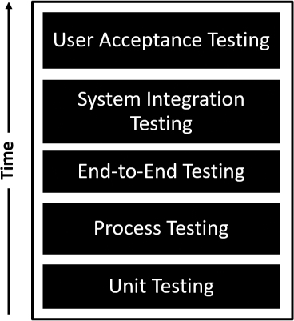

# 验证测试

你将在这一小时学到什么：

- 测试心态
- 传统类型的测试
- 学习和验证的技巧
- 反馈测试工具
- 什么不该做：自动化一切
- 总结和案例研究

第 19 小时开始于第 V 部分"为进步而迭代"的最后六个小时，我们重点关注技术设计思维模型的第 4 阶段，包括测试和阶段之间的反馈循环（见图 19.1）。 在第 19 小时，我们研究了测试心态，以传统类型的测试为基础，然后详细介绍了五种设计思维测试技术，以更多地了解和验证用户需求。 我们以两个反馈测试工具和"不该做什么"作为结尾，重点关注自动化过多回归测试导致的负投资回报率。


图 19.1
我们的技术设计思维模型的第 4 阶段。

## 测试心态

有人说思维的另一面是测试。 我们通过测试来证明我们的理论和想法。 这种测试心态是解决问题不可或缺的一部分，因为我们验证我们认为我们知道的东西，发现我们不知道的东西的差距，并且通常在整个测试过程中学到更多。 在原型设计和构建解决方案的背景下，测试也是核心。 我们制作原型来测试我们的理论并在此过程中学习，我们执行 ```POC``` 来验证我们自己的想法。 我们运行 ```MVP```（最小可行产品）和试点，以与我们的用户一起验证所提议的解决方案是否有方向性地步入正轨（正如我们在第 17 小时中介绍的那样）。

从某种意义上说，测试也是一种早期的行为方式，因为我们有第一手的机会来快速学习，这样我们就可以避免因错误的设计、开发或构建而浪费时间。 尽早完成，测试也有助于我们避免死胡同的想法和理论。 最后，测试通过我们的观察和学习为我们提供了我们迫切需要的早期反馈。

正是这种反馈帮助我们完善我们的同理心、思考、原型设计、重新测试和构建解决方案的方式。 测试心态为我们提供了新的见解，我们可以深入了解我们如何解决问题和情况以实现价值。 因此，测试让我们越来越接近真正解决我们问题的东西。 我们可能会为思考而构建，但我们会通过测试来学习、实践和解决问题。

## 传统类型的测试

正如我们在图 19.2 中看到的那样，有许多类型的测试，其中大多数类型都专注于验证我们设计、原型化或构建的内容是否符合我们的预期。 虽然超出了本书的范围，但这些类型的测试跨越了原型设计和解决方案的生命周期。 我们很早就对其中一些测试进行了测试，而其他测试则在很晚的时候进行了，并且只针对我们的一部分用户进行了测试。 让我们用这些传统的测试方法做准备：

- 单元测试。 我们需要测试特定的概念证明或原子用户交易或我们开发的一些定制代码是否符合我们的预期。
- 过程测试。 我们需要在单元测试的基础上进行构建，以验证一串开发代码或一串先前测试的用户事务是否以流程（通常与业务流程同义）的形式按预期协同工作。
- 端到端测试。 我们需要建立在流程测试的基础上，以确保相关流程的集合协同工作，以提供端到端的业务功能或特性，例如从订单到现金或采购到付款。
- 系统集成测试。 我们需要测试我们的功能和特性的集合——我们的解决方案——作为一个完全集成的系统整体协同工作。 特别是，我们需要确保一个流程不会破坏另一个流程，并且所有流程都按预期接收输入、按预期执行并按预期交付输出。
- 用户验收测试 (```UAT```)。 最后，我们需要让一部分用户有机会练习和测试我们的解决方案，然后再将这些解决方案最终推广到生产环境并提供给整个社区。 正确执行的 ```UAT``` 不仅可以验证系统是否按预期工作（快乐路径测试），而且可以在用户以非常规或意外的方式使用系统时按预期做出反应。



图 19.2
传统测试包括单元测试、过程测试、端到端测试、系统集成测试和用户验收测试。

然而，用户验收测试并不代表传统测试的最终形式。 随着我们的解决方案得到强化或准备好投入生产，我们还需要考虑该解决方案在许多用户同时访问系统、生成报告、长时间运行的批处理或在幕后运行的作业的情况下如何执行 . 系统在这些负载下将如何运行？ 系统的弱点在哪里？ 用户社区对性能和可用性的期望是什么？ 如何重新设置这些期望以适应业务或季节性高峰或仅适应系统的功能？ 我们如何测试和验证不同负载或条件下的性能和可伸缩性？

有这么多问题要回答，最重要的是要考虑另外三种与性能相关的测试类型以及此处针对每种类型提出的问题：

- 性能测试。 在系统上没有其他负载的情况下，单个用户事务或单个进程的执行情况如何？ 当在系统上放置额外事务时，单个用户事务的性能如何降低？
- 可扩展性测试。 也称为大规模可用性测试，当整个用户社区按预期使用系统时，系统的性能如何？
- 负载和压力测试。 系统在负载或压力下的表现如何？ 用户社区在他们的季节或业务日历的高峰时段可能会遇到什么级别的性能下降？ 根据不同的负载或不同的时间点，我们如何设定社区对性能的期望？

请注意，性能、可伸缩性以及负载和压力测试会尽可能早地准备好，并在解决方案稳定并准备好进行特定类型的测试后实际执行。 这最后三种与性能相关的测试方法（连同其他与性能的特定属性以及安全测试、用户配置文件测试等相关的方法）完成了我们所谓的传统测试框架，如图 19.3 所示。 同样，这些不一定是设计思维的启发，而只是一套以用户为中心的良好实践，用于在部署产品和解决方案以进行生产性使用之前负责任地测试这些产品和解决方案。


图 19.3
传统测试框架代表所有七种传统测试类型（以及此处未具体概述的其他类型）。

最后，为了验证和定量衡量我们系统的性能，我们需要对我们的系统进行性能和可用性监控（这又超出了本书的范围，但在测试环境中分享很重要）。 作为服务可靠性工程的一部分，我们应该建立什么样的性能监控器和阈值来帮助我们理解和管理我们的解决方案在负载下的日常工作？ 我们需要仔细观察什么，我们可以自动化什么以便在我们的解决方案遇到重大性能问题之前提醒我们？

> 笔记
> 什么是 SRE？
> SRE，即服务可靠性工程，包括管理系统可靠性和解决可靠性操作和基础设施问题（通常以自动化或自我修复的方式）所必需的工程、技术和变更控制方法和程序。 作为服务可靠性文化或思维方式的同义词，服务可靠性工程师致力于将可以负责任地自动化的东西自动化，以此作为避免手动引入问题的一种方式（就像我们寻求自动化大约 80% 的系统回归测试一样，因为我们 该系统的更改，将在本小时晚些时候介绍）。

有了我们的传统测试框架和服务可靠性工程的概念，让我们将注意力转移到设计思维技术和工具上，这些技术和工具建立在这些长期存在的测试和监控支柱之上并为其增值。

## 用于学习和验证的测试技术
除了前面概述的许多类型的传统测试之外，我们还可以依靠几种受设计思维启发的测试技术。 当然，所有形式的原型制作（在第 16 小时中介绍）是我们最早的测试方法之一。 毕竟，我们制作原型是为了测试我们的想法并测试我们的部分解决方案。 除了原型设计之外，我们还通过 ```POC```、```MVP``` 和试点来测试和验证我们的想法和解决方案，正如我们在第 17 小时中介绍的那样。

但是，我们如何才能更好地吸引用户进行更深入的原型设计和测试呢？ 我们可以做哪些不同的事情来更好地确保我们的解决方案满足他们口头甚至可能未说出口的需求？ 在我们的解决方案甚至变成 ```MVP``` 或 ```Pilot``` 之前，我们如何了解那些未说出口的需求？

这些问题的答案在于接下来概述的几种技术。 这些设计思维技术中的大多数都与我们围绕原型制作进行的迭代测试相关联，但实际上，这些技术中的每一种在整个解决方案过程中都很有用，甚至在我们发现自己对已经在生产中的解决方案进行迭代时也是如此。

### 行动中的设计思维：```A/B``` 测试

```A/B``` 测试是我们可以使用的最简单但最有价值的测试技术之一。 当我们想要验证围绕两个功能或界面的两个方面的偏好，或者可能是解决问题的两种不同方法时，我们可以求助于 ```A/B``` 测试。 顾名思义，这个想法是针对另一种选择来测试一个备选方案，如图 19.4 所示。 例如，用户有时更喜欢这种将一个特性与另一个特性进行比较的方法，而不是试图解释他们为什么不喜欢某个特定特性。


图 19.4
考虑如何将 A/B 测试与传统测试一起使用，以确定用户社区对一种替代方案的偏好。
由于 A/B 测试可以轻松构建并快速执行，因此适用于定量评估。 也就是说，从一个数十、数百或数千的用户社区，我们可以根据社区的点赞和其他反馈，快速确定下一次将时间花在哪里。 在原型制作的早期使用此技术，并在整个测试过程中以及产品或解决方案部署到生产后的很长时间内继续使用此技术。 A/B 测试非常适合评估对我们的生产解决方案提出的微小更改——例如，以持续功能测试和改进的名义。

### 行动中的设计思维：体验测试

当我们需要来自唯一真正重要的人（潜在用户）的宝贵原型见解时，请转向体验测试。 这种类型的测试通常与结构化可用性测试（接下来介绍）重叠，并且它可以用作传统端到端和系统集成测试的一部分，以评估用户对我们的原型或提议的产品或解决方案的体验。 线框图、粗略和现成的原型，甚至简单的线条图也可以作为体验测试的来源。

同样，我们的想法是从可能有一天会使用我们的产品或解决方案的人们那里获得早期反馈。 鼓励这些人说出他们的好恶，以及他们可能会改变的地方。 好的产品和解决方案通常被认为使用起来很直观。 确认这种直观性的真实程度，并捕捉设计或设计实施中遗漏的内容。

尽早练习体验测试。 产品或解决方案的直观性通常可以在设计和开发阶段的早期进行评估。 随着产品或解决方案的成熟，也可以使用其他方式和方法来收集此类反馈，从传统的冲刺后或发布后用户验收测试到本小时概述的其他设计思维技术以及稍后概述的静默设计等技术 在第 20 小时。

### 行动中的设计思维：结构化可用性测试
要尽早与我们的用户一起测试和验证我们的原型，请转向结构化可用性测试。 这个想法是为了确认产品或解决方案有效地工作并且确实可用。 这种测试与传统用户验收测试的区别在于时间； 当我们有时间对产品和解决方案进行基本更改时，结构化可用性测试会提前进行。

结构化可用性测试的关键在于为该测试创建一个统一且可重复的环境。 通过制定一个计划，其中包括对每个用户进行测试目的和目标的级别设置，以及要执行的一组有序的测试用例或场景，我们最早的用户可以帮助我们实现许多目标：

- 从有一天会使用我们的产品或解决方案的人那里获得早期观点，包括不同角色与我们早期原型的交互效果如何。 某些人物角色自然比其他人更了解我们的原型吗？
- 验证我们关于产品或解决方案的假设和早期方向。 我们走在正确的轨道上吗？
- 验证产品或解决方案所需的输入、处理和输出的有效性。 我们错过了什么吗？
- 根据用户提出的问题或用户浏览我们的产品或解决方案所花费的时间，确认我们的界面或设计的直观程度。 我们的用户是否必须问很多问题才能实际使用我们的原型？
- 考虑产品或解决方案的性能，包括单个用户的想法和期望。 系统是快速、缓慢还是介于两者之间？ 体验的某些方面比其他方面更快还是更慢？
- 例如，按 1（非常直观和满意）到 10（不清楚和不满意）的等级对每个用户的整体体验进行评分。 额外的上下文、用户准备或培训是否有效？

通过这些方式，我们可以根据准真实世界的经验和反馈快速调整和更改我们的设计、界面、底层技术，甚至是产品或解决方案的基本性质。 早点而不是晚点这样做可以节省成本和时间，同时尽早创造急需的清晰度。 测试主管或测试促进者也应该考虑录制视频或以其他方式记录这些结构化的可用性测试，以便整个团队都能从这些早期学习中受益。 这种学习也构成了我们用户参与度指标的一部分。

> 笔记
> 什么是用户参与度指标？
> 当我们通过测试我们的产品和解决方案（并最终部署和操作它们）时，我们需要从用户那里跟踪他们认为我们与他们互动的程度。 这种直接的反馈和知识称为用户参与度指标，可帮助我们了解我们可能需要采取哪些不同的措施来使我们的测试更加以用户为中心和有效。

### 行动中的设计思维：解决方案面试
在我们结束传统的用户验收测试（通常是我们在将产品或解决方案推向生产状态之前进行的最终类型测试）之后，我们需要以另一种重要方式确认我们的产品或解决方案真正"被接受"。 我们可以通过解决方案面试来完成这个最后的检查点。

解决方案面试建立在我们倾向于从 ```UAT``` 获得的静态通过/未通过结果的基础上。 可以肯定的是，用户验证他们将作为"生活中的一天"的一部分执行的交易和业务流程的通过/失败是重要的反馈。 但这是干巴巴的反馈。 另一方面，解决方案面试为我们提供了对我们的产品和解决方案进行智能更新所需的丰富反馈，即使它们被接受了。

一定要采访广泛的用户，并将亲和力聚类分组或应用到用户社区中的关键子集或角色。 我们的目标是直接和口头确定用户喜欢什么、不喜欢什么、希望改变什么等等。 创建围绕产品特性、解决方案功能等组织的此类问题的列表。

最重要的是，确保我们多听少说。 依靠我们在第 6 小时中获得的听力和理解技能，使用积极倾听、设计沉默、超级恶棍独白和探索更好地理解技巧。 理想情况下，我们应该能够创建团队可以考虑、原型和迭代的新想法和功能的积压。

最后一点：解决方案面试是为即将成为生产系统提供确认的理想选择，但我们也应该在部署 ```MVP``` 和试点之前寻求这种确认。 使用解决方案访谈不仅可以从预生产 ```UAT``` 获得反馈，还可以从我们在发布 ```MVP``` 和试点之前进行的早期测试中获得反馈。 通过这些方式，我们可以更早地学习和迭代。

### 行动中的设计思维：回归速度自动化

自动化与速度有关。 我们需要尽可能自动化，尤其是容易出现人工测试错误的重复性复杂业务流程。 关于自动化 80% 到 90% 的回归测试的需求，博客和其他书籍中已经写了很多。 当我们对一个版本进行 10 次冲刺并且需要快速测试更改并验证错误修复没有破坏我们系统的另一部分时，对工具和脚本的前期投资会带来回报。

> 笔记
> 什么是回归测试？
> 在我们对原型、MVP、试点或生产系统进行任何类型的实质性更改（有些人会正确地争论任何更改）之后，我们应该运行一系列功能和非功能测试以验证我们的新更改没有破坏我们的 现有系统或我们现有的任何功能。 此类测试组合在一起并标记为回归测试，因为我们正在测试我们的系统以验证它是否仍按预期工作并且没有回归。 如果现有功能因我们的更改而"中断"，我们说它经历了回归。 需要明确的是，问题可能出在我们的更改上，但它也可能反映出我们现有功能或代码中的缺陷。 无论哪种方式，都需要补救一些东西。

完全自动化回归测试听起来很诱人。 但是我们需要注意不要将每个回归测试用例都自动化。 当我们超过测试表面积的 80% 到 90% 时，回报会迅速减少。 超出这个 80% 到 90% 的范围，每个新的 sprint 都需要脚本维护，并且每个错误修复都可能破坏我们的脚本（如果错误修复未能真正修复它打算修复的内容，有时会错误），我们最终会做更多的手动操作 脚本维护比回归测试。 自动化简单的测试用例，自动化特别容易出现手动人为错误的测试用例，并寻求尽可能自动化复杂的测试用例。

## 反馈测试工具
虽然我们将在接下来的一小时内详细介绍反馈，但这里有两个用户反馈捕获工具值得探索。 这些设计思维工具用于测试环境，可用于传统测试和受设计思维启发的测试类型。

- 测试表。 顾名思义，这通常是一个单页模板，可用于持续收集我们需要的反馈，以按原样迭代原型、```MVP``` 或产品或解决方案。 我们正在寻找用户在与我们正在进行的工作互动时获得的学习和见解。 将此工具与本小时涵盖的任何传统或受设计思维启发的技术结合使用。 请参见图 19.5 中的样本测试表。

图 19.5
考虑使用此示例模板为我们的原型、```MVP```、```Pilot``` 或其他产品或解决方案创建和自定义测试表。
- 反馈捕获网格。 这个简单的 2×2 矩阵工具为用户提供了快速测试和记录我们的发现、观察和其他知识所需的结构。 因为它本质上非常通用，所以与会者也可以使用反馈捕获网格在会议、研讨会、设计思维练习等结束后捕获他们的反馈。 有关示例反馈捕获网格，请参见图 19.6。


图 19.6
使用简单的 2×2 反馈捕获网格快速记录测试反馈，这些反馈按效果良好、需要更改、仍需回答和尝试的想法组织。
请记住尽可能准确地逐字记录客户和用户的反馈以及其他反馈。 如果我们发现有必要在用户的反馈旁边添加我们自己的详细信息和评论，请明确说明是谁提供了哪些反馈。

## 什么不该做：自动化一切

随着时间的推移，我们可能会想要完全自动化我们的回归测试，并且我们会看到执行不当的手动测试的影响。 在其复杂的 ERP（企业资源规划）和网络环境中出现一系列回归"失误"之后，一家知名的石化公司在自动化回归测试方面投入了大量资金。 该公司打算在用户社区发现生产中的问题之前，在定期引入更新后发现错误并验证其现有功能的功能。

但是自动化太少和自动化太多之间只有一线之隔，这家石化公司以惨痛的方式了解到尝试自动化一切的成本。

首先，它的自动化测试工具不支持主 ```UI``` 中的所有用户界面操作，并且在移动界面上提供的覆盖范围更差。 因此，投入在自动化整个回归测试用例中的时间大约有 10% 被浪费了。 其次，由于 ```UI``` 技术本身每年更新几次，因此自动化脚本会出现故障。 每个实例都需要时间来排除故障并修复另外 10% 的无法在这些 ```UI``` 更新中存活的脚本。 该公司发现测试工具提供商的年度更新也破坏了脚本的另一个子集。 这些都是简单的修复，但需要梳理完整的回归测试套件并进行另一轮脚本更新。 最后，正如大家所预料的那样，如期每四个星期进行一次的定期功能更新和错误修复也需要团队进行大量的脚本维护。 这种情况下的预期时间和成本不足为奇，但结合此处提到的其他问题，自动化回归测试的预期投资回报将无法实现。

## 概括

在第 19 小时，我们探索了测试心态、八种传统测试类型和服务可靠性工程。 有了这个基础，我们便将注意力转向五种设计思维测试技术，以更多地了解和验证用户的需求。 这些技术包括结构化可用性测试、```A/B``` 测试、体验测试、解决方案访谈和回归速度自动化。 接下来，我们探索了测试表和反馈捕获网格，这两个工具用于在测试期间收集更丰富的反馈。 我们以"什么不该做"来结束这一小时，重点是错误的观念，即自动化一切实际上是可能的，或者在财务上是谨慎的。

## 练习册

### 案例分析

考虑以下案例研究和问题。 你可以在附录 A"案例研究测验答案"中找到与此案例研究相关的问题的答案。

### 情况

由于每个 ```OneBank``` 计划都让各自的用户参与测试，```Satish``` 注意到反馈的提供或记录方式几乎没有一致性。 更糟糕的是，他认为测试的执行方式不一致，并要求你调查此事。 ```Satish``` 看到了将整个企业和技术组织的人员和团队更有效地聚集在一起以进行更智能测试的机会。 不过，对于初学者来说，你已经从大多数计划中收集了测试线索，以设定水平并分享新方法。

### 测验

1. 每个计划的测试主管应组织的五种传统测试类型和三种与性能相关的测试类型是什么？

2. 你如何解释测试心态？

3. 本小时涵盖的五种设计思维测试技术是什么？

4. 结构化可用性测试与传统类型的测试有何相似或不同之处？

5. 我们可以用来获取用户反馈的两种设计思维测试工具是什么？

6. 就回归测试用例的总体百分比而言，测试负责人应将多少数量作为自动回归测试的目标？