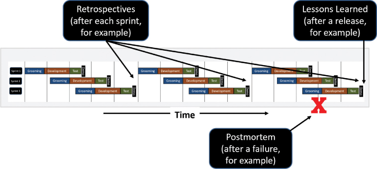
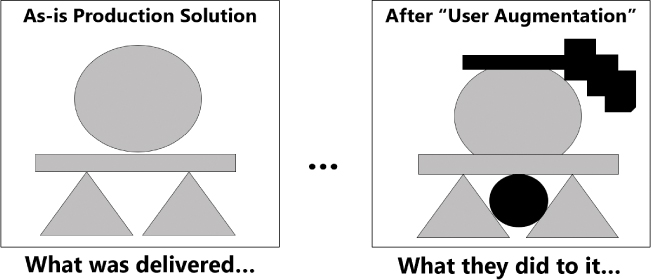
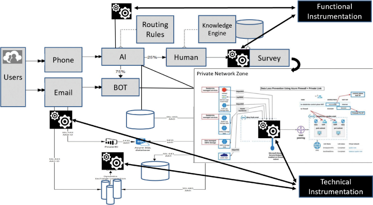

# 持续改进的反馈

你将在这一小时学到什么：

- 简单的反馈技巧
- 战略反馈和反思技巧
- 什么不该做：等待迟到的反馈
- 总结和案例研究

在这一小时中，我们将重点介绍三种简单的技术和两种更具战略性的技术，这些技术有助于收集和学习持续改进产品和解决方案所需的反馈。 从回顾和测试反馈，到收集无声的设计反馈，再到运行上下文映射和检测我们的产品和解决方案以获得持续反馈，我们在整个设计思维周期中有很多机会来学习和迭代。 第 20 小时结束时的"不该做什么"反映了等待延迟反馈的影响。

## 简单的反馈技巧

在生活和工作中，无论来源或频率如何，反馈都有助于我们学习。 反馈帮助我们改进我们是谁、我们的团队如何交付、我们交付什么以及我们如何改进我们交付的东西。 从一般的大局反馈到我们在技术设计思维模型中使用的反馈，反馈使我们走上了持续反思、持续改进和减少意外的道路。

> 笔记
> 不惊奇原则
> 考虑取悦用户和利益相关者意味着什么。 当谈到设计、用户界面、工件、标准文档、状态报告、反馈机制和其他结果时，我们不应该纠结于如何使用、阅读或以其他方式消费它们。 设计应该激发灵感、令人愉悦、直观，并推动清晰而不是惊喜。

### 行动中的设计思维：回顾
考虑驾驶汽车的类比，我们必须时不时地检查后视镜，看看发生了什么以及可能会追上我们。 偶尔回头看很重要，当然我们不能开很久，回头看才能进步。

获取反馈的最普遍和最全面的技术是简单地回顾一下最近发生的事情。 我们有什么做得好？ 我们应该停止做什么？ 我们可以做些什么不同和更好的事情？ 这些问题是 Looking Back 的基础，Looking Back 是一种包含许多其他技巧和练习的综合技巧。 Looking Back 下的常见技术包括

- 回顾。 在冲刺或发布结束时使用好、坏和丑的方法与团队一起运行经典回顾。 讨论团队完成了什么以及还有什么需要完成。
  - 想想为什么事情进展得不够快，以及在其他情况下为什么我们已经达到了合理的速度。 有什么不同之处，我们在哪里可以重复好的，改进坏的，完全消除丑陋的？
  - 通过使用回顾板对经典回顾进行扭曲，回顾板是一个 2×2 矩阵，分为四个象限以供讨论和反思。 四个象限包括
    - 我们将继续做的事情
    - 下次我们会做不同的事情
    - 我们想尝试的事情
    - 不再相关的事情
- 得到教训。 围绕基础广泛的成功、改进的机会、导致学习的失败以及项目、计划或重要时间段（例如为期六个月的原型制作、 测试和迭代）。 为了以后供他人使用，请确保在项目或计划的整个过程中（而不是仅在结束时）定期将这些知识记录在经验教训登记册或知识库中。
- 事后剖析。 对失误或彻底失败进行更深入的事后分析，无论它们存在于项目或计划生命周期中的哪个位置。 从成长心态的角度来看这些，如果我们重来，我们会做些什么。 请记住，事后分析不需要专门针对已死的事物！ 考虑对我们最伟大的胜利和成就也进行事后分析。 确定并庆祝我们做对的事情——因此绝对需要继续做——这些事情导致了这些胜利。

考虑这些反馈机制中的每一个如何倾向于占据时间线的不同部分（见图 20.1）。 在这些情况下，我们在设计思维过程中的地位不如我们在项目或计划生命周期中的地位重要。



图 20.1
回顾自然发生在项目或计划生命周期内的不同阶段或阶段。

为确保我们确实完成了回顾工作，请使用强制功能（如第 16 小时所述）并安排这些回顾、经验教训会议和事后回顾。 每个月在我们的日历上预留 30 分钟。 包括其他可以帮助我们了解进展顺利和不顺利的人。 并记录这些发现和见解。 回顾我们一路上吸取的教训对于理解而不是重复我们遇到问题的方式和地点至关重要。 回过头来学习、反思和思考。

### 行动中的设计思维：测试反馈

正如我们在第 19 小时中广泛介绍的那样，测试旨在为我们提供反馈。 各种形式的测试中的每一种，跨越传统的以及我们的设计思维启发的测试类型，都为我们提供了一种特定形式的反馈。 对于初学者，请考虑通过五种传统测试类型获得的反馈：

- 单元测试，它提供有关代码质量的反馈以及我们对用户需求、他们的用例或他们的用户场景的理解程度
- 流程测试，它提供有关我们的开发人员和测试人员遵守标准的程度的反馈，彼此交谈（在不同的开发人员编写流程的不同组件的情况下）等
- 端到端测试，它提供有关我们对关键功能区域及其大型流程的理解程度的反馈
- 系统集成测试，它提供有关我们对外部端点、与其他系统的集成以及协调的回归测试的考虑程度的反馈
- 用户验收测试，它根据适合使用、定向状态和验收向我们提供来自用户的反馈

此外，三种类型的传统性能测试通过以下方式提供反馈：

- 性能测试，它提供有关事务或流程的性能和用户体验的良好数据
- 可扩展性测试，为技术和架构团队提供反馈
- 负载和压力测试，它提供有关系统在负载下崩溃的位置以及哪些组件可能首先、第二和第三崩溃的反馈

最后，五种设计思维测试方法可帮助我们填补通过传统测试收到的反馈中的空白：

- A/B 测试针对两种备选方案提供用户反馈。
- 体验测试提供用户体验反馈。
- 结构化可用性测试在广泛的功能领域、用户体验等方面提供用户反馈。
- 在将产品或解决方案投入生产之前，解决方案访谈提供了最后一点有价值的用户反馈。
- 受速度启发的自动回归测试为功能团队、开发人员和测试人员提供了与他们的工作相关的见解，尤其是对提议的错误修复的质量和理解。

在将产品或解决方案投入生产之前，上述所有反馈功能都是有用的。 但是，在我们的产品或解决方案已经投入生产使用后，我们如何从用户那里受益呢？ 让我们将注意力转向另一种收集反馈的技术，称为静默设计。

### 行动中的设计思维：收集无声设计反馈

静音设计是我们可以从已经投入生产（因此已经使用）的产品和服务的用户那里获得反馈的一个重要方面。 根据 ```Peter Gorb``` 和 ```Angela Dumas``` 在 1980 年代的研究，无声设计反映了最终用户在我们将产品和服务部署到生产环境后对其所做的更改（见图 20.2）。 这些用户扩充代表了宝贵的反馈来源。



图 20.2
考虑一下我们的用户社区对我们的生产系统所做的更改如何代表收集和使用他们的反馈以持续改进和维持我们的产品和解决方案的另一个机会。
向 ```Silent Design``` 学习可以使我们已经部署的产品和解决方案更加可用。 因此，我们需要像用户反馈一样对待我们的产品和解决方案的用户衍生更改——因为这些更改确实是反馈。 此外，我们需要定期和重复地追求这些类型的见解。 毕竟，我们可以对积压工作进行的最简单的添加是合并来自用户社区的建议更改，这些用户社区已经在使用并找到了改进我们的产品和服务的方法。

## 战略反馈和反思技巧

虽然以前的技术很简单，但它们很有效。 但是，如果我们有更多的时间和预算，或者只是希望以不同于我们习惯的方式和更深入的方式处理反馈和反思，那么请考虑用于持续反馈的上下文映射和检测。 接下来将介绍这些技术中的每一种。

### 行动中的设计思维：上下文构建和映射

收集反馈的另一种方法是彻底颠覆这种反思方法。 与其询问一组最终用户关于他们如何工作和做什么的想法，不如亲自或虚拟地前往他们今天工作的地方。 然后被动地观察并了解他们如何使用他们当前的产品或服务（或者他们如何使用我们的原型或 MVP，我们可能将其作为他们当前产品或解决方案的替代品）。 注意他们完成工作所依据的环境和背景，并在此过程中构建和映射背景。

将此上下文组织成各种亲和力集群或组。 有些人喜欢使用 ```Futures Wheel``` 和 ```Possible Futures Thinking```（第 13 小时）或 ```AEIOU``` 中使用的 ```STEEP``` 首字母缩写词来表示提问热身技术和分类法（在第 10 小时中介绍）。 还有一些人可能更愿意创建由设计思维阶段或一组维度（如环境、挑战、经济、政治和系统、不确定性、需求等）组成的自定义上下文分类法。 考虑将它们组织成一个圆圈或雏菊，分别有五个或八个部分或花瓣（就像第 12 小时探讨的黄金比例思维一样）。

这种设计思维反馈技术有点像滚动旅程映射、"生活中的一天"分析和同理心沉浸。 情境构建和映射反映了研究、观察、理解和同理心。 当然，在这种情况下，我们的学习和同理心来自于被动地观察他人，而不是主动地亲自去做。 尽管如此，它仍然是一个强大的工具，可以用于回顾性学习和真正理解人们为什么想要他们所说的想要的东西。

### 行动中的设计思维：持续反馈的检测
从工程和电子领域借用，对我们的系统和解决方案进行连续反馈检测也称为创建闭环或反馈控制系统。 前提很简单：在我们的技术和/或系统功能中建立反馈机制，以便我们和我们的系统随着时间的推移学习并做出更明智的基于用户体验或基于满意度的决策。

- 技术仪表反馈循环：这两个选项中更容易的一个，其想法是通过系统管理工具和自动化云 ```Dev/Ops``` 在我们的技术堆栈中建立智能阈值。 这样，如果我们的技术堆栈遇到高需求，例如，它会根据需要自动提供额外的计算、内存或存储。 尽管需求高峰和低谷，这种反馈旨在从性能或吞吐量的角度保持用户体验。
- 功能检测反馈回路：这两个选项中难度较大的一个，其想法是将人工智能 (```AI```) 或机器学习 (```ML```) 构建到功能本身中。 通过这种方式，如果我们发现特定类型的用户或角色倾向于遵循被禁止的用户旅程，我们可以让开始满足该角色配置文件属性的用户更早地进入该用户旅程，大概可以推动更多的用户或客户 满意。 如果另一种类型的用户在获得 X 后倾向于需要或购买 Y，则可以对系统进行检测以寻找此类趋势，并更快地将 Y 提供给我们的 X 客户，再次提高用户的满意度和体验。

仪表技术和功能的组合可以帮助自动化重复的最终用户任务，使这些用户受益于更大的过程吞吐量或比其他方式更快地到达我们系统中的正确"位置"。 例如，我们可能会自动化如何自动路由从用户发送到客户服务功能的电子邮件，以实现最佳功能或最大的最终用户对特定类别的用户或角色的响应。

其他形式的自动化可用于推动对浏览我们系统的用户进行小型调查，以便我们可以更多地了解这些用户做出特定选择的原因。 我们还可以将 ```A/B``` 测试（正如我们在第 19 小时中介绍的那样）注入到我们的工作流程中，例如，在生产中派生抽样。 同样，我们可以将与用户体验相关的 ```AI``` 注入用户客户旅程的不同方面，或者在我们的系统中自动化结构化可用性测试的一个子集，或者配置我们的调查机制以自动调查每 100 个尝试新功能的用户。

因此，从技术和功能角度对我们的平台和解决方案进行检测可为我们提供源源不断的反馈，据此做出后续决策并得出其他见解（见图 20.3）。



图 20.3
请注意我们如何从技术和功能角度检测我们的解决方案，以便为我们提供源源不断的反馈和其他见解。
我们越了解我们的用户和他们的需求，我们就能更好更快地为他们提供服务，所有这些都是为了改善他们的用户体验和最终满意度。 反过来，更高的满意度有助于组织实现与组织的目标和关键结果 (```OKR```) 相关的收入流、盈利能力以及其他基于财务和价值的成果，如我们在第 17 小时中概述的那样。

## 什么不该做：等待迟到的反馈

虽然在任何时间任何形式的反馈都是有用的，但在部署原型或更新 ```MVP``` 之前等待数周的反馈并不是一个好主意。 但是一家金融服务公司就是这么做的。 该公司等待更新其基本的 ```MVP```，同时收集和分析来自早期一轮结构化可用性测试的反馈。 然后公司等待一个承诺完成新功能的冲刺……并等待其产品所有者和咨询经理的冲刺反馈……并等待更长的时间以等待另一个承诺完成更多功能的冲刺。

与此同时，该公司的准系统 ```MVP``` 只是静静地坐在那里，满足少数用户的需求，但对更广泛的其他用户社区没有任何帮助，这些用户正在等待机会参与进来。

通过让更广泛的社区处于停滞状态，等待他们动手，该公司错过了三个月的机会来尽早了解原型仍然缺少一些非常重要的附加功能，这些功能需要再花几个月的时间才能开发出来。 该公司也错过了将新用户引入其正在进行的工作的机会，这会影响 ```MVP``` 的采用。

这个教训很简单。 当反馈循环与我们正在完成的其他工作并行运行时，等待反馈。 但是，当我们准备好部署某些东西时，无论是原型或 ```MVP``` 还是对 ```MVP``` 的更新，只需部署即可。 很快就会有更多反馈的时间。 不要让完美成为学习和进步的敌人。 并且不要让对一些返工的恐惧阻止我们前进。 返工只是迭代的另一个词，这是我们将设计思维及其技术和练习应用于我们的设计、开发和部署工作的关键。

如果我们打算保持任何一种速度或坚持一个计划，我们需要留下迟到的反馈，以用于下一轮的功能更新。 把它当作产品或解决方案积压的意外礼物，继续前进！

## 概括

在这一小时中，我们专注于收集反馈的三种简单技术，包括称为"回顾"的伞式技术、各种形式的测试反馈以及收集静默设计反馈以进行持续改进。 然后我们将注意力转向了两种用于定期反馈和反思的战略技术，包括上下文构建和映射以及用于持续反馈我们的产品和解决方案的检测。 第 20 小时结束时的"不该做的事"反映了等待反馈的影响。

## 练习册

### 案例分析

考虑以下案例研究和问题。 你可以在附录 A"案例研究测验答案"中找到与此案例研究相关的问题的答案。

### 情况

```BigBank``` 的首席数字官 ```Satish``` 一直是反馈的忠实拥护者。 在加入 ```BigBank``` 之前，他围绕有意义的反馈建立了自己的职业生涯，并部署了相当多的转型业务计划和大型系统。

因此，当 ```Satish``` 要求你协助改进银行获取和使用反馈以支持十几个 ```OneBank``` 计划的方式以及其中一些计划的速度时，你知道这肯定是一个很大的问题。 事实证明，萨蒂什在他的反馈技术工具包中需要新工具。 他也有问题，需要你的新观点。

### 测验

1. 本小时所涵盖的反映从用户那里获得的反馈以及他们如何在产品或解决方案投入生产后对其进行更改的技术的名称是什么？

2. 哪种基础广泛的技术反映了来自传统和更新的设计思维测试技术广度的反馈和其他学习？

3. 回顾技术的保护伞下的三种具体反馈技术或方法是什么？

4. 哪种技术反映了我们应该与我们的设计和开发团队或其他冲刺团队定期进行的持续审查？

5. 关于反馈的时间，我们可以告诉萨蒂什什么，包括如何对待迟到的反馈？