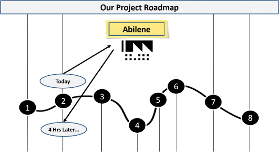
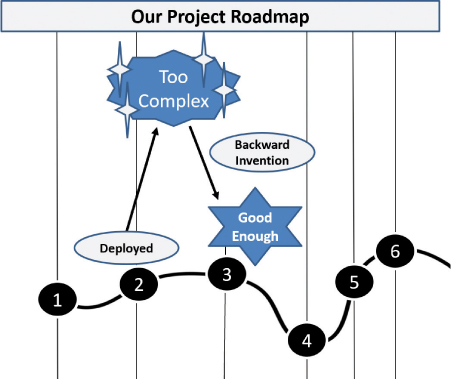
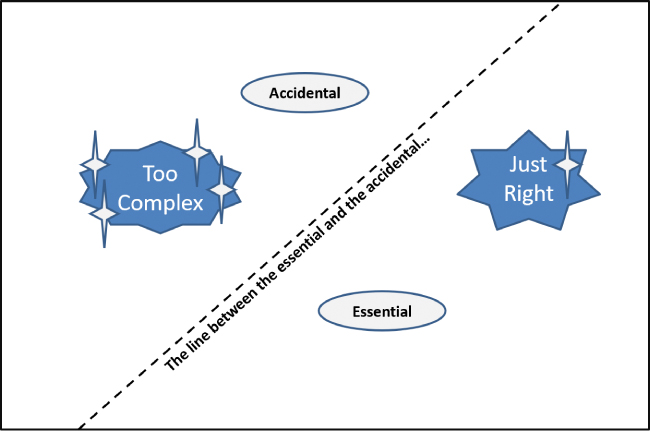

# 部署进展

你将在这一小时学到什么：

- 避开完美陷阱
- 新技术取得进展
- 部署和实现价值的边缘案例技术
- 不该做的事：过早部署
- 总结和案例研究

在之前的几个小时里，我们测试、随后改进并继续迭代我们的产品或解决方案，通常是为一小部分观众作为学习和改进的一种方式。 在这一小时中，我们将超越部署的基础知识，思考当我们发现自己陷入困境时部署产品和解决方案意味着什么。 在简要讨论了完美陷阱之后，我们转向了三种在部署停滞后恢复速度的新技术。 然后，我们介绍了两种边缘案例技术，当产品或解决方案的复杂性影响部署速度时，这些技术可能会有用。 我们以"不该做什么"案例研究结束第 21 小时，该案例研究侧重于过早部署的现实经验教训。

## 避开完美陷阱

正如我们从前几小时了解到的那样，在我们找到完美的解决方案之前，我们不能简单地反复迭代。 完美不存在； 总是有更多的工作要做，有更多的功能需要开发和交付，新的需求需要理解并出现在解决方案中。

- 设计永远不会完全完成。 然而，我们需要划清界限，并声称从发布的角度来看设计已经完成。 后续的设计更改请求需要放入下一个版本的待办事项列表中。
- 因此，开发也永远不会完全完成。 但我们仍然需要那条线，声称功能开发至少从发布的角度来看现在已经完成。 需要将新请求的功能推送到下一个版本。
- 以所有必需的形式测试一个版本也很容易无限期地继续下去。 但我们最终需要宣称测试已经足够好了。
- 最终用户培训和其他与解决方案准备就绪和采用相关的责任同样受到 100% 准备就绪的愿望以及及时培训和准备的需求以及允许低于 100% 准备就绪的帮助访问的影响。

避开完美陷阱的关键在于设定和管理期望。 在正确的时间与正确的人进行正确的对话将使我们走向成功。 几乎总是，人们更喜欢我们取得进步，并且当我们进行了正确的讨论并权衡取舍时，他们通常会接受这种观点。 虽然完美是进步的敌人，但足够好是进步的盟友。

## 取得进步的新技术
在第 17 小时的早些时候，我们探索了进步心态和一系列取得进步的技巧，重点是从小处着手，快速交付小部分价值，并围绕一组目标和可衡量的关键结果组织价值概念。

但是，如果交付存在根本性挑战怎么办？ 如果我们需要退后一步并做一些不同的事情才能成为我们希望成为的进步者怎么办？ 在这些情况下，我们可能希望首先尝试一组先驱技术，接下来将对其进行探索。 将这三种技术结合在一起，以创建在其他方法似乎不足或被证明无效时取得进展的秘诀。

### 行动中的设计思维：修复破损的窗户

在我们取得进展之前，我们可能需要先放慢速度并修复我们团队和用户周围的"破窗"。 基于犯罪学和社会理论，破窗理论指出，未解决的疏忽或不良行为的明显迹象会促进更大的疏忽和更糟糕的行为。 相反，正如犯罪学家 ```James Q. Wilson``` 和 ```George L. Kelling``` 于 1982 年在《大西洋月刊》中所分享的那样，如果我们解决我们周围的小违法行为和忽视证据，则发生更大违法行为和忽视的可能性几乎消失。 不良行为会导致更坏的行为，而良好的行为会导致更好的行为。

因此，当谈到取得进展时，我们技术团队的第一步可能就像搁置项目或倡议一样简单，首先清理和组织工作场所……或修复网站损坏的互联网……或恢复免费咖啡- 在大流行期间自然枯竭的全民工作福利。 对于我们的用户社区，在搬进来之前真正修复损坏的工作空间并清理共享空间的团队更有可能建立积极的情绪和支持。 当我们尽早投入成为解决方案的一部分时——当我们采用修复破损的 Windows 技术时——其他人会记住这一点并做出回应。

### 行动中的设计思维：避免阿比林悖论

1974 年，杰瑞·B·哈维 (```Jerry B. Harvey```) 写了一篇名为"阿比林悖论：协议管理"的文章，其中他分享了一个四口之家舒适地坐在得克萨斯州酷暑中玩多米诺骨牌游戏的故事。 其中一位家庭成员担心其他人对游戏感到厌倦，建议他们都开车一个小时到最近的城市阿比林吃晚饭。 其余的家庭成员一个接一个地同意了，他们相信其他人可能也想在炎热的天气里开车一个小时或更长时间去吃晚饭。

事实证明，实际上没有人想去阿比林。 一家人浪费了好几个小时开车去那里再开车回来。 更糟糕的是，他们吃了一顿糟糕的晚餐，没有人满意。 离开 4 小时后，他们发现自己仍停留在与之前相同的位置，如图 21.1 所示，没有取得任何进展。



图 21.1
当我们无法对他人进行投票并说出自己的真实需求时，我们就有可能浪费宝贵的时间和精力，但却完全无处可去，就像阿比林悖论一样。
教训或要点很简单：在做出耗费团队时间和进步的决定之前，我们需要了解人们的真实需求。 当我们面临可能需要或不需要的旅程时，请考虑如何以谨慎或匿名的方式对群体进行民意调查，以验证他们的真实需求。 我们也需要说出自己的真实需求！ 我们可能会对我们的发现感到惊讶。 更重要的是，就像去阿比林进行一次不必要的旅行一样，我们可以避免各种阻碍进步的弯路和反捷径。

### 行动中的设计思维：减少认知负荷

有时我们无法取得进步仅仅是因为我们有太多的事情要考虑和思考。 过多的认知负担会破坏或拖慢原本知道下一步需要做什么的人员和团队。 过度的认知负荷会剥夺我们采取我们今天理解的下一步最佳步骤的能力，而是思考和考虑 x 并思考和考虑 y。

减少认知负荷技术只是关于识别和减少我们给自己和他人施加的无关负荷。 一旦我们完成了我们的思考和构思，我们可以做些什么来从思考转为做呢？ 我们如何重新聚焦并开始执行？ 我们可能需要如何以不同的方式思考或操作以启动行动？

例如，我们可能会发现对我们的认知活动进行时间限制以创建一个明确的停止点或强制功能以继续前进并完成工作很有用。 当我们发现自己停滞不前或陷入困境时，这些都是重要的考虑因素和需要回答的问题。 记住"做"的力量，并采取必要的步骤来扭转局面！

## 用于部署和实现价值的边缘案例技术

正如我们在上一节中读到的那样，我们可以使用一些技术来帮助我们保持或恢复速度。 当复杂产品或解决方案的部署本身被证明太具有挑战性时，两种这样的边缘案例技术可能会很有用。

### 行动中的设计思维：逆向发明

有时，复杂性的重压使我们无法部署价值。 正如我们在本书的众多示例和案例研究中看到的那样，我们希望为我们的用户和客户带来最大价值的愿望可能会让我们陷入困境。 我们可能会等待更多的冲刺完成，或者等待用户界面得到完善，或者等待数据加载无误地完成，或者等待我们的 ```MVP``` 获得最新功能的集合。 当然，在某些情况下，这种等待是必要的。

然而，在许多情况下，正是等待让我们无法部署和实现价值。 在这些情况下，可能是时候将向后发明作为再次取得进步的一种方式来实践了。 向后发明要求我们剥离功能和复杂性，以此作为简化设计、原型或 ```MVP``` 的一种方式，如图 21.2 所示。 这样的练习针对的是我们继续努力解决的特性或功能，我们的 A/B 测试、结构化可用性测试和其他早期测试表明我们仍然不具备的特性和功能。 当用户在解决方案访谈中与我们分享某个特定功能令人恼火并且应该删除时，请执行此操作。 听从他们的建议，即使只是短期的。 并继续与较小的社区一起改进和迭代那些令人讨厌和有问题的项目，以便有一天我们可以再次构建我们精简的设计、原型或 ```MVP```。



图 21.2
当部署停滞时，向后发明可以将我们带到一个地方，在我们解决复杂性和其他阻碍我们前进的细节的同时，我们至少可以取得一些进展。
行动中的设计思维：平衡本质和偶然
有时在我们的部署中，我们发现复杂性正在干扰价值实现。 确实，我们应该通过从原型设计、测试、MVP 和试点收集的反馈更早地发现这种情况。 但是这些事情发生了，当它们发生时，重要的是能够退后一步并考虑：

- 复杂性从何而来？
- 这种复杂性是绝对必要的吗？
- 复杂性是偶然的、另一个决定的结果还是疏忽？
- 在我们正确解决这个复杂性问题的同时，是否有更轻量级的设计、界面或可交付成果可以快速转向？

平衡本质和偶然技术的价值在于帮助我们思考从我们面前的复杂性中真正需要什么。 当我们考虑一个复杂的想法、设计、界面、可交付成果、部署过程、入职方法等时，了解可以消除的复杂性和必要的复杂性是很重要的。 例如，在想法、设计或界面中发现的价值与失去该价值之间通常有一条模糊的界限。 如图 21.3 所示，这条线将必需品与偶然品、必需品与非必需品或可选品分开



图 21.3
确定区分重要事项和偶然事项的细线可以帮助我们找到不必要的复杂性并将其剥离以再次取得进展。
基于哲学，我们如何将平衡本质和偶然技术应用到我们的工作产品中？ 我们如何才能学会识别这条区分本质与偶然的细线？

- 有些功能比其他功能更重要。 我们是否可以追溯到用户社区早期认为必不可少的那些功能？
- 强制排名可以帮助我们找到本质和偶然之间的界限。 我们能否使用第 13 小时中概述的"购买功能"技术来迫使用户"把钱花在嘴边"，从而在"资助"和因此必不可少的内容与非必要内容之间划清界限？
- 评估和讨论还可以阐明必备品和可有可无品之间的界限。 我们可以通过匿名管理的调查找到那条线吗？

需要明确的是，我们经常发现偶数是有用的。 我们甚至可能依赖于这些偶然的项目。 例如，考虑在冲刺中如何意外引入报告中显示数据的某些方式。 我们的用户可能会发现这种偶然的报告方法很有用并加以利用。 几周或几个月后，在随后的冲刺中删除了这样一个意外的功能后，我们可能会遭到那些开始依赖该功能的人的强烈反对。 无论如何，随着我们通过他们的生产反馈更好地了解我们的用户（再次考虑从第 20 小时收集无声设计反馈），我们可能会将那些新发现或新理解的需求纳入我们的 sprint 待办事项列表和发布计划中。

## 不该做的事：过早部署

我们经常强调避免完美的必要性。 但现实是，人们和团队往往更倾向于交付一些东西——任何东西——而不是什么都不交付。 毕竟，团队想要证明自己的价值，而企业高管和发起人自然倾向于（正确地）推动价值实现。 在原型、```MVP``` 和试点的世界中，尽早部署并经常部署绝对是正确的心态。

然而，在为更广泛的用户社区部署我们的产品或解决方案时，过早部署会带来另一个问题：用户感知和采用。 也就是说，如果产品或解决方案没有经过全面测试和"烘焙"，并且我们没有针对我们糟糕的烘焙技能适当地设定这样的期望，那么我们的最终用户将在第一天就迅速反映我们的工作存在感知和情绪问题。 再过几天，如果没有任何变化，我们可能会冒着失去用户的风险，因为他们完全反对采用我们的产品或解决方案。

这样的例子太常见了，它们通常反映了开发和部署的瀑布方法。 想一想一家大型制药公司的故事，该公司在其企业资源规划 (```ERP```) 解决方案上投入了三年多的时间。 在花费 6000 万美元的咨询和许可费用并将解决方案介绍给一小群资深且可能具有影响力的用户后，该公司最终将该解决方案部署到其更广泛的社区。 它在第一天就发现，这项巨大的投资未能满足许多用户在外观、功能和性能方面的期望。 为什么？ 因为 ```ERP``` 项目和业务团队未能开展有助于我们规避此类结果的设计思维启发活动。

例如，几乎没有原型设计，除了一小部分朋友和家人之外，零演示。 该公司拒绝运行 ```MVP```，因为害怕展示一个功能齐全的系统，并且它决定不使用 Pilot，因为它错误地认为它的展示和讲述演示几乎一样有效，而且成本要低得多。 最后，这家制药公司的支出远远超出了预算，只是为了弥补已建成的产品与最终用户的预期之间的差距。

## 概括
在第 21 小时，我们假设我们最终可以部署我们的产品或解决方案以进行更广泛的使用。 在简要讨论了完美陷阱之后，我们介绍了三种在进展停滞或陷入困境时取得进展的新技术：修复破损的窗户、避免阿比林悖论和减少认知负荷。 每种技术都涵盖了与部署进度相关的独特挑战。 然后，我们概述了两种在复杂产品或解决方案的部署被证明具有挑战性时有用的边缘案例技术，包括向后发明和平衡必要与偶然。 我们以"不该做什么"案例研究结束第 21 小时，重点是过早将我们的产品和解决方案部署到生产中的经验教训。

## 练习册

### 案例分析

考虑以下案例研究和问题。 你可以在附录 A"案例研究测验答案"中找到与此案例研究相关的问题的答案。

### 情况

你的发起人和银行的首席数字官 ```Satish``` 一直担心部署失误和意外。 一些借口让他担心其中两位倡议领导人可能过度设计了他们的解决方案。 在其他情况下，```Satish``` 担心追求完美的测试和训练。 你提醒他，有很多技巧和练习可以用来思考部署问题和恢复进度。

作为回应，```Satish``` 组织了一个研讨会，邀请所有负责该银行 ```OneBank``` 计划的部署专家参加。 他希望你涵盖部署本身之外的新技术或方法，真正专注于恢复停滞的部署和恢复失去的速度的新技术。

### 测验

1. 许多组织在避免完美陷阱方面遇到的四个问题是什么？

2. 哪种技术反映了坏行为会导致更坏行为的前提？

3. 阿比林悖论故事的寓意是什么？

4. 哪种设计思维技术假定简化产品、解决方案或服务有助于采用？

5. 在哲学或设计思维中平衡本质和偶然是什么意思？