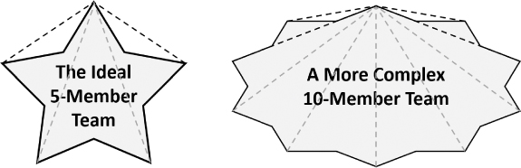
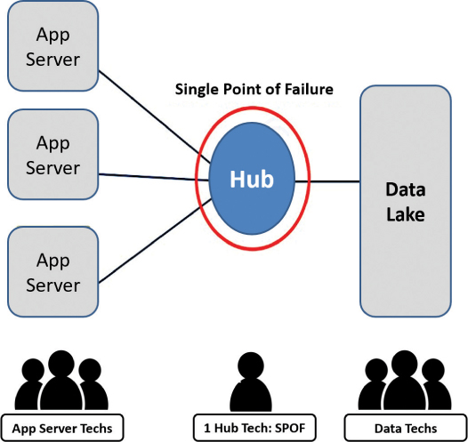

# 规模经营

你将在这一小时学到什么：

- 有效扩展的技术和练习
- 运营弹性技术
- 维持系统和价值的技术
- 什么不该做：规模与特征的要求
- 总结和案例研究

在这一小时中，我们将超越简单部署解决方案的意义，而是关注扩展该解决方案及其背后的团队的意义。 随着用户群的增长，我们探索了幕后必要的运营和维持变化，以提高运营弹性。 最后，我们探索了三种额外的技术来维持我们新扩展的系统。 与解决"我们应该扩展以满足更多用户，还是应该构建更多功能来满足当前用户？"相关的"不该做的事情"。 问题在第 23 小时结束。

## 有效扩展的技术和练习

在商业和公民支持解决方案的世界中，扩展这些解决方案以供更多人使用并从中受益最终胜过为 MVP 或试点受众开发新功能的需求。 扩展我们的解决方案意味着扩展我们的人员和支持团队的技能组合和数量。 但是，如果我们的人员扩展策略不健全，我们可能无法负责任地将我们珍贵的解决方案部署到它预期的更广泛的社区。

幸运的是，有几种受设计思维启发的策略可以有效地扩展人员和团队。 在接下来的几页中，我们将考虑如何通过按五个规模扩展我们的团队。 我们还探讨了如何通过减法游戏来提高我们团队的效率和速度。 之后，我们考虑如何使用 AntiFragile Validation 来确认个人力量或弹性，同时让我们的团队获得更长的寿命。 结合使用这些技术和方法来创建强大的扩展方法。

### 行动中的设计思维：按五分之一缩放

当我们环顾工作场所时，我们会发现许多不同规模的团队和工作组。 有的很大，领导和工人的控制跨度在1:20到1:50之间。 在其他情况下，较小的团队通常由管理和参与日常工作场所任务的个人领导。 这样的董事总经理、管理架构师、管理顾问等可能运行 1:5 到 1:10。 在其他情况下，项目经理可能会运行由 5 到 50 人组成的虚拟团队，这些团队仍然有直属经理。 在其他情况下，一些组织采用自我管理团队，其中管理和领导由集体决定，并分布在较小的 3 到 10 人功能团队或其他自我管理和半自治团队中。

如果我们关心增长和可扩展性，最好的方法是什么？ 专家、经验和研究出人意料地一致认为，神奇的数字介于四到六人之间，这反过来又导致了五人制技术的兴起。

五分之一缩放的要点与其说是关于控制跨度或管理结构的类型，不如说是关于最高效团队的规模。 研究表明，最佳团队规模为五人，随着团队规模达到两位数，团队功能障碍和其他绩效问题呈指数增长。 美国海军海豹突击队和海军陆战队消防队以四人一组的形式组织。 麦肯锡的参与团队也是如此。 典型的手术团队由六人组成，研究表明创新团队的最佳规模在四到六人之间。

正如我们在图 22.1 中看到的，我们的团队变得越大，对额外的点对点通信和协作的需求就越大，因此开销也越大。 这些连接的重量最终会消耗宝贵的带宽，剥夺团队的效率和能力来推动共识建立、决策制定和速度。



图 22.1
通过由四到六名团队成员组成的团队的成长来扩展组织； 额外的团队成员需要点对点的复杂性，这会增加开销并占用团队宝贵的带宽。

> 笔记
> 两个披萨规则！
> 亚马逊名人杰夫·贝佐斯 (Jeff Bezos) 曾经谈论过"两个披萨规则"。 他对理想团队规模的看法？ 团队的人数不应超过两个比萨饼可以喂饱的人数，即大约四到六人。

### 行动中的设计思维：减法游戏

当我们将团队规模扩大到可能超过五六个人时，我们需要考虑可以从这些团队中移除什么。 是什么阻碍了团队的成长，什么在今天不再有效，因此应该消除什么？ 考虑这些问题的一种方法是玩减法游戏。

时间和人员：减法游戏练习需要一个完整的团队（可能是 4-10 人）总共 20 分钟。

减法游戏是一种高度集中的计时练习，反映了发散思维和头脑风暴的结合。 它包括三个定时步骤，仅持续 10 分钟，之后还有另外 10 分钟用于分享和讨论要消除的内容以及如何进行：

1. 在开始的三分钟内，每个团队成员单独就团队或工作组今天的运作方式进行头脑风暴。 团队的哪些方面（或团队直接外部的因素）作为约束？ 什么曾经有用但今天成为进步或速度的障碍？ 是什么增加了不必要的摩擦或随机分配我们的团队和我们的个人注意力？ 忠于发散思维，目标是数量； 想法和减法目标列表越长越好。
2. 在接下来的四分钟内，两人一组或三人一组，彼此分享我们的清单。 确定新的减法目标并将其添加到组列表中。
3. 在接下来的三分钟内，在同样的两到三人小组中，集中在一个减法目标周围。 该小组如何设想从所有合并列表中删除这一项？ 考虑到两到三人的小团体规模，三分钟就足够了。 注意不要过度考虑这个消除练习。 一个团队越小，越接近挑战，就应该迅速确定要消除什么以及如何消除它。

随着 10 分钟的结束，通过更广泛的团队进行循环，与其他两到三人的小组分享和讨论我们的单一减法目标。 根据需要向其他人展示，以进一步讨论、确定优先级并使这些更改成为必要，以保持团队的效率和速度。

### 行动中的设计思维：长寿的反脆弱验证
植根于心理学和医学，最近由纳西姆·塔勒布 (```Nassim Taleb```) (2012) 推广，反脆弱性背后的概念是通过力量的镜头来认识我们个人的压力和挣扎。 我们如何从挑战和反对我们的事物中变得更强大？ 不仅仅是生存或应对，而且实际上变得更强大，与脆弱相反。 想一想骨折的骨头如何在受到外部压力后更快地愈合并长得更强壮。 那些抗脆弱的人不只是从逆境中恢复过来； 他们变得更强壮。 反脆弱性反映的不仅仅是弹性； 他们从艰难的环境中走出来，变得更好、更强大。

反脆弱验证旨在确认我们将生活压力转化为工具和经验以获得新的力量和适应能力的程度。 我们如何验证反脆弱性？

- 寻找一种坚持不懈的态度，一种表明我们将战胜困难的态度。 这种态度体现了反脆弱性。 我们都经历过艰难的工作环境和近乎不可能的人际关系。 如果我们告诉自己我们会在这些情况和关系中幸存下来，而且我们确实做到了，那么我们就是在炫耀我们的抗脆弱技能。
- 寻找压力的外在迹象及其内部表现。 我们正在经历并放手吗？ 如果我们允许自己将压力和挣扎视为只需要我们关注一段时间的事情，那么我们就是在反映一种反脆弱的观点。 反脆弱者接受这样一个事实，即苦难总有一天会结束。
- 了解我们的同事和团队在反脆弱识别连续体中所处的位置。 他们的应对情况如何？ 他们的成长和适应情况如何？ 考虑团队的文化或工作场所氛围如何反映反脆弱态度。 团队是否以健康的方式运作和应对围绕团队合作、项目和日程安排的不可避免的压力？

验证反脆弱性是关于检查我们的团队和我们自己，探索我们和我们的团队如何应对和应对困难和创伤。 自我药疗不是抗脆弱的，忽视压力也不是。 反脆弱者识别、面对并采取措施管理它。 通过网状网络与他人联系（第 4 小时）、依靠我们的共享身份（第 15 小时）、积极倾听彼此（第 6 小时）等等，会有所帮助。 反脆弱性最明显的迹象可以在个人和团队有效应对、成长和进步的记录中找到。

> 引用："风吹灭了蜡烛，却点燃了火焰。"
>
> ——纳西姆·塔勒布

## 运营弹性技术

考虑到第 19 小时中提到的服务可靠性工程，我们不仅需要强化和自动化我们的解决方案，还需要强化和自动化我们的团队。 反脆弱验证帮助我们超越我们所涵盖的弹性，但也有一些实用技术可以提高团队弹性。 设计思维尤其为我们提供了一个有趣的有用技术库，其中两个直接借鉴了灾难恢复能力和风险管理领域。 在下一节中，我们将探索伙伴系统配对和杀死英雄。 他们一起组成了久经考验的二人组和提高团队弹性的秘诀。

### 行动中的设计思维：伙伴系统风险配对
将团队成员配对在一起是很常见的做法，包括将新团队成员与资深团队成员配对。 较新的团队成员受益于较资深同事的智慧和经验，有趣的是，老手也倾向于学习新的思维和操作方式。 它被称为 ```Buddy System Pairing```，是最强大和最古老的技术之一，用于跟踪、确保冗余和尽快执行知识转移，同时保护和保留操作。 同样，通过这种有意的冗余，```Buddy System Pairing``` 不仅提供了操作弹性，而且还充当了风险管理和灾难恢复的最佳实践。

伙伴系统配对还有其他好处。 我们可以从与我们有联系的其他善意和积极的人那里学习并付诸实践。 第一步就是出现，建立联系。

第二步，我们与谁联系，同样重要。 例如，如果我们或我们的领导者真的对更聪明地成长和执行感兴趣，我们需要以一种反映有意多样性的方式结伴。 考虑以下：

- 我们应该与看起来或听起来与我们或我们的团队成员不同的人联系。
- 我们应该考虑"伙伴关系"将如何发挥作用； 观察、学习和考虑另一个人的"生活中的一天"（```DILO```）将是确认一对之前的理想步骤。
- 我们还应该考虑在更短的时间内与各种不同的人建立联系，以接触更多的思考和执行方式。

当结对时，我们需要考虑我们伙伴过去成功和学习或失败的记录，以帮助我们融入我们今天可以个人使用的课程和学习。 例如：

- 与有完成困难项目和计划历史的伙伴联系。
- 与可能担任高级职位的人联系（如果确实可能的话），再次从更广泛的经验中学习。
- 与以在模棱两可和不确定性中航行而著称的伙伴联系。 这样的伙伴可以帮助我们了解角色的"内容"以及应对复杂性的"方式"。

再次提醒你，与他人结成伙伴不仅能帮助我们的新会员或初级会员。 伙伴关系也有助于伙伴关系的另一半。 伙伴关系自然会帮助其他同事和我们整个团队。 有意识地结对并相互依靠是一种让每个人都变得更强大的有趣方式。 这是我们为什么要成为伙伴的根本原因。

### 行动中的设计思维：为系统弹性杀死英雄

我们的下一个技术，杀死英雄，是灾难恢复计划和练习的长期主要内容。 这个想法既简单又出色，就我们的目的而言类似于"人类原型设计和测试"。 我们使用 ```Slay the Hero``` 来测试我们的系统和流程的人类弹性。

在工作中，我们可能会将 ```Faizel``` 视为我们的超级明星生产支持专家和我们解决方案的全能主题专家。 我们每天都依赖 ```Faizel```，当系统进行每月系统更新和年度灾难恢复练习时更是如此。 如果没有 ```Faizel```，我们不知道该怎么办。 这正是我们有时需要形象地杀死 ```Faizel``` 的原因：看看团队如何"挺身而出"并在他缺席的情况下承担他的责任。

为什么杀死英雄很重要？ 人们随便说每个人都可以被替换，但当谈到 ```Faizel``` 的技能、冷静的举止以及解决看似任何问题的能力时，我们不太确定。 但是，就像一个好的系统一样，我们不能让一个人成为单点故障 (```SPOF```)。 而 ```Faizel``` 确实是 ```SPOF```； 例如，他是我们团队中唯一的网络中心技术人员。 我们需要"人员冗余"，就像我们在云基础设施和新一代云应用程序中内置技术和设施冗余一样。

当 ```Faizel``` 突然休假时会发生什么？ 如果他需要待在家里照顾生病的亲人怎么办？ 如果有一天他突然消失了怎么办？ 我们的解决方法是什么？ 更重要的是，"谁"是我们的变通办法？ 在这些场景在现实中上演之前，我们需要在心理上演练它们（通常也通过有形的练习）。 为此，请想象我们的关键人物、团队或流程（在本例中为 ```Faizel```，我们的英雄）从画面中移除了一段时间。 如果我们唯一的网络枢纽技术 ```Faizel``` 从图 22.2 中消失，会发生什么？ 我们有备份吗？



图 22.2
使用杀死英雄技术来制作原型并测试我们的人类单点故障 (SPOF)。

使用杀死英雄来制作原型并测试我们团队的弹性以及我们个人从轻微系统故障到重大灾难中恢复的能力。 我们是否过于依赖特定的人、系统或流程？ 我们是否将合适的技能分配给了足够多的人？ 我们是否有在紧急情况下可以依靠的后备人员和合作伙伴？ 提前了解这些选项——并仔细思考和测试我们将如何在没有我们英雄的帮助下行动——将帮助我们在现实世界中不可避免地发生的情况下生存下来。

## 维持系统和价值的技术

一旦解决方案开始交付其预期收益和其他成果，我们就需要更加关注可持续性。 只有通过与我们的人员和团队保持一致的运营、监控、升级、发展和扩展我们的解决方案的规范性策略，才能维持价值和其他收益。

### 行动中的设计思维：规模化运营结构

当我们完成部署并开始大规模运营时，需要规划、部署并随着时间的推移优化我们的规模化运营结构。 虽然超出了本书的范围，但我们需要像处理产品、服务和解决方案一样，对我们的支持组织进行原型设计、测试和强化，以便它们可以帮助我们维护一个可用的、可扩展的和有弹性的解决方案。 有很多影响，但最容易被忽视的一些包括

- 定时。 一旦我们部署了 ```MVP``` 或 ```Pilot``` 或其他类似生产的解决方案来支持最终用户，就立即建立初始支持组织。
- 进化。 请记住，我们的支持组织需要随着我们的解决方案的开发和部署而成长； 当我们微调我们的支持结构及其与用户社区的联系时，将这种需求视为迭代的另一个要求。
- 入职。 尽可能早地将关键支持人员纳入解决方案的生命周期，再次创建机构知识和经验的记录。

还要考虑所需支持的广度。 准备好我们的规模运营结构意味着将人置于我们可能遇到的特定问题和情况的中心。 对于大规模运行的系统：

- 我们的解决方案团队需要来自负责维护和更新的内部或合同开发人员和测试人员团队的访问和帮助。
- 我们的全球用户社区需要一个以某种形式全天 24 小时可用的 1 级帮助台。
- 我们的1 级服务台需要知识管理能力和二级升级支持（有时称为 ```L2``` 或 ```Level 2``` 支持组织）。
- 我们的 2 级支持组织将需要联络员与我们的硬件和基础设施提供商、云提供商、应用程序和软件提供商、安全和第三方应用程序供应商等合作（通常是 L3 或 3 级应用程序支持的职责） 团队）。

其他团队和人员也需要在支持方面进行部署（同样，这超出了本书的范围）。 实践我们的设计思维过程，以理解和理解与我们的产品和解决方案相关的无数人和团队。 通过尽早建立有意的合作伙伴关系和建立支持组织，我们可以有意识地维持我们解决方案的实用性、价值以及对我们的最终用户和利益相关者的其他好处。

### 行动中的设计思维：验证 OKR 和价值
一旦将解决方案部署到生产环境中——无论这意味着作为 MVP 还是试点或完整的生产系统——我们都需要随着时间的推移保持其优势。 为此，通常会创建一个有意且持续的利益或价值工作流。 需要明确的是，在我们构思、解决问题、制作原型和测试时，我们应该更早地验证和思考价值衡量标准。 但是，一旦用户和客户开始从花在设计思维过程中的时间中意识到价值，为了我们自己和我们的利益相关者，我们有责任积极并定期地验证我们

- 正在交付和实现我们解决方案目标中确定的价值
- 可以以一组特定于目标的关键结果的形式来衡量该价值
- 使我们的人员和团队与价值创造和维持过程保持一致
- 正在采取必要的步骤来维持和增长该价值

实现和衡量价值的必要性需要体现在组织的维持计划中。 一个好的维持计划反映了组织的愿景、使命、不断发展的战略、用于实现价值的产品和解决方案，以及为实现和衡量组织战略、产品和解决方案的有效性而建立的各种目标和关键结果——所有这些 这是进一步成长和转型的绝佳反馈回路。

> 笔记
> 使人们与价值保持一致
> 价值实现的前提是团队成员理解、尊重并为交付价值和其他预期结果负责。 实现价值并因此取得成功需要个人与他们期望并负责交付的结果之间的这种一致性。 请务必使我们的人员和团队与他们的产品和解决方案预期提供的价值保持一致！

### 行动中的设计思维：维持的静音设计

正如之前在第 20 小时中概述的那样，我们不能忘记从我们的用户已经在生产中对我们的产品和服务做出的静音设计选择中收集到的知识。 请记住，我们的用户社区对我们的生产系统所做的修改和添加代表了另一个收集和使用他们的反馈以持续改进和维持我们的产品和解决方案的机会。

作为设计领导者和思想家，我们需要向正在解决我们未知和已知的产品差距和流程的用户学习。 我们需要在学习时积极主动，将这些知识融入我们的产品和解决方案待办事项列表中。 我们为使我们的产品和解决方案更有用而尽早做的任何事情都会将时间还给今天采用和调整它们的每个人。

## 什么不该做：规模与特征的要求

当我们到达绝对必须提供可衡量价值的时间点时，我们需要最终决定规模何时胜过新功能； 也就是说，当社区的许多需求超过了少数超级用户"闭着眼睛"一厢情愿的需求时。 对于一家拥有 100 年历史的保险公司，```CRM``` 项目的业务联络人最终需要单方面做出该决定。 她的技术领导同行似乎很高兴继续改进成功 ```MVP``` 的特性和功能（正如我们在第 17 小时中讨论的那样）。 ```MVP``` 开始时有 40 个兴高采烈的用户，六个月后，这个 ```MVP``` 在功能方面有了很大改进，但只为 50 个兴高采烈的用户提供服务。

与此同时，该企业正在为其承诺已久的解决方案尖叫。 该公司已经厌倦了将部分解决方案与夜间界面更新和在不同系统和屏幕之间旋转的转椅串在一起的混合包。 它同样厌倦了这家缓慢部署价值的技术领导者在九个月的时间里做出的"下一季度"承诺。

公司的业务联络人最终不得不介入并要求将当前的解决方案按原样移交给业务的其余部分。 她正确地解释说解决方案已经足够好了（正如我们在第 11 小时中介绍的那样）。 是时候让规模胜过部署新功能的愿望了。 在接下来的三个月中，以 500 和 1,000 名用户为增量，业务的不同部分每两到三周就加入一次。 正如大多数团队成员所预料的那样，新用户也对他们的新解决方案感到高兴。 该解决方案的业务联络帮助整个组织在部署和实现价值的过程中避开了一个主要地雷。

## 概括
在第 22 小时中，我们探讨了如何通过按五倍扩展、减法游戏和长寿的反脆弱验证来扩展和完善支撑我们解决方案的团队。 然后，我们概述了两种有助于随着用户群的增长提高运营弹性的运营和维持技术，包括伙伴系统配对和杀死英雄。 后来，我们探索了三种额外的技术来维持我们新扩展的系统，使用规模运营结构、验证 ```OKR``` 和价值，以及考虑维持的静默设计。 第 22 小时结束时，与避免"规模与新功能"决定相关的"不该做什么"。

## 练习册

### 案例分析

考虑以下案例研究和问题。 你可以在附录 A"案例研究测验答案"中找到与此案例研究相关的问题的答案。

### 情况

```Satish``` 和 ```BigBank``` 的执行委员会 (```EC```) 对你对其倡议领导者、高管和其他利益相关者的支持感到高兴。 他们现在正在寻求你的帮助，以帮助 ```BigBank``` 在重新构想银行的未来和重塑银行如何快速交付其新业务能力和成果的过程中扩展其 ```OneBank``` 的多项计划。 ```Satish``` 要求你主持一个问答环节，以回答委员会围绕扩展方法、解决方案可扩展性方法、操作注意事项等提出的几个问题。

### 测验

1. 虽然存在多种方法，但我们探索了哪两种方法可以为 ```BigBank``` 等组织提供一种思考和扩展支持银行各种项目和计划的团队的方式，尤其是当他们变得富有成效并快速发展时？

2. 哪种技术迫使我们考虑价值衡量以及价值的概念在整个项目生命周期中可能发生了怎样的变化？

3. 增强运营弹性的两种技术是什么？

4. ```Silent Design```在解决方案和系统可持续性的整体追求中扮演什么角色？

5. 哪种技术可以帮助 ```BigBank``` 考虑其团队和人员的脆弱性？