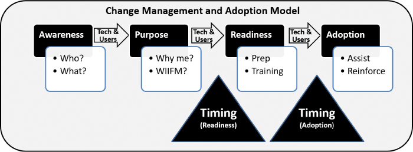
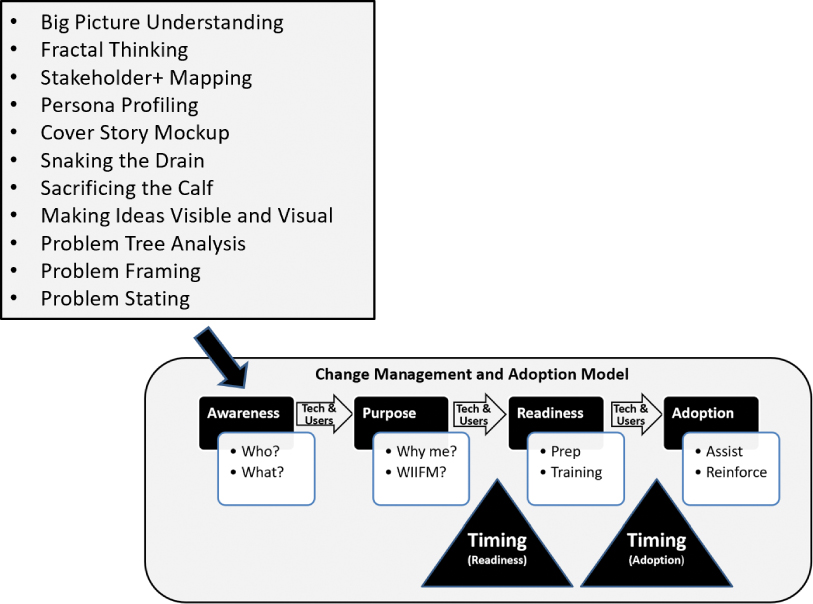
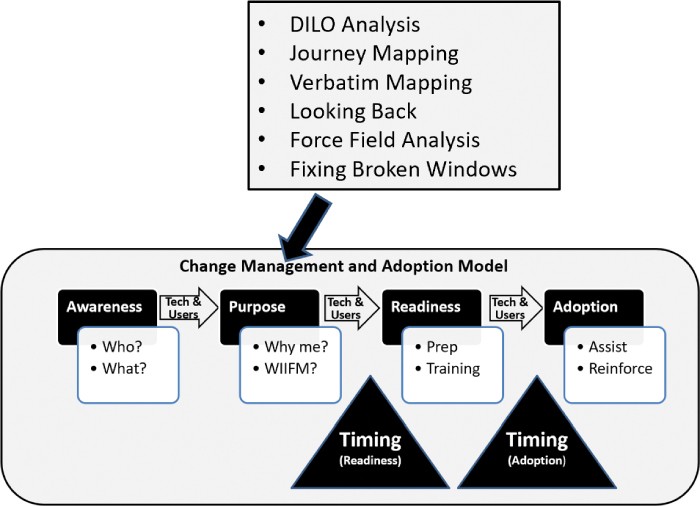
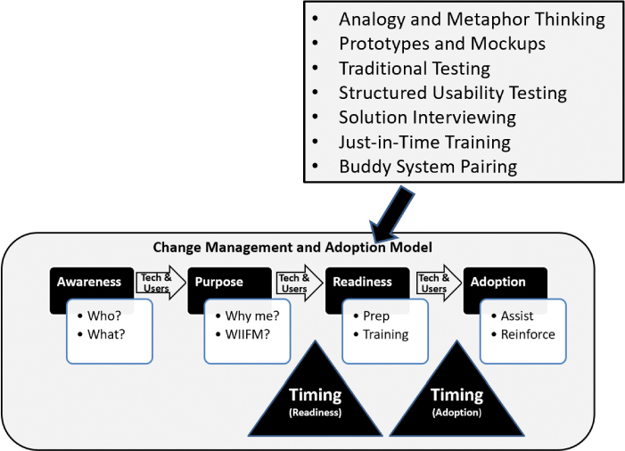
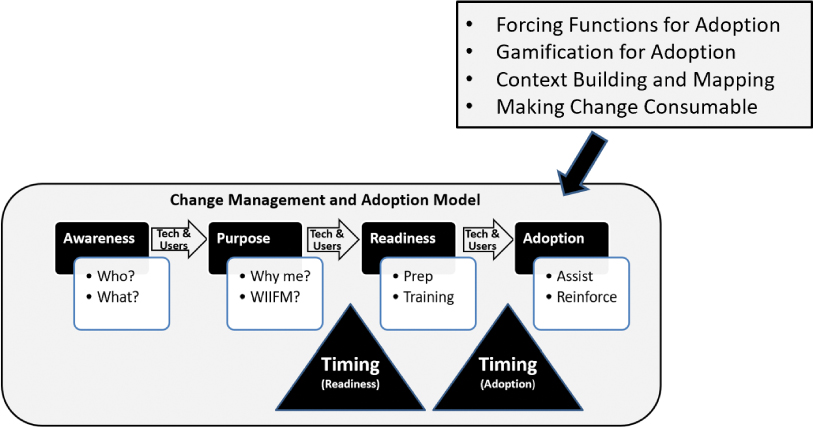
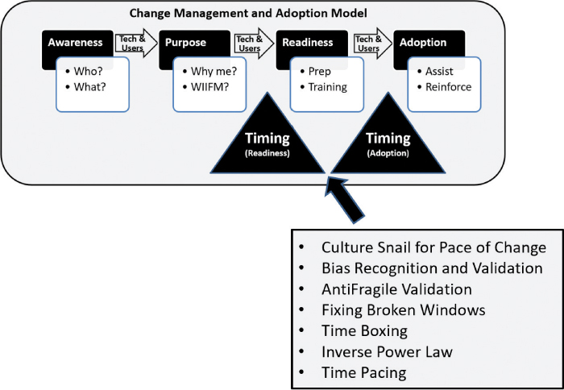

# 让改变变得有粘性

你将在这一小时学到什么：

- 变革管理和采用
- 四相变化过程
- 建立意识的方法
- 提供目的的技巧
- 通过设计思维推动准备
- 采用变革的四种技巧
- 时间变化的技巧
- 什么不该做：变革管理可以等待
- 总结和案例研究

在第 23 小时，我们回顾了一些简单的变更管理和解决方案采用技术和练习，目的是让我们的新解决方案在他们的用户社区中具有"粘性"和持久性。 为了组织这些设计思维技术和练习，我们将它们连接到一个简单的四阶段模型以进行变更管理和采用。 当我们逐步介绍用于创建意识、提供目的、驱动准备和执行采用所需工作的方法时，每个阶段都标记了几种流行的设计思维方法。 在第 23 小时结束时，我们提出了一个重要的"不该做什么"，这与在解决方案设计、开发和部署周期中过晚解决变更管理有关。

## 变革管理和采用

从广义上讲，变革管理和采用反映了实施和接受变革所需的流程和技术。 对这些问题的关注至关重要，但往往被削弱； 管理变革是一项耗时且艰苦的工作。 有鉴于此，我们希望本小时分享的技术和练习对即使是最有经验的变革管理专家也有帮助。

> 笔记
> 变更管理与变更控制
> 就我们的目的而言，变更管理和变更控制满足两个截然不同的目标。 变革管理直接关注管理一个人在面对变革时需要驾驭的变革。 因此，变更管理适用于将被要求使用新产品或业务解决方案的用户社区。 变更管理还适用于在设计、开发和部署新的支持业务的产品和解决方案的过程中必须学习和采用新技术的技术团队。 然而，正如我们在前几个小时所述，变更控制的重点是跟踪和记录对计划或项目的更改，而不是交付该计划或项目或由该计划或项目提供服务的人员。

什么是变革管理？ 将其视为用户社区及其支持技术团队必须导航以了解、理解、准备和接受其运营方式变化的步骤。 正如我们在图 23.1 中所见，这个改变过程似乎很容易。



图 23.1
变更管理和采用流程反映了用户社区和与该用户社区合作以导航变更流程的技术团队所需的步骤。
采用，特别是图 23.1 所示的变更管理流程的最后阶段或步骤，用户社区实际使用或采用变更，或者技术团队实际与支持用户社区的技术交互并部署。 此类变化可能包括新的运营方式，以及支持这些新运营方式的新技术或更新的技术和解决方案。

正如我们所有人的经验所知，采用可以说是人们实现的最困难的飞跃。 我们喜欢坚持旧的经营方式。 在复杂多变的世界里，我们往往会珍惜那几样静止一时的东西——这些东西给我们带来安慰，确实在我们周围的一切都在变化时起到了锚的作用。

> 笔记
> 人与变化
> 改变需要时间，因为它是一次一个人、一天一次被采用的。 请记住，人们接受变革，而不是团队或组织。

但一切最终都会改变。 当那些给我们安慰的东西最终屈服于变化时，理解和采用下一步的过程对于成功改变至关重要。

## 四相变化过程

有许多模型和方法可以帮助人们和组织驾驭和思考变革。 ```Burke-Litwin``` 详细的 10 要素变革模型和 ```Kotter``` 著名的变革 8 步模型是变革的两个长期重量级人物。 ```PROSCI``` 的变革模型是一个更简单且高效的变革三阶段流程，以及他们的个人变革五步法。

出于此处的目的以及前面图 23.1 中的说明，我们将变更过程组织为四个阶段，这些阶段通常与大多数这些流行的变更管理模型保持一致。 这些阶段包括创造意识、提供目标、推动准备和采用变革。 接下来将介绍这四个阶段。

## 创造意识的方法
几乎所有变革管理专家都同意，意识是着陆变革的关键和早期行动。 在我们的案例中，意识等同于了解谁将使用即将发生的变化或受其影响，以及这种变化意味着什么。 图 23.2 说明了提高意识的有用技巧或练习，包括以下内容：

- 了解全局可以帮助我们了解将使用我们的新产品或解决方案或以其他方式受到变更影响的更广泛的社区。 通过这些方式，我们可以制定更有针对性的宣传活动和抵押品。
- 分形思维可以让我们了解从组织、公司、行业或更广泛的生态系统的高层向我们回响的是什么。 有了这种理解，我们就可以创建引起组织不同级别共鸣的意识活动和倡议。
- 利益相关者+ 映射对于映射用户社区的主要领导者、发起人、导师、教练和其他此类促成者很有用。 包括这些人所说的话以及我们认为他们在想什么也可以给我们另一个层次的洞察力。
- 人物画像和分组可以帮助我们更好地了解特定变革的目标对象。 不要忘记包括受影响的用户社区以及支持产品或解决方案的各种技术团队角色和角色。
- 使用封面故事模型来激发兴奋感，并将用户社区或技术团队与新技术支持的业务愿景联系起来。
- 考虑蛇形排水和牺牲小腿技术来影响意识，解决过去的失误，并减少阻力。
- 最后，让我们的"意识"想法和抵押品可见和可视化，以推动更快的共享理解，并在多个层面上与参与变革的社区和技术团队建立联系。



图 23.2
许多设计思维方法都可以帮助我们建立意识。

对于某些听众，我们甚至可能会探索潜在的问题或情况以建立联系并获得更深入的支持。 我们在第 9 小时使用的技术和练习可能有助于建立这种意识，包括问题树分析、问题框架和问题陈述。

当我们通常结束创建意识的工作时，我们可能会进入下一个变革管理阶段，我们的任务是提供目标并回答经常不言而喻的问题"它对我有什么好处？"

## 达到目的的技术

当我们在个人层面考虑变革管理时，我们最终会到达目标和 ```WIIFM``` 的地方，或者"这对我有什么好处？" ```WIIFM``` 可能是整个变革管理流程的关键组成部分，因为它直接反映了变革是如何发生的：一次一个人，一次一天。 没有良好目标感或 ```WIIFM``` 的人很少会支持即将到来的变革。 更糟糕的是，这些人可能会被动地避免变革或积极地反对变革，从而破坏良好的变革管理实践。

提供目的的有用设计思维技术也帮助我们回答另一个问题："为什么是我？" 如图 23.3 所示，请考虑以下内容：

- 将变化映射到用户的"生命中的一天"（```DILO```）分析或旅程地图，以通过解决问题、改善用户旅程、简化关键 ```DILO``` 任务等来创造兴奋感。
- 使用逐字映射来展示已共享的问题、问题或机会的种类，这些问题或机会突出了支撑变革需求的问题。
- 公布回顾反馈和其他从早期原型和测试中学到的东西，以验证即将发生的变化的有用性。
- 与将受到即将到来的变革计划影响的社区或技术团队一起完成视觉力场分析"支持和反对提议的变革"练习。 然后使用由此产生的变革分析作为客观促进和支持 ```WIIFM``` 变革的一种方式。
- 使用力场分析练习的"反对变革"分析作为反馈，以影响即将到来的变革计划的业务案例、```OKR```（目标和关键结果）、设计、原型制作、测试等。
- 将修复破窗技术与其他变更管理技术一起应用，作为今天主动修复问题区域的一种方式，这将帮助我们在明天取得更大的成功。



图 23.3
请注意设计思维技术的多样性，这些技术可用于提供目的和解决"这对我有什么好处？"的问题。

更好地理解"为什么是我？" 和 ```WIIFM```、用户社区及其支持技术团队需要开始思考在变革真正落地或被采用之前需要解决的各种准备相关项目和技术。 我们称之为第三阶段就绪，这是我们下一节的主题。

## 通过设计思维推动准备工作

除了创造意识和提供目标之外，变革管理还反映了组织对变革的准备和能力。 我们需要了解用户社区是如何为变化做好准备的，这样我们才能参与一系列旨在加强这种准备的活动。 步骤包括了解变革的规模或幅度，以及了解业务组织对变革的准备情况。

在平行意义上，变革管理也说明了技术团队从底层技术和流程角度支持变革的能力。 新解决方案几乎总是意味着新的技术解决方案和基础设施、数据技术、应用程序和集成平台、用户体验技术等。

我们可以用来帮助我们做好准备的设计思维技巧和练习，如图 23.4 所示，包括以下内容：

- 考虑一下类比和隐喻思维如何帮助我们围绕对变革、变革过程以及组织和团队将面临的差距的共同理解进行调整。
- 原型和模型可以帮助我们以一种早期和安全的方式看到即将发生的变化并与之互动，我们不仅知道会发生什么，而且有机会影响该变化的设计和实施。
- 各种形式的测试，尤其是 ```SIT``` 和 ```UAT``` 以及受设计思维启发的结构化可用性测试和解决方案面试（在第 19 小时中介绍）有助于组织和团队突出准备差距。
- 及时提供培训也很重要。 培训需要对整个社区开放，供整个社区使用，根据需要以不同的视频和书面形式和格式呈现，离线提供以供日后参考（以及供未来的社区用户和今天不在该职位的技术团队成员使用）， 并交付不太早但也不算太晚。
- 工具和类似的推动因素也是推动准备的一个重要方面。 考虑 ```wiki```、常见问题解答 (```FAQ```)、支持组织、伙伴系统配对（在第 22 小时中概述）、社区领导和导师、高级用户和用户组等在帮助整个社区解决问题方面发挥的作用， 解决问题，并吸引未来的用户和技术团队成员。



图 23.4
请注意用于推动准备的变更管理技术的广度。

需要计划变更，以便它在用户和技术社区中很好地落地。 正如我们所提到的，更改本身必须可供每个相应的社区使用。 一般准备和准备问题包括以下内容：

- 社区是否真正了解新产品或解决方案如何与组织或团队的整体组织愿景保持一致？
- 在采用计划的变更之前，我们是否询问过社区对准备情况和需要解决的差距的看法？
- 我们是否评估了对现有业务或技术相关流程进行更改的准备情况？
- 现有的组织结构、角色和特定团队将如何受到影响，因此从战术准备的角度来看需要发生什么？
- 我们是否考虑过我们的变革计划如何影响其他系统和技术，因此从更广泛的准备角度来看可能需要适应什么？
- 我们是否有一组明确且可衡量的目标和关键结果（```OKR```，在第 17 小时中讨论），我们可以依靠这些目标和关键结果来具体准备？

请记住，准备是采用之前的最后一步。 理想情况下，为实现采用而需要进行的任何更改，包括激励新行为，都应在此阶段进行。 我们越早考虑即将到来的变化，当最终采用变化的那一天到来时，我们就会过得越好，这将在下面讨论。

## 采用变革的四种技巧

当最终需要帮助我们的用户社区或技术团队采用更改时，我们使用以下技术，其中前三种技术已在之前概述过，并共同创建了一个可重复的推动采用的方法：

- 强制采用函数
- 采用游戏化
- 上下文构建和映射
- 改变消耗品

接下来让我们简要地看一下这些与采用相关的技术，如图 23.5 所示。



图 23.5
考虑一下这些设计思维技术在推动用户社区或技术团队采用变更时如何为我们提供良好的服务。

### 行动中的设计思维：强制采用功能

我们知道强制功能有助于我们取得进步并完成困难的事情。 在采用新系统时，我们需要考虑我们可能拥有的强制功能。

- 我们当前的系统是否需要因为高维护成本的原因而退役？
- 我们当前的系统是否需要新的许可才能使它们变得更加昂贵？
- 我们当前的系统是否不再符合监管或合规要求？
- 从支持的角度来看，我们当前的系统是否处于生命周期的尽头？

当然，其中一些强制函数比其他函数更容易接受。 所有这些都反映了逃离当前状态的原因，而不是寻求更好的产品或解决方案。

### 行动中的设计思维：采用游戏化

正如我们在第 3 小时简要介绍并在第 18 小时详细介绍的那样，游戏化技术可以帮助我们提高参与度、积极性和反馈，并激励新的行为。

- 我们应该在第 19 小时中概述的最早的测试工作流中使用游戏化。早期反馈促进健康的解决方案和用户社区的支持。
- 通过向完成所需培训的人员（尤其是提前或按时完成培训的人员）颁发徽章、积分或有形奖励，在我们的培训工作流中采用游戏化。
- 将团队之间的健康竞争游戏化，以全面推动更好更快的培训成果。
- 当我们接近上线时，通过颁发有意义的奖品和礼品卡或通过抽奖获得更昂贵的礼物，例如 500 美元的礼品卡、```Apple iWatch``` 或 ```Microsoft Surface Go```（在最后一段中），将其他活动游戏化 为了采取变革，我们需要引起所有人的注意）。

使用游戏化来帮助我们在整个变革管理和采用过程中创造更多的能量和兴奋。

### 行动中的设计思维：上下文构建和映射

正如第 20 小时所述，亲自或虚拟地前往我们的最终用户和技术团队今天工作的地方可以在几个方面帮助我们。 在现场举办培训课程，不仅可以提供帮助，还可以为即将上线或积压的工作提出新想法。 观察他们如何使用培训系统。 注意混淆的区域和缺点的讨论或认为必要的解决方法。 所有这些见解都充当我们今天和未来产品或解决方案版本中可以组织和使用的上下文。

### 行动中的设计思维：让改变成为可消费的
第 23 小时的新内容，使改变成为可消耗的是一个经常使用的技巧和技术集合，用于着陆改变、驱动能量、创造更有效的训练等等。

- 为即将发生的变化提供早期沟通。
- 使用图片和数字使更改可见和可视化。
- 分享围绕即将发生的变化的早期愿景，使用封面故事样机等技术描绘未来的图景。
- 分享同样让人们对未来感到兴奋的"差异制造者"和 ```WIIFM``` 数据点。
- 发布三到五分钟的短片宣传视频，让人们对未来更加兴奋。
- 将关键用户和有影响力的人拉入原型设计和测试阶段，并确保他们的反馈在整个组织中得到倾听和回应。
- 确保组织的高管和其他领导者谈论即将发生的变化，让其他人对这些变化的可能性感到兴奋。
- 还要确保培训视频和其他附属资料易于访问、易于使用、足够详细以满足需求，并且足够短以引起人们的注意。

我们越是从改变的可口性、可访问性和可消费性的角度考虑改变，我们的改变就越容易被采纳。

## 时间变化的技巧

在前几个小时，我们介绍了时间变化的技术，包括时间步调和逆幂定律。 这些和此处介绍的其他技术可以帮助我们根据用户社区或技术团队的准备情况、采用准备情况以及最重要的是其消耗或采用更改的带宽来确定何时准备好进行更改。 毕竟，一个准备充分的商业社区，例如，可能没有时间适应变化，直到其商业周期中的特定时期。

历史背景也很重要。 在管理、处理和采用变更方面，我们需要考虑组织或团队的业绩记录。 关键问题包括

- 大多数项目或计划是否有专门的变革管理团队？
- 组织或团队是否遵循结构化的变革管理和采用方法？
- 最近，变化被视为消极或积极的经历吗？
- 当前的变革计划是否反映了整个组织或团队的共同愿景和理解？
- 从战术上讲，当前的变革举措是否反映了强大的 WIIFM 或其他变革原因？
- 员工行为或运营流程需要在多大程度上改变才能实现预期结果？
- 组织或团队是否有能力在必要的范围内改变其行为？
- 考虑到飞行中的其他变化，组织或团队是否有足够的带宽和能力来适应这种变化？
- 是否存在可能干扰此特定变革计划的相互竞争的优先事项？
- 此变革计划是否会改变组织或团队的结构或所需的角色？

根据前面的问题，接下来我们可以转向几个设计思维技术，这些技术在前几小时中介绍过，这些技术会影响变更的时间，如图 23.6 所示：

- 当组织或团队每天一次一次地改变一个人时，变革步伐的文化蜗牛如何阐明过去的困难或困难？
- 偏见识别和验证可以通过哪些方式帮助组织或团队在变革之旅中更有计划或更谨慎？
- 社区目前如何处理压力或最近的组织或团队创伤？ 团队在多大程度上体现了反脆弱行为？
- 作为一个组织或团队，我们是否需要着手修复破损的窗户以向我们的社区展示我们了解他们的需求？ 或者以某种方式展示我们是如何在一起的？
- 对任何剩余的关键项目进行时间限制以确保它们得到计划和完成是否有意义？
- 如果我们通过逆幂定律的视角来审视组织或团队，地平线上是否存在必须适应的重大变化或力量？
- 最后，关于 ```Time Pacing```，在我们承诺这个最新变革计划的时间之前，是否有我们必须更好地理解的频率或持续时间问题？



图 23.6
之前在各种上下文中介绍过，考虑这种经过验证的设计思维技术的横截面如何帮助我们着陆和"时机"改变应该着陆或可以被用户社区或技术团队吸收。
当然，其他时间因素也可能在起作用。 考虑最近的过去以及社区最近浏览的内容。 查看今天的优先事项和当前正在进行的更改。 最后，展望未来。 在这些范围内使用前面的技术，确定成功整合当前变革计划所需的时间块。

## 什么不该做：变革管理可以等待

我们不能在向用户介绍新产品或解决方案之前几天才完成变更管理和采用的工作。 不过，一家大型政府机构就是这么做的。 为了响应早期的宣传活动，揭示了一个不情愿的用户社区，该机构做了很多工作来设计一个新的员工支持门户网站。 它单独制作原型，通过两个不同的门户供应商提供的门户选项工作。 选择门户平台后，该机构独立开发和测试解决方案，使用项目团队成员开发和执行测试用例。

政府机构还将变革管理深入到项目计划中。 可以肯定的是，很少有人再次关注提高意识。 在第一轮意识反馈显示该机构的一个组织中没有人愿意改变之后，该项目实际上是一项绝密任务。 该机构从未与其他组织正式分享该项目的存在。 没有绘制任何愿景，也没有制定和分享 ```WIIFM```。 该机构忽略了意识，也未能分享新员工门户的目的。

在项目后期，该机构开始了一些工作以促进准备工作。 一个团队被要求收集一组视频和培训资料，以帮助潜在用户熟悉门户的界面。 项目团队成员制作了视频，展示了人们知之甚少的用例。 看到这些视频后，用户社区员工会窃笑项目团队甚至不了解门户的真正用途。

用户社区的一个子集被要求使用从未实际使用该门户的团队构建的测试用例进行用户验收测试。 少数出现的人在执行高级 ```UAT``` 测试用例时也窃笑。 在该门户网站要取代旧的网站和在线清单集合的几周前，就为该门户网站的目标用户安排了培训。

门户项目团队在潜在用户社区中使用了两种最古老的强制函数形式。 首先，该团队表示，如果用户未能参加培训，他们的经理将收到通知。 其次，他们在一个日历周内提供半天的培训； 如果用户错过了培训，将没有其他机会再次参加。

门户培训组在培训中强调，新门户发布后，旧网站和在线资源将被淘汰。 不会有并行测试，也不会有与淘汰遗留系统和资源相关的其他通信。 大量无视培训任务或碰巧生病或在该周休假的员工从来没有正式机会听说他们最喜欢的工具被迫退役。

一些经理召开会议以确保他们的团队知道门户即将到来并且旧工具将被淘汰。 其他经理在上周末发送了电子邮件。 当决定性的门户网站发布的那一天终于到来时，它的新用户以各种方式迎接它，从不满到公正、顺从和蔑视。 该机构错过了创造兴奋、提供有价值的东西以及将可以真正帮助该机构存在的公民的东西交到员工手中的机会。 相反，该门户网站只是另一个拙劣的变更管理示例，错失了推动采用和实现价值的机会。

## 概括
在第 23 小时，我们回顾了一个简单的四阶段变革管理和采用模型，重点是建立意识、提供目标、推动准备和采用变革。 对于这些阶段中的每一个，我们然后概述了一些设计思维技术和练习，这些技巧和练习被证明对使我们的新解决方案"具有粘性"和持久性很有用。 我们在第 23 小时结束时提出了一个重要的"不该做的事"，它涉及当我们将变更管理推迟到未来某个时间后发生的事情，并且错过了在解决方案设计、开发或部署之前尽早进行社交和土地变更的机会。

## 练习册

### 案例分析

考虑以下案例研究和问题。 你可以在附录 A"案例研究测验答案"中找到与此案例研究相关的问题的答案。

### 情况

萨蒂什最近一直在谈论变革过程，并将反脆弱团队、数字化毅力以及即使在最艰难和最不确定的时期也能茁壮成长的能力联系起来。 然而，他担心如果其 ```OneBank``` 计划的领导者不能很好地实施他们的变革，该银行将如何蓬勃发展。 由于银行的不同用户社区、地理和远程影响、缺乏一致的管理变革和采用的方法，以及一些制定不当的变革意识活动，这些着陆挑战变得更加复杂。 萨蒂什知道他需要一些帮助，他认为他的倡议领导者可能需要新的方式来思考变革管理。

考虑到这些挑战和需求，```Satish``` 要求你与五位倡议领导者以及他们各自的业务和技术团队成员一起举办研讨会。 他引用了当前的主题，即帮助银行重新构想其未来，并围绕一套新的业务能力和价值驱动因素集结其员工和团队。 你得出的结论是，有必要演练思考和管理变革的意义，并讨论变革管理和采用的技术。

### 测验

1. 本小时概述的变革过程的四个阶段是什么？

2. 本小时涵盖的哪些设计思维技巧可能有助于提高对变更的认识？

3. 在我们为即将到来的变革做好准备时，可能会采用本小时概述的哪些设计思维技术？

4. 本小时概述的哪四种技术可以帮助组织和团队采用变革？

5. 本小时概述了哪些可以帮助组织和团队考虑变更时机的设计思维技术包括哪些？