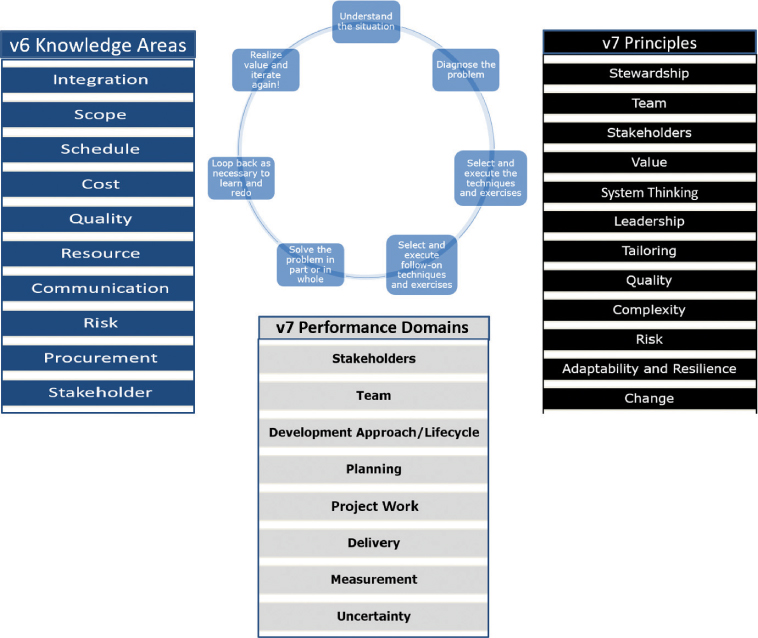
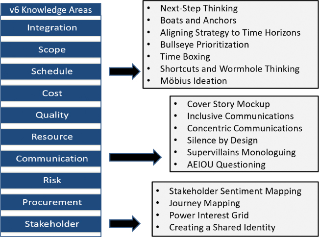

# 项目速度的设计思维

你将在这一小时学到什么：

- 项目管理速度
- 领导和治理
- 利益相关者和期望
- 发展方针
- 风险管理
- 日程管理
- 管理范围
- 交货和质量
- 沟通与协作
- 什么不该做：没有勇气，就没有未来
- 总结和案例研究

在我们在一起的最后一个小时，我们不会介绍新的设计思维练习或技术，而是通过项目管理速度的镜头重述我们之前所涵盖的内容。 我们这一小时的目标是双重的：提供单一的方法来源，并围绕项目管理协会 (PMI) 如何看待选定的项目管理知识领域、绩效领域和指导原则来松散地组织这些方法。 虽然每个 PMI 知识领域、项目绩效领域和指导原则都很重要，但从速度的角度来看，有些知识领域比其他知识领域更有影响力或更重要。 我们以熟悉的"不该做什么"主题结束这一小时，反映了面对未知时需要勇气来推动价值。

## 项目管理速度

尽管并非总是如此，但技术项目和计划往往由项目经理、产品经理、计划负责人、工作流负责人或功能团队负责人以专业方式管理或以其他方式领导。 即使是自我管理的团队仍然需要以产生结果的方式组织他们的工作和执行。 当然，每个人都需要考虑如何更快地实现预期结果。

当我们通过速度的镜头查看 ```PMI``` 的知识领域、绩效领域和指导原则时，重要的是要反思我们在第 1 小时中介绍的"进步设计思维周期"（见图 24.1）。 考虑循环如何从了解情况开始，然后诊断问题，选择和执行设计思维技术和练习，根据需要选择后续技术和练习，全部或部分解决问题，循环回头学习，以及 在我们迭代时实现价值。 这整个过程可以应用于每个 ```PMI``` 项目管理知识领域、绩效领域和指导原则。



图 24.1
应用进步设计思维循环来考虑和选择对每个项目管理知识领域、绩效领域或原则有用的练习和技术。

使用设计思维循环以取得进步，项目和倡议领导者可以考虑如何使用特定技术或练习来增强他们在管理风险、沟通、利益相关者等方面的运作方式。 图 24.2 帮助我们在这种情况下可视化 ```PMI``` 的知识领域（在流行的项目管理知识体系或 ```PMBOK``` 的第六版中概述）。



图 24.2
请注意进步设计思维周期如何帮助我们将 ```PMI``` 的 10 个项目管理遗留知识领域映射到一组特定领域的设计思维技术和练习。

求助于一组设计思维启发的练习和技巧可以帮助我们以更快的速度前进——或者再次取得进步——当传统的方法和方法让我们失望时。 通过这种方式，可以更快地交付价值。

同样，我们可以将进步设计思维周期应用于 ```PMI``` 最新指南（```PMBOK``` 指南第七版）中共享的绩效领域和原则。 请注意图 24.2 中反映的旧版 ```PMI``` 指南与图 24.3 中的 ```PMI``` 新指南之间的相似之处。


图 24.3
设计思维循环以取得进步还可以帮助我们将 ```PMI``` 的 8 个项目绩效领域和 12 个原则映射到一组特定领域的设计思维技术和练习。
在这一小时的剩余时间里，我们围绕项目管理原则、绩效领域和知识领域的合并组织了一套设计思维技术，这些技术涵盖了过去十年 ```PMI``` 的指导：

- 领导和治理
- 利益相关者和期望
- 发展方针
- 风险管理
- 日程管理
- 管理范围
- 交货和质量
- 沟通与协作

接下来通过追求、保持或增加速度的镜头涵盖每个区域。 请记住，除了这八个合并之外，在之前的几个小时中还详细介绍了许多其他项目管理原则、领域和知识领域！

## 领导和治理
为了有效，领导力必须是可见的和视觉的。 领导者必须现身并从前线领导——被看到和被听到——并展示变革和进步所必需的那种善解人意的领导力（```Tyler```，2019 年）。 多年来，项目管理协会共享指导和一套用于领导和管理资源的传统技术。 最近，```PMI``` 分享了其对领导风格和行为的看法，包括如何针对特定情况调整这些风格和行为。 这些帮助我们快速移动的基础技术的一个子集包括：

- 根据情况、选择和行动来指导和锻炼特定的领导风格以推动成果
- 通过能力和承诺发展领导力
- 使用视频会议代替面对面会议
- 开发跨越远程和地理边界的虚拟团队
- 通过头脑风暴和其他基本构思技巧解决问题

如果我们寻求更有效和更快地领导和管理我们的项目和计划，我们还可以转向设计思维方法，包括

- 简单的规则和指导原则，让我们的团队清楚地了解我们做什么、何时做以及如何执行（第 4 小时）
- Stakeholder+ 和 Stakeholder Sentiment Mapping 用于理解和跟踪关键关系（第 7 小时）
- 用于确定关键关系优先级的权力/利益网格（第 7 小时）
- 框架治理以清晰和规律地协作和推动关键利益相关者的联系（第 15 小时）

从团队领导的角度来看，使用以下技巧和练习可以更快地建立关系和共享理解，所有这些都会带来更高的长期速度：

- 通过设计实现多样性，以建立能够更有创意地构思的高效互联团队（第 4 小时）
- 网状网络连接和维护我们远程工作人员岛屿的健康并避免群岛效应（第 4 小时）
- 反脆弱验证用于验证我们的个人和团队即使在困难之后也变得更强大（第 22 小时）
- 学习和团队的成长心态，通过创造学习一切的工作氛围，并在面对不可避免的失败时相互宽容（第 4 小时）
- 视觉思维以更快地建立共同理解（第 5 小时）
- 用于团队协调和简化复杂情况的类比和隐喻思维（第 11 小时）
- 创建共享身份以将我们的员工彼此、与其他团队以及我们的用户社区联系起来（第 15 小时）
- 分享和强化组织愿景的讲故事（15 小时）

当然，还有更多的技巧和练习可以帮助我们更有效地领导，但前面的列表是实现和保持速度的坚实设计思维基础。 现在让我们将注意力转向吸引利益相关者和管理他们期望的技巧和练习。

## 利益相关者和期望
正如第 7 小时所述，在发布第六版 ```PMBOK```（2017 年）后的某个时间，项目管理协会改变了对利益相关者的立场，从管理他们转变为让他们参与并管理他们的期望。 用于"管理利益相关者"或他们的期望的传统技术包括利益相关者分析、经典的利益相关者映射、优先排序和排名技术、参与评估矩阵、冲突管理技能以及提高政治和文化意识的团队技能。

当传统方法不完整或根本不够时，请转向此处概述的设计思维技术和练习，以更好地理解、与利益相关者建立联系，同时更好地吸引他们，并管理他们的期望：

- 了解大局，深入了解组织更广泛的行业和生态系统（第 6 小时）
- 用于探索组织最近的旅程和当前状态的文化蜗牛和文化立方体（第 6 小时）
- 识别和验证偏见（第 6 小时）
- 用于理解层次结构和监控关键关系的利益相关者+映射（第 7 小时）
- 利益相关者情绪图，用于跟踪利益相关者随时间的满意度（第 7 小时）
- 了解优先级关系的权力/利益网格（第 7 小时）
- 根据不同类型的同理心进行同理心和最有效地与他人联系的同理心映射（第 8 小时）
- 包容和同心沟通、讲故事、结构化文本和其他沟通技巧（15 小时）
- 创建共享身份以创建单个虚拟团队，而不管涉及的实际团队数量如何（第 15 小时）
- 各种可视化技术，用于更深入地联系并更快地达成共识（第 5 小时和第 12 小时）
- 简化复杂的瀑布类比和类比和隐喻思维（第 4 和 11 小时）

在考虑到领导力、治理和利益相关者的情况下，让我们来看看如何通过一组设计思维技术和练习进一步影响所选的开发方法。

## 发展方针
在技术部署和软件开发项目的世界中，开发方法的概念通常归结为两个对立的极端：一方面是自适应或敏捷方法，另一方面是更顺序的瀑布方法。 说实话，几乎所有的组织都在两者之间运作，从每个极端中借鉴所需的东西，以他们认为可以的方式尽可能迅速和负责任地行动。

根据项目或计划的阶段或需求，选择的开发方法也可能有所不同。 自适应方法在迭代或增量开发方面可能会有所不同。 外部现实，包括监管审计或治理门的需要，也可能影响该方法。

然而，无论具体的开发方法如何，一组受设计思维影响的练习和技术通常可以帮助组织更快地思考、测试和行动：

- 建立思考以开始并更快地学习（16 小时）
- 粗略和现成的原型制作以获得早期反馈（包括模型、线框和第 16 小时中概述的其他方法）
- 提高清晰度的流程（第 16 小时）
- 使战略与时间范围保持一致以实现智能发布和冲刺计划（第 13 小时）
- 用于计划、组织和执行工作的时间盒、节奏和逆幂定律（第 16 小时）
- 改变景观以提高速度的捷径和虫洞思维（第 18 小时）
- 智能 ```IP``` 重用以更快开始（第 18 小时）
- 模块化思维以更智能、更快速地构建（第 3 和 11 小时）
- ```MVP```、```POC``` 和试点以获得有意义的用户社区反馈（第 17 小时）
- 自动化回归速度以更快地管理变更（第 19 小时）

让我们把注意力转向许多人认为最重要的项目管理知识领域或绩效领域：风险管理。

## 风险管理
就项目和倡议领导者的工作而言，风险管理可以说仅次于沟通。 一门成熟的学科，甚至风险管理都从一组设计思维练习和技术中受益匪浅，这些练习和技术从根本上改进了我们识别潜在风险的方式，将它们纳入我们的风险登记册，并在项目或计划的生命周期中管理和减轻风险。

管理项目风险的传统技术包括以下及更多：

- 执行企业级风险管理计划
- 进行风险分解练习
- 进行风险识别的头脑风暴
- 执行应急储备分析和相关技术
- 为威胁规划、风险识别和更智能的风险补救运行事后分析练习
- 面对问题执行根本原因分析 (RCA) 和类似的数据分析技术
- 执行风险审查和其他审计和风险规划活动，以不断完善项目的风险状况并减轻新发现的风险

除了这些传统的风险管理方法外，我们还可以求助于无数的设计思维练习和技术来规划、识别、分析、减轻、响应和监控项目风险。 其中一些受设计思维启发的方法包括

- 预测风险的趋势分析（第 6 小时）
- 识别先前未发现风险的发散思维（第 10 小时）
- 以不同方式思考和更有效地构思的护栏（第 11 小时）
- 用于考虑和预测潜在风险的模式匹配和分形思维（第 12 小时）
- ```SCAMPER```、逆向头脑风暴、最差和最佳创意，用于头脑风暴的创新转折，以更深入地识别和减轻风险（第 14 小时）
- 提前思考以减轻和规划可能的风险的事前分析（第 11 小时）
- 用于识别进度风险的船和锚（第 11 小时）
- 逆幂律以避免在特定社区或团队的最糟糕时间安排更改（第 16 小时）
- 时间节奏考虑任务频率和持续时间方面的计划变化（第 16 小时）
- 力场分析以快速考虑支持和反对拟议变更的风险（第 14 和 23 小时）
- 组织风险的玫瑰、荆棘、花蕾 (RTB) 练习（第 13 小时）
- 用于识别风险主题的亲和力聚类（第 13 小时）
- 减少解决方案遗漏的结构化可用性测试（第 19 小时）
- 用于发现与未达预期相关的用户社区风险的静默设计（第 20 和 22 小时）

我们还应该考虑基于团队的设计思维技术，以最大限度地降低风险，从而保持速度：

- 通过设计降低同质思维风险的多样性（第 4 小时）
- 避免团队失调的简单规则和指导原则（第 4 小时）
- 避免群岛效应的网状网络（第 4 小时）
- 回顾（包括回顾、经验教训和事后分析）以学习并避免重蹈覆辙（20 小时）

在所有项目管理知识领域或原则中，风险管理可以说是从广泛的设计思维技术和练习中受益最多的。

## 日程管理
与风险管理一样，按计划和进度进行管理是项目管理的另一个主要内容。 ```PMI``` 为进度管理提供了大量指导。 传统技术包括以下及更多：

- 根据依赖关系绘制优先级图表或排序任务
- 使用关键路径法 (```CPM```) 确定最短项目工期
- 平衡资源可用性与时间的资源优化实践
- 将超前和滞后构建到时间表中以控制或管理时间安排
- 执行敏捷发布计划，因为我们将大量工作组织成更小的主体，例如跨时间线的用户故事和功能
- 练习各种形式的进度压缩，包括快速跟踪和进度崩溃

除了传统方法之外，我们还可以转向设计思维技术和练习来规划、定义、排序、估算、开发和控制项目进度。 其中一些方法包括

- 船和锚，考虑和减轻对我们日程安排的潜在影响的最有用的练习之一（第 11 小时）
- 设计有效的近期计划的下一步思考（第 13 小时）
- 使战略与时间范围保持一致以创建更长期的路线图（第 13 小时）
- 用于创建可预测时间表的时间盒（第 16 小时）
- 逆幂律和时间步调用于在正式确定后保留我们的日程安排（第 16 小时）
- "什么，那又怎样，现在呢？" 在出现问题或情况后重新制定时间表（第 13 小时）
- 考虑基本路径或时间表的旅程映射（第 8 小时）
- 靶心优先级确定优先级并做出更明智的逐步选择（第 13 小时）
- 捷径和虫洞思考以重塑或重铸景观以提高速度（第 18 小时）
- 避免不必要的上下文切换的智能多任务处理（第 18 小时）
- 推动进步的强制功能（第 16 小时）
- 分形思维和模式匹配，提前考虑潜在的日程安排影响（第 12 小时）
- 包容性和可及性的思考，以尽量减少未来的返工（第 11 小时）
- 足够好的想法继续前进（第 11 小时）
- 压缩时间表的不可能的任务构想（第 11 小时）
- 减少或避免等待额外资源的莫比乌斯构想（第 11 小时）

在保留、优化并有可能加快我们的日程安排的情况下，让我们接下来转向管理跨越该日程安排的工作范围。

## 管理范围
项目管理协会长期以来一直为我们的工作范围管理提供指导。 我们经常求助于管理项目范围的传统技术的一个子集包括：

- 专家判断
- 检查
- 亲和力和各种基于关系的图表
- 引导技巧
- 头脑风暴
- 表决

除了 ```PMI``` 的传统方法，我们还可以转向设计思维技术来规划、收集、定义、创建、验证和控制项目范围。 请记住将 ```OKR``` 与我们的范围联系起来，在我们提供的战术特征和业务价值与组织的战略愿景之间建立直接联系。 其中一些技术包括

- 用于组织和分配范围的时间盒和时间步调（第 16 小时）
- 旅程映射以逐步以用户为中心的方式考虑范围（第 8 小时）
- 平衡基本和意外以确定比其他范围更重要的范围（第 21 小时）。
- 购买功能以减少范围不确定性并在冲刺和发布计划中达成共识（第 13 小时）
- 靶心优先级以做出优先范围选择（第 13 小时）
- 亲和聚类将范围组织为主题、故事、功能等（第 13 小时）
- 逐字映射以定向确认范围或用户需求和优先级（第 9 小时）
- 验证范围时间或优先级的五个为什么（第 9 小时）
- 评估范围"适合"的黄金比例分析（第 12 小时）
- "什么，那又怎样，现在呢？" 在出现问题或情况后重新平衡范围（第 13 小时）
- 粗略和现成的原型制作和各种形式的构建思考作为定向验证范围的一种方式（第 16 和 17 小时）

正如项目管理研究所所分享的那样，管理范围与交付和质量息息相关，接下来将介绍。

## 交货和质量
交付是执行的同义词。 ```PMI``` 告诉我们，交付是以预期质量交付特定范围的工作。 因此，当我们考虑以质量交付我们的工作范围意味着什么时，我们将交付和质量结合起来。 ```PMI``` 的最新指南和技术包括以下内容：

- 执行以实现约定的结果
- 按时实现项目价值和其他收益
- 在交付和质量失误后管理利益相关者的期望
- 通过以预期质量交付范围来满足要求以推动预期结果
- 使用需求管理系统在结果和为实现这种价值而必须交付的需求之间提供可追溯性
- 通过与验证和控制相关的政策、程序和其他指南来检测交付
- 适应行业特定的质量标准或指标
- 识别和稳定不稳定或"移动"需求的方法
- 将可持续性和其他公司或行业标准作为负责任交付的一部分

应用设计思维来提高交付速度包括以下练习和技巧，其中许多练习和技巧与时间表或时间表、组织范围和确定我们的工作优先级以实现价值和其他预期结果有关：

- 靶心优先级确定交付选择或僵局的优先级（第 13 小时）
- 考虑低影响交付路径的相邻空间技术（第 13 小时）
- 组织交付和质量问题的玫瑰、荆棘、花蕾 (RTB) 练习（第 13 小时）
- 亲和力聚类以确定交付主题（第 13 小时）
- 智能多任务处理以更快地交付（第 18 小时）
- 下一步思考以选择下一个最佳步骤（第 13 小时）
- 足够好的想法交付需要的东西而不是可能想要的东西（第 11 小时）
- 捷径或虫洞思维重塑景观以提高交付速度（第 18 小时）
- 发现或定位极端交付解决方案的不可能完成的任务（第 11 小时）
- 强制功能推动交付（第 16 和 23 小时）
- 未能继续关注未来并取得交付进展（第 17 小时）
- 修复破损的窗户以使交付重回正轨（第 21 小时）
- 避免阿比林悖论以尽量减少不必要的送货弯路（第 21 小时）

虽然 ```PMI``` 重视交付，但 ```PMI``` 反映了更丰富的质量管理记录，或者说交付质量意味着什么。 用于管理质量的传统技术包括以下及更多：

- 视觉规划的流程图和模型
- 各种类型的测试（用于通过第 19 小时中介绍的传统技术验证功能和评估适合度）
- 测试和检查计划
- 验证符合标准的检验方法
- 通过数据和图表方法解决问题的因果关系
- 解决问题的根本原因分析

除了 ```PMI``` 的传统质量方法外，我们还可以求助于多种设计思维技术，这些技术有助于规划、管理和控制质量，即使不能提高速度也能保持速度。 其中一些提高质量的技术包括

- 以全新的方式思考问题（第 10 小时）
- 提前计划的事前分析练习（第 11 小时）
- 最坏和最好的规划创意（第 14 小时）
- 管理期望的三分法则（第 4 小时）
- "我们怎么可能？" 以包容和积极的方式探索下一步的问题（第 4 小时）
- 杀死英雄以提高运营质量（第 22 小时）
- 静默设计，用可能构成质量缺失的内容填充我们的积压工作（第 22 小时）
- 奔跑沼泽以获得极致品质思维（第 12 小时）
- 用于评估质量匹配度的黄金比例分析（第 12 小时）

请注意，许多与理解和解决问题相关的技巧和练习在质量管理方面很有帮助。 参考第 9 和 14 小时，思考如何使用额外的交付和质量技术。

## 沟通与协作
始终是头等大事但执行不佳，沟通需要特别注意才能执行得好。 项目管理协会 (2017) 认为沟通是"规划、收集、存储和更新项目信息的过程……以确保通过开发工件和实施旨在 实现有效的信息交换。" 管理项目沟通的传统技术包括以下及更多：

- 趋向跨文化交际现实
- 分析沟通需求以确定沟通的类型和渠道
- 考虑特定需求或情况下渠道的有效性
- 使用编码-传输-解码通信模型
- 根据需要采用推拉式通信方法
- 学习非语言交流的作用以及使用和转向非语言交流所必需的技能
- 扩展个人观察和对话技巧，包括团队倾听和沟通技巧，成为更有效的沟通者

结合我们传统的沟通管理方法，我们还可以转向设计思维技术，以更有效、更包容、更清晰地进行沟通。 其中一些技术包括

- 用于在内部沟通我们的团队执行什么、何时以及如何执行的简单规则和指导原则（第 4 小时）
- 封面故事模型，用于传达愿景并产生支持和兴奋（第 3 和 16 小时）
- 积极倾听学习，从而以有意义的方式更快地交流（第 6 小时）
- 探索理解以更快、更清晰地学习和交流（第 6 小时）
- 通过设计沉默来学习，从而以有意义的方式更快地交流（第 6 小时）
- 超级反派独白用于快速收集正式讨论中可能无法提供的信息（第 6 小时）
- 在正确的时间与正确的人沟通的同心沟通（第 15 小时）
- 包容性沟通确保每个人都有发言权并参与团队沟通（15 小时）
- 讲故事以加深理解并分享愿景和目标（第 15 小时）
- ```AEIOU``` 口头提问和快速评估情况并采取更明智的后续步骤（第 9 小时）
- 结构化文本，使接收者可以更快地理解复杂的书面交流（15 小时）
- 网状网络创建一个更有效的通信网络，将我们的团队相互连接并连接到其他资源（第 4 小时）

如需其他沟通技巧和技巧，请考虑第 4 小时和第 15 小时的材料和技巧，以领导健康的团队并有效地进行跨界沟通和协作。

除了此处涵盖的八个领域——跨越领导和治理、利益相关者及其期望、开发方法、风险管理、进度管理、范围管理、对交付和质量的关注以及沟通和协作——PMI 最近概述了设计思维技术可以应用的其他领域 可能会有帮助。 例如，考虑在过去的 23 小时内还涵盖了以下领域。

- 价值（第 1、2、4、6、17、18、21、22 小时等）
- 复杂性（第 1、9、21 小时等）
- 不确定性（第 1、3、13 小时等）
- 适应性和弹性（第 4、13、16、22 小时等）
- 更改（第 3、6、11、12、13、16、18、19，当然还有 23 小时）

当我们着手了解人和情况以解决复杂问题时，让我们寻找那些可以通过设计思维提高清晰度和速度的机会。 正如我们在本书的每个案例研究和"不该做的事"的真实示例中所看到的那样，机会就在我们身边！

## 什么不该做：没有勇气，就没有未来
正如我们在之前的几个"不该做什么"案例研究中所看到的那样，鉴于未知的风险而不愿前进只会让我们的团队和我们的解决方案无法实现其预期价值。 这需要勇气，但我们最终必须停止迭代和完善我们的工作——并实际部署一些有价值的东西。 毕竟，我们的价值悬而未决，就像速度取决于交付价值一样。

对于一家全球财富管理公司，紧张的产品负责人最终只能找到一个未达预期和失业线的世界。 产品负责人错过了早期收集用户社区反馈的机会。 演示被取消的次数比实际举行的次数多，尽管该公司在其他此类 MVP 方面有积极的经验，但 MVP 的想法从未实现。

相反，该公司的产品负责人继续让她的团队培养和迭代完善几个公认的重要功能集。 产品负责人与她的产品经理和一位沮丧的咨询合作伙伴一起创建了一个漂亮但不完整的案例管理系统。 但是就像一颗陷在泥里的珍珠，这个系统永远不足以让她的用户惊叹； 他们甚至没有机会以有意义的方式提供反馈。 最后，新的产品负责人和技术负责人有机会与团队一起创建更具用户包容性的发布和冲刺计划，以完成他们前任的工作。

## 概括

在 24 小时中，我们回顾了一系列从项目管理速度的角度进行的设计思维练习和技巧。 我们围绕许多 PMI 知识领域、绩效领域和原则组织了这些方法。 虽然每个 PMI 知识领域、绩效领域和原则都很重要，但通过速度的镜头，我们确定了八个重点领域，这些领域极大地受益于新的设计思维——启发的思维和执行方式。 这八个重点领域包括领导力和治理、利益相关者及其期望、开发方法、风险管理、进度管理、管理范围、交付和质量以及沟通和协作。 我们以"什么不该做"来结束这一小时，反映了尽管始终存在的不确定性和其他未知因素可能使我们陷入无休止的迭代，但仍需要交付价值。

## 练习册

### 案例分析

考虑以下案例研究和问题。 你可以在附录 A"案例研究测验答案"中找到与此案例研究相关的问题的答案。

### 情况

当你与 ```Satish``` 在一起的时间终于结束时，他再次给你打电话，这次是关于速度的问题。 似乎 ```OneBank``` 的一些举措进展得比预期的要慢。 倡议领导者通常采用良好的项目管理技术，但当他们的倡议停滞不前或似乎陷入困境时，一些领导者会不知所措下一步该做什么。 你被要求分享有助于重启和加速银行计划的设计思维技术。

为了帮助倡议领导者，你组织了一个虚拟研讨会，你可以在其中展示其中的一些技巧和练习并回答他们的问题。 你对每项计划的初步审查突出了治理、进度管理、交付和质量、沟通和协作等方面的差距。

### 测验

1. 倡议领导者如何通过设计思维改善各自倡议的治理？

2. 当管理计划范围的传统方法无法交付结果时，哪些与范围相关的设计思维技术可能被证明是有用的？

3. 倡议领导者正在寻找一种新方法来更深入、更直观地思考潜在的进度影响。 在这方面，哪种设计思维练习可能最有用？

4. 除了思考和管理质量的标准方法外，哪些与质量相关的设计思维技术可能会引起倡议领导者的兴趣？

5. 哪组设计思维技巧或练习对于寻找新方法与各自的利益相关者或团队联系和沟通的倡议领导者特别有用？